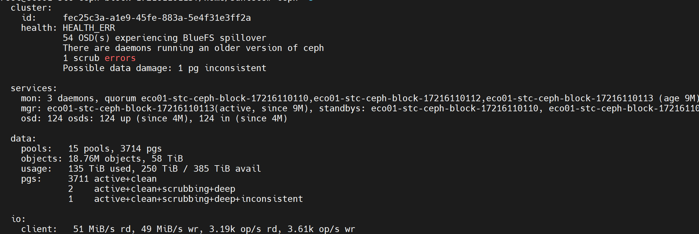
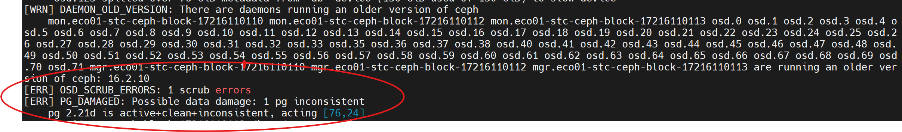
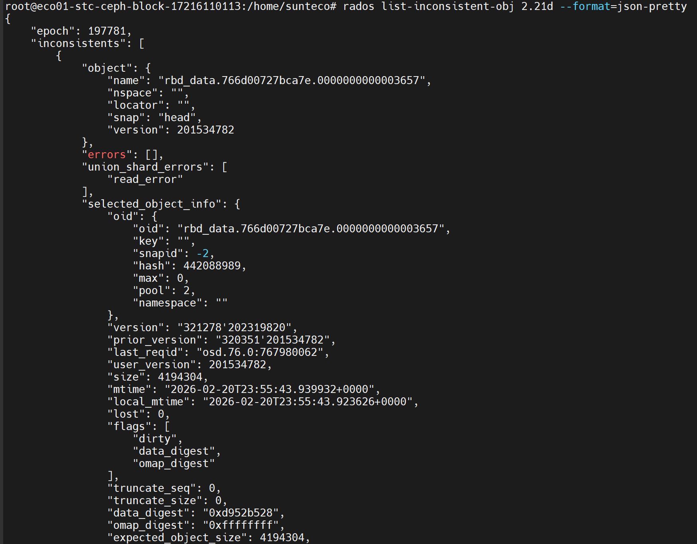
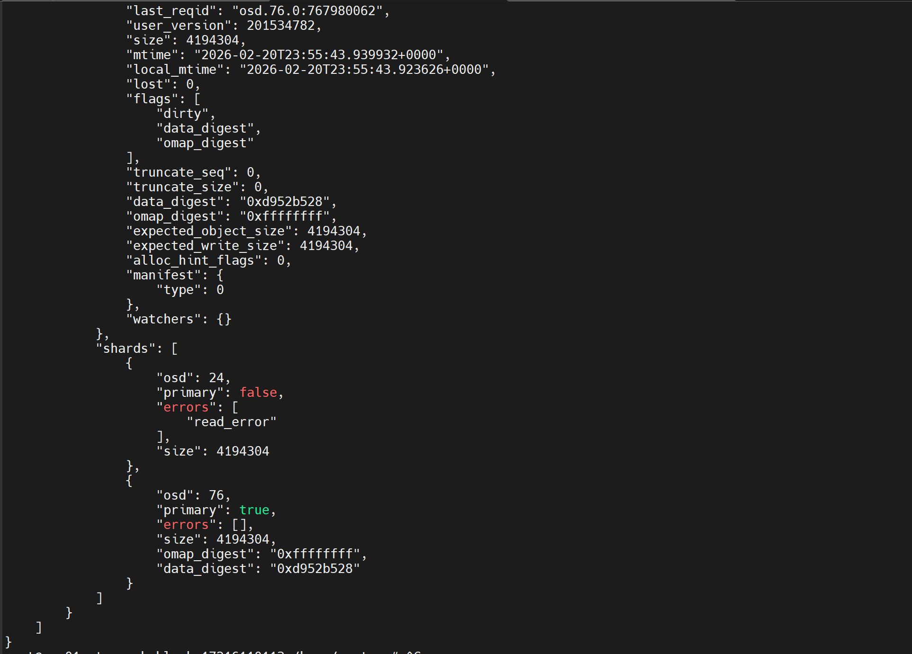
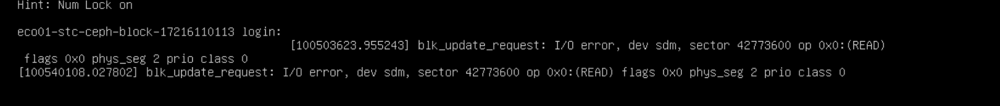

title: "Ceph PG inconsistent"
level: low


# Hiện tượng
- Kiểm tra hằng ngày cụm ceph gặp lỗi dữ liệu trên pg bị lệch khi replica từ osd primary sang osd replica .

 

Kiểm tra chi tiết hơn bằng health status 



=> Dự đoán cụm ceph đang bị lệch dữ liệu khi replica block ở 2 osd . Như hình là osd 76 là primary và đang replica sang osd 24

# Kiểm tra 
```bash
# Để đảm bảo an toàn cho cụm trước khi thao tác cần đặt cờ noout để tránh ceph tự kích các osd ra khỏi cụm , norebalance và nobackfills là tùy chọn
ceph osd unset noout
ceph osd unset nobackfill
ceph osd unset norebalance
```

Từ thông tin của health status , liệt kê thử xem trên pg báo lỗi thì chính xác object nào bị `inconsistent`
```bash
rados list-inconsistent-obj {pg.id} --format=json-pretty
```




Từ log chúng ta đã xác định được có 1 object bị lỗi khi từ osd.76 replica sang osd.24 . Lỗi báo về là lỗi đọc (read_errors)

# Xử lý 
- Khi đã xác định được lỗi , ta thử chạy 2 lệnh deep-scrub và repair thủ công để ceph đối chiếu lại 2 osd 
```bash
ceph pg deep-scrub {pg.id}
ceph pg repair {pg.id}

```

- Tuy nhiên sau 1 khoảng thời gian nhất định ( 5-10p) ta chưa thấy thay đổi gì của cụm , tiếp tục trace đến nguyên nhân có thể liên quan đến ổ đĩa vật lý 
```bash
# Tìm vị trí osd.24 vì nó đang là osd bị lỗi
ceph osd find {osd.id}
ceph osd find 24

# Liệt kê các thiết bị mà osd.24 được mapping
ceph device ls-by-daemon
```

- Khi tìm được host chứa osd bị lỗi , ta kiểm tra thông tin IDRAC phần storage và thấy được nguyên nhân lỗi liên quan đến disk bad sector 


- Kiểm tra thêm console của IDRAC , ta có thể thấy cảnh báo về việc lỗi I/O trên disk với yêu cầu đọc , tên lỗi `blk_update_request`



=> Xác nhận lỗi chủ yếu đến từ ổ đĩa vật lý bị hỏng 

- Tiến hành cách ly tạm thời osd bị lỗi :
```bash
# Giảm affinity của osd 24 để tránh object data client ghi vào osd 24 này nữa. Tuy nhiên nó vẫn sẽ nhận replica từ các osd khác sang
ceph osd primary-affinity 24 0

```

- Tiến hành chuyển dữ liệu 
```bash
# Hạ giới hạn phục hồi về mức thấp tránh ảnh hưởng đến cụm đang phục vụ :
ceph config set osd osd_recovery_max_active 1
ceph config set osd osd_max_backfills 1
ceph config set osd osd_recovery_sleep 0.1

# Đặt cờ cho cụm ngăn Ceph tự ý kích OSD ra khỏi cụm hay chạy tác vụ quét nặng trong lúc di chuyển dữ liệu.
## Lưu ý: vẫn mở các cờ tác vụ rebalance và backfilling
ceph osd set noscrub
ceph osd set nodeep-scrub

#  Bắt đầu di chuyển dữ liệu theo từng mốc 
## Điều kiện đáp ứng để chuyển mức là ceph-s báo trạng thái các pg vẫn active+clean và hết các tiến trình backfilling
ceph osd out 24 

## Trong quá trình chuyển dữ liệu nếu xuấy hiện slow request thì bật các cờ để tránh ảnh hưởng hệ thống 
# ceph osd set nobackfill
# ceph osd set norebalance

# Sau khi chuyển hoàn toàn dữ liệu của osd sang các osd khác thì dừng osd tránh việc cụm chuyển dữ liệu hay tạo bản sao vào osd :
ceph osd df | grep osd.24 # Kiểm tra lại thông tin osd 24 để xác nhận

# Chạy lại lệnh repair
ceph pg repair {pg.id}
# Down osd 
systemctl stop ceph-osd@24
```

- Sau khi repair xong và down osd bị lỗi thì trạng thái cụm 
```bash
ceph osd unset noscrub
ceph osd unset nodeep-scrub
ceph config rm osd osd_recovery_max_active
ceph config rm osd osd_max_backfills
ceph config rm osd osd_recovery_sleep
```
