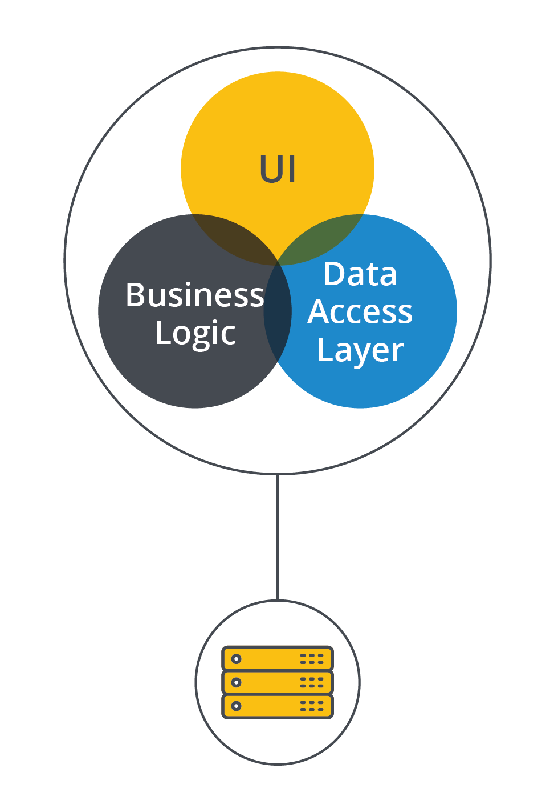
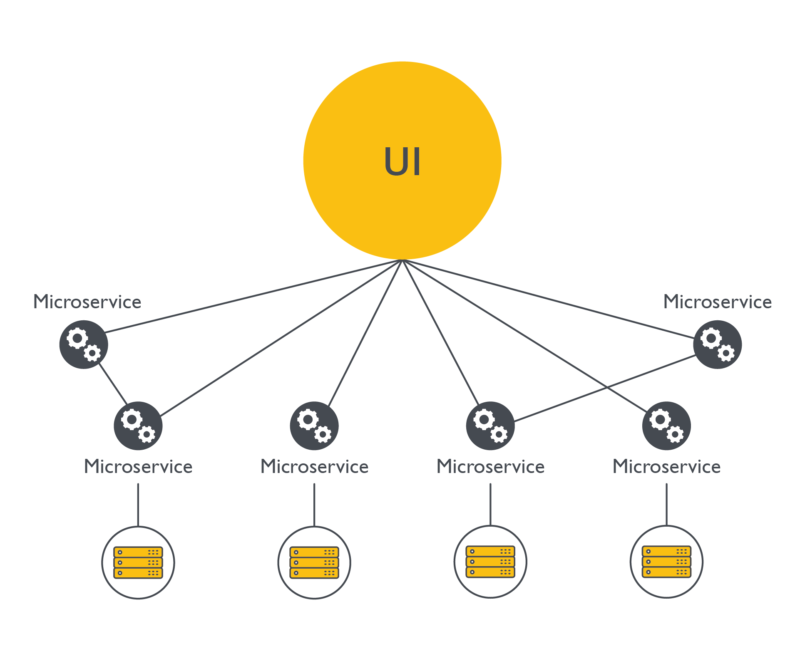

# Monolith Vs Microservices

Monolith và microservices là hai cách tổ chức boundary của application. Không có mô hình nào luôn tốt hơn; lựa chọn phụ thuộc vào quy mô team, tốc độ thay đổi, mức độ độc lập domain và năng lực vận hành.

## Monolith

Monolith gom nhiều capability trong một codebase/process/deployment unit.

Phù hợp khi:

- Sản phẩm còn nhỏ hoặc domain chưa ổn định.
- Team ít người, cần tốc độ phát triển ban đầu.
- Transaction và dữ liệu liên quan chặt.
- Năng lực observability, CI/CD và platform còn mỏng.

Rủi ro:

- Codebase lớn dễ khó maintain.
- Deploy một phần nhỏ vẫn phải release cả hệ thống.
- Boundary domain có thể bị lẫn nếu không giữ module discipline.

## Microservices

Microservices chia hệ thống thành nhiều service độc lập, mỗi service sở hữu một phần domain và có deployment lifecycle riêng.

Phù hợp khi:

- Nhiều team cần phát triển độc lập.
- Domain boundary đã tương đối rõ.
- Cần scale hoặc release từng capability riêng.
- Tổ chức đã có CI/CD, observability, service discovery và incident process đủ tốt.

Rủi ro:

- Network call thay function call.
- Debug khó hơn vì request đi qua nhiều service.
- Data consistency, tracing, versioning và security phức tạp hơn.
- Dễ tạo distributed monolith nếu service tách theo kỹ thuật thay vì domain.

## Ranh Giới Vận Hành

Sự khác biệt production không nằm ở sơ đồ đẹp hơn, mà nằm ở blast radius và năng lực vận hành:

- Monolith thường đơn giản hơn về network, transaction và troubleshooting ban đầu, nhưng deploy/rollback có blast radius lớn hơn vì nhiều capability đi cùng một artifact.
- Microservices giúp nhiều team release độc lập hơn, nhưng mỗi request có thể đi qua nhiều network hop, API contract, datastore và policy riêng.
- Monolith có thể tiết kiệm tài nguyên hơn cho workload vừa và nhỏ; microservices thường tốn thêm overhead cho runtime, service discovery, observability, security policy và data synchronization.
- Microservices chỉ nên tách khi service có ownership, API contract, datastore boundary, dashboard, alert và runbook riêng. Nếu vẫn phải deploy cùng nhau, dùng chung database một cách tùy tiện hoặc không trace được request end-to-end, hệ thống dễ trở thành distributed monolith.

## Decision Framework

| Câu hỏi | Nghiêng về monolith | Nghiêng về microservices |
|---|---|---|
| Domain đã rõ chưa | Chưa rõ | Rõ, ít thay đổi |
| Team size | Nhỏ | Nhiều team độc lập |
| Deploy | Một pipeline đủ | Cần release độc lập |
| Data ownership | Dữ liệu gắn chặt | Bounded context rõ |
| Observability | Còn mỏng | Có tracing/log/metrics tốt |

## Khuyến Nghị

- Bắt đầu bằng modular monolith nếu domain còn thay đổi nhanh.
- Tách service khi có lý do thật: ownership, scale, release cadence hoặc fault isolation.
- Tránh tách service chỉ vì muốn "cloud-native".
- Khi tách, tách cả data ownership, dashboard, alert và runbook.
