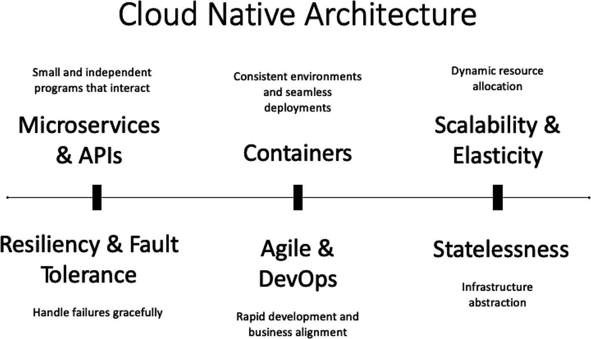
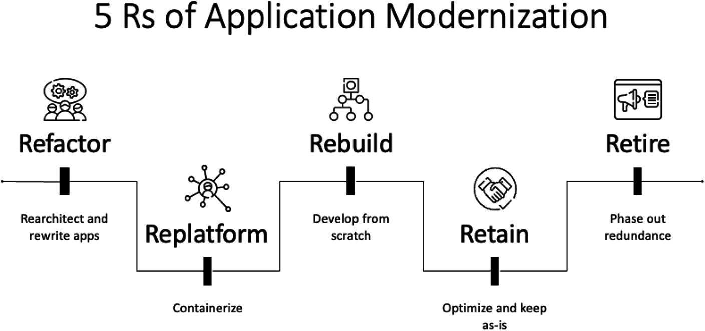

# Application Modernization And Cloud-Native Principles

## Tổng Quan

Application modernization không phải là đổi công nghệ cho mới. Đây là chương trình thay đổi application, platform, process và operating model để hệ thống tiếp tục đáp ứng mục tiêu kinh doanh, bảo mật, reliability, cost và tốc độ delivery.

Modernization thất bại khi chỉ tách monolith thành microservices hoặc chỉ lift-and-shift lên cloud mà không giải quyết state, dependency, observability, deployment, ownership và business value.

## Vì Sao Legacy Application Cần Được Đánh Giá

Legacy application không tự động là xấu. Một hệ thống cũ vẫn có thể tiếp tục chạy nếu nó ổn định, có ROI tốt, risk được chấp nhận và chưa cản trở business. Điểm cần làm là đánh giá có hệ thống:

| Tín hiệu | Ý nghĩa |
|---|---|
| Cost vận hành tăng | Hardware, license, support, datacenter, manual operation hoặc capacity dư thừa đang ăn ngân sách |
| Support suy giảm | Vendor hết support, đội ngũ hiểu hệ thống ít dần, tài liệu yếu |
| Khó tích hợp | Không có API rõ, data silo, khó kết nối mobile/web/partner/cloud service |
| Security debt | Runtime/OS/library cũ, không patch được, thiếu audit, thiếu encryption, exposure khó kiểm soát |
| Performance kém | Không scale động, latency cao, không chịu được peak load |
| Developer scarcity | Công nghệ cũ khó tuyển người, onboarding chậm, change cycle dài |

Ngược lại, vẫn có thể **retain** nếu workload critical chạy tốt, rủi ro được quản trị, migration cost lớn hơn benefit, hoặc ràng buộc regulatory/data locality chưa cho phép di chuyển.

## Cloud-Native Architecture Elements

Cloud-native không chỉ là container. Một hệ thống cloud-native thường kết hợp:

- **Microservices và APIs**: boundary theo business capability, contract rõ, tích hợp qua API/event.
- **Containers**: đóng gói runtime/dependency nhất quán giữa môi trường.
- **Scalability và elasticity**: scale theo nhu cầu thật, tránh capacity cố định.
- **Resiliency và fault tolerance**: component failure không kéo sập toàn hệ thống.
- **Agile và DevOps**: business, development và operations có feedback loop ngắn.
- **Statelessness**: compute dễ thay thế; state được externalize vào datastore, queue, object storage hoặc managed service phù hợp.

Cloud-native cần đi kèm CI/CD, observability, security policy, platform guardrails và incident process. Nếu không, microservices chỉ biến lỗi đơn giản thành lỗi phân tán.

## 5R Modernization

| Strategy | Cách hiểu production | Khi phù hợp | Cẩn thận |
|---|---|---|---|
| Refactor | Sửa code/architecture để cải thiện maintainability, performance hoặc cloud fit | Technical debt cao, cần tách module, containerize hoặc đổi runtime từng phần | Không đổi behavior nếu chưa có test/regression safety |
| Replatform | Chuyển sang platform mới với thay đổi vừa đủ | Muốn nhanh lên cloud/managed service nhưng chưa rebuild toàn bộ | Lift-and-shift không tự tạo cloud-native benefit |
| Rebuild | Xây lại application bằng stack/model mới | Legacy quá cũ, domain cần thiết kế lại, ROI đủ lớn | Đắt, rủi ro scope creep, migration data phức tạp |
| Retain | Giữ hệ thống hiện tại và quản trị rủi ro | System vẫn tạo giá trị, migration chưa đáng, ràng buộc compliance/data | Cần owner, lifecycle, patching/compensating control rõ |
| Retire | Loại bỏ application dư thừa hoặc không còn giá trị | Duplicate capability, low usage, high exposure/cost | Phải xử lý data, dependency, DNS, credential, backup và audit trail |

Nhiều tổ chức dùng thêm **replace/repurchase** cho trường hợp thay ứng dụng bằng SaaS hoặc sản phẩm khác. Dù gọi là 5R/6R/7R, điều quan trọng là mỗi application có quyết định riêng, không ép một strategy cho toàn portfolio.

## Modernization Roadmap

Một modernization program nên bắt đầu bằng discovery, không bắt đầu bằng tool:

1. Xác định lý do modernization: growth, customer experience, security, cost, reliability, compliance hay speed.
2. Inventory application, dependency, data flow, upstream/downstream, owner, runtime, support status và business criticality.
3. Xây business case: ROI, risk reduction, time-to-market, cost model, opportunity cost.
4. Có sponsorship từ leadership và product/business owner, không chỉ platform team.
5. Đánh giá cultural/process change: team structure, release process, incident ownership, customer communication.
6. Chọn modernization pattern cho từng application: replatform-and-change, change-and-replatform, greenfield, brownfield, strangler pattern, retain hoặc retire.
7. Thiết kế target architecture: API boundary, data ownership, state externalization, CI/CD, observability, security baseline và rollback.
8. Chạy PoC có tiêu chí rõ, không biến PoC thành production âm thầm.
9. Rollout từng phần bằng canary, traffic split, parallel run hoặc migration window tùy rủi ro.
10. Đo outcome sau mỗi phase: latency, error rate, deployment frequency, MTTR, cost, customer signal và operational toil.

## Modernization Patterns

### Replatform And Change

Đưa application lên cloud/platform mới trước, sau đó từng bước refactor. Pattern này nhanh tạo footprint cloud nhưng dễ mắc kẹt ở trạng thái "VM cũ chạy ở nơi mới" nếu không có phase cải tiến tiếp theo.

Guardrail: đặt modernization backlog ngay từ đầu, gồm observability, backup, IAM, network exposure, cost cleanup và từng bước tách state/dependency.

### Change And Replatform

Sửa application để phù hợp cloud trước khi di chuyển. Pattern này giảm shock khi lên platform mới nhưng đòi hỏi test, staging và stakeholder discipline cao hơn.

Guardrail: cần môi trường test gần production và migration rehearsal; nếu không, rủi ro tích tụ đến ngày cutover.

### Greenfield

Xây mới từ đầu. Hữu ích khi business domain thay đổi mạnh hoặc legacy không còn cứu được, nhưng thường đắt và dễ under-estimate migration data/dependency.

Guardrail: không bỏ qua legacy data contract, customer workflow, reporting, compliance và integration mà hệ thống cũ đang âm thầm xử lý.

### Brownfield

Hiện đại hóa từng phần trên nền hệ thống đang có. Đây là pattern thực tế phổ biến vì vừa giữ business continuity vừa giảm rủi ro big-bang.

Guardrail: cần documentation và observability tốt; nếu không, bug/behavior cũ có thể bị copy sang hệ thống mới.

## API-First Trong Modernization

API là boundary giúp legacy system, data lake, website, mobile app, IoT và microservices giao tiếp có kiểm soát.

Trong modernization, API-first giúp:

- che giấu implementation cũ phía sau contract ổn định;
- mở đường cho strangler pattern: service mới thay dần capability cũ;
- kiểm soát authentication, authorization, quota, audit log và data exposure;
- cho phép nhiều client dùng cùng capability mà không truy cập trực tiếp database;
- giảm coupling giữa frontend, partner integration và backend implementation.

API-first không có nghĩa "mọi thứ đều expose public API". Production API cần ownership, versioning, schema contract, rate limit, authn/authz, logging, error model, backward compatibility và deprecation policy.

## Production Guardrails

- Không modernize application khi chưa biết owner, criticality, dependency và rollback path.
- Không tách microservice nếu chưa có distributed tracing, centralized logging, SLO, CI/CD và incident ownership.
- Không di chuyển state mà chưa có backup, restore test, data reconciliation và cutover plan.
- Không expose API mới ra internet nếu chưa có auth, rate limit, input validation, WAF/API gateway policy và audit log.
- Không retire hệ thống chỉ vì low usage; xác nhận không còn downstream job, reporting, batch, webhook, DNS, credential hoặc regulatory retention.
- Không coi cloud-managed service là chuyển hết trách nhiệm. Team vẫn sở hữu data, config, IAM, business logic, observability và incident process.

## Trang Liên Quan

- [Monolith Vs Microservices](./03-monolith-vs-microservices.md)
- [Stateless Vs Stateful](./02-stateless-vs-stateful.md)
- [Infrastructure Consistency](./05-infrastructure-consistency-and-platform-thinking.md)
- [GKE, Anthos And Container Platforms](../../04-cloud-edge/02-cloud-ecosystem/gcp/03-gke-anthos-and-container-platforms.md)
- [App Engine, Cloud Run And Cloud Functions](../../04-cloud-edge/02-cloud-ecosystem/gcp/04-app-engine-cloud-run-and-cloud-functions.md)
- [API Management And Apigee](../../04-cloud-edge/02-cloud-ecosystem/gcp/05-api-management-and-apigee.md)
