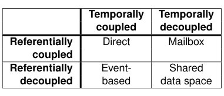
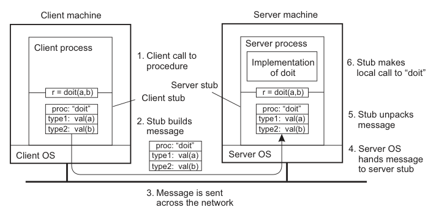
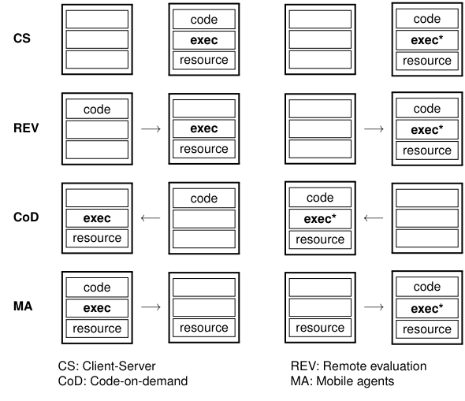

# Distributed System Architecture Styles

Distributed system architecture cần tách hai lớp quyết định:

- **Software architecture:** component nào tồn tại, interface/contract là gì, component phối hợp qua connector nào.
- **System architecture:** component đó được đặt ở máy, node, zone, region, edge hay cloud nào; failure domain và network path ra sao.

Một sơ đồ logic đẹp không đủ để vận hành production. Cùng một service boundary có thể chạy trong một process, nhiều process trên một host, nhiều node trong một cluster, hoặc nhiều region. Mỗi placement tạo ra latency, consistency, security và operability khác nhau.

## Component And Connector

Một component nên có:

- interface cung cấp và interface yêu cầu rõ ràng;
- ownership, deployment unit và lifecycle độc lập ở mức cần thiết;
- compatibility/versioning rule;
- health signal, log/metric/trace và rollback path.

Connector là cơ chế nối component: function call, RPC, HTTP, message queue, event bus, stream, shared database, shared filesystem hoặc protocol stack. Khi function call biến thành network call, semantics thay đổi: timeout không khẳng định operation chưa chạy, retry có thể nhân đôi side effect, và partial failure trở thành trạng thái bình thường.

## Layered Architecture

Layered architecture đặt component theo tầng. Tầng trên gọi xuống tầng dưới qua interface, còn implementation của tầng dưới được ẩn đi.

Pattern này phù hợp khi:

- cần che khác biệt OS/protocol/backend;
- muốn tách application khỏi platform hoặc middleware;
- cần thay implementation mà giữ contract;
- cần chuẩn hóa access path, ví dụ VFS, network stack, storage interface.

Guardrails:

- Đừng để tầng trên phụ thuộc vào implementation detail của tầng dưới.
- Upcall/callback từ tầng dưới lên tầng trên phải có timeout và failure handling rõ.
- Khi thêm abstraction layer, đo thêm latency, queueing và debug cost.
- Với protocol stack, tách rõ **service**, **interface** và **protocol**: interface là cách caller dùng service; protocol là luật hai bên dùng để trao đổi.

## Service-Oriented And Microservice Styles

Service-oriented architecture gom capability thành service có interface riêng. Microservice là biến thể nhỏ hơn, thường chạy như process/container độc lập và có deployment lifecycle riêng.

Lợi ích chính:

- encapsulation tốt hơn;
- scale/release theo từng capability;
- ownership theo team hoặc bounded context;
- dễ thay implementation nếu contract ổn định.

Rủi ro chính:

- distributed monolith khi service tách theo kỹ thuật nhưng vẫn release, database hoặc transaction dính chặt;
- quá nhiều interface khác nhau gây integration cost;
- observability, security policy, schema migration và incident triage phức tạp hơn.

Khi thiết kế service, contract phải ghi rõ:

- operation có idempotent không;
- retry safe trong trường hợp nào;
- consistency guarantee là strong, read-your-writes hay eventual;
- timeout và error code có ý nghĩa gì;
- versioning và deprecation policy ra sao.

## REST And Resource-Based Architecture

REST/resource-based style coi hệ thống là tập resource có tên ổn định, được thao tác qua interface chung như `GET`, `POST`, `PUT`, `DELETE`.

Phù hợp khi:

- domain có resource rõ;
- operation tương đối CRUD-like;
- client/server cần stateless execution;
- muốn tận dụng HTTP cache, proxy, gateway, auth và observability sẵn có.

Không phù hợp nếu workflow cần conversational state phức tạp, distributed transaction chặt, streaming hai chiều hoặc operation semantics khó biểu diễn bằng resource state.

Production guardrail: REST interface ít verb không có nghĩa service đơn giản hơn. Độ phức tạp có thể bị đẩy vào URI, parameter, state transition và error semantics.

## Publish-Subscribe And Coordination Coupling

Publish-subscribe giảm coupling giữa producer và consumer. Cách chọn model nên nhìn theo hai trục: producer/consumer có cần biết nhau không, và có cần online cùng lúc không.

| Model | Referential coupling | Temporal coupling | Ý nghĩa vận hành |
|---|---|---|---|
| Direct | Có | Có | Caller biết callee và cả hai phải online |
| Mailbox / queue | Có | Không | Sender biết queue/mailbox; receiver có thể xử lý sau |
| Event-based | Không | Có | Subscriber nhận event khi đang online hoặc khi broker hỗ trợ delivery |
| Shared data space | Không | Không | Producer/consumer trao đổi qua data space bền vững |

Pub-sub phù hợp khi:

- producer không nên biết danh sách consumer;
- event có nhiều consumer độc lập;
- cần thêm consumer mới mà không sửa producer;
- workflow chấp nhận eventual processing.

Rủi ro:

- matching subscription có thể thành bottleneck;
- event schema/versioning không rõ làm consumer vỡ;
- duplicate/out-of-order/lost message nếu delivery semantics không được thiết kế;
- broker/event bus trở thành hidden dependency;
- content-based subscription mạnh hơn topic-based nhưng khó scale và khó bảo mật hơn.

Guardrails:

- Ghi rõ delivery semantics: at-most-once, at-least-once hay effectively-once.
- Consumer phải idempotent nếu có retry hoặc redelivery.
- Theo dõi lag, dead-letter queue, retry count, poison message và schema compatibility.
- Không dùng event để che transaction boundary nếu business cần consistency chặt.

## Middleware Patterns

Middleware nằm giữa application và OS/network/platform để cung cấp interface chung, communication, security, accounting, failure masking và resource sharing.

Các pattern thường gặp:

- **Wrapper / adapter:** chuyển interface legacy sang interface mà client dùng được.
- **Broker:** giảm số lượng integration trực tiếp giữa N application từ gần `O(N^2)` xuống gần `O(N)`, nhưng broker trở thành dependency trung tâm.
- **Interceptor:** chèn logic vào call path, ví dụ retry, tracing, auth, compression, fragmentation hoặc fan-out tới replica.
- **Modifiable middleware:** cho phép load/unload component hoặc thay behavior lúc runtime.

Production guardrails:

- Middleware không được làm mờ ownership của failure.
- Interceptor phải có thứ tự thực thi, timeout và rollback rõ; tránh "magic behavior" khó debug.
- Broker cần HA, backpressure, observability và capacity planning như một production service.
- Wrapper tốt cho migration, nhưng wrapper chồng wrapper lâu dài thường che nợ kỹ thuật.

## RPC And Communication Semantics

Remote Procedure Call (RPC) làm remote call trông giống local call bằng cách dùng client stub và server stub. Client gọi stub như function local; stub marshal parameter thành message, gửi qua network, server stub unmarshal rồi gọi implementation thật.

RPC hữu ích khi service boundary có operation rõ và caller cần response trực tiếp. Nhưng remote call không bao giờ thật sự giống local call:

- Pointer/reference local không có ý nghĩa ở address space khác; phải copy value, dùng global reference, object reference hoặc ID.
- Marshalling/unmarshalling phải thống nhất data type, byte order, schema và version.
- Timeout không chứng minh server chưa chạy operation; response có thể mất sau khi side effect đã commit.
- Retry RPC cần idempotency key, deduplication hoặc reconciliation nếu operation có side effect.

Communication semantics nên được ghi rõ theo hai trục:

| Trục | Lựa chọn | Ý nghĩa vận hành |
| --- | --- | --- |
| Lifetime | Transient | Message chỉ có cơ hội tới đích khi sender/receiver và transport path đang sẵn sàng |
| Lifetime | Persistent | Middleware/broker giữ message cho tới khi deliver hoặc hết policy |
| Blocking | Synchronous | Sender block tới khi accepted, delivered hoặc processed |
| Blocking | Asynchronous | Sender tiếp tục sau khi submit; kết quả có thể qua callback, poll hoặc event |

RPC truyền thống là transient synchronous communication: caller thường block tới khi server xử lý xong. Message queue thường là persistent asynchronous communication: producer submit rồi tiếp tục, consumer xử lý sau.

RPC failure semantics cần được ghi rõ:

| Semantics | Ý nghĩa |
| --- | --- |
| At-least-once | Client retry cho tới khi có response; operation có thể chạy nhiều lần |
| At-most-once | Server deduplicate request; operation có thể không chạy nếu failure xảy ra trước execution |
| Effectively-once | Kết hợp retry, idempotency key, dedup store và reconciliation để đạt hiệu ứng một lần ở business boundary |

Không hứa "exactly-once" nếu chưa định nghĩa boundary. Trong distributed system, lost reply có thể xảy ra sau khi server đã commit side effect, nên retry phải có request ID/idempotency key hoặc response replay.

Guardrails:

- Interface IDL/schema phải versioned và backward-compatible khi có nhiều client.
- Deadline/timeout phải propagate qua call chain; tránh một request giữ tài nguyên vô hạn.
- Instrument RPC bằng request ID/trace ID, latency, retry count, timeout, error class và remote endpoint.
- Với async/deferred RPC, callback/polling cũng cần auth, timeout, duplicate handling và observability.

## Client-Server And Tiered Architecture

Client-server là request-reply model: client gửi operation, server xử lý và trả response. Vấn đề chính là semantics khi request/reply bị mất hoặc timeout.

Nếu operation idempotent, retry thường an toàn hơn. Nếu operation có side effect như chuyển tiền, tạo order hoặc cấp quyền, retry cần idempotency key, deduplication hoặc reconciliation.

Tiered architecture tách:

- **Presentation / user interface**
- **Processing / business logic**
- **Data / storage**

Một hệ thống có thể là two-tier, three-tier hoặc nhiều tier. Tách tier giúp quản lý và scale theo chức năng, nhưng mỗi hop thêm latency, failure mode và security boundary.

Guardrails:

- Thin client dễ quản lý hơn, nhưng có thể tăng server-side load và latency.
- Fat client tốt cho offline, UX và local compute, nhưng khó patch, support và secure hơn.
- Application server gọi database server là client của database; không nên chỉ nhìn role theo tên process.
- Với web architecture, phân biệt static document serving, server-side dynamic generation, client-side script và API backend.

### Client-Side Transparency

Client middleware thường che bớt distribution bằng các cơ chế như stub/proxy, naming, rebinding, retry, cache và replica selection. Đây là lớp hữu ích nhưng cũng là nơi dễ tạo illusion sai:

- Retry che lỗi tạm thời nhưng có thể nhân đôi side effect nếu operation không idempotent.
- Cache client giúp availability/latency nhưng có thể trả stale data khi backend đã đổi.
- Client-side replica fan-out cần timeout, quorum hoặc conflict rule rõ; nếu chỉ "lấy response đầu tiên" có thể che lỗi consistency.
- Rebinding khi server đổi location cần phân biệt temporary disconnect với operation đã commit nhưng response bị mất.

Production API client nên expose metrics cho retry count, timeout, selected endpoint, cache hit/stale và error class. Nếu mọi thứ bị giấu sau một SDK im lặng, incident triage sẽ khó hơn.

## Code Mobility And Runtime Migration

Code mobility là pattern đưa computation tới nơi khác thay vì chỉ gửi data qua network. Nó xuất hiện dưới nhiều hình thức: browser tải script, client tải plugin/stub, database nhận stored procedure/query, federated learning gửi model tới dữ liệu, hoặc VM/container được migrate giữa host.

Các mô hình chính:

| Mô hình | Ai khởi tạo | Di chuyển gì | Dùng khi |
| --- | --- | --- | --- |
| Remote evaluation | Bên gửi | Code hoặc query tới server | Đưa compute gần data để giảm network transfer |
| Code-on-demand | Bên nhận | Client tải code từ server | Bổ sung client capability khi cần, ví dụ browser/app plugin |
| Mobile agent | Bên gửi | Code kèm execution state một phần | Cần di chuyển workflow qua nhiều site, hiện ít phổ biến |
| VM/runtime migration | Platform | Environment đang chạy hoặc image/runtime state | Bảo trì host, cân bằng tải, locality, capacity |

Guardrails:

- Không chạy downloaded code nếu không có sandbox, signature, permission boundary và update/revocation model.
- Không gửi code tới data nhạy cảm nếu thiếu audit, data minimization và output policy; federated learning vẫn có rủi ro leakage qua model update.
- Với migration runtime, phải hiểu resource binding: file, socket, IP, device, credential và local cache có theo được sang nơi mới không.
- Weak mobility chỉ chuyển code/config và start lại ở target; strong mobility chuyển execution state, khó hơn nhiều và phụ thuộc runtime/OS.

Code mobility phù hợp khi giảm data movement, giảm client preinstall hoặc tăng locality. Nó không phù hợp nếu security boundary mơ hồ, target runtime không đồng nhất, rollback không rõ hoặc audit không đủ.

## Peer-To-Peer And Overlay Networks

Peer-to-peer system cho các node vai trò tương đối ngang nhau; mỗi node có thể vừa là client vừa là server. Các node tạo overlay network: logical network trên nền TCP/UDP/network thật.

Các kiểu chính:

- **Structured P2P / DHT:** topology deterministic, key được map tới node chịu trách nhiệm. Lookup tốt hơn nhưng cần duy trì topology khi node join/leave.
- **Unstructured P2P:** neighbor list ad hoc, search bằng flooding, random walk hoặc policy-based search. Đơn giản hơn nhưng lookup khó scale.
- **Super-peer hierarchy:** một số node mạnh hơn giữ index/broker hoặc đại diện cho nhóm peer. Giảm search cost nhưng đưa lại risk leader/super-peer availability.

Guardrails:

- DHT cần xử lý churn, rebalancing, replication và hot key.
- Flooding cần TTL/rate limit để tránh storm.
- Random walk giảm traffic nhưng tăng lookup latency.
- Super-peer cần election, backup và load balancing.
- P2P qua nhiều administrative domain cần trust, abuse control, identity và quota rõ.

## Multicast, Flooding And Gossip Dissemination

Multicast gửi một update tới nhiều receiver. Trong distributed systems hiện đại, multicast thường được làm ở application/overlay layer thay vì phụ thuộc network-level multicast.

Các cách phổ biến:

| Cách | Mental model | Điểm mạnh | Rủi ro |
| --- | --- | --- | --- |
| Tree-based multicast | Tạo cây forwarding qua overlay | Ít duplicate, kiểm soát path tốt hơn | Tree phải tự repair khi node/link lỗi |
| Mesh overlay | Node có nhiều neighbor, nhiều path | Robust hơn tree đơn | Có thể tốn bandwidth hơn |
| Flooding | Mỗi node forward cho neighbor, bỏ duplicate | Rất đơn giản và robust | Message explosion nếu không có TTL/dedup/rate limit |
| Probabilistic flooding | Forward với xác suất hoặc theo degree | Giảm traffic lớn | Không đảm bảo mọi node nhận |
| Gossip / epidemic | Node chọn peer ngẫu nhiên để push/pull update | Scalable, không cần coordinator trung tâm | Eventual, cần peer sampling và version/deletion handling |

Gossip phù hợp cho membership, cache invalidation mềm, metadata propagation, anti-entropy và health dissemination. Nó không phù hợp nếu business cần all-or-nothing delivery, strict ordering hoặc bounded consistency.

Production guardrails:

- Mọi dissemination message cần ID/version để deduplicate.
- Dùng TTL/hop limit/rate limit để tránh storm.
- Theo dõi fan-out, duplicate rate, propagation delay, stale node count và drop/error rate.
- Delete cũng phải là update: dùng tombstone/death certificate với retention đủ lâu; xóa tombstone quá sớm có thể làm dữ liệu cũ sống lại.
- Nếu overlay có locality/cost khác nhau, tree/gossip nên xét latency, zone/region và failure domain thay vì chọn peer hoàn toàn ngẫu nhiên.

## Hybrid Architectures

Production system thường hybrid: logical client-server, backend distributed; broker trung tâm kết hợp queue; peer-to-peer có tracker; cloud service ẩn distributed implementation; edge xử lý một phần gần thiết bị.

### Cloud

Cloud architecture thường có các tầng hardware, infrastructure, platform và application. IaaS/PaaS/SaaS/FaaS khác nhau ở ranh giới responsibility và mức abstraction. Nội dung cloud chi tiết nên đặt ở cloud notes; trong architecture style, điểm cần nhớ là cloud che physical distribution sau API và control plane.

### Edge

Edge đặt compute/storage/network gần device hoặc user hơn cloud. Lý do hợp lệ thường là latency, locality, bandwidth shaping, offline tolerance, data residency hoặc operational boundary.

Edge không tự động an toàn hơn cloud. Nếu dùng edge cho privacy/security, phải chứng minh identity, encryption, audit, patching, physical access và data lifecycle tốt hơn hoặc phù hợp compliance hơn.

### Blockchain / Distributed Ledger

Blockchain là hybrid architecture cho môi trường thiếu trust chung. Ledger logic là một chuỗi transaction/block, nhưng được replicate rộng. Điểm thiết kế chính là ai được validate và append block:

- centralized validator: đơn giản nhưng cần trusted party;
- permissioned validator set: ít node validate, cần Byzantine/fault-tolerant consensus;
- permissionless validation: nhiều participant có thể tham gia, cần leader election/incentive và cost control.

Không nên dùng blockchain chỉ vì muốn "decentralized". Nếu đã có một trusted authority rõ ràng, database/audit log/append-only ledger truyền thống thường dễ vận hành hơn.

## Architecture Review Checklist

- Component boundary có theo business capability, data ownership hoặc failure isolation thật không.
- Connector là sync call, async queue, stream, shared DB hay shared filesystem; semantics đã rõ chưa.
- Operation nào idempotent, operation nào cần deduplication.
- Dependency nào là critical path cho user-facing request.
- Có hidden central component nào như broker, tracker, control plane, event bus, database primary không.
- State nằm ở đâu, ai backup/restore, ai migrate schema.
- Khi một tier/broker/peer/super-peer/edge site lỗi, hệ thống fail closed, retry, degrade hay queue lại.
- Observability có đi qua đủ layer không: client, gateway, service, middleware, broker, database, network.
- Security boundary có thay đổi khi chuyển từ local call sang network call không.

## Liên Quan

- [Distributed Systems Foundations](../00-foundations/02-distributed-systems-foundations.md)
- [Monolith Vs Microservices](../01-principles/03-monolith-vs-microservices.md)
- [Stateless Vs Stateful](../01-principles/02-stateless-vs-stateful.md)
- [Scalability Vs Maintainability](../02-tradeoffs/03-scalability-vs-maintainability.md)
- [Caching Strategies](./01-caching-strategies.md)
- [Database Sharding And Replication](./02-database-sharding-and-replication.md)
- [Distributed Coordination Patterns](./07-distributed-coordination-patterns.md)
- [Distributed Naming And Discovery](./08-distributed-naming-and-discovery.md)
- [Distributed Fault Tolerance And Recovery](../04-reliability-and-dr/10-distributed-fault-tolerance-and-recovery.md)
- [Cloud Computing Core Mechanisms](../../04-cloud-edge/01-cloud-fundamentals/01-cloud-computing-core-mechanisms.md)
