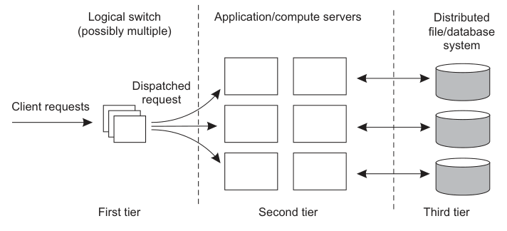

# Load Balancer Clusters

Load balancer cluster loại bỏ single point of failure ở tầng entrypoint. Thay vì chỉ có một load balancer, hệ thống dùng nhiều node phối hợp qua VIP, DNS, anycast hoặc cloud load balancer.

## Mô Hình

- **Active-passive:** một node giữ VIP, node dự phòng nhận khi node chính lỗi.
- **Active-active:** nhiều node cùng nhận traffic, thường kết hợp DNS/anycast/L4 upstream.
- **Cloud-managed:** provider quản lý HA phía dưới, người vận hành chỉ cấu hình listener, target và health check.

## Thành Phần Cần Thiết

- Health check backend.
- Health check chính load balancer node.
- Cơ chế chuyển VIP hoặc route.
- Logging và metric request/error/latency.
- Runbook failover/failback.

## Server Cluster Request Dispatching

Một server cluster thường che nhiều server phía sau một entrypoint logic. Mô hình phổ biến có ba lớp:

- **First tier:** switch/load balancer/reverse proxy nhận request từ client.
- **Second tier:** application hoặc compute servers xử lý business logic.
- **Third tier:** distributed file/database/storage system giữ state.

Dispatching có hai cấp thường gặp:

| Cấp dispatch | Cách quyết định backend | Khi phù hợp | Rủi ro |
| --- | --- | --- | --- |
| L4 / transport-layer | Dựa trên TCP/UDP, IP, port, connection | High throughput, protocol đơn giản, ít cần hiểu request | Ít context, dễ cần connection affinity |
| L7 / application-layer | Dựa trên HTTP host/path/header, URL, method hoặc metadata request | Route theo service/content, canary, auth, caching, API gateway | Tốn CPU hơn, phải hiểu protocol, dễ thành bottleneck |

Cluster tốt phải giữ access transparency cho client nhưng không được làm mờ operational truth. Operator vẫn cần biết request đi qua entrypoint nào, backend nào nhận, health check nào pass/fail, state nằm ở tier nào và failover có làm mất session không.

## Rủi Ro

- VIP split-brain nếu keepalive/quorum sai.
- Health check quá nông khiến traffic vào node không thật sự sẵn sàng.
- TLS certificate/config drift giữa các node.
- Load balancer sống nhưng backend pool chết.
- Entry point là single point of failure nếu chưa có HA cho chính load balancer.
- Sticky session che state placement sai và làm rollback/failover khó hơn.
