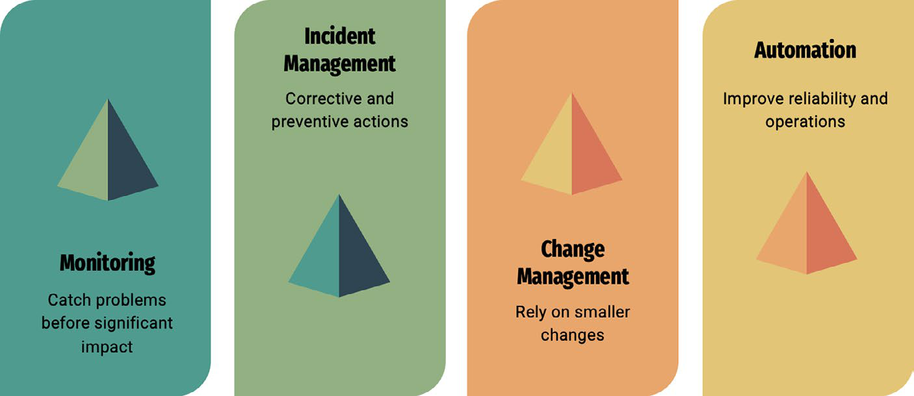

# SRE Concepts

SRE là cách vận hành hệ thống bằng software engineering discipline. Mục tiêu không phải đạt uptime tuyệt đối, mà đạt reliability phù hợp với nhu cầu business và kiểm soát rủi ro thay đổi.

## DevOps Và SRE

DevOps giảm khoảng cách giữa development và operations: team cùng chịu trách nhiệm cho delivery, quality, deploy, operate và feedback. Điểm quan trọng không phải là ghép tên hai team, mà là bỏ cơ chế "ném qua tường" khi release lỗi hoặc production có incident.

SRE nhìn operations bằng engineering discipline. Thay vì chỉ phản ứng với incident, SRE thiết kế monitoring, incident management, change management và automation để hệ thống ổn định hơn theo thời gian.

DevOps và SRE không đối lập:

- DevOps nhấn vào culture, collaboration, CI/CD và feedback loop.
- SRE nhấn vào reliability target, SLI/SLO, error budget, toil reduction và incident learning.
- Cả hai cần blameless postmortem, automation, small changes, rollback và đo lường rõ.

## SLI, SLO, SLA

- **SLI (Service Level Indicator):** chỉ số đo chất lượng service, ví dụ availability, latency, error rate.
- **SLO (Service Level Objective):** mục tiêu nội bộ cho SLI, ví dụ 99.9% request thành công trong 30 ngày.
- **SLA (Service Level Agreement):** cam kết với khách hàng, thường có hậu quả pháp lý/tài chính.

SLO nên thấp hơn kỳ vọng tuyệt đối nhưng cao hơn mức business cần. SLO quá cao làm team sợ thay đổi; SLO quá thấp làm user mất niềm tin.

## Error Budget

Error budget là phần lỗi được phép xảy ra trong một khoảng thời gian.

Ví dụ SLO 99.9% trong 30 ngày tương đương khoảng 43 phút downtime/error budget. Khi burn rate cao, team cần giảm release risk hoặc tập trung reliability work.

Error budget là cơ chế cân bằng innovation và stability:

- Khi còn error budget, team có thể release hoặc thử nghiệm có kiểm soát.
- Khi burn rate cao hoặc error budget gần cạn, ưu tiên reliability work, giảm scope release và tăng validation.
- Error budget không phải "quota được phép gây outage"; nó là signal để quyết định rủi ro thay đổi.

## SLO Design Guardrails

SLO nên đo điều user hoặc business thật sự cảm nhận:

- availability của request thành công;
- latency theo percentile phù hợp;
- error rate theo service boundary;
- freshness của data pipeline;
- durability hoặc correctness khi dữ liệu là sản phẩm chính.

Tránh biến mọi metric hạ tầng thành SLO. CPU, memory, disk I/O có thể là signal debug tốt, nhưng chỉ nên thành SLO nếu chúng trực tiếp đại diện cho trải nghiệm hoặc cam kết dịch vụ.

Một SLO tốt cần có:

- SLI đo được bằng telemetry hiện có hoặc có thể triển khai;
- cửa sổ đo rõ ràng;
- loại traffic/request được tính và loại bị loại trừ;
- owner chịu trách nhiệm khi burn rate xấu;
- alert/runbook gắn với hành động cụ thể.

## Toil

Toil là công việc vận hành thủ công, lặp lại, có thể tự động hóa và tăng tuyến tính theo scale.

Ví dụ:

- Restart service thủ công.
- Tạo user/resource bằng ticket.
- Copy log thủ công để debug.
- Chạy checklist lặp lại không có automation.

SRE nên giảm toil bằng automation, self-service và runbook rõ ràng.

## Incident Lifecycle

Một incident tốt nên có:

1. Detection.
2. Triage.
3. Mitigation.
4. Communication.
5. Recovery.
6. Postmortem.
7. Follow-up action.

Postmortem nên tập trung vào system learning, không đổ lỗi cá nhân.

Blameless không có nghĩa là không accountability. Nó nghĩa là phân tích lỗi ở mức system: test gap, review gap, automation gap, rollout gap, monitoring gap, ownership gap. Nếu có hành vi lặp lại hoặc cẩu thả, xử lý bằng coaching/process/role clarity thay vì biến RCA thành nơi quy trách nhiệm cá nhân.

## Operability

Một hệ thống dễ vận hành cần:

- Health check đúng nghĩa.
- Metrics/logs/traces đủ để debug.
- Safe deploy và rollback.
- Runbook cho failure mode chính.
- Capacity signal trước khi quá tải.
- Ownership rõ ràng.

## Liên Quan

- [RTO/RPO Design](../04-reliability-and-dr/07-rto-rpo-design.md)
- [HA And Failover Patterns](../04-reliability-and-dr/01-ha-and-failover-patterns.md)

