#  —  Tổng quan về hệ thống và boot 

## 1. Boot Process/Run Level và Systemd

### 1.1. Boot Process/ Run Level
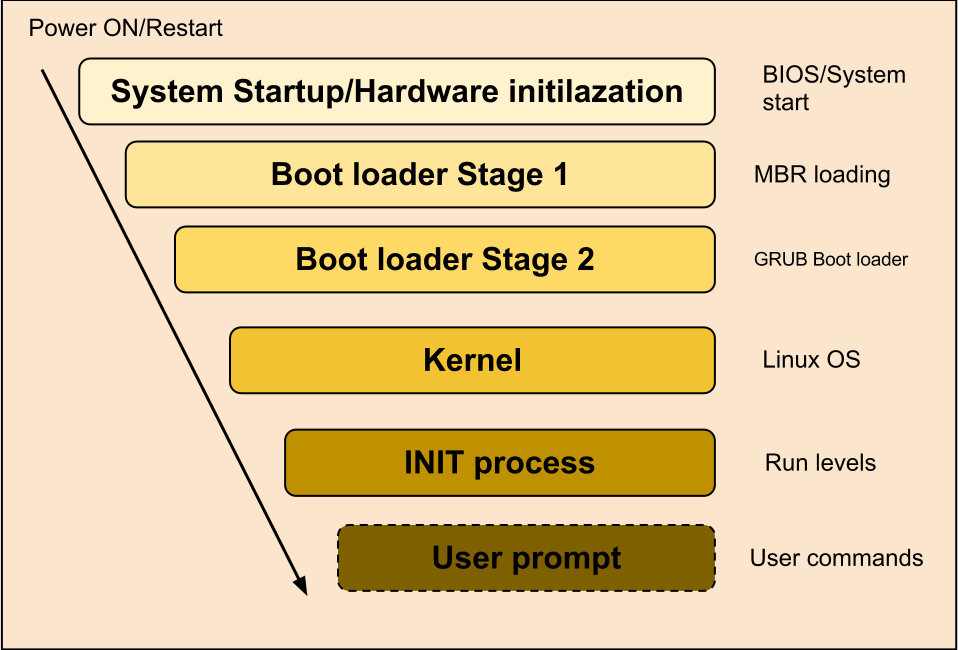

#### 1.1.1. System Startup
- Đây là bước đầu tiên của quá trình khởi động , ở bước này **BIOS** thực hiện 1 công việc gọi là **POST ( Power-on Self-test )** . **POST** là quá trình kiểm tra tính sẵn sàng phần cứng nhằm kiểm tra thông số và trạng thái của các phần cứng máy tính như bộ nhớ , CPU , thiết bị lưu trữ , card mạng ,… Nếu quá trình **POST** kết thúc thành công , **BIOS** sẽ cố gắng tìm kiếm và boot 1 hệ điều hành được chứa trong các thiết bị lưu trữ như ổ cứng , CD/DVD , USB .
- Thông thường **BIOS** sẽ kiểm tra ổ đĩa mềm hoặc CD-ROM xem có thể khởi động từ chúng được không , rồi đến phần cứng . Thứ tự của việc kiểm tra các ổ đĩa phụ thuộc vào các cấu hình trong **BIOS** .
    - Nếu **BIOS** không tìm thấy boot device thì sẽ cảnh báo No boot device found .
    - Nếu hệ điều hành **Linux** được cài đặt trên đĩa cứng thì sẽ tìm đến **Master Boot Record (MBR)** tại **sector** đầu tiên của ổ cứng đầu tiên .
#### 1.1.2. MBR Loading
- MBR ( Master Boot Record ) được lưu trữ tại sector đầu tiên của 1 thiết bị lưu trữ dữ liệu , vd /dev/hda hoặc /dev/sda .
- MBR rất nhỏ , chỉ 512 byte .
- MBR chứa thông tin :
    - Primary boot loader code ( 446 byte ) : cung cấp thông tin boot loader và vị trí boot loader trên ổ cứng .
    - Partition table information ( 64 byte ) : lưu trữ thông tin các partition .
    - Magic number ( 2 byte ) : được sử dụng để kiểm tra MBR , nếu MBR bị lỗi thì nó sẽ khôi phục lại .

#### 1.1.3. GRUB Loader
- Sau khi xác định vị trí Boot Loader , bước này sẽ thực hiện load Boot Loader vào bộ nhớ và đọc thông tin cấu hình sau đó hiển thị **GRUB boot menu** để user lựa chọn . Nếu user không chọn OS thì sau khoảng thời gian được định sẵn , **GRUB** sẽ load **kernel** default vào memory để khởi động .
- Đối với các hệ thống sử dụng **EFI/UEFI** , các firmware **UEFI** sẽ đọc dữ liệu Boot Manager để tìm các ứng dụng **UEFI** . Firmware sẽ chạy ứng dụng **UEFI** .

#### 1.1.4. Kernel
- Kernel của hệ điều hành sẽ được nạp vào trong RAM . Khi kernel hoạt động thì việc đầu tiên đó là thực thi quá trình INIT .


#### 1.1.5. Runlevels ( INIT )
- Đây là giai đoạn chính của quá trình boot . Quá trình này bắt đầu bằng việc đọc file `/etc/inittab` :
    - **Runlevel** `0` : *halt* - tắt hệ thống
    - **Runlevel** `1` : *single-user mode* - không cấu hình network , khởi động các tiến trình và cho phép đăng nhập user non-root
    - **Runlevel** `2` : *multi-user mode* - không cấu hình network , khởi động các tiến trình
    - **Runlevel** `3` : *multi-user mode with networking* - khởi động hệ thống bình thường trên giao diện dòng lệnh
    - **Runlevel** `4` : *undefined*
    - **Runlevel** `5` : *X11* - khởi động hệ thống trên giao diện đồ họa
    - **Runlevel** `6` : *reboot* - khởi động lại hệ thống

#### 1.1.6. User Prompt 
- Người dùng đăng nhập và sử dụng

Thiết lập chế độ khởi động mặc định : 
- **Multi-user.target** ( **INIT 3** ) : Chế đô dòng lệnh Command Mode ( non-graphics ) . User chỉ sử dụng các lệnh ( command ) để thao tác . Ở chế độ này Server dùng rất ít RAM .
- **Graphical.target** ( **INIT 5** ) : Chế độ GUI , mặc định khi install OS ở chế độ GNOME là ta đang sử dụng **Graphical.target**
- Các lệnh thiết lập :
    - Thiết lập **Multi-user.target** mặc định khi khởi động : `# systemctl set-default multi-user.target`
    - Thiết lập **Graphical.target** mặc định khi khởi động : `# systemctl set-default graphical.target`
    - Kiểm tra chế độ mặc định khi khởi động hiện tại : `# systemctl get default`
    - Chuyển đổi tạm thời từ **graphical -> multi-user** : `# systemctl isolate multi-user.target hoặc # init 3`
    - Chuyển đổi tạm thời từ **multi-user -> graphical** : `# systemctl isolate graphical.target hoặc # init 5`


### 1.2. Systemd

- **Systemd** là 1 nhóm các chương trình đặc biệt quản lý , vận hành và theo dõi các tiến trình khác hoạt động .

**Vai trò của systemd**
- **Systemd** cung cấp 1 chương trình đầu tiên được khởi động trong hệ thống ( `PID = 1 `) . Và khi hoạt động , `/sbin/init` sẽ giữ vai trò kích hoạt các file cấu hình cần thiết cho hệ thống , và các chương trình này sẽ nối tiếp để hoàn tất công đoạn khởi tạo . 

**Các thành phần của systemd**
- Về cơ bản thì systemd tương đương với 1 chương trình quản lý hệ thống và các dịch vụ trong Linux . Nó cung cấp các tiện ích sau :
    - `systemctl` : dùng để quản lý trạng thái của các dịch vụ hệ thống ( bắt đầu , kết thúc , khởi động hoặc kiểm tra trạng thái hiện tại ) .
    - `journald` : dùng để quản lý nhật ký hoạt động của hệ thống ( hay còn gọi là ghi log ) .
    - `logind` : dùng để quản lý và theo dõi việc đăng nhập / đăng xuất của người dùng .
    - `networkd` : dùng để quản lý các kết nối mạng thông qua các cấu hình mạng .
    - `timedated` : dùng để quản lý thời gian trên hệ thống hoặc mạng .
    - `udev` : dùng để quản lý các thiết bị và firmware

**Unit file**
- Tất cả các chương trình được quản lý bởi systemd đều được thực thi dưới dạng daemon hay background bên dưới nền và được cấu hình thành 1 file configuration gọi là unit file .
- Các unit file này sẽ gồm 12 loại :
    - `service` : các file quản lý hoạt động của 1 số chương trình .
    - `socket` : quản lý các kết nối
    - `device` : quản lý thiết bị
    - `mount` : gắn thiết bị
    - `automount` : tự động gắn thiết bị
    - `swap` : vùng không gian bộ nhớ trên đĩa cứng
    - `target` : quản lý tạo liên kết
    - `path` : quản lý các đường dẫn
    - `timer` : dùng cho cronjob để lập lịch
    - `snapshot` : sao lưu
    - `slice` : dùng cho quản lý tiến trình
    - `scope` : quy định không gian hoạt động

**Service**
- Mặc dù có 12 loại **unit file** trong **systemd** , tuy nhiên có lẽ service là loại được quan tâm nhất .
- Loại này sẽ được khởi động khi bật máy và luôn chạy ở chế độ nền ( **daemon** hoặc **background** ) .
- Các service thường được cấu hình trong các file riêng biệt và được quản lý thông qua **systemctl** .
- Có thể dùng các câu lệnh sau để xem các `service` : `# systemctl list-units | grep -e '.service'` hoặc `# systemctl -t service`

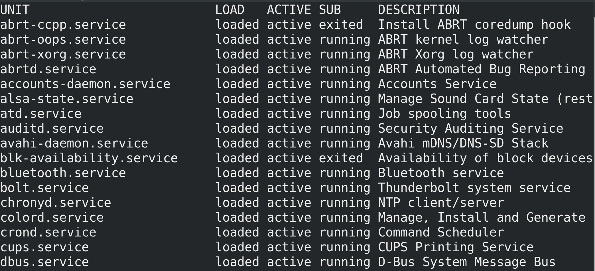

- Các tùy chọn bật/tắt service trong systemctl :
    - `start` : bật service
    - `stop` : tắt service
    - `restart` : khởi động lại service
    - `reload` : load lại file cấu hình ( chỉ có 1 số service hỗ trợ như **Apache / NginX** ,… )
    - `enable` : service được khởi động cùng hệ thống
    - `disable` : service không được khởi động cùng hệ thống

**Các hệ thống tương tự Systemd**

- **Systemd** mới chỉ xuất hiện từ 30-3-2010 , trước đó có 2 hệ thống khác đã từng được sử dụng :
    - **Upstart** : hệ thống init được phát triển bởi **Canonical** và được sử dụng trong Ubuntu Linux giai đọan đầu .
    - **SysV** : hệ thống init cổ điển của **Unix BSD SystemV** , được viết bằng shell script và đã quá lâu đời .

##  System Info - Thông tin hê thống 
- Xem thông tin hệ điều hành
```sh
cat /etc/*release
```

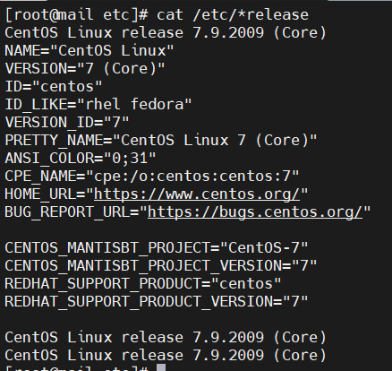

- Kernel version: 
```sh
uname -r
```

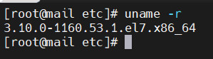

- Thông tin bộ nhớ: 
```sh
head /proc/meminfo
```

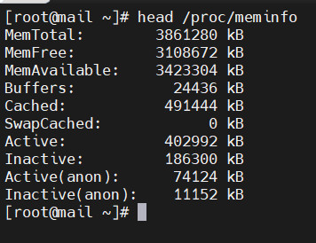

- File hệ thống 
```sh
df -h
```

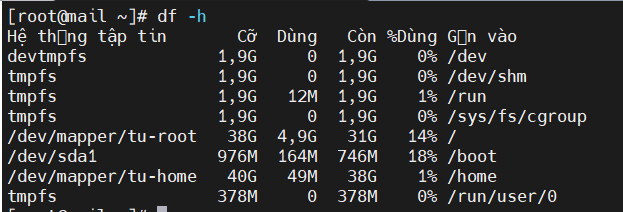

- Đếm số lượng CPU: 
```sh
cat /proc/cpuinfo | grep model
```

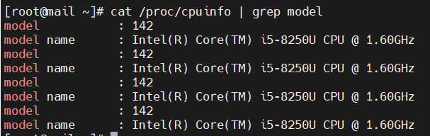

- Tên máy chủ
```sh
cat /etc/hostname
```

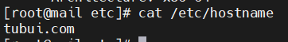

- Đổi tên máy chủ
```sh
hostnamectl set-host name tubuixyz
```

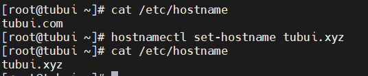

- Hệ thống tập tin `proc` chứa các tập tin ảo mà chỉ tồn tại trong bộ nhớ. Một số tập tin quan trọng trong `/proc` bao gồm
```sh
/proc/cpuinfo
/proc/interrupts
/proc/meminfo
/proc/mounts
/proc/partitions
/proc/version
/proc/<process-id-#>
/proc/sys
```

> Hệ thống tập tin /proc rất hữu ích vì thông tin mà nó báo cáo chỉ được thu thập khi cần thiết và không bao giờ cần lưu trữ trên đĩa.

## 3. Phân vùng ổ đĩa và tập tin hệ thống (Filesystem)
### 3.1. File System
- File system là một phương pháp được sử dụng để **lưu trữ, sắp xếp, quản lý và truy cập dữ liệu trên các thiết bị lưu trữ**, chẳng hạn như ổ cứng, hoặc một phân vùng dữ liệu. File system khiến cho việc **truy xuất và sắp xếp các tập tin, thư mục trở nên dễ dàng và hiệu quả hơn.**

> Một Filesystem có thể được hiểu đơn giản là **một cây logic** hoặc **một logic map của các folder (directory) trên ổ đĩa hoặc phân vùng ổ đĩa**

- Mỗi loại hệ thống tệp có cách tổ chức và lưu trữ dữ liệu khác nhau, nhưng đều cung cấp các chức năng cơ bản như tạo, đọc, ghi và xóa các tập tin và thư mục.

- Các loại File system phổ biến: 
    - **FAT (File Allocation Table)**: Hệ thống tệp đơn giản, cũ, tương thích rộng rãi (USB, thẻ nhớ), nhưng bị giới hạn về kích thước tệp và phân vùng, không có journaling hay bảo mật nâng cao.
    - **NTFS (New Technology File System)**: Hệ thống tệp tiêu chuẩn của Windows, hỗ trợ kích thước lớn, ghi nhật ký (journaling), bảo mật cấp tệp (ACLs), và nén/mã hóa dữ liệu.
    - **EXT (Extended File System)**: Hệ thống tệp mặc định và phổ biến cho Linux (EXT4), cung cấp hiệu suất tốt, độ tin cậy cao, và hỗ trợ ghi nhật ký.
    - **HFS (Hierarchical File System)**: Hệ thống tệp cũ của Apple (HFS+ hay Mac OS Extended), được sử dụng trên macOS trước khi APFS ra đời, không tối ưu cho SSD.
    - **APFS (Apple File System)**: Hệ thống tệp hiện đại của Apple, tối ưu hóa cho SSD, hỗ trợ ảnh chụp nhanh (snapshots), mã hóa mạnh mẽ, và Copy-on-write.
    - **ReFS (Resilient File System)**: Hệ thống tệp mới của Microsoft tập trung vào tính đàn hồi, tự sửa lỗi, và toàn vẹn dữ liệu cho môi trường máy chủ và lưu trữ lớn.
    - **XFS (X File System)**: Hệ thống tệp ghi nhật ký hiệu suất cao trong Linux, xuất sắc trong việc xử lý các tệp và phân vùng cực lớn và I/O song song.
    - **Btrfs (B-Tree File System)**: Hệ thống tệp "thế hệ mới" của Linux với các tính năng tiên tiến như ảnh chụp nhanh, tự sửa lỗi, và quản lý ổ đĩa tích hợp.
    - **ZFS (Zettabyte File System)**: Hệ thống kết hợp giữa file system và quản lý ổ đĩa, nổi tiếng với tính toàn vẹn dữ liệu (checksums), ảnh chụp nhanh, và hỗ trợ dung lượng cực lớn.
#### 3.1.1 Hệ thống thư mục trên Linux
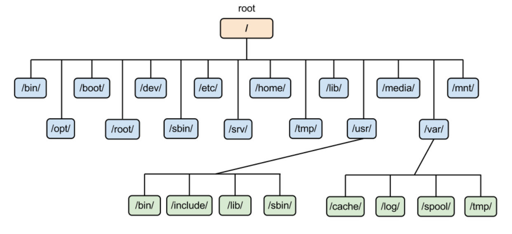

##### /root
- Là home directory riêng của user `root (superuser)`, tương đương như `/home/root` nhưng được đặt trực tiếp dưới `/` để đảm bảo root luôn truy cập được kể cả khi `/home` bị lỗi hoặc chưa mount.
- Chỉ có `root` mới có quyền `read/write/execute` trong thư mục này (permissions mặc định `700`).
- Thường chứa:
    - các script quản trị,
    - các file SSH keys (/root/.ssh/),
    - các file tạm của admin khi thao tác trực tiếp bằng root.

- Một số hệ thống không dùng root login trực tiếp (như Ubuntu sử dụng `sudo`), nhưng thư mục `/root` vẫn luôn tồn tại để đảm bảo tương thích.


##### /bin - user binary
- Chứa các tập tin thực thi nhị phân .
- Lệnh Linux phổ biến sử dụng ở chế độ *single-user mode* nằm ở thư mục này .
- Tất cả các user hệ thống nằm tại thư mục này đều có thể sử dụng lệnh .
##### /sbin - system binaries
- Cũng giống như `/bin` , `/sbin` cũng chứa tập tin thực thi nhị phân .
- Những lệnh trong thư mục này chỉ được dùng bởi người quản trị hệ thống - tương đương user `root` .

##### /etc - configuration files
- Chứa các file cấu hình chính của toàn bộ hệ thống, từ kernel modules, networking, user accounts đến dịch vụ nền.
- Chứa shell scripts startup và shutdown , sử dụng để chạy/ngừng các chương trình cá nhân .
- Dữ liệu trong /etc không phải binary, mà luôn là:

    - file text,

    - script,

    - template,

    - các file định dạng cấu hình (INI, YAML, conf…).
- Không chứa “data runtime” hay “log” – chỉ chứa **cấu hình tĩnh**.
- Ví dụ tiêu biểu:

    - `passwd`, `shadow`, `group` — thông tin account hệ thống.

    - `fstab` — cấu hình mount filesystem.

    - `ssh/sshd_config` — cấu hình dịch vụ SSH.

    - `systemd/system/*.service` — unit file cho systemd.

- Về startup/shutdown scripts:

    - Trên hệ thống cũ dùng SysVinit, scripts nằm trong:
    `/etc/init.d/`

    - Trên hệ thống hiện đại dùng systemd, unit file nằm ở:
    `/etc/systemd/system/`

- Một số thư mục con quan trọng:

    - `/etc/network/` — cấu hình mạng (Debian)

    - `/etc/nginx/` — cấu hình Nginx

    - `/etc/apt/` — repository list

    - `/etc/default/` — biến môi trường mặc định của dịch vụ

##### /dev/ - files device
- Chứa thông tin nhận biết cho các thiết bị của hệ thống , bao gồm các thiết bị đầu cuối , USB hoặc các thiết bị được gắn trên hệ thống .
- Mỗi thiết bị đều có file đại diện và được đặt tên nhất định :
    - `cdrom` : đĩa CDROM / DVD
    - `hd*` : ổ đĩa IDE , ATA
        - `hda` : ổ cứng thứ nhất
        - `hdb` : ổ cứng thứ hai
            - `hdb1` : phân vùng thứ nhất của ổ cứng thứ nhất
    - `sd*` : ổ đĩa SCSI , SATA ( SSD , HDD ) , USB
        - `sda` : ổ cứng thứ nhất
        - `sdb` : ổ cứng thứ hai
            - `sdb1` : phân vùng thứ nhất của ổ cứng thứ nhất
    - `nvme0*` : ổ cứng SSD NVMe
        - `nvme0n1` : ổ nvme thứ nhất
        - `nvme0n2` : ổ nvme thứ hai
            - `nvme0n2p1` : phân vùng thứ nhất của ổ nvme thứ nhất
    - `tty*` : cổng giao tiếp ( COM ,…)
    - `eth*`: cổng Ethernet

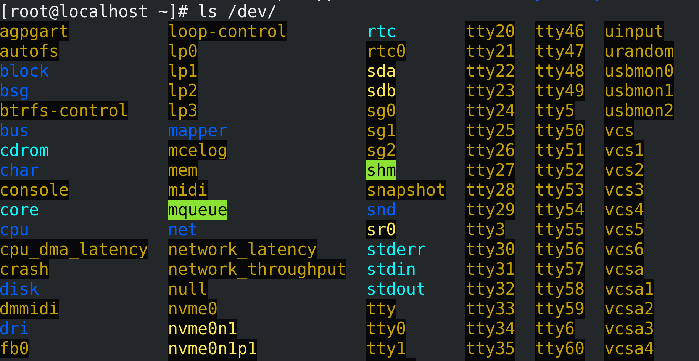

##### /proc - process information
- Chứa các thông tin về **System process** .
- Đây là **hệ thống tập tin giả** có **chứa thông tin về các tiến trình đang chạ**y hoặc **thông tin về tài nguyên hệ thống** .

##### /var - variable files
- Là nơi chứa các **dữ liệu thường xuyên thay đổi, không cố định, thường tăng theo thời gian**.
- Trái với `/etc` (cấu hình tĩnh), `/var` chứa dữ liệu động của hệ thống.
- Dữ liệu trong `/var` thường là:
    - log,
    - cache,
    - database nội bộ,
    - queue files (mail, print),
    - state và lock,
    - spool jobs.
- **Một số thư mục con quan trọng trong `/var` :**
    - `/var/log` – system logs 
        - Chứa log của toàn hệ thống: kernel, systemd, auth, cron, web server…
        - Ví dụ : syslog, auth.log, dmesg, nginx/access.log, journal/.
    - `/var/lib` – state information của các dịch vụ
        - Chứa dữ liệu stateful, được dịch vụ tạo và duy trì giữa các lần reboot.
        - Ví dụ:
            - `/var/lib/dpkg/` — trạng thái các package đã cài (Debian)
            - `/var/lib/mysql/` — database MySQL
            - `/var/lib/kubelet/` — data của Kubernetes node
            - `/var/lib/docker/` — container/storage layer
    - `var/mail` hoặc `/var/spool/mail` – user mailboxes
        - Chứa mail cho người dùng local mail server (sendmail/postfix).
    - `/var/spool` – job queues
        - Queue cho các tác vụ chờ xử lý:
            - mail queue
            - print queue (`/var/spool/cups`)
            - cron jobs
            - at jobs
    - `/var/lock` (hoặc `/run/lock`) – lock files
        - lock file đảm bảo rằng chỉ một process truy cập tài nguyên tại một thời điểm.
        - Trên hệ thống mới: `/var/lock` → symlink → `/run/lock`
    - `/var/www` – web content
        - Chứa dữ liệu của web server (Apache, Nginx).
        - Không bắt buộc theo FHS nhưng gần như mọi distro đều đặt tại đây.
    - `/var/tmp` – long-lived temporary files
        - Không giống `/tmp`, file trong `/var/tmp` sẽ được giữ lại giữa các lần reboot.
        - Dùng cho ứng dụng cần file tạm nhưng không được mất khi restart.

##### /tmp - temporary file
- Thư mục **chứa các tập tin tạm thời được tạo bởi hệ thống và user** .
- Các tập tin trong thư mục này **bị xóa khi hệ thống reboot lại** .
- **Quyền mặc định:** 1777 (ai cũng có thể ghi, nhưng không thể xóa file của người khác).

> Không phải tất cả hệ thống đều tự động xóa nội dung `/tmp` khi reboot → Debian/Ubuntu dùng tmpfs (xóa khi reboot), nhưng một số distro khác thì không.

#####  /usr - Unix - System Resources
- Đây là thư mục chứa toàn bộ ứng dụng và dữ liệu read-only, coi như Program Files của Linux.
- `/usr/bin` Chứa hầu hết user commands như `awk`, `curl`, `ssh`, `scp`, `less`
> `/bin `hiện đại thường chỉ là symlink trỏ về `/usr/bin`
- `/usr/sbin` Chứa các chương trình dành cho quản trị hệ thống (admin tools).
- `/usr/lib` chứa thư viện cho `/usr/bin` và `/usr/sbin` .
- `/usr/local` Đây là nơi chứa các ứng dụng không thuộc hệ thống packager, cài thủ công (from source). VD : Khi cài đặt apache2 từ source , apache 2 nằm ở `/usr/local/apache2` .
Cấu trúc : 
```
/usr/local/bin
/usr/local/sbin
/usr/local/lib
/usr/local/share

```

##### /home - home directory
- Thư mục chứa các thư mục home của các user được tạo .
- Đây là nơi chứa dữ liệu cá nhân: .config, .ssh, tài liệu, key, script.
- Thường tách thành partition riêng để tránh mất dữ liệu khi cài lại hệ điều hành.
##### /boot - boot loader files
- Chứa kernel (vmlinuz-*), initramfs (initrd.img-*), các file cấu hình khởi động.
- Các file `kernel initrd` , `vmlinux` , `grub` đều nằm trong đây .VD : `initrd.img-2.5.32.24-generic` , `vmlinux-2.6.32-24-generic`
- Thường được đặt ở phân vùng riêng `/boot` hoặc `/boot/efi` (EFI system partition).

##### /lib - system libraries
- Chứa thư viện thiết yếu dùng bởi các chương trình trong `/bin` và `/sbin`.
- Chứa kernel modules trong `/lib/modules/$(uname -r)`.
Tên file có thể là ld* hoặc lib*.so*VD : ld-2.11.1.so , libncurses.so.5.7

##### /lib64 - system libraries x64
- Tương tự như `/lib` nhưng chủ yếu dành cho các máy 64-bit theo chuẩn multilib. 
- Giúp hệ thống chạy song song chương trình 32-bit và 64-bit.


##### /opt - optional
- Chứa các ứng dụng thêm vào từ nhà cung cấp độc lập khác .
- Các ứng dụng này có thể được cài ở `/opt` hoặc 1 thư mục con của `/opt` .
- Thường chứa các ứng dụng third-party kiểu “self-contained”, ví dụ:
/opt/google/chrome, /opt/vmware/, /opt/zoom/.
- Không bị OS package manager (apt/yum) quản lý.


##### /media - mount outside devices
- Thư mục này có vai trò như đích đến của quá trình **mount point** . Khi gắn 1 thiết bị lưu trữ bên ngoài , để sử dụng cần **mount** thiết bị này vào 1 thư mục trong `/media` , từ đó , các thư mục , tập tin sẽ được chuyển vào đây ( lúc này `/media` có thể coi như ảnh chiếu của các thiết bị ) .

- Mount tự động USB/CD/DVD theo cấu trúc:
```
/media/<username>/<device_name>
```
- Do desktop environment (GNOME/KDE) tự động handle
##### /mnt - mount inside device
- /mnt được dùng làm mount point tạm, thường cho sysadmin.
→ Ví dụ khi rescue system, chroot, mount ổ cứng backup…
```
mount /dev/sda2 /mnt
```
##### /srv - system services’s data
- Chứa dữ liệu phục vụ trực tiếp cho các dịch vụ (server services):
```
/srv/www      # dữ liệu web server
/srv/ftp      # dữ liệu FTP
/srv/nfs      # exported NFS data

```

- Dùng cho dữ liệu mà dịch vụ cung cấp ra ngoài (service data, not program data).
##### /run – runtime data
- Lưu trữ các file runtime data, tồn tại trong 1 phiên boot.
Ví dụ:

- PID files: /run/*.pid

- Socket: /run/docker.sock

- Lock files

- Network state khi boot

- /var/run hiện đại là symlink → /run

##### /sys - system files
- `/sys` là virtual filesystem cung cấp giao diện để kernel expose thông tin thiết bị và driver.
- Do hệ thống tự tạo, không phải dữ liệu thật.
- Ví dụ:
```
/sys/class/net/eth0/speed
/sys/block/sda/queue

```
- Cho phép user-space đọc thông tin phần cứng hoặc tương tác kernel (tuning).

#### 3.1.2. Đường dẫn tuyệt đối và đường dẫn tương đối
- **Đường dẫn tuyệt đối** là đường dẫn chỉ ra vị trí chính xác của file và thư mục . Đường dẫn tuyệt đối sẽ được khai báo bắt đầu bởi ký tự / rồi đến thư mục con … 
    - VD : `#cd /etc/sysconfig`
- **Đường dẫn tương đối** là đường dẫn mà vị trí của file và thư mục sẽ được tham chiếu bởi vị trí của thư mục hiện hành . Đường dẫn tương đối không được khai báo bắt đầu bởi thư mục gốc / 
    - VD : `# cd network-scripts`

