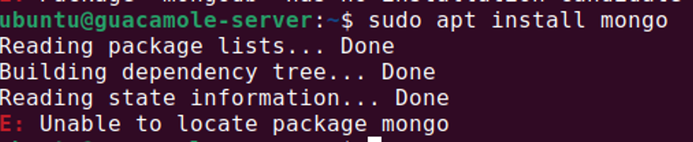
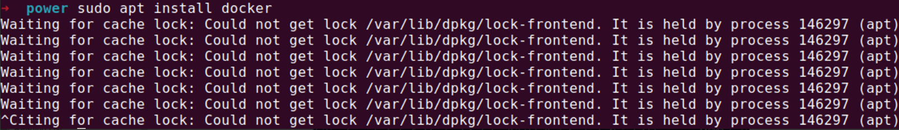

#  —  Quản lý gói phần mềm 
## 1. Package Management Systems (Hệ thống quản lí package)
- Các phần cốt lõi của các bản phân phối Linux và hầu hết các phần mềm của nó được cài thông qua `Packet Management System`. Mỗi gói chứa các tệp và các hướng dẫn khác cần thiết để làm cho một thành phần phần mềm hoạt động trên hệ thống. Các gói phụ thuộc lẫn nhau
- Có 2 lựa chọn quản lý gói : 'dpkg' và 'rpm'. Hai hệ thống không tương thích nhưng cung cấp các tính năng giống nhau ở mức độ rộng rãi.

|High Level Tool|Low Level Tool|Family|
|---------------|--------------|------|
|zypper|rpm|SUSE|
|yum|rpm|Red Hat|

- Cả 2 hệ thống quản lý gói cung cấp 2 mức công cụ:
	+ Công cụ cấp thấp (ví dụ như `dpkghay`, rpm), sẽ chăm sóc các chi tiết của giải nén gói cá nhân, chạy các kịch bản, nhận được các phần mềm được cài đặt một cách chính xác
	+ Một công cụ cấp cao (ví dụ `apt-get`, `yum` hoặc `zypper`) hoạt động với các nhóm gói, tải gói từ nhà cung cấp và tìm ra các phụ thuộc
- Cài đặt một gói duy nhất có thể dẫn đến hàng chục thậm chí hàng trăm gói phụ thuộc được cài đặt

|Operation|RPM|Debian|
|---------|-----------|-----------|
|Cài đặt 1 package|rpm –i foo.rpm|dpkg --install foo.deb|
|Cài đặt 1 package từ repository|yum install foo|apt-get install foo|
|Xóa một package|rpm –e foo.rpm|dpkg --remove foo.deb|
|Xóa một package lấy từ repository|yum remove foo|apt-get remove foo|
|Update một package tới phiên bản mới hơn|rpm –U foo.rpm|dpkg --install foo.deb|
|Update 1 package sử dụng repository và resolving dependencies|yum update foo|apt-get upgrade foo|
|Update toàn bộ hệ thống|yum update|apt-get dist-upgrade|
|Hiển thị tất cả các package đã cài đặt|yum list installed|dpkg --list|
|Nhận thông tin về các package được cài đặt bao gồm các file|rpm –qil foo|dpkg --listfiles foo|
|Hiển thị các package có sẵn với "foo" trong tên|yum list foo|apt-cache search foo|
|Hiển thị tất cả các package có sẵn|yum list|apt-cache dumpavail|
|Hiển thị package có chứa "file"|rpm –qf file|dpkg --search file|

## 2. Package Management
- **Packages management** - trình quản lý các gói là **các chương trình hoặc bộ chương trình được cài đặt sẵn trong các bản phân phối của Linux** và được dùng để **quản lý việc cài đặt hoặc gỡ cài đặt các chương trình hoặc ứng dụng trên Linux**.
- Một package thường bao gồm các **file nhị phân**, các file cấu hình, **thư viện**, **file mã nguồn**, **document và file script cần thiết để cài đặt và chạy chương trình.** thường được xây dựng từ mã nguồn của một ứng dụng và có logic cho bản phân phối của bạn biết nơi đặt các tệp nhị phân, tệp và cấu hình của ứng dụng.
```
ivan@ubuntu:~$ sudo apt install flameshot // sample 
```

- **Package Management tools** là các công cụ được thiết kế để tự động hóa quá trình cài đặt, nâng cấp, định cấu hình và gỡ bỏ phần mềm một cách nhất quán. 
    - `apt` (Advanced Package Tool) for Debian-based systems (like Ubuntu)
    - `dnf` (Dandified Yum) or yum for Red Hat-based systems (like Fedora and CentOS)
    - `pacman` for Arch Linux
    - `zypper` for openSUSE

- **Package dependency** là trường hợp gói phần mềm hoặc thư viện nào phụ thuộc vào các gói hoặc thư viện khác để hoạt động chính xác. Các phần phụ thuộc thường được quản lý bằng cách sử dụng trình quản lý gói, like pip for Python, npmfor JavaScript, or gemfor Ruby.
```bash
#list packages

dpkg --list

 

#list of all the files installed by the package, including their full paths.

# dpgk -L <package ivane>

dpkg -L flameshot

#apt list of all the files in the package, including their full paths.

apt-file list <package-name>

apt policy docker

# Install / Remove package and dependencies


#On Ubuntu or Debian using apt:

sudo apt-get update

sudo apt-get install <package-name>

 

#On Fedora, CentOS or Red Hat using yum:

sudo yum install <package-name>

# Remove package


#On Ubuntu or Debian using apt:

#Remove package and it's dependencies

sudo apt-get remove <package-name>

#Remove package and it's dependencies which(dependencies) are no longer used by other package

sudo apt-get autoremove <package-name>

 

#On Fedora, CentOS or Red Hat using yum:

#Remove package and it's dependencies

sudo yum remove <package-name>

#Remove package and it's dependencies which(dependencies) are no longer used by other package

sudo apt-get autoremove <package-name>


## remove package and it configuration
#REMOVE PACKAGE AND IT CONFIGURATION

sudo apt-get purge  <package-name>

sudo apt-get remove --purge <packagename>


# Update packages


#On Ubuntu or Debian using apt:

sudo apt-get update && sudo apt-get upgrade

 

#On Fedora, CentOS or Red Hat using yum:

sudo yum update


```

## 1. Config YUM and APT
- **Config APT:** Cấu hình chỉnh sửa các repo và mirror file(với .list định dạng) trong folder `/etc/apt/sources.list.d/` or hoặc cấu hình `file/etc/apt/sources.list.` Để cập nhật các thay đổi `sudo apt update`
    - Mỗi dòng trong file /etc/apt/sources.list đại diện cho một kho lưu trữ (repository) và có định dạng sau: 
    ``` bash
    deb http://repository_url distribution component1 component2 ..
    ```
    - **Trong đó :**
        - `deb` cho biết rằng đây là kho lưu trữ gói nhị phân (trái ngược với kho lưu trữ mã nguồn sẽ sử dụng `deb-src`).
        - http://repository_url: url của repository.
        - distribution: tên của bản phân phối Linux (e.g. focal, bionic, xenial, etc.).
        - component1, component2, etc. tên của các thành phần trong gói (e.g. main, restricted, universe, multiverse).
    - Ví dụ về thêm mirror/repo file vào directory `/etc/apt/sources.list.d`
    ```bash
    echo "deb [ arch=amd64,arm64 signed-by=/usr/share/keyrings/mongodb-server-6.0.gpg ] <https://repo.mongodb.org/apt/ubuntu> jammy/mongodb-org/6.0 multiverse" | sudo tee /etc/apt/sources.list.d/mongodb-org-6.0.list
    ivan@ubuntu:~$ sudo apt update
    ```

    - Ví dụ chỉnh sửa `/etc/apt/sources.list
`   ```bash
    ivan@ubuntu:~$ sudo nano /etc/apt/sources.list
    #add the mirror for example:
    deb http://mirror.example.com/ubuntu/ focal main restricted
    ivan@ubuntu:~$ sudo apt update
    ```

## 2. Các lỗi thường gặp 
- **Package Manager** không không thể tìm thấy gói trong repo/mirror của nó.
=> **Solution:** Cập nhật/Thêm repo của package trong file `/etc/apt/sources.list`



- **Package manager** đang được chạy bỏi tiến trình khác.



=> **Solution:** Kiểm tra và kill tiến tình đang chạy Package manager
```bash
$ sudo killall apt apt-get
$ sudo dpkg --configure -a
$ sudo apt update
```
