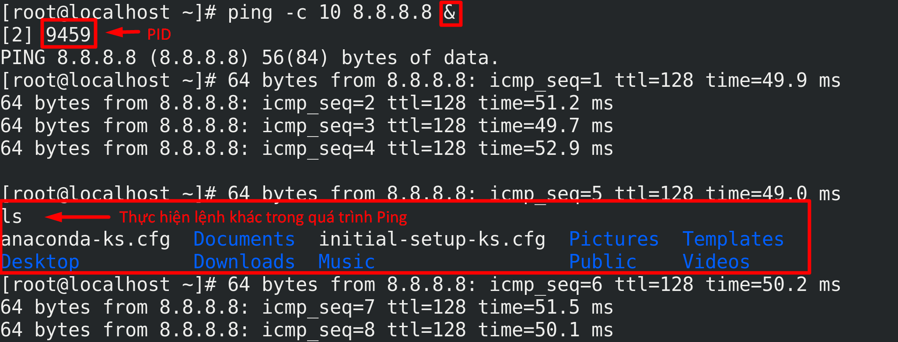
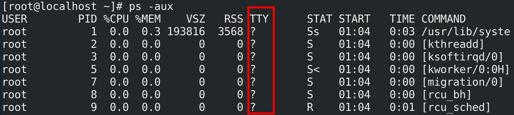
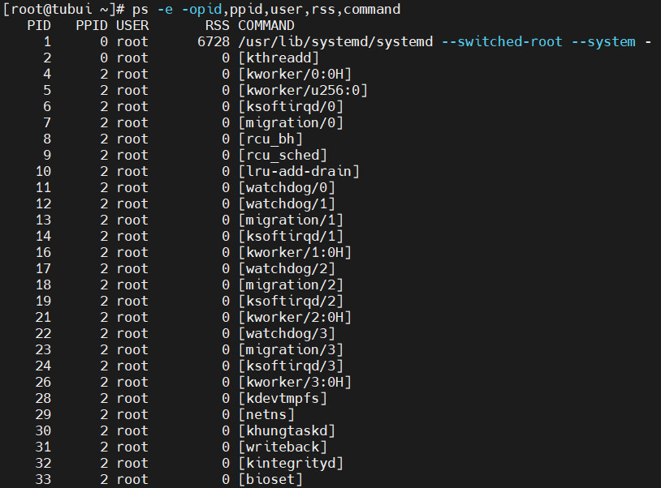
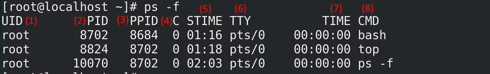
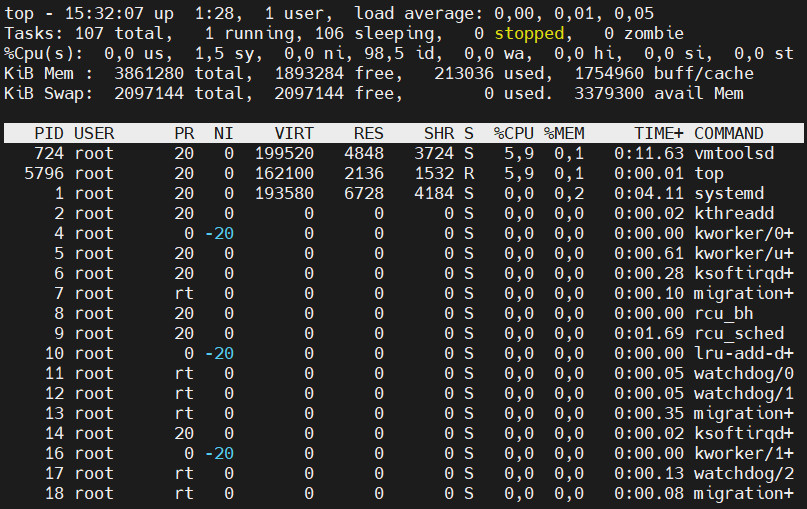
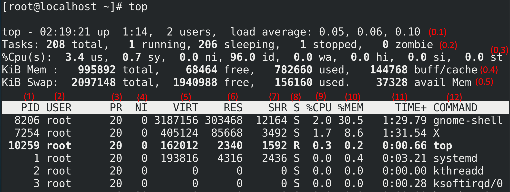
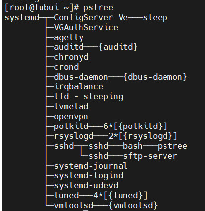
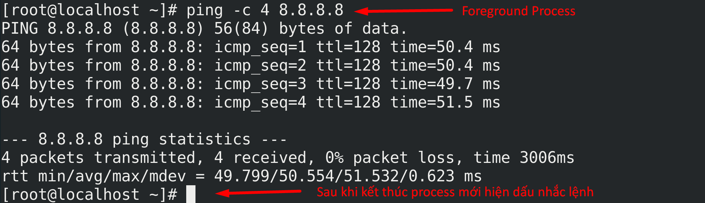
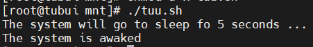

# Quản lý Tiến Trình và Tài Nguyên
## 1. Khái niệm Process

Mỗi lệnh hoặc chương trình khi thực thi trên Linux sẽ tạo ra một hoặc nhiều **process** (tiến trình).  
**Process** chính là đơn vị cơ bản cấu thành nên hệ điều hành Linux.

### 1.1. Các đặc điểm chính
- Mỗi process có **PID** (Process ID) duy nhất tại một thời điểm và một **PPID** (Parent Process ID) – ID của process cha đã sinh ra nó.
- PID được cấp tăng dần từ 0, giới hạn tối đa có thể xem/thay đổi tại `/proc/sys/kernel/pid_max`.
- Các process có không gian địa chỉ bộ nhớ riêng biệt → **process isolation** (cô lập tiến trình), giúp chúng độc lập và tăng tính bảo mật.
- Khi **fork**, Linux sử dụng cơ chế **copy-on-write**: process con ban đầu chia sẻ bộ nhớ vật lý với process cha. Chỉ khi một trong hai thay đổi dữ liệu thì vùng bộ nhớ mới được sao chép riêng → tiết kiệm tài nguyên đáng kể.



### 1.2. Các loại Process

| Loại                  | Mô tả                                                                                                   | Đặc điểm nhận biết                          |
|-----------------------|---------------------------------------------------------------------------------------------------------|---------------------------------------------|
| Foreground Process    | Chạy mặc định, chiếm terminal, nhận input từ bàn phím và xuất output ra màn hình                       | Không thể chạy lệnh khác cho đến khi kết thúc |
| Background Process    | Chạy ngầm, không chiếm terminal. Thêm `&` cuối lệnh để chạy background                                 | Có thể tiếp tục làm việc khác trên terminal |
| Daemon Process        | Process hệ thống chạy nền lâu dài, thường với quyền root, cung cấp dịch vụ (printer, sshd, cron…)      | Trường TTY hiển thị `?` trong `ps`          |
| Zombie Process        | Đã kết thúc nhưng vẫn còn entry trong bảng process (trạng thái `Z`) vì parent chưa đọc exit status     | Không chiếm tài nguyên, chỉ chiếm slot PID  |
| Orphan Process        | Parent bị kill trước → init (PID 1) trở thành parent mới                                                | Vẫn chạy bình thường                        |




### 1.3. Job ID và Process ID
- Khi chạy background, shell cấp thêm **Job ID** (%1, %2…) để quản lý dễ dàng hơn PID.
- Job có thể gồm nhiều process chạy nối tiếp hoặc song song.

## 2. Các lệnh quản lý Process

### 2.1. ps — hiển thị trạng thái process tại một thời điểm
```sh
ps -e -o pid,ppid,user,rss,command          # Cơ bản, hiển thị PID, PPID, user, RSS, command
ps aux                                      # Hiển thị toàn bộ thông tin tất cả process (tương đương ps -ef)
ps -f -u user                               # Chi tiết process của một user
ps -p PID                                   # Xem process cụ thể theo PID
```






Ý nghĩa các cột chính của `ps -f`:
| Cột   | Ý nghĩa                                  |
|-------|------------------------------------------|
| UID   | Người dùng sở hữu process                |
| PID   | Process ID                               |
| PPID  | Parent Process ID                        |
| C     | % CPU sử dụng                           |
| STIME | Thời gian khởi chạy                     |
| TTY   | Terminal liên kết (? = không có terminal/daemon) |
| TIME  | Tổng thời gian CPU đã dùng              |
| CMD   | Lệnh khởi chạy process                  |

### 2.2. top — theo dõi process realtime




Thông tin chính trong top:
- Dòng 1: uptime, load average 1-5-15 phút
- Dòng 2: Tasks (total, running, sleeping, stopped, zombie)
- Dòng 3: %CPU (us, sy, ni, id, wa, hi, si, st)
- Dòng 4: MiB Mem (total, free, used, buff/cache)
- Dòng 5: MiB Swap (total, free, used, avail)
Bảng: PID, USER, PR, NI, VIRT, RES, SHR, %CPU, %MEM, TIME+, COMMAND

### 2.3. pstree — hiển thị cây tiến trình
- Hiển thị quan hệ cha-con rõ ràng dưới dạng cây.



### 2.4. kill — gửi tín hiệu tới process

```
kill PID                # Mặc định gửi SIGTERM (15)
kill -9 PID             # SIGKILL – buộc dừng ngay lập tức (kill cứng)
kill -15 PID            # SIGTERM – dừng an toàn, cho process dọn dẹp
kill -18 PID            # SIGCONT – tiếp tục process bị tạm dừng
kill -19 PID            # SIGSTOP – tạm dừng process (không thể bắt tín hiệu này)
```

> Khi kill process cha, tất cả process con cũng sẽ bị kill theo (trừ trường hợp đã detach).


### 2.5. Chạy background, tạm dừng, tiếp tục



```
command &               # Chạy background ngay từ đầu
Ctrl + Z                # Tạm dừng foreground process → trở thành stopped job
bg                      # Đưa job stopped ra chạy background
fg                      # Đưa job background về foreground
jobs                    # Xem danh sách job của shell hiện tại
```


### 2.6. Delay (sleep) một process


```
sleep 5                 # Ngủ 5 giây
command1; sleep 10; command2   # Thực hiện tuần tự có delay
(sleep 300; command) &         # Chạy command sau 5 phút ở background
```

## 3. Basic Security liên quan đến Process & User
### 3.1. Process Isolation & các cơ chế bảo vệ
- Mỗi process có address space riêng → không thể truy cập trực tiếp bộ nhớ của process khác.
- Các lớp bảo vệ bổ sung:
    - Control Groups (cgroups): giới hạn tài nguyên (CPU, RAM, I/O) cho nhóm process.
    - Linux Containers (Docker, LXC): cô lập hoàn toàn môi trường.
    - Virtualization (KVM, VMware): cô lập phần cứng.
### 3.2. Mã hóa mật khẩu
Hiện đại Linux sử dụng chuẩn SHA-512 để hash mật khẩu trong `/etc/shadow`.

### 3.3. Password Aging (hết hạn mật khẩu)
```
chage -l username       # Xem thông tin hết hạn mật khẩu của user
```

### 3.4. Xác thực bằng SSH Public/Private Key
- Không cần nhập mật khẩu mỗi lần đăng nhập.
- Có thể tắt hoàn toàn xác thực mật khẩu → chỉ ai có private key mới truy cập được → bảo mật cao hơn rất nhiều.