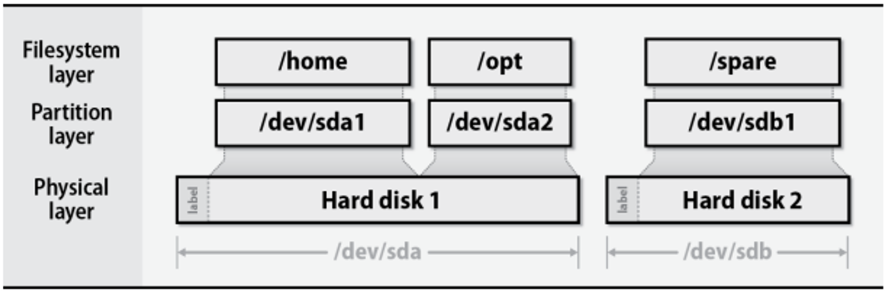
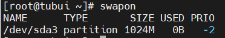
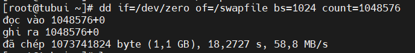
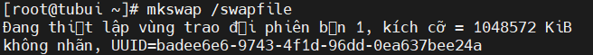
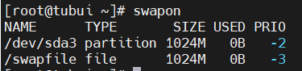
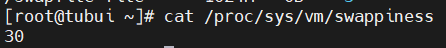
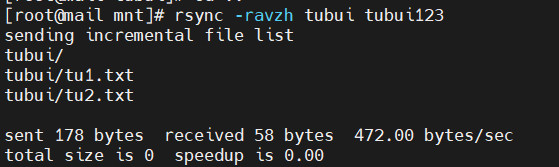

#  —  Quản lý lưu trữ cơ bản 

## 1. Disk Partition

- Phân vùng (Partition) ổ cứng là khái niệm phân chia một ổ đĩa cững hoặc thiết bị lưu trữ thành các phân vùng logic riêng biệt. Mỗi phân vùng đại diện cho một phần của ổ đĩa, có khả năng quản lý dữ liệu độc lập (có thể triển khai hệ thống file system riêng). 
    - (*) Partition table format là một phương thức, cách thức dùng để phân chia và quản lý các phân vùng lưu trữ. 
    - Các partition table phổ biến MBR (Master Boot Record) and GPT (GUID Partition Table)(MGB có kích thước tối đa của một phân vùng khoảng 2TB trong khi GPT lên tới 9TB.).
Tools for disk partitioning: `fdisk`, `parted`, `GNU parted`, ….
### 1.1. Mount và unmount file system
- Việc mount hệ thống tệp cho phép hệ điều hành truy cập vào thiết bị (ổ đĩa hoặc phân vùng) và giúp thiết bị có thể đọc và ghi dữ liệu vào thiết bị thông qua mount point(mount point là một thư mục trên hệ thống tệp được sử dụng để kết nối với thư mục gốc của filesystem được mount).
    - Command dùng mount một file system:
    ```
    sudo mount <device_name> <mount_point>
    #example
    sudo mount /dev/sda1 /media/nam/HDD-Drive
    ```
    - Unmount một file system
    ```
    sudo umount <mount_point>
    #example
    sudo umount /media/nam/HDD-Drive
    ```
    - Unmout một busy file system: Nếu muốn unmount một file system trong trạng thái busy (đang được một tiến trình thực hiện thao tác đọc hoặc ghi…)
    ```
    #see which processes are using the /media/nam/HDD-Drive file system
    sudo fuser -mv /media/nam/HDD-Drive
    # kill the process
    sudo kill -9 <process id>
    #then unmount
    sudo umount /media/nam/HDD-Drive
    ```

## 2. Swap memory
### 2.1. Khái niệm
- Swap Memory được sử dụng khi hệ thống quyết định rằng nó cần thêm bộ nhớ RAM cho quá trình hoạt động và bộ nhớ RAM hiện tại không còn đủ để sử dụng. Nếu điều đó xảy ra, các tài nguyên và dữ liệu tạm thời không hoạt động trên bộ nhớ RAM sẽ được di chuyển để lưu trữ vào không gian Swap để giải phóng bộ nhớ RAM và sử dụng cho việc khác
- Swap sẽ làm nhiệm vụ duy trì tất cả các hoạt động bình thường dù tốc độ chậm hơn thay vì phải dừng cả hệ thống khi đầy bộ nhớ RAM
### 2.2. Khi nào cần Swap memory
- Tối ưu hóa hệ thống bộ nhớ: Hệ thống sẽ di chuyển các tài nguyên và dữ liệu hiện không sử dụng trong bộ nhớ RAM đến Swap, điều này giúp hệ thống phục vụ cho các mục đích khác tốt hơn
- Tránh các trường hợp không thể lường trước: Trong một số trường hợp không thể dự tính được bộ nhớ chương trình chuẩn bị chạy
- Linux swap có 2 dạng: Phân vùng và file: Để xem nó ở đâu dùng lệnh
```sh
swapon
```



### 2.3. Tạo file Swap
- Tạo Swap flie:
```sh
dd if=/dev/zero of=/swapfile bs=1024 count=1048576
```

> Trong đó `bs` là kích thước của Swap file, `count` là tốc độ



- Phân quyền cho `swapfile`. Chỉ có root user mới có quyền truy cập:
```sh
chmod 600 /swapfile
```

- Sử dụng `mkswap` để thiết lập file là file swap
```sh
mkswap /swapfile
```



- Khởi động swap file
```sh
swapon /swapfile
```

- Mở file `/etc/fstab` và thêm vào cuối dòng sau:
```sh
$ sudo echo '/swapfile swap swap defaults 0 0' | sudo tee -a /etc/fstab
```

### 2.4. Kiểm tra lại vùng Swap
```sh
swapon
```



### 2.5. Giá trị Swappiness
- Giá trị từ swappiness từ 0 - 100. Chỉ số này càng thấp thì máy linux sẽ tránh sử dụng swap file này, càng cao thì càng ưu tiên sử dụng. Ta có thê thay đổi giá trị này tại `/proc/sys/vm/swappiness`
```sh
cat /proc/sys/vm/swappiness
```



### 2.6. Xóa Swap file
- Để xóa File Swap, có thể deactive swap file:
```sh
swapoff -v /swapfile
```
- Xóa dòng khai báo swap tại file `/etc/fstab`
- Cuối cùng để xóa ta dùng lệnh `rm`
```sh
rm -rf /swapfile
```
### 2.7. Dung lượng cần thiết của bộ nhớ SWAP
- Nếu RAM ít hơn hoặc bằng 1Gb, thì nên sử dụng Swap có kích thước tối thiểu là bằng với lượng RAM
- Đối với RAM trên 1Gb, thì kích thước tối đa thường là gấp đôi lượng RAM. Nếu thiết lập kích thước của Swap quá lớn chính là đang lãng phí dung lượng ổ đĩa mặc dù Swap không được sử dụng
- Thời gian truy cập trên Swap sẽ chậm hơn so với trên RAM

## 3. Backup data (Sao lưu dữ liệu)
- Lệnh `rsync` được sử dụng để đồng bộ hóa cây thư mục, ngoài ra, `rsync` kiểm tra xem tập tin đã được sao chép chưa. Nếu tồn tại hoặc không có thay đổi về kích thước hay thời gian sửa đổi, `rsync` sẽ tránh một bản sao không cần thiết và tiết kiệm thời gian. `rsync` chỉ sao chép các phần của tệp đã thay đổi nên nó rất nhanh
- `rsync` hiệu quả khi đệ quy sao chép một cây thư mục qua mạng, vì nó chỉ truyền đi sự thay đổi trong thư mục
- Người ta thường đồng bộ hóa cây thư mục đích với gốc, sử dụng option `rsync -r` để đệ quy xuống cây thư mục sap chép tất cả các tệp và thư mục bên trong tệp được liệt kê dưới dạng nguồn
### 3.1. Cài đặt `rsync`:
- Trên Red Hat/CenOS:
```sh
yum install rsync
```
- Trên Debian/Ubuntu:
```sh
apt-get install rsync
```
Ví dụ:

