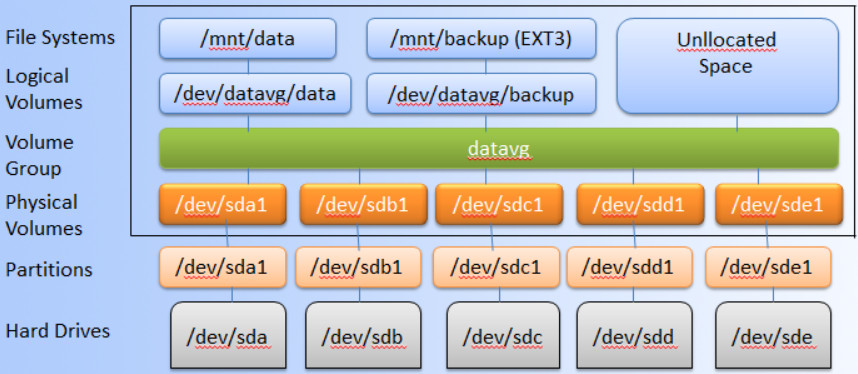
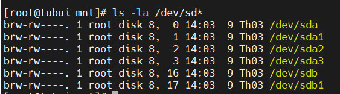
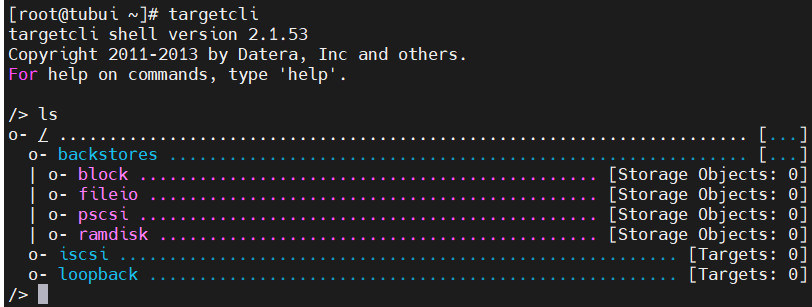

#  —  Lưu trữ mảng và nâng cao 
## 1. Logical Volume Manager (LVM)
- LVM là một công cụ để quản lý phân vùng logic được tạo và phân bổ từ các ổ đĩa vật lý. Với LVM ta có thể dễ dàng tạo mới, thay đổi kích thước hoặc xóa bỏ phân vùng đã tạo.
- LVM được sử dụng cho các mục đích:
    + Tạo 1 hoặc nhiều phân vùng logic hoặc phân vùng với toàn bộ đĩa cứng, cho phép thay đổi kích thước volume
    + Quản lý Large hard Disk Farms bằng cách cho phép thêm và thay thế đĩa mà không bị ngừng hoạt động và gián đoạn dịch vụ
    + Trên các hệ thống nhỏ (như máy tính để bàn), thay vì phải ước tính thời gian cài đặt, phân vùng, LVM cho phép các hệ thống tệp dễ dàng thay đổi kích thước khi cần
    + Thực hiện sao lưu nhất quán bằng cách tạo snapshot nhanh các khối một cách vật lý
    + Mã hóa nhiều phân vùng vật lý bằng một mật khẩu

Mô hình LVM



- LVM bao gồm
    + Physical volumes: Là những đĩa cứng vật lý hoặc phân vùng trên nó. Ví dụ: `/dev/fileserver/share, /dev/fileserver/backup, /dev/fileserver/media`
    + Volume groups: Là một nhóm bao gồm các Physical volumes. Có thể xem Volume group như 1 ổ đĩa ảo. Ví dụ: `fileserver`
    + Logical volumes: Có thể xem như là các "phân vùng ảo" trên "ổ đĩa ảo". Có thể thêm, gỡ bỏ, thay đổi kích thước 1 cách nhanh chóng

- Thao tác trên LVM
Liệt kê các phân vùng ổ cứng trong hệ thống `# fdisk -l` hoặc `# ls -la /dev/sd*`
    + Có 3 ổ cứng: sda, sdb, sdc
    + sda: Ổ cứng cài đặt hệ điều hành
    + sdb và sdc: Ổ để lưu trữ data




## 2. Network File System (NFS)
### Giới thiệu
- NFS (Network File System) cho phép gắn kết các hệ thống tệp cục bộ của mình qua mạng và các máy chủ từ xa để tương tác với chúng khi chúng được gắn cục bộ trên cùng một hệ thống
### Lợi ích
- NFS cho phép truy cập cục bộ vào các tệp từ xa
- Nó sử dụng kiến trúc client/server tiêu chuẩn để chia sẻ tệp giữa các máy
- Với NFS, không cần thiết cả 2 máy đều phải chạy trên cùng một hệ điều hành
- Với NFS, có thể cấu hình các giải pháp lưu trữ tập trung
- Người dùng có được dữ liệu của họ bất kể vị trí thực tế
- Không cần làm mới thủ công cho các tập tin mới
- Hỗ trợ acl, mount root ảo
- Hỗ trợ bảo mật với tường lửa và kerberos
### 2.1. Dịch vụ NFS
- NFS bao gồm `portmap` và `nfs-utils package`
	+ `portmap`: Nó ánh xạ các cuộc gọi được thực hiện từ các máy khác đến dịch vụ RPC
	+ `nfs`: Nó dịch các yêu cầu chia sẻ tệp từ xa thành các yêu cầu trên hệ thống tệp cục bộ
	+ `rpc.mountd`: Dịch vụ này có trách nhiệm lắp và unmount toàn bộ các hệ thống tập tin
- Các tệp quan trọng cho cấu hình NFS
	+ `/etc/export`: Đây là tệp cấu hình chính của NFS, tất cả các tệp và thư mục đã xuất được xác định 
	+ `/etc/fstab`: Để gắn một thư mục NFS trên hệ thống trên các lần khởi động lại, chúng ta cần tạo một mục trong `etc/fstab`
	+ `/etc/sysconfig/nfs`: Tệp cấu hình của NFS để kiểm soát cổng rpc và các dịch vụ đang nghe
## 3. iSCSI
### Khái niệm
- iSCSI là Internet SCSI (Small Computer System interface): Là một giao thức cho phép truyền tải các lệnh SCSI qua mạng IP bằng cách sử dụng giao thức TCP/IP. Nó truy cập thiết bị lưu trữ theo dạng block-level (truy cập theo từng khối)
- Lệnh iSCSI được đóng gói trong lớp TCP/IP và truyền qua mạng nội bộ LAN hoặc cả qua mạng Internet Public
### Thành phần của iSCSI
- **iSCSI Inititor**: Là thiết bị client trong kiến trúc hệ thống lưu trữ qua mạng
- **iSCSI Target**: Thường là một máy chủ lưu trữ
### Cài đặt 
```sh
yum -y install targetcli
```
- Để khởi động ta dùng lệnh `# targetcli`, sau đó `# ls` để được bố cục giao diện dạng cây


