#  —  Networking Cơ bản và Cấu hình 
## 1. Basic Network
### 1.1. Network Interface
- Network Interface (Giao diện mạng) là kênh kết nối giữa thiết bị và mạng. Có thể có nhiều interface hoạt động cùng lúc, các interface có thể được kích hoạt (actived) hoặc không kích hoạt (de-actived)
- File cấu hình network ở những nơi khác nhau tùy vào mỗi nền tảng:
    + Debian: `/etc/network/interfaces`
    + CentOS: `/etc/sysconfig/Network-scripts`
    + SUSE: `/etc/sysconfig/network`

#### Lệnh ip
- Lệnh hiển thị thông tin trên từng Ethernet được kết nối
```sh
ip addr show
```

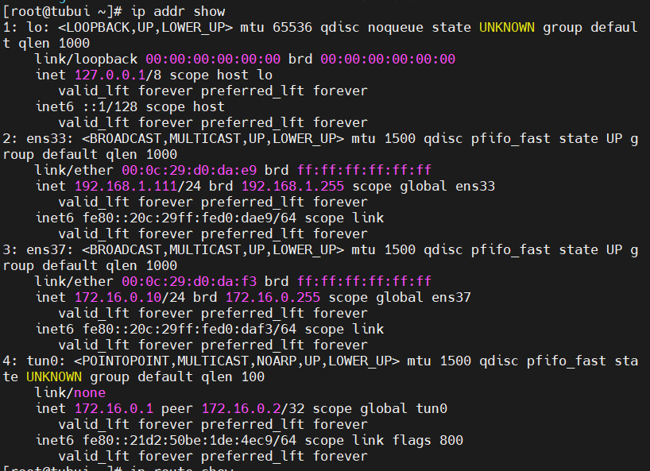

- Hiển thị bảng định tuyến
```sh
ip route show
```

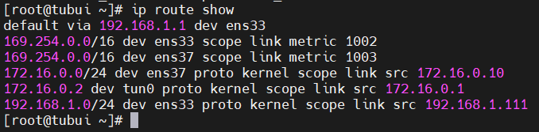

- Gán IP cho một giao diện mạng
```sh
ip addr add 192.168.1.112 dev ens33
```

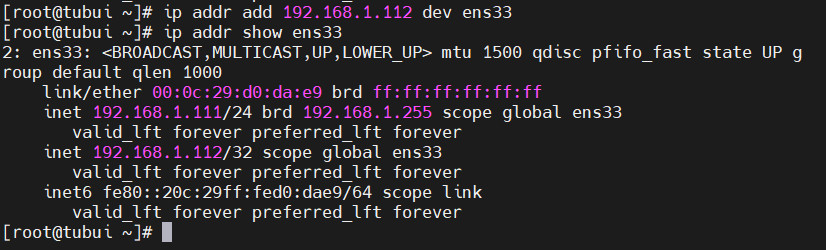

- Gỡ bỏ IP từ giao diện mạng
```sh
ip addr del 192.168.1.112/32 dev ens33
```

- Thêm một định tuyến mới
`# ip route add <dia_chi_IP> via <gateway>`

- Xóa định tuyến
`# ip route del default`

- Xóa định tuyến cần xóa
`# ip router del <dia_chi_IP> via <gateway>`

#### Lệnh route
Lệnh route được sử dụng để xem hoặc thay đổi bảng định tuyến IP
- Hiển thị bảng định tuyến
```sh
route -n
```

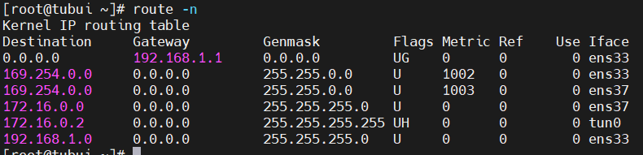

- Thêm định tuyến
```sh
route add -net 112.176.0.0 netmask 255.255.255.0 dev ens33
```

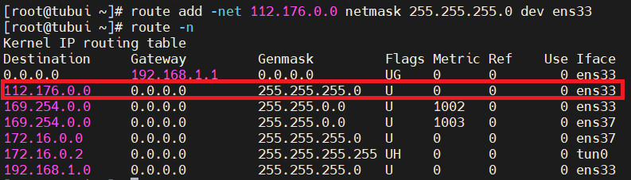

- Xóa định tuyến
```sh
route del -net 112.176.0.0 netmask 255.255.255.0 dev ens33
```

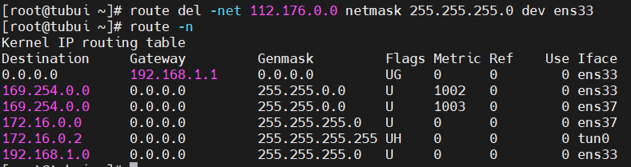

### 1.4. Đặt IP tĩnh trên CentOS-7
- Vào thư mục `/etc/sysconfig/network-scripts`

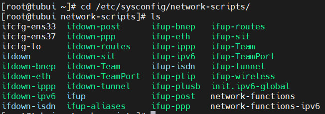

- Chọn card muốn set ip tĩnh. Ở đây em chọn ens33
```sh
vi ifcfg-ens33
```

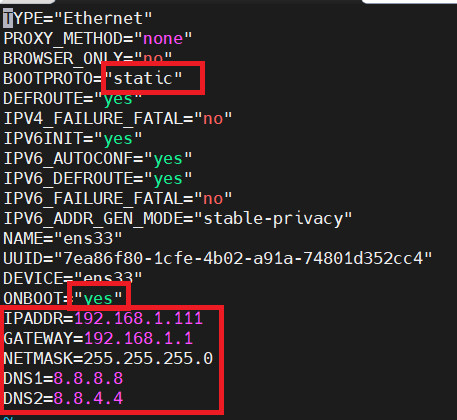

- Thoát và lưu lại
- Khởi động lại card mạng bằng lệnh 
```sh
systemctl restart network.service
```
- Kiểm tra lại IP được cài đặt

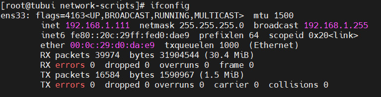

### 1.5. Linux Virtual Networking
- Linux Virtual Networking có thể dễ dàng tạo ra từ `libvirt` và `linux virtual bridge`
- Cài đặt và bắt đầu kích hoạt `libvirt`:
```sh
yum install libvirt
systemctl start libvirtd
systemctl enable libvirtd
```
- `libvirt` hỗ trợ các loại mạng ảo sau
    + Network Address Translation mode (Chế độ dịch địa chỉ mạng - NAT)
    + Routed Mode (Chế độ định tuyến)
    + Isolated Mode (Chế độ cô lập)
    + Bridged Mode (Chế độ bridged)

#### 1.5.1. Virtual Networking trong NAT mode
- Khi trình nền `libvirt` được cài đặt trên máy chủ, nó đi kèm với cấu hình chuyển đổi mạng ảo, switch ảo mặc định ở chế độ NAT và được sử dụng bởi các máy ảo để liên lạc với mạng bên ngoài thông qua máy chủ vật lí
- File cấu hình được lưu tại `/etc/libvirt/qemu/networks/default.xml`
- Interface virbr0 cũng được tạo trên máy chủ

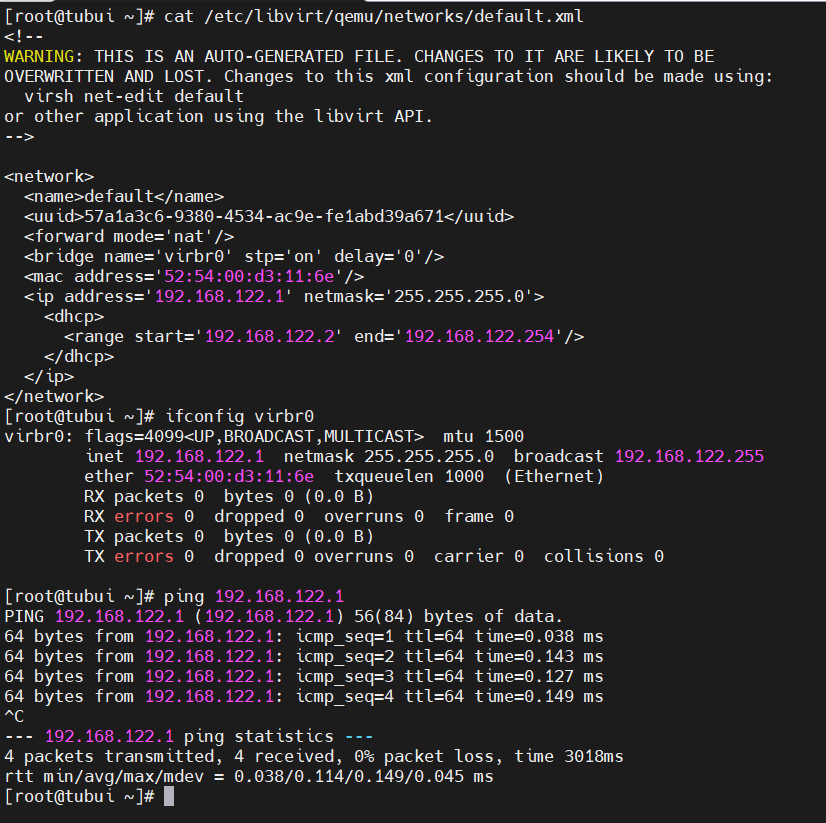

- Lệnh `virsh` dùng để kiểm tra và cấu hình mạng ảo
```sh
virsh net-list.
```

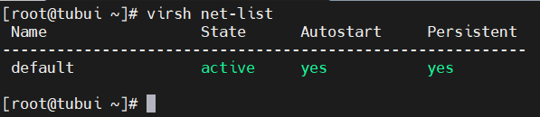

- Khi `libvirt` đang chạy mặc định, ta sẽ thấy 1 bridge bị cô lập. Bridge này không có bất kỳ interface vật lý nào thêm vào, vì nó sử dụng NAT để kết nối mạng ra ngoài

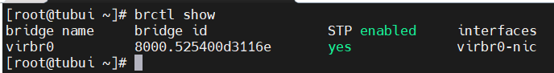

- `libvirt` sẽ thêm quy tắc `iptable`. Nó cũng sẽ kích hoạt `ip-forward`

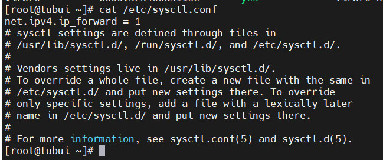


## 2. LLDP - Link Layer Discovery Protocol
- Là một giao thức chuẩn hóa (IEEE 802.1ab) giúp các thiết bị mạng (switch, router, điện thoại IP) tự động quảng bá thông tin về chính chúng (tên thiết bị, cổng kết nối, khả năng,...) tới các thiết bị lân cận, cho phép quản trị viên mạng dễ dàng khám phá, lập bản đồ và quản lý cấu trúc mạng ở lớp 2 (Lớp liên kết dữ liệu) một cách hiệu quả, đặc biệt trong môi trường đa nhà cung cấp. 
- Đặc điểm : 
    - Chuẩn IEEE 802.1AB
    - Hoạt động ở Layer 2 (Data Link)
    - Cho phép thiết bị mạng quảng bá thông tin của chính mình cho các thiết bị lân cận.
    - Không đi qua router, không định tuyến
- Mục đích :
    - Xác định server đang cắm vào switch nào, port nào
    - Mapping topology mạng
    - Phát hiện cắm nhầm port / nhầm switch
    - Hỗ trợ troubleshoot nhanh trong DC
- Phạm vi hoạt động 
    - Chỉ hoạt động trong cùng broadcast domain

### 2.1 LLDP CLI 
- Có thể sử dụng ở nhiều môi trường như :
    - Linux server (baremetal / VM)
    - Switch / Router
    - VMware ESXi
    - OpenStack / Kubernetes node
- Sử dụng daemon chính lldpd 

#### 2.1.1 Cài đặt dịch vụ 
```bash
apt install lldpd # Ubuntu / Debian
yum install lldpd # RHEL / CentOS
```

#### 2.1.2 Quản lý service 
```bash
systemctl status lldpd
systemctl enable --now lldpd
```

#### 2.1.3 Kiến trúc hoạt động 
- lldpd: chạy nền, gửi & nhận LLDP frame

- lldpcli: giao tiếp với daemon để hiển thị thông tin

### 2.2 Các lệnh LLDP CLI quan trọng
#### 2.2.1 Xem neighbor
```bash
lldpcli show neighbors
```

- Hiển thị:
    - Switch neighbor
    - Port switch
    - Interface local


> 80% tình huống thực tế chỉ cần lệnh này

#### 2.2.2 Xem chi tiết neighbor 
```bash
lldpcli show neighbors details
```

- Thông tin bổ sung:
    - Chassis ID
    - System Name
    - Port Description
    - VLAN ID
    - MTU
    - Management IP

#### 2.2.3 Xem neighbor theo interface
```bash
lldpcli show neighbors ports eth0
```
- Dùng khi:
    - Server có nhiều NIC
    - Bonding / teaming

#### 2.2.4 Xem thông tin thiết bị local
```bash
lldpcli show chassis
```

- Hiển thị:
    - Hostname
    - MAC
    - Capability
    - IP quản lý

#### 2.2.5 Các trường LLDP cần hiểu rõ 
##### Chassis ID
- Định danh thiết bị neighbor
- Thường là MAC hoặc hostname

##### System Name
- Tên switch / thiết bị neighbor
- Dùng để xác định đúng TOR / leaf

##### Port ID
- Port vật lý trên switch
- Thông tin quan trọng nhất khi làm việc với network team

##### Port Description
- Mô tả port (do network admin cấu hình)

##### Management Address
- IP quản lý của switch

##### VLAN Information
- VLAN untagged / native VLAN (nếu có)

##### TTL
- Thời gian neighbor còn hiệu lực
- Hết TTL → neighbor biến mất

### 2.3 Thực hành thực tế 
#### 2.3.1 Server cắm nhầm switch
```bash
lldpcli show neighbors
```
→ Phát hiện switch không đúng thiết kế

#### 2.3.2 Bonding / NIC Teaming
- Kiểm tra từng NIC có nối tới 2 switch khác nhau
- Tránh single point of failure

#### 2.3.3 Kubernetes / OpenStack node
- Xác định node nối đúng TOR
- Kiểm tra VLAN quản lý / storage

#### 2.3.4 Không thấy LLDP neighbor
```bash
systemctl status lldpd
ip link show eth0
tcpdump -i eth0 ether proto 0x88cc
``` 

#### 2.3.5 Bật / tắt LLDP trên port
```bash
lldpcli configure ports eth0 lldp status rx-and-tx
lldpcli configure ports eth0 lldp status disabled
```

#### 2.3.6 Chỉ nhận, không gửi
```bash
lldpcli configure ports eth0 lldp status rx-only
```


> LLDP là giao thức layer 2 cho phép thiết bị tự quảng bá thông tin cho neighbor trực tiếp, thường dùng để xác định server đang cắm vào switch và port nào, rất hữu ích cho troubleshooting và mapping hạ tầng.