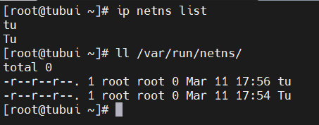
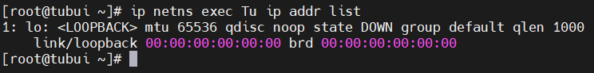
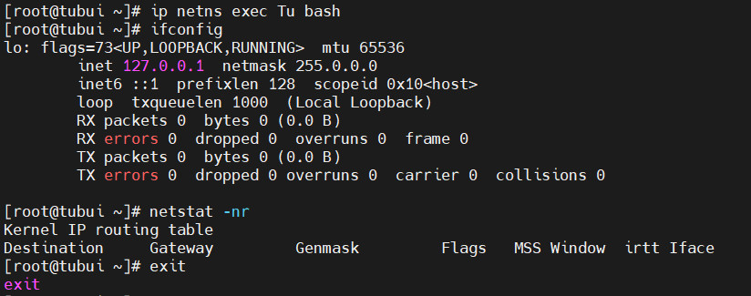
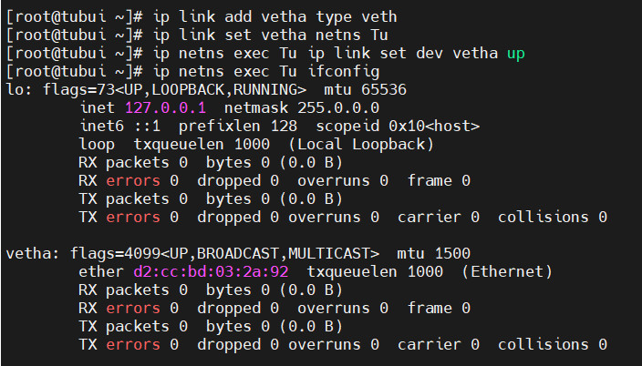
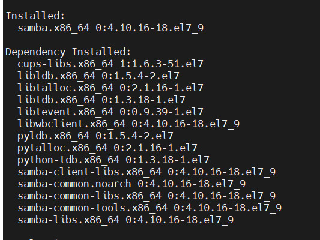
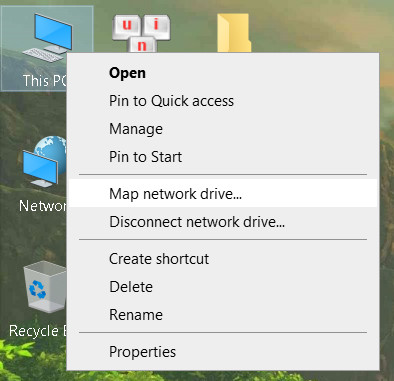
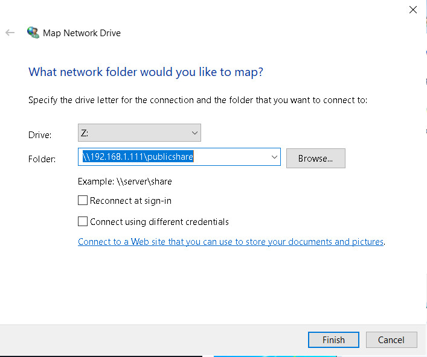
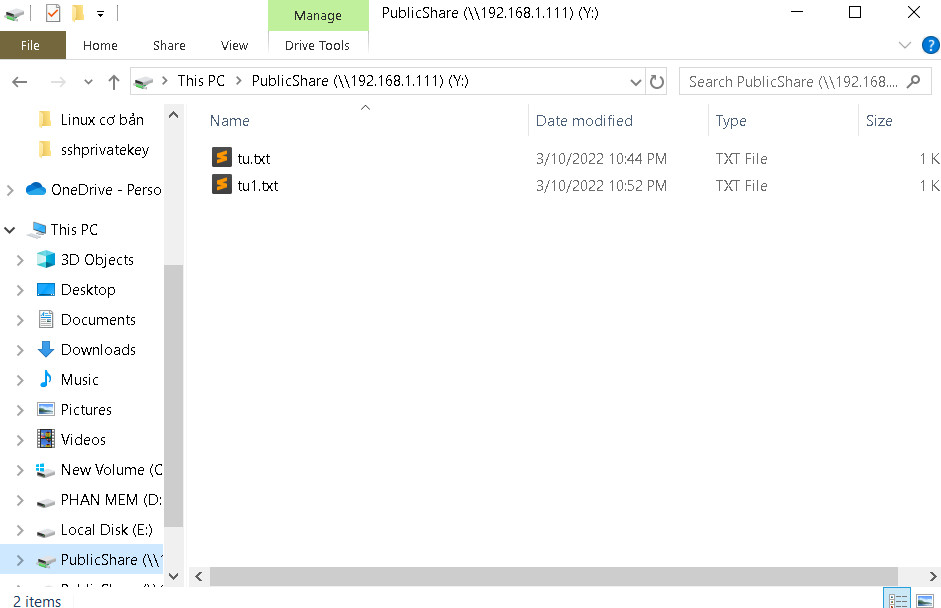
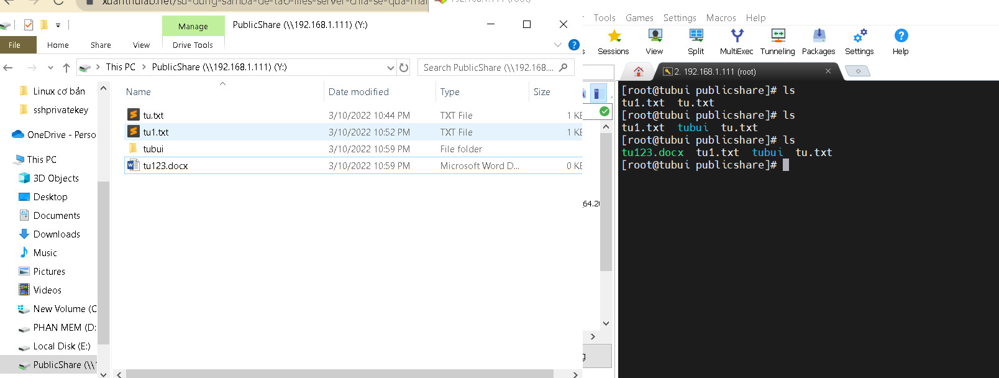

#  —  Networking nâng cao và chi sẻ 
## 1. Network Namespaces
- Network namespace là khái niệm cho phép cô lập môi trường mạng network trong một host. Namespace phân chia việc sử dụng các khái niệm liên quan tới network như devices, địa chỉ address, ports, định tuyến và các quy tắc tường lửa vào trong một không gian riêng biệt, chủ yếu là ảo hóa mạng trong một máy chạy một kernel duy nhất
- Các thiết bị mạng sử dụng nhiều hơn 1 bộ định tuyến ảo (Switch layer 3) có thể chạy trên cùng một thiết bị vật lý
- Trong không gian mạng ảo Linux, các Network Namespaces cho phép các giao diện mạng và bảng định tuyến hoạt động riêng biệt với nhau
### 1.1. Các thao tác cơ bản trên Namespaces
- Tạo một `network namespace`:
```sh
ip netns add Tu
ip netns add tu
```

- Hiển thị danh sách các namespace. Mỗi khi namespace được tạo mới, có một file tương ứng có cùng tên với tên của namespace tạo ra trong thư mục `/var/run/netns`



- Mỗi Network namespace có giao diện loopback và bảng định tuyến (routing table) của riêng nó và tách biệt với các namespace khác



- Network Namespaces cung cấp thêm khả năng chạy các tiến trình với network namespace. Ví dụ chạy 1 session trên namespace Tu



- Xóa 1 namespace
```sh
ip netns delete Tu
```

#### Thêm giao diện vào Network Namespace 
- Tạo giao diện ảo, đặt là `vethb`
```sh
ip link add vetha type veth
```

- Gắn `vethb` vào namespace Tu:
```sh
ip link add vetha type veth
ip link set vetha netns Tu
ip netns exec Tu ip link set dev vetha up
ip netns exec Tu ifconfig
```




## 2. Samba Server và Windows File Sharing
### Khái niệm
-Samba Server được xem là một máy chủ tập tin (File Server), sử dụng trong mạng nội bộ. Là nơi lưu trữ tập trung các thông tin của một tổ chức, doanh nghiệp bất kỳ và thường được cài đặt trên hệ điều hành Linux hoặc Windows
- Samba Server hoạt động chủ yếu dựa trên giao thức SMB (Server Message Block Protocol)
### 2.1. Cách thức hoạt động của giao thức SMB
- Giao thức SMB hoạt động trong mạng Internet dựa trên giao thức TCP/IP. Và đem cho người dùng toàn quyền trong việc tạo một tập tin với các quyền hạn như (read, write, excute). Ngoài ra SMB còn hỗ trợ các tính năng như:
	+ Phát hiện các máy chủ sử dụng SMB trên mạng (browse network)
	+ Xác thực truy cập file, thư mục chia sẻ
	+ Thông báo sự thay đổi file và thư mục
	+ Xử lý các thuộc tính mở rộng của file
	+ Hỗ trợ Unicode
### 2.2. Dịch vụ
- Samba bao gồm các dịch vụ sau:
	+ `smbd`: Cung cấp dịch vụ chia sẻ tệp và máy in cho các Windows Client. Ngoài ra nó còn chịu trách nhiệm xác thực người dùng, khóa tài nguyên và chia sẻ dữ liệu thông qua giao thức SMB. Cổng mặc định mà máy chủ lắng nghe lưu lượng SMB là TCP 139 và 445
	+ `nmbd`: Hiểu và trả lời NetBIOS qua các yêu cầu dịch vụ bởi SMB trong các hệ thống dựa trên Windows. Cổng mặc định mà máy chủ lắng nghe lưu lượng NMB là UDP 137
	+ `winbinđd`: Là dịch vụ phân giải thông tin người dùng và nhóm nhận được từ máy chủ chạy Windows. Điều này giúp cho người dùng Windows và thông tin các nhóm có thể hiểu được bởi các nền tảng Linux và UNIX. Nó cho phép người dùng Windows xuất hiện và hoạt động như người dùng Linux
- Cả `winbindd` và `smbd` đều được đóng gói với các bản phân phối của Samba, nhưng dịch vụ `winbindd` được kiểm soát tách biệt từ dịch vụ `smbd`

### 2.3. Sử dụng Samba để tạo Files Server chia sẻ qua mạng bằng giao thức SMB
- Cài đặt Samba Server
```sh
yum install samba -y

systemctl enable smb.service
systemctl enable nmb.service
systemctl restart smb.service
systemctl restart nmb.service
```



- Chia sẻ một thư mục public
```sh
mv /etc/samba/smb.conf /etc/samba/smb.conf.bak
vi /etc/samba/smb.conf  
```

Nhập vào nội dung sau: 
```sh
[global]
workgroup = WORKGROUP
server string = My Samba Server
netbios name = centos
security = user
map to guest = bad user
dns proxy = no

[PublicShare]
path = /samba/publicshare
browsable = yes
writable = yes
guest ok = yes
read only = no
```
- Thoát và lưu file
- Tạo file chia sẻ và phân quyền cho file
```sh
mkdir -p /samba/publicshare/
chmod -R 0755 /samba/publicshare/
chown -R nobody:nobody /samba/publicshare/
```
- Sau khi thiết lập khởi động lại Samba
```sh
systemctl restart smb.service
systemctl restart nmb.service
```
- Kết nối từ Windows đến Samba Server



- Điền thông tin như hình (gồm địa chỉ IP và file public)



- Kết nối thành công





>> Như vật đã có thể truy cập file public share từ máy chạy CentOS qua mạng 

