#  —  Xử lý văn bản và Cluster
## 1. Các lệnh xử lý/lọc văn bản
### 1.1. Text Commands
- Linux cung cấp các tiện ích cho thao tác tập tin và văn bản như sau

|Tiện ích|Lệnh|
|---|---|
|Hiển thị nội dung|`cat` và `echo`|
|Chỉnh sửa nội dung|`sed` và `awk`|
|Tìm theo mẫu|`grep`|

### 1.2. Hiển thị nội dung
- Lệnh `# cat` được sử dụng để đọc và in ra nội dung của file `# tac` là ngược lại của `# cat` có chức năng đọc và in ra nội dung file theo chiều ngược lại

- Lệnh `# echo` là lệnh hiển thị text lên màn hình, Ngoài ra, ta có thể in ra giá trị của biến: `# echo $<bien>`

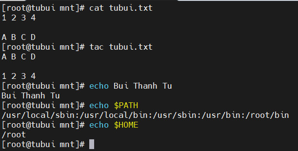

### 1.3. Chỉnh sửa nội dung
#### 1.3.1. Lệnh `# sed`
- Là một công cụ lọc văn bản cũng như thực hiện thay thế trong luồng dữ liệu. Dữ liệu từ nguồn được lấy ra và di chuyển vào không gian xử lý. Toàn bộ danh sách, thao tác sửa đổi được áp dụng lên dữ liệu trong không gian xử lý, nội dung cuối cùng được chuyển đến không gian đầu ra
- Ví dụ: Thay đổi nội dung file

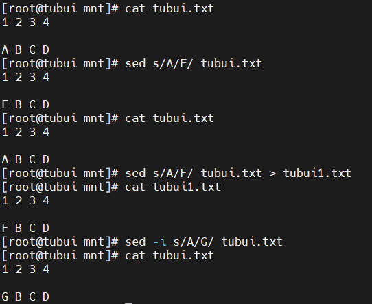

- Xóa 1 dòng

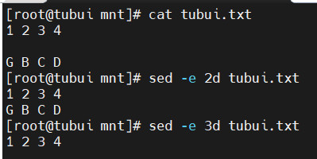

#### 1.3.2. Lệnh `# awk`
- Được sử dụng để trích xuất và sau đó in nội dung cụ thể của tệp. Được sử dụng để thao tác với tệp dữ liệu, truy xuất và xử lý văn bản

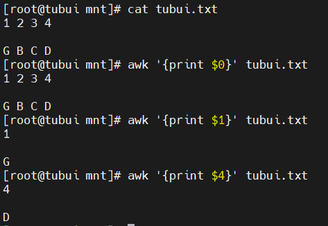

#### 1.3.3. Lệnh `# sort`
- Được sử dụng để sắp xếp lại các dòng của tệp văn bản theo thứ tự tăng dần hoặc giảm dần, theo 1 chuẩn nào đó

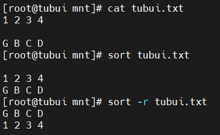

#### 1.3.4. Lệnh `# uniq`
- Dùng để xóa các dòng trùng lặp trong tệp văn bản. Các đòng trùng lặp nối tiếp bị loại bỏ

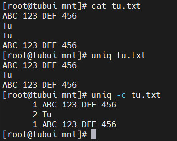

#### 1.3.5. Lệnh `# paste`
- Dùng để kết hợp các trường (fields) từ các file khác nhau.

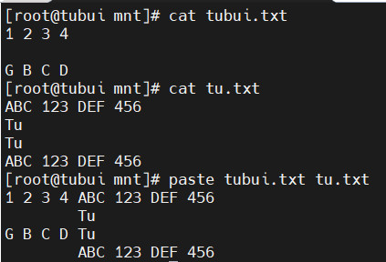

#### 1.3.6. Lệnh `# join`
- Dùng để kết hợp 2 file với nhau theo 1 trường chung

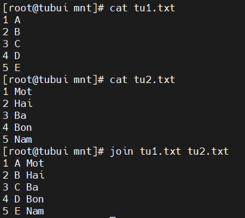

### 1.4. Tìm theo mẫu
#### 1.4.1. Lệnh `# grep`
- Được sử dụng để quét các tập cho các mẫu chỉ định và có thể được sử dụng với các biểu thức thông thường

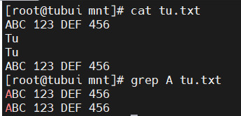

#### 1.4.2. Lệnh `# tr`
- Được sử dụng để dịch các kí tự được chỉ định sang ký tự khác hoặc xóa chúng đi

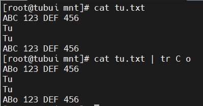

#### 1.4.3. Lệnh `# tee`
- Lệnh này sẽ lấy đầu ra của bất kỳ lệnh nào và trong lúc gửi ra đầu ra tiêu chuẩn, nó sẽ lưu vào 1 file

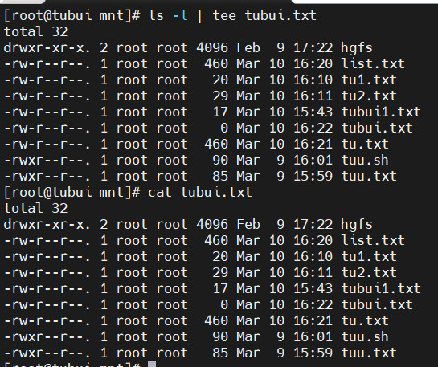

### 1.5. Lệnh `# wc`
- Lệnh này đếm số lượng dòng `-l`, số lượng từ `-w`, số lượng ký tự `-c` trong một tệp hoặc một danh sách tệp

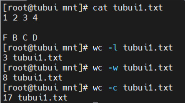

### 1.6. Lệnh `# cut`
- Sử dụng để trích xuất các cột trong tệp. Dấu phân cách cột mặc định sẽ là kí tự `tab`

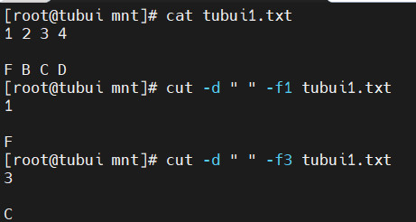

### 1.7. Lệnh head
- In ra vài dòng đầu tiên của file (mặc định là 10). Có thể thay đổi qua option `-n <so_dong>`

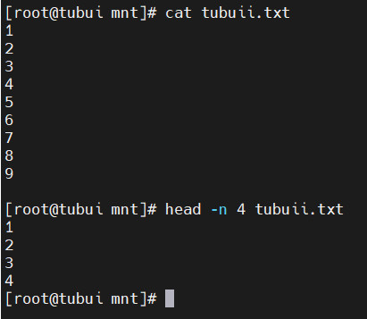

### 1.8. Lệnh tail
- In ra vài dòng cuối của file (mặc định là 10). Có thể thay đổi qua option `-n <so_dong>`

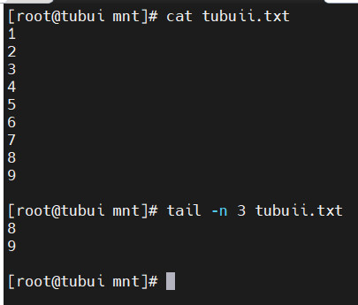

# 2. Cluster 
- Một cluster (Cụm) là hai hay nhiều máy tính làm việc cùng nhau để thực hiện một tác vụ. Ví dụ như là: cung cấp tính sẵn sàng cao cho một dịch vụ. Các cụm khả dụng cao cung cấp các dịch vụ khả dụng cao bằng cách loại bỏ những điểm bị lỗi và lỗi dịch vụ từ một thành viên của cụm đến những trường hợp khác không hoạt động 
- Thông thường, các dịch vụ trong cụm khả dụng cao, duy trì tính toàn vẹn của dữ liệu 
- Trong Linux, có nhiều công cụ cụm đạt được tính sẵn sàng cao cho tài nguyên. Công cụ được sử dụng nhiều nhất là Pacemaker. 
- Một cụm được định cấu hình với Pacemaker bao gồm các trình nền thành phần riêng biệt theo dõi các thành viên trong cụm, tập lệnh quản lý dịch vụ và các hệ thống con quản lý tài nguyên theo dõi tài nguyên
- Kiến trúc Pacemaker gồm:
	+ **Cluster Information Base (Cụm thông tin cơ sở)**: Trình thông tin Pacemaker phân phối, đồng bộ cấu hình cụm và trạng thái thông tin điều phối được chỉ định (DC) của cụm tới tất cả các thành viên trong cụm. DC là một thành viên cụm được chỉ định để lưu trạng thái cụm 
	+ **Cluster Resource Management Daemon (Quản lý tài nguyên cụm)**: Tài nguyên cụm được quản lí bởi thành phần này có thể được truy vấn bởi hệ thống máy khách, di chuyển, khởi tạo và thay đổi khi cần thiết. Mỗi nút cụm bao gồm một trình nền quản lý tài nguyên cục bộ hoạt động như một giao diện giữa trình nền quản lý tài nguyên cụm và chính tài nguyên đó