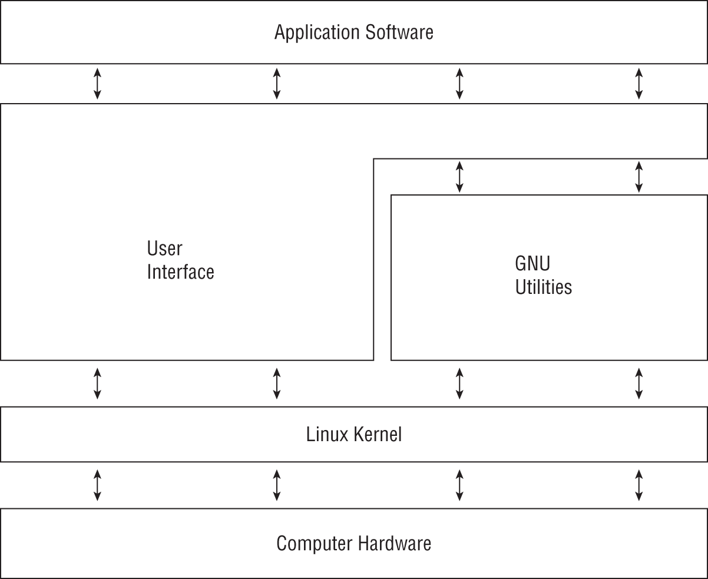

# Linux Overview, Boot Process và systemd

## 1. Linux System Overview

Linux là hệ điều hành Unix-like, thường dùng cho server, cloud, container host, network appliance và embedded system. Một hệ thống Linux vận hành quanh các lớp chính:

- Kernel: quản lý process, memory, filesystem, network stack, device driver và system call.
- User space: shell, core utilities, package manager, daemon, service và ứng dụng.
- Filesystem hierarchy: tổ chức file cấu hình, binary, log, runtime data và dữ liệu người dùng.
- Init/service manager: khởi động hệ thống và quản lý daemon. Trên distro hiện đại, phần này thường là `systemd`.



Một cách nhìn thực dụng hơn: Linux không chỉ là kernel. Một hệ thống Linux hoàn chỉnh thường là tổ hợp của hardware, Linux kernel, GNU/core utilities, shell hoặc graphical interface, package manager, service daemon và application. Kernel là lớp phân phối tài nguyên và kiểm soát truy cập tới CPU, memory, disk, network, device; user space là nơi admin và application tương tác với hệ thống thông qua command, library, service và API.

| Lớp | Vai trò vận hành |
| --- | --- |
| Hardware | CPU, RAM, disk, NIC, firmware và thiết bị ngoại vi |
| Linux kernel | Quản lý process, virtual memory, filesystem, network stack, driver, module và system call |
| GNU utilities / shell | Cung cấp lệnh thao tác file, text, process, permission và automation |
| User interface | CLI qua shell hoặc GUI qua desktop/display stack |
| Application software | Workload thật sự chạy trên host: database, web server, agent, container runtime, tool quản trị |

Distribution là cách đóng gói Linux thành một operational contract: kernel, user space, package manager, repository, release cadence, security update policy, default service layout và support window. Vì vậy, khi chọn Debian/Ubuntu, RHEL-compatible, Fedora, SUSE/openSUSE, Alpine hoặc một distro chuyên dụng cho cloud/embedded/container image, câu hỏi production không phải là "distro nào quen hơn" mà là:

- Workload cần stability hay package mới?
- Team có năng lực vận hành package manager, service layout và security update flow của distro đó không?
- Vendor/support/compliance có yêu cầu lifecycle cụ thể không?
- Image cloud hoặc appliance có tooling bootstrapping như metadata agent, network config, disk resize hoặc cloud-init không?
- Rollback, patching, hardening và audit evidence có nhất quán với fleet hiện có không?

Vì vậy khi troubleshooting Linux, nên hỏi lỗi nằm ở lớp nào: hardware/driver, kernel/runtime state, filesystem/mount, process/service, network, user-space tool hay application. Cách phân lớp này giúp tránh việc xử lý triệu chứng ở application trong khi nguyên nhân nằm ở kernel, disk, permission hoặc service manager.

## 2. Khi Dùng Trong Thực Tế

File này dùng như bản đồ tổng quan khi cần:

- Hiểu Linux boot qua các lớp firmware, bootloader, kernel và `systemd`.
- Xác định service đang được `systemd` quản lý như thế nào.
- Kiểm tra nhanh lỗi boot, target, unit hoặc service failed.
- Đọc các path hệ thống quan trọng trước khi đi sâu vào storage, security hoặc troubleshooting.

## 3. Filesystem Hierarchy Standard

Các thư mục quan trọng cần nắm khi vận hành Linux:

| Path | Vai trò |
| --- | --- |
| `/` | Root filesystem, điểm bắt đầu của toàn bộ cây thư mục |
| `/boot` | Kernel, initramfs, GRUB config; hệ UEFI có thêm `/boot/efi` |
| `/etc` | Cấu hình tĩnh của hệ thống và service |
| `/bin`, `/usr/bin` | Lệnh cho user |
| `/sbin`, `/usr/sbin` | Lệnh quản trị hệ thống |
| `/lib`, `/usr/lib` | Library và kernel modules |
| `/dev` | Device nodes do kernel/udev quản lý |
| `/proc` | Virtual filesystem expose process và kernel runtime state |
| `/sys` | Virtual filesystem expose device, driver và kernel object |
| `/run` | Runtime state trong một phiên boot |
| `/var` | Log, cache, spool, state data thường xuyên thay đổi |
| `/home` | Dữ liệu người dùng |
| `/root` | Home directory của `root` |
| `/mnt`, `/media` | Mount point tạm hoặc removable media |
| `/opt` | Third-party/self-contained software |
| `/srv` | Dữ liệu phục vụ bởi service như web, ftp, nfs |

Không nên biến note FHS thành note storage chi tiết. Các thao tác disk, partition, mount, fstab và swap nằm ở [Disk, Filesystem, Mount và Swap](../02-storage-networking/01-disk-filesystem-mount-swap.md).

## 4. Boot Flow: BIOS/UEFI -> GRUB -> Kernel -> init/systemd

Luồng boot cơ bản:

1. Firmware chạy POST và tìm boot device.
2. BIOS đọc boot loader từ MBR, hoặc UEFI đọc boot entry từ EFI System Partition.
3. GRUB hiển thị menu, nạp kernel và initramfs.
4. Kernel khởi tạo hardware, mount root filesystem ban đầu và chạy PID 1.
5. PID 1, thường là `systemd`, khởi động target, service, mount, socket và timer.
6. Hệ thống vào trạng thái login hoặc workload service.

### BIOS và MBR

BIOS thường tìm boot code trong sector đầu tiên của disk. MBR có kích thước 512 byte, chứa boot loader stage đầu, partition table kiểu legacy và magic number.

Trong mô hình BIOS legacy, firmware chạy POST, khởi tạo tối thiểu video/keyboard/storage, rồi đọc boot code stage đầu từ boot device đầu tiên theo boot order. Nếu vừa gắn thêm disk hoặc đổi thứ tự SATA/SAS/NVMe, lỗi boot có thể không nằm ở Linux mà nằm ở firmware đang chọn nhầm disk đầu tiên. Với server production, thay đổi boot order cần được xem như thay đổi rủi ro cao: phải có console/BMC access, biết thiết bị boot cũ và có kế hoạch trả lại cấu hình ban đầu.

### UEFI

UEFI dùng EFI System Partition, thường mount tại `/boot/efi`. Boot entry được quản lý bởi firmware và có thể kiểm tra bằng:

```bash
efibootmgr -v
```

UEFI thường chạy EFI application từ ESP; trong Linux, EFI application đó thường là bootloader. ESP trên block device thường dùng FAT12/FAT16/FAT32; optical media có thể dùng ISO-9660. Secure Boot chỉ cho phép chạy EFI application đã được ký phù hợp với key mà firmware tin cậy. Đây là guardrail tốt cho boot chain, nhưng có thể làm cài đặt kernel/driver/OS không được ký bị fail nếu chưa chuẩn bị key hoặc signing flow.

Kiểm tra nhanh host đang boot theo UEFI hay legacy BIOS:

```bash
test -d /sys/firmware/efi && echo UEFI || echo BIOS
findmnt /boot/efi
```

### GRUB

GRUB chịu trách nhiệm chọn kernel, initramfs và kernel parameter.

```bash
grep ^menuentry /boot/grub/grub.cfg
cat /proc/cmdline
```

Đường dẫn config có thể khác nhau theo distro:

- Debian/Ubuntu: thường dùng `update-grub`.
- RHEL/CentOS BIOS: thường ghi vào `/boot/grub2/grub.cfg`.
- RHEL/CentOS UEFI: có thể nằm dưới `/boot/efi/EFI/<vendor>/grub.cfg`.

Không sửa trực tiếp `grub.cfg` nếu không ở tình huống rescue đặc biệt, vì file này thường được sinh tự động từ `/etc/default/grub` và các script trong `/etc/grub.d/`.

```text
/etc/default/grub
/etc/grub.d/*
        |
        v
update-grub / grub-mkconfig / grub2-mkconfig
        |
        v
/boot/grub*/grub.cfg
```

Các phím GRUB hữu ích khi boot:

| Phím | Vai trò |
| --- | --- |
| Arrow keys | Chọn boot entry |
| `Enter` | Boot entry đang chọn |
| `e` | Sửa boot entry tạm thời |
| `c` | Vào GRUB command shell |
| `Ctrl+x` | Boot với cấu hình đang sửa |

Khi cần boot tạm vào chế độ sửa lỗi, có thể thêm kernel arg trong GRUB edit mode:

```text
systemd.unit=rescue.target
systemd.unit=emergency.target
init=/bin/bash
debug
console=ttyS0,115200n8
root=/dev/sda3
ro
rw
```

Một số kernel parameter hay gặp khi rescue hoặc giới hạn phạm vi debug:

| Kernel parameter | Khi dùng |
| --- | --- |
| `root=<device-or-uuid>` | Chỉ định root filesystem khi GRUB/initramfs đang trỏ sai thiết bị |
| `ro` / `rw` | Mount root filesystem read-only hoặc read-write lúc boot |
| `systemd.unit=<target>` | Boot tạm vào target khác như `rescue.target` hoặc `multi-user.target` |
| `init=/bin/bash` | Vào shell tối thiểu thay PID 1 để sửa lỗi nặng; cần console và remount root nếu ghi file |
| `mem=<size>` | Giới hạn RAM mà kernel nhìn thấy để test lỗi memory hoặc lab |
| `maxcpus=<n>` | Giới hạn số CPU dùng để khoanh vùng lỗi CPU/NUMA/driver |
| `acpi=off` | Chỉ dùng như bước debug cuối vì có thể làm mất power management, IRQ routing hoặc device discovery |

Thay đổi kernel parameter trong GRUB edit mode chỉ có hiệu lực cho lần boot đó. Nếu cần persistent, sửa `/etc/default/grub`, backup trước, rồi generate lại `grub.cfg` bằng công cụ của distro. Không chạy `grub-mkconfig -o ...` trên production nếu chưa chắc đúng output path của distro và chưa có rollback qua GRUB entry/kernel cũ.

Kernel message lúc boot nằm trong kernel ring buffer và journal nếu hệ thống dùng `systemd-journald`. Khi debug boot, đọc log trước khi reboot lại:

```bash
dmesg -T | less
journalctl --list-boots
journalctl -k -b --no-pager
journalctl -b -1 --no-pager
journalctl -xb --no-pager
cat /proc/cmdline
```

Với sự cố boot do storage/root filesystem, cần ghi lại kernel parameter `root=`, `ro`/`rw`, initramfs đang dùng, device path và UUID trước khi sửa GRUB hoặc initramfs. Không chỉnh kernel arg cố định nếu chưa có console/out-of-band access và rollback bằng kernel/entry cũ.

### GRUB Rescue Và Reinstall Guardrails

Khi GRUB menu sai hoặc `grub rescue>` xuất hiện, mục tiêu đầu tiên là xác định đúng partition chứa `/boot`, kernel và initramfs, sau đó boot tạm hoặc reinstall bootloader với blast radius nhỏ nhất.

Read-only checks trong GRUB shell:

```text
ls
ls (hd0,gpt1)/
ls (hd0,msdos1)/boot/
set
```

GRUB 2 đánh số disk từ `hd0`, còn partition thường dùng `gpt1`, `gpt2` hoặc `msdos1`, `msdos2`. GRUB Legacy đánh số cả disk và partition từ 0, ví dụ `(hd0,0)` là partition đầu tiên trên disk đầu tiên. Nhầm convention này là nguyên nhân phổ biến khiến menu entry boot sai partition.

Boot tạm từ GRUB 2 shell thường cần ba mảnh:

```text
set root=(hd0,gpt1)
linux /vmlinuz root=UUID=<root-filesystem-uuid> ro
initrd /initrd.img
boot
```

Nếu đang ở `grub rescue>`, có thể phải set `prefix` và load module trước:

```text
set prefix=(hd0,gpt1)/boot/grub
insmod normal
insmod linux
normal
```

Reinstall GRUB từ live/rescue environment là thao tác rủi ro vì ghi vào boot path của host. Trước khi chạy `grub-install` hoặc `grub-mkconfig`, xác nhận:

- boot mode hiện tại là BIOS hay UEFI;
- đúng root filesystem và đúng `/boot` hoặc `/boot/efi`;
- đúng disk target, ví dụ `/dev/sda`, không phải partition `/dev/sda1` trong BIOS install;
- `/proc`, `/sys`, `/dev`, `/run` đã bind mount nếu đang `chroot`;
- có snapshot/backup hoặc ít nhất một GRUB entry/kernel cũ để rollback.

Ví dụ skeleton trong rescue mode:

```bash
lsblk -f
mount /dev/<root-partition> /mnt/sysroot
mount /dev/<boot-partition> /mnt/sysroot/boot
mount /dev/<esp-partition> /mnt/sysroot/boot/efi
mount --rbind /dev /mnt/sysroot/dev
mount --rbind /proc /mnt/sysroot/proc
mount --rbind /sys /mnt/sysroot/sys
mount --rbind /run /mnt/sysroot/run
chroot /mnt/sysroot
```

Sau khi boot được, validate bằng `cat /proc/cmdline`, `findmnt /boot /boot/efi`, `journalctl -b -p warning..alert` và kiểm tra rằng kernel/initramfs/GRUB entry mới thật sự tương ứng với root filesystem mong muốn.

## 5. systemd, Unit, Service và Target

`systemd` là init system và service manager phổ biến trên Linux hiện đại. Nó chạy với PID 1 và quản lý service thông qua unit.

Các unit thường gặp:

| Unit | Ý nghĩa |
| --- | --- |
| `.service` | Daemon hoặc service |
| `.socket` | Socket activation |
| `.mount` | Mount point |
| `.automount` | Automount |
| `.timer` | Lịch chạy thay cho cron trong nhiều use case |
| `.target` | Nhóm trạng thái hệ thống |
| `.path` | Kích hoạt theo thay đổi path |
| `.device` | Device unit |
| `.slice` | Nhóm resource/cgroup cho process |
| `.scope` | Nhóm process external do systemd quản lý |

Target thay thế runlevel truyền thống:

| SysV runlevel | systemd target | Ý nghĩa |
| --- | --- | --- |
| 0 | `poweroff.target` | Tắt máy |
| 1 | `rescue.target` | Rescue/single-user |
| 2 | `multi-user.target` tùy distro | Multi-user không nhất quán giữa distro SysV |
| 3 | `multi-user.target` | Multi-user CLI |
| 4 | Custom/unused tùy distro | Dành cho site-specific use case trên SysV |
| 5 | `graphical.target` | GUI |
| 6 | `reboot.target` | Reboot |

Trên hệ thống cũ còn dùng SysVinit, runlevel mô tả trạng thái boot chính của máy. Trên hệ thống dùng `systemd`, `target` đóng vai trò tương tự nhưng linh hoạt hơn vì nó gom nhiều unit dependency thay vì chỉ là một số cố định. Khi cần kiểm tra trạng thái mặc định:

```bash
systemctl get-default
runlevel
systemctl is-system-running
systemctl --failed
```

`systemctl get-default` phản ánh target mặc định của `systemd`. `runlevel` chỉ hữu ích trên hệ thống SysVinit hoặc distro còn cung cấp lớp tương thích.

Với SysVinit, PID 1 thường là `/sbin/init`, default runlevel nằm trong `/etc/inittab`, service script nằm dưới `/etc/init.d/` và symlink start/stop nằm trong `/etc/rc*.d/`. Không đặt default runlevel là `0` hoặc `6` vì host sẽ tắt hoặc reboot ngay sau boot. Sau khi sửa `/etc/inittab`, dùng `telinit q` để yêu cầu init đọc lại cấu hình; thao tác chuyển runlevel bằng `telinit 1`, `telinit 3` hoặc `telinit 6` có thể dừng service và cần maintenance window.

Upstart là init system legacy từng được một số distro dùng trước khi chuyển sang `systemd`. Khi gặp host cũ còn Upstart, kiểm tra job trong `/etc/init/` và dùng `initctl list`, `start`, `stop`, `status`; đừng giả định toàn bộ service đều có systemd unit.

Phân biệt rescue và emergency:

| Target | Khi dùng | Đặc điểm |
| --- | --- | --- |
| `rescue.target` | Sửa lỗi hệ thống khi boot bình thường fail | Ít service, thường mount local filesystem, root login |
| `emergency.target` | Lỗi nghiêm trọng khi rescue cũng không đủ | Tối thiểu nhất, root filesystem có thể read-only, gần như không có network |

`systemctl isolate rescue.target` hoặc `systemctl isolate emergency.target` có thể làm gián đoạn service đang chạy. Chỉ dùng khi có console/out-of-band access hoặc maintenance window phù hợp.

Các trạng thái nhanh của service:

```bash
systemctl is-active <service>
systemctl is-enabled <service>
systemctl is-failed <service>
```

`enable`/`disable` chỉ kiểm soát service có được start ở boot hay không; nó không đảm bảo service đang chạy hiện tại. `mask` mạnh hơn `disable`: unit bị link tới `/dev/null` và không thể start thủ công hoặc qua dependency cho tới khi `unmask`.

## 6. systemd Unit Files Và Override

Unit file có thể đến từ package, runtime generator hoặc admin override. Khi cùng tên, systemd ưu tiên cấu hình ở `/etc` hơn package-provided unit.

```text
/etc/systemd/system/        # admin override/custom, ưu tiên cao
/run/systemd/system/        # runtime-generated
/usr/lib/systemd/system/    # package-provided
/lib/systemd/system/        # package-provided trên một số distro
```

Không sửa trực tiếp unit do package cung cấp trong `/usr/lib/systemd/system/` hoặc `/lib/systemd/system/`, vì package upgrade có thể ghi đè. Nếu chỉ cần thay đổi vài directive, ưu tiên drop-in:

```bash
sudo systemctl edit <service>.service
sudo systemctl daemon-reload
sudo systemctl restart <service>.service
systemctl cat <service>.service
systemd-delta
```

Ví dụ drop-in restart policy:

```ini
[Service]
Restart=on-failure
RestartSec=5s
```

Ghi nhớ: `After=`/`Before=` chỉ nói về thứ tự start; `Wants=`/`Requires=` mới nói về dependency kéo unit khác lên.

Phân biệt reload quan trọng:

- `systemctl daemon-reload`: yêu cầu systemd đọc lại unit file/drop-in sau khi sửa unit.
- `systemctl reload <service>`: yêu cầu chính service đọc lại config runtime nếu service hỗ trợ reload.
- `systemctl restart <service>`: stop rồi start lại service, có thể làm gián đoạn kết nối hoặc mất evidence tạm thời.

## 7. Common Commands

```bash
# Xem init system và PID 1
ps -p 1 -o pid,comm,args

# Xem default target
systemctl get-default
systemctl set-default multi-user.target
systemctl set-default graphical.target

# Chuyển target tạm thời
systemctl isolate multi-user.target
systemctl isolate graphical.target

# Quản lý service
systemctl status ssh
systemctl start ssh
systemctl stop ssh
systemctl restart ssh
systemctl reload ssh
systemctl enable ssh
systemctl disable ssh
systemctl mask ssh
systemctl unmask ssh

# Xem unit
systemctl list-units --type=service
systemctl list-unit-files
systemctl cat ssh.service
systemd-delta

# Log theo service
journalctl -u ssh
journalctl -u ssh -b
journalctl -u ssh -xe
```

## 7.1 Shutdown, Reboot Và Thông Báo Người Dùng

Shutdown/reboot là thay đổi trạng thái toàn host. Với production, cần xác nhận workload, user đang login, job đang chạy, cửa sổ bảo trì và rollback/console access trước khi thao tác.

```bash
who -T
systemctl --failed
systemctl list-jobs
wall
shutdown -r +10 "planned reboot for kernel update"
shutdown -c
systemctl reboot
systemctl poweroff
```

`who -T` cho biết terminal nào nhận được wall message. `mesg y`/`mesg n` chỉ ảnh hưởng tới việc nhận message từ `wall`; message của `shutdown` có thể bỏ qua trạng thái này tùy distro. Với service stateful hoặc host có user interactive, ưu tiên thông báo trước, ghi ticket/change ID và xác nhận không còn session/job quan trọng trước khi reboot.

`halt`, `poweroff`, `reboot` trên nhiều distro systemd là wrapper/symlink tới `systemctl`. Không dùng `reboot -f` hoặc power reset qua BMC/IPMI trừ khi OS shutdown bình thường không thể thực hiện và đã chấp nhận rủi ro filesystem/application corruption.

Runbook tối thiểu trước reboot/shutdown production:

1. Xác nhận maintenance window, owner workload, HA/failover hoặc drain khỏi load balancer/cluster nếu host đang phục vụ traffic.
2. Thu thập trạng thái trước thay đổi: `uptime`, `who`, `systemctl --failed`, journal/kernel warning gần nhất và health check ứng dụng.
3. Thông báo người dùng bằng kênh vận hành và `wall` nếu có interactive session.
4. Dùng `shutdown -r +<minutes>` để có khoảng hủy bằng `shutdown -c` nếu phát hiện blocker.
5. Sau khi host lên lại, validate `journalctl -b`, `systemctl --failed`, service health, mount, network route và application probe.

## 8. Phân Tích Boot Time Với systemd-analyze

`systemd-analyze` giúp tách thời gian boot thành kernel/initrd/userspace và tìm dependency path làm boot chậm.

```bash
systemd-analyze time
systemd-analyze --no-pager blame
systemd-analyze critical-chain
systemd-analyze critical-chain network-online.target
sudo systemd-analyze verify /etc/systemd/system/myapp.service
```

Diễn giải nhanh:

- `blame` cho biết unit nào mất nhiều thời gian init nhất, nhưng unit đó chưa chắc nằm trên critical path vì nhiều unit start song song.
- `critical-chain` cho biết chuỗi dependency ảnh hưởng trực tiếp tới thời điểm target đạt trạng thái mong muốn.
- `verify` hữu ích trước khi reload/restart sau khi viết unit file hoặc drop-in mới.

## 9. Troubleshooting Quick Checks

Khi hệ thống không boot hoặc service không lên:

```bash
# Boot/kernel message
journalctl -xb
dmesg -T | tail -100

# Service failure
systemctl --failed
systemctl status <service>
journalctl -u <service> -xe

# Mount lỗi trong boot
findmnt
systemctl status local-fs.target
mount -a

# Target hiện tại
systemctl get-default
systemctl list-dependencies multi-user.target
```

## 10. Production Notes

- Không sửa GRUB hoặc kernel parameter trên production nếu chưa có console/out-of-band access và rollback plan.
- Trước khi reboot sau khi sửa boot config, `systemd` unit hoặc `/etc/fstab`, giữ một session root đang mở nếu có thể.
- Với service quan trọng, validate config trước khi `restart` hoặc `reload`, ví dụ `nginx -t`, `sshd -t`, `named-checkconf`.
- Không reboot để “thử may mắn” khi chưa kiểm tra log boot, fstab, disk và service dependency.
