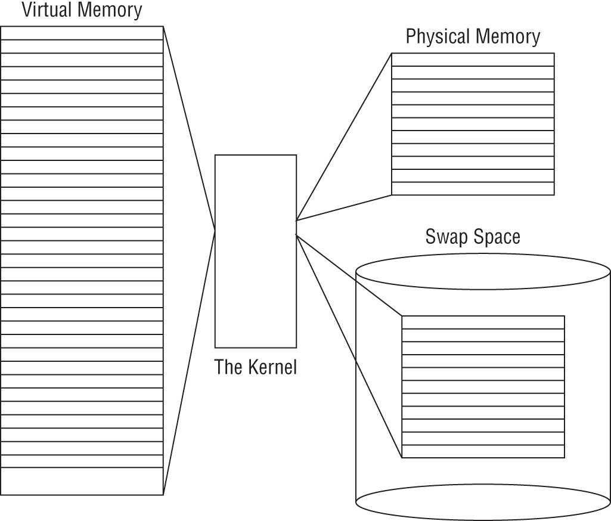

# Kernel, /proc, /sys và System Information

## 1. Kernel Version và Booted Kernel

Kernel là lớp lõi quản lý process, memory, filesystem, network stack, device driver và system call.

Nhìn theo vai trò vận hành, kernel có bốn nhóm trách nhiệm lớn:

| Nhóm | Kernel chịu trách nhiệm |
| --- | --- |
| Memory management | Quản lý physical memory, virtual memory, page table, page cache, swap và OOM decision |
| Process management | Tạo process/thread, lập lịch CPU, signal, namespace, cgroup và lifecycle của PID |
| Hardware management | Giao tiếp với thiết bị qua driver, kernel module, interrupt, `/dev`, `/sys` và udev |
| Filesystem management | Cung cấp VFS để user space thao tác file thống nhất dù backend là ext4, XFS, procfs, sysfs, NFS hay filesystem khác |

```bash
uname -r
uname -a
cat /proc/version
cat /proc/cmdline
```

Kiểm tra kernel package đã cài:

```bash
# Debian/Ubuntu
dpkg -l 'linux-image*'

# RHEL/CentOS/Fedora
rpm -qa 'kernel*'
```

Lưu ý: kernel package đã cài không đồng nghĩa kernel đang boot. Luôn kiểm tra `uname -r`.

`/boot` thường chứa kernel image, initramfs, file cấu hình kernel, System.map và cấu hình bootloader. Khi nâng cấp kernel hoặc build kernel riêng, phải giữ ít nhất một kernel cũ boot được trong GRUB để rollback nếu kernel mới thiếu driver storage/network hoặc không boot được.

```bash
ls -lh /boot
grep ^menuentry /boot/grub*/grub.cfg 2>/dev/null
```

## 2. Virtual Memory, Physical Memory và Swap



Mỗi process nhìn thấy một không gian **virtual memory** riêng. Kernel và MMU ánh xạ virtual address của process sang **physical memory** trong RAM hoặc sang page đã được đẩy xuống **swap space**. Nhờ vậy process không cần biết dữ liệu hiện nằm ở RAM thật hay đang phải được nạp lại từ swap.

| Thành phần | Ý nghĩa |
| --- | --- |
| Virtual memory | Không gian địa chỉ mà process nhìn thấy; cô lập giữa các process |
| Kernel | Quản lý page table, cấp phát memory, page cache, swap in/out và bảo vệ truy cập |
| Physical memory | RAM thật, nhanh hơn disk rất nhiều |
| Swap space | Vùng disk dùng để giữ tạm page ít dùng khi RAM chịu áp lực |

Kernel chia memory thành các **page**. Khi RAM thiếu, kernel có thể swap out page ít được truy cập xuống disk. Khi process cần lại page đó, kernel swap in page về RAM. Swap giúp hệ thống chịu được áp lực memory ngắn hạn, nhưng swap nhiều thường là tín hiệu thiếu RAM, memory leak, working set quá lớn hoặc cấu hình workload chưa phù hợp.

Kiểm tra an toàn:

```bash
free -h
cat /proc/meminfo
swapon --show
vmstat 1 5
```

Đừng đọc `free` theo kiểu “free memory thấp là xấu”. Linux dùng RAM rảnh cho buffer/page cache để tăng hiệu năng IO. Cần nhìn thêm `available`, swap activity, major page fault, OOM log và latency của workload.

## 3. Kernel Modules

Kernel module là phần mở rộng có thể load/unload để hỗ trợ driver hoặc tính năng kernel.

```bash
lsmod
modinfo <module>
modinfo -p <module>
sudo modprobe -n -v <module>
sudo modprobe <module>
sudo modprobe -r <module>
```

Ví dụ:

```bash
lsmod | grep br_netfilter
modinfo overlay
```

Không unload module trên production nếu chưa rõ dependency và tác động tới workload. Trước khi dùng `modprobe -r`, kiểm tra module đang được dùng bởi module khác hay service nào bằng `lsmod`, log kernel và tài liệu của distro/vendor.

Module thường nằm dưới `/lib/modules/$(uname -r)/`. Sau khi thêm/xóa module thủ công, `depmod` tạo lại dependency map để `modprobe` biết module nào cần load kèm. Trong vận hành bình thường, ưu tiên `modprobe` thay vì `insmod` vì `insmod` chỉ nạp đúng file `.ko` được chỉ định và không tự xử lý dependency.

Checklist an toàn trước khi load/unload module:

```bash
uname -r
modinfo <module>
lsmod | grep -F <module>
sudo modprobe -n -v <module>
journalctl -k --since "10 minutes ago" --no-pager
```

Nếu module liên quan storage, network, filesystem, security agent hoặc hypervisor driver, cần maintenance window, console/out-of-band access và rollback kernel/module package trước khi thay đổi. Một module unload sai có thể làm mất disk path, rớt network hoặc treo workload.

Load module khi boot:

```bash
echo br_netfilter | sudo tee /etc/modules-load.d/br_netfilter.conf
```

Module option nên được đặt trong file riêng dưới `/etc/modprobe.d/` thay vì sửa lẫn vào file blacklist chung của distro. Ví dụ khi cần tắt Kernel Mode Setting của `nouveau` để dùng driver NVIDIA vendor-managed:

```text
options nouveau modeset=0
```

Blacklisting module cũng nên đặt trong file có tên rõ mục đích, ví dụ `/etc/modprobe.d/blacklist-nouveau.conf`:

```text
blacklist nouveau
```

Thay đổi module config có thể ảnh hưởng boot sau, initramfs hoặc driver binding. Trước khi áp dụng trên production, ghi lại kernel đang chạy, module đang load, package driver, console/out-of-band access và rollback bằng kernel/driver cũ. Với thay đổi ảnh hưởng storage, network hoặc GPU đang phục vụ workload, cần maintenance window.

## 4. Device, Driver và Device File

Kernel giao tiếp với hardware thông qua driver. Driver có thể được build trực tiếp vào kernel hoặc được nạp động dưới dạng kernel module. User space thường không nói chuyện trực tiếp với thiết bị vật lý, mà đi qua abstraction như device node trong `/dev`, object trong `/sys`, network interface hoặc block device.

| Loại device | Mô tả | Ví dụ |
| --- | --- | --- |
| Character device | Truyền dữ liệu dạng stream/ký tự, thường không có random block access | terminal, serial, `/dev/null` |
| Block device | Đọc/ghi theo block, thường dùng cho disk/partition | `/dev/sda`, `/dev/nvme0n1`, `/dev/mapper/*` |
| Network device | Gửi/nhận packet qua network stack, thường không hiện như file block/char thông thường | `eth0`, `lo`, `bond0`, `veth*` |

Luồng quan sát từ hardware tới OS abstraction:

```text
physical/virtual device
-> firmware/bus discovery
-> kernel driver binding
-> object trong /sys
-> device node trong /dev hoặc network interface
-> filesystem, mount, service hoặc application
```

Lệnh read-only hữu ích:

```bash
lspci
lspci -s <pci-address> -v
lspci -s <pci-address> -k
lsusb
lsusb -t
lsusb -v -d <vendor-id>:<product-id>
lsblk -o NAME,SIZE,TYPE,FSTYPE,MOUNTPOINT,MODEL,SERIAL
udevadm info --query=all --name=/dev/sda
dmesg -T | grep -iE 'error|fail|reset|timeout|firmware'
```

`lspci -k` đặc biệt hữu ích vì nó cho thấy device PCI/PCIe đang bind với kernel driver nào và module nào đang liên quan. `lsusb -t` cho thấy topology USB, class và driver ở dạng cây, phù hợp để tách lỗi "kernel không thấy device" khỏi lỗi "driver không bind" hoặc lỗi tầng application.

Với host vật lý hoặc VM mới attach thêm disk/NIC, đừng suy luận chỉ từ tên `/dev/sdX` hoặc interface name. Thứ tự phát hiện thiết bị có thể đổi sau reboot hoặc khi topology thay đổi. Với storage lâu dài, dùng `UUID`, `LABEL`, WWN, serial hoặc symlink ổn định trong `/dev/disk/by-*` như đã mô tả ở [Disk, Filesystem, Mount và Swap](../02-storage-networking/01-disk-filesystem-mount-swap.md).

Khi debug device, phân biệt rõ: physical device, driver binding, kernel object trong `/sys`, device node trong `/dev`, filesystem/mount và application IO error. Một lỗi “không đọc được file” có thể đến từ permission, filesystem, block device, driver hoặc phần cứng.

Firmware như BIOS/UEFI quyết định boot device, một số tính năng phần cứng và tùy chọn virtualization trước khi kernel chạy. Với host ảo hóa, container host hoặc hypervisor, nếu extension virtualization bị tắt trong firmware thì OS có thể vẫn boot bình thường nhưng KVM/VM workload không dùng được acceleration.

Boot order là cấu hình firmware có tác động trực tiếp tới khả năng boot. Khi gắn thêm disk SATA/SAS/NVMe hoặc chuyển boot giữa local disk, SAN, PXE và USB rescue media, xác nhận lại boot device trong BIOS/UEFI/BMC console. Trên server production, thay đổi boot order hoặc bật/tắt thiết bị onboard là thao tác rủi ro vì có thể làm host không boot hoặc mất NIC/storage path.

Kiểm tra read-only:

```bash
lscpu
cat /proc/cpuinfo | grep -E 'vmx|svm' | head
```

Với server vật lý, đừng bỏ qua lớp power/thermal. PSU lỗi, mất redundancy, nhiệt độ cao hoặc thermal throttling có thể biểu hiện thành reboot bất thường, performance tụt hoặc disk/NIC reset trong log kernel. Bắt đầu bằng `dmesg`, `journalctl -k`, BMC/IPMI/iDRAC/iLO event log và monitoring phần cứng trước khi kết luận lỗi application.

## 5. `/proc` Filesystem

`/proc` là virtual filesystem do kernel tạo, không phải dữ liệu nằm trên disk. Nó expose thông tin process và kernel runtime state.

Các path thường dùng:

| Path | Ý nghĩa |
| --- | --- |
| `/proc/cpuinfo` | Thông tin CPU |
| `/proc/meminfo` | Thông tin memory |
| `/proc/mounts` | Mount hiện tại |
| `/proc/partitions` | Partition kernel thấy |
| `/proc/uptime` | Uptime |
| `/proc/loadavg` | Load average |
| `/proc/cmdline` | Kernel command line |
| `/proc/<pid>/` | Thông tin process |
| `/proc/sys/` | Kernel tunable dùng bởi `sysctl` |

Ví dụ:

```bash
cat /proc/meminfo
cat /proc/loadavg
cat /proc/mounts
ls -l /proc/1
ls -l /proc/$(pidof sshd | awk '{print $1}')/fd
```

`/proc/<pid>` rất hữu ích khi debug process vì nó cho thấy trạng thái mà kernel đang biết, không phụ thuộc hoàn toàn vào output của application:

| Path | Dùng để kiểm tra |
| --- | --- |
| `/proc/<pid>/cmdline` | Command line thật của process, phân tách bằng byte null |
| `/proc/<pid>/environ` | Environment của process, có thể chứa secret nên chỉ đọc khi cần |
| `/proc/<pid>/cwd` | Working directory hiện tại |
| `/proc/<pid>/exe` | Binary đang chạy |
| `/proc/<pid>/fd/` | File descriptor đang mở: file, socket, pipe, device |
| `/proc/<pid>/maps` | Memory mapping, shared library, heap, stack |
| `/proc/<pid>/status` | State, UID/GID, thread count, memory summary |

Khi incident hoặc troubleshooting, ưu tiên đọc snapshot trước khi restart/kill process vì nhiều thông tin trong `/proc/<pid>` biến mất khi process kết thúc.

## 6. `/sys` Filesystem

`/sys` là virtual filesystem expose kernel object, device, driver và class. Nó thường dùng để kiểm tra hardware/runtime state hoặc tuning một số queue/device parameter.

Các path thường gặp:

| Path | Ý nghĩa |
| --- | --- |
| `/sys/class/net/` | Network interfaces |
| `/sys/block/` | Block devices |
| `/sys/devices/` | Device tree |
| `/sys/module/` | Loaded modules và parameters |

Ví dụ:

```bash
ls /sys/class/net
cat /sys/class/net/eth0/operstate
cat /sys/class/net/eth0/speed
ls /sys/block
cat /sys/block/sda/queue/scheduler
```

Không chỉnh file trong `/sys` nếu chưa hiểu tác động runtime và rollback.

## 7. IRQ, I/O Port Và DMA

Một số hardware signal thấp hơn vẫn có thể quan sát qua `/proc` khi debug driver, interrupt hoặc thiết bị không nhận đúng.

| Runtime view | Ý nghĩa | Lệnh quan sát |
| --- | --- | --- |
| IRQ | Interrupt request, cách device báo CPU có sự kiện cần xử lý | `cat /proc/interrupts` |
| I/O port | Vùng địa chỉ I/O truyền thống cho một số thiết bị/driver | `cat /proc/ioports` |
| DMA | Direct Memory Access, device đọc/ghi RAM mà không cần CPU copy từng byte | `cat /proc/dma` |

Các signal này thường dùng khi debug hardware/driver sâu, không phải bước đầu tiên cho mọi incident. Với server production, bắt đầu từ `dmesg`, `lspci -k`, `lsusb -t`, `lsblk`, `/sys/class/*` và metric phần cứng trước; chỉ đi xuống IRQ/I/O port/DMA khi có bằng chứng driver hoặc interrupt bất thường.

## 8. `/dev` và `/run`

`/dev` chứa device nodes do kernel/udev quản lý:

```bash
ls -l /dev/sda
ls -l /dev/nvme0n1
ls -l /dev/null
udevadm info --query=all --name=/dev/sda
udevadm monitor
```

`/run` chứa runtime state trong một phiên boot:

```bash
ls /run
ls /run/systemd
ls /run/lock
```

`/var/run` trên hệ thống hiện đại thường là symlink tới `/run`.

## 9. udev Và Hot-Plug Device

`udev` là userspace device manager nhận event từ kernel khi thiết bị xuất hiện, biến mất hoặc thay đổi trạng thái. Nó tạo device node, set permission, tạo symlink ổn định và chạy rule phù hợp.

```text
device inserted/removed
-> kernel emits event
-> udev receives event
-> udev rule matched
-> device node/symlink/permission/action updated
```

Lệnh quan sát an toàn:

```bash
udevadm monitor
udevadm info --query=all --name=/dev/sdb
```

Reload rule sau khi sửa:

```bash
sudo udevadm control --reload-rules
sudo udevadm trigger
```

Production notes:

- Cẩn thận với rule chạy script vì nó có thể kích hoạt khi hot-plug hoặc boot.
- Dùng thuộc tính ổn định như serial, WWN, vendor/product ID thay vì device name `/dev/sdX` nếu cần symlink bền.
- Khi disk/NIC/USB không nhận, đọc `dmesg` và `udevadm monitor` giúp tách lỗi kernel detect, driver, udev rule hay layer phía trên.

## 10. debugfs và tracing runtime

`debugfs` là pseudo filesystem cho debugging/tracing của kernel. Nó thường mount dưới `/sys/kernel/debug` và được dùng bởi một số công cụ như `perf`, `ftrace`, dynamic debugging hoặc eBPF/BCC tooling.

Kiểm tra read-only:

```bash
mount | grep debugfs
ls /sys/kernel/debug 2>/dev/null
ls /sys/kernel/tracing 2>/dev/null
```

Mount debugfs hoặc bật tracing có thể làm lộ thông tin runtime nhạy cảm và tạo overhead. Trên production, chỉ bật khi có mục tiêu debug rõ, ghi lại thay đổi và tắt sau khi thu thập xong.

## 11. sysctl

`sysctl` đọc/ghi kernel tunable dưới `/proc/sys`.

```bash
sysctl -a
sysctl net.ipv4.ip_forward
sudo sysctl -w net.ipv4.ip_forward=1
```

Persistent config:

```bash
cat /etc/sysctl.conf
ls /etc/sysctl.d/
sudo sysctl --system
```

Thứ tự áp dụng có thể khác nhẹ theo distro, nhưng thực tế nên coi `/etc/sysctl.conf` và các file trong `/etc/sysctl.d/*.conf` là nguồn cấu hình persistent. Dùng `sysctl --system` để reload toàn bộ và kiểm tra output khi có key bị lỗi.

Ví dụ bật IP forwarding:

```bash
echo 'net.ipv4.ip_forward = 1' | sudo tee /etc/sysctl.d/99-ip-forward.conf
sudo sysctl --system
```

Production notes:

- Ghi lại giá trị cũ trước khi thay đổi.
- Ưu tiên file riêng trong `/etc/sysctl.d/`.
- Kiểm tra tác động security/network trước khi bật forwarding hoặc relax kernel hardening.

## 12. Build Kernel Từ Source

Build kernel từ source thường dành cho lab, kernel development, debug driver hoặc cần patch đặc biệt. Với server production, ưu tiên kernel do distro/vendor cung cấp vì nó đi kèm packaging, security update, module ABI, initramfs, bootloader integration và support lifecycle.

High-level workflow trong lab:

```bash
tar xf linux-*.tar.xz
cd linux-*
make menuconfig
make -j"$(nproc)"
```

Điểm cần kiểm soát:

- Cần đủ disk space, CPU và thời gian build.
- Config kernel sai có thể làm hệ thống không boot hoặc thiếu driver storage/network.
- Module ngoài tree như driver vendor, filesystem hoặc security agent có thể không tương thích.
- Luôn giữ kernel cũ trong GRUB để rollback.
- Với Ubuntu/Debian/RHEL-family, nếu cần vận hành lâu dài, nên build thành package theo tooling của distro thay vì `make install` thủ công.

## 13. System Information Commands

```bash
# OS, hostname, time
cat /etc/os-release
hostnamectl
timedatectl

# CPU/RAM
lscpu
free -h
cat /proc/cpuinfo
cat /proc/meminfo

# Disk/filesystem
lsblk -f
blkid
df -h
findmnt

# Hardware/device
lspci
lsusb
udevadm info --export-db

# Kernel/runtime
uname -a
dmesg -T | tail -100
journalctl -k
```

## 14. Quick Triage

```bash
uptime
hostnamectl
timedatectl
uname -r
free -h
df -h
lsblk -f
ip addr
ip route
systemctl --failed
dmesg -T | tail -100
journalctl -p warning -b
```

Script health-check dài nên đặt ở [Sysadmin Scripts Collection](../04-shell-automation-advanced/08-sysadmin-scripts-collection.md), không đặt trong note kernel/proc/sys.
