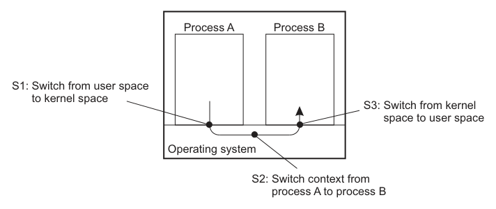

# Linux System Programming For Ops

## Overview

System programming giải thích cách program tương tác với kernel: system call, file descriptor, process, signal, daemon, systemd, IPC, thread và debugging. Với sysadmin/SRE, mục tiêu không phải viết C chuyên sâu, mà là đọc đúng triệu chứng runtime và hiểu vì sao service bị lỗi.

Note này chuyển hóa phần reusable từ `_inbox/Linux-System-Programming-Techniques.docx` và `_inbox/Linux.docx` theo góc vận hành Linux.

## Mental Model

```text
shell / service manager
-> process
-> system call
-> kernel object: file, socket, pipe, signal, memory, thread
-> filesystem / network / device
-> exit code, logs, metrics, core dump
```

Khi debug, luôn tách:

- Program logic.
- Runtime environment.
- Kernel resource.
- Service manager behavior.
- External dependency như filesystem, network, DNS, database.

## Exit Code And Scriptability

Unix program tốt nên có exit code rõ:

| Exit code | Ý nghĩa thường gặp |
| --- | --- |
| `0` | thành công |
| `1` | lỗi chung |
| `2` | sai usage/input |
| `126` | command tồn tại nhưng không execute được |
| `127` | command không tồn tại |
| `128+n` | process kết thúc bởi signal `n` |

Kiểm tra:

```bash
command
echo $?
```

Với automation, exit code là contract giữa program, shell script, cron, systemd và CI/CD. Đừng chỉ in lỗi ra stdout rồi vẫn exit `0`.

## File Descriptor

Process nhìn file, socket, pipe và device qua file descriptor.

Mặc định:

| FD | Ý nghĩa |
| --- | --- |
| `0` | stdin |
| `1` | stdout |
| `2` | stderr |

Kiểm tra file descriptor của process:

```bash
ls -l /proc/<pid>/fd
lsof -p <pid>
```

Triệu chứng hay gặp:

- Too many open files: FD leak hoặc limit quá thấp.
- Log không ghi được: permission/path/disk full hoặc FD bị redirect sai.
- Socket còn giữ port: process vẫn listen hoặc zombie parent chưa dọn đúng.

## Process Lifecycle: fork, exec, wait

Các primitive quan trọng:

- `fork`: tạo process con.
- `exec`: thay image của process bằng program khác.
- `wait`: parent chờ và reap child.
- `exit`: process kết thúc với exit code.

Trong vận hành:

- Zombie xuất hiện khi child đã exit nhưng parent chưa `wait`.
- Orphan được PID 1/systemd nhận.
- Daemon thường tách khỏi terminal và chạy lâu dài.

Checks:

```bash
ps -eo pid,ppid,stat,cmd | head
pstree -ap
ps -eo pid,ppid,stat,cmd | awk '$3 ~ /Z/ {print}'
```

## Signals

Signal là cơ chế gửi sự kiện tới process.

| Signal | Dùng khi |
| --- | --- |
| `SIGHUP` | reload config với nhiều daemon |
| `SIGTERM` | yêu cầu dừng an toàn |
| `SIGKILL` | kill cưỡng bức, không cleanup |
| `SIGSTOP` | pause process |
| `SIGCONT` | tiếp tục process |

Ưu tiên:

```bash
kill -TERM <pid>
```

Chỉ dùng `SIGKILL` khi process không phản hồi và bạn chấp nhận mất cleanup, lock, temp file hoặc transaction đang dang dở.

## Daemon And systemd

Systemd quản lý daemon bằng unit file, dependency, restart policy, environment, cgroup và logging.

Debug service:

```bash
systemctl status <service>
systemctl cat <service>
journalctl -u <service> --since "1 hour ago"
systemctl show <service> -p ExecStart -p User -p Group -p Restart -p MainPID
```

Điểm hay sai:

- Binary path sai.
- Environment khác interactive shell.
- Working directory không đúng.
- Service user thiếu permission.
- Restart loop che mất lỗi gốc.
- LimitNOFILE/MemoryMax/TasksMax quá thấp.

## Pipes And IPC

IPC là cách process trao đổi dữ liệu. Các dạng thường gặp:

- Pipe anonymous: nối stdout/stdin trong shell.
- Named pipe/FIFO: path trong filesystem.
- Unix domain socket: local IPC cho daemon.
- TCP/UDP socket: network IPC.
- Shared memory/message queue/semaphore: dùng trong app performance-sensitive.

Checks:

```bash
lsof -p <pid>
ss -xap
ls -l /run /var/run
```

Unix socket rất phổ biến trong service local như Docker socket, database socket, system bus. Quyền trên socket có thể tương đương quyền quản trị service.

## Threads And Race Conditions

Thread chia sẻ address space trong cùng process. Lợi ích là concurrency nhẹ hơn process, nhưng rủi ro là race condition, deadlock và tài nguyên dùng chung bị tranh chấp.



Process có isolation mạnh hơn vì mỗi process có address space, file table và security context riêng. Cái giá là tạo process và context switch thường đắt hơn: kernel phải chuyển user/kernel mode, đổi process context, cập nhật memory map/MMU và có thể làm xáo trộn CPU cache/TLB. Thread nhẹ hơn vì nhiều thread trong cùng process chia sẻ address space, nhưng chính vì chia sẻ nên application phải tự quản lý mutex, condition variable, ordering và lifecycle của dữ liệu dùng chung.

Operational signals:

- CPU cao nhưng throughput không tăng.
- Thread count tăng bất thường.
- Deadlock làm process còn sống nhưng không xử lý request.
- Memory leak theo thread pool hoặc request.

Checks:

```bash
ps -L -p <pid>
top -H -p <pid>
cat /proc/<pid>/status | grep -E 'Threads|VmRSS|FDSize'
```

## Server Concurrency Models

Khi một service xử lý nhiều connection hoặc request, có ba mô hình hay gặp:

| Mô hình | Cách hoạt động | Điểm mạnh | Rủi ro vận hành |
| --- | --- | --- | --- |
| Iterative / single-threaded blocking | Một request được xử lý xong rồi mới nhận request tiếp theo | Đơn giản, dễ debug | Disk/network blocking làm toàn service đứng chờ |
| Thread/process per request hoặc worker pool | Dispatcher nhận request rồi giao cho worker thread/process | Giữ code tuần tự, tận dụng blocking I/O và multicore | Thread/process leak, contention, pool exhaustion, memory tăng |
| Event loop / finite-state machine | Một hoặc vài thread dùng nonblocking I/O và state machine | Hiệu quả với nhiều connection idle | Code phức tạp, bug state/race khó đọc, một callback chậm có thể chặn loop |

Trong production, không chọn mô hình chỉ theo benchmark synthetic. Kiểm tra workload thật: tỷ lệ CPU-bound vs I/O-bound, thời gian chờ disk/network, số connection idle, request fan-out, memory per connection và khả năng observability của runtime.

Pre-check khi service có dấu hiệu nghẽn concurrency:

```bash
ps -L -p <pid>
top -H -p <pid>
ss -tanp | grep '<process-name>'
lsof -p <pid> | wc -l
cat /proc/<pid>/limits
```

Nếu phải tăng thread/process pool, tăng theo từng bước nhỏ và theo dõi latency, queue depth, memory, context switch rate và error rate. Rollback bằng cách trả lại cấu hình pool cũ; đừng restart service trước khi giữ lại log và metrics quanh thời điểm nghẽn nếu còn cần RCA.

## Debugging Native Programs

Tools phổ biến:

| Tool | Dùng để |
| --- | --- |
| `strace` | xem system call, file/socket mở, lỗi `ENOENT`, `EACCES`, timeout |
| `ltrace` | xem library call |
| `gdb` | debug process/native crash |
| `valgrind` | memory leak/use-after-free trong lab |
| `coredumpctl` | xem core dump trên systemd distro |
| `ldd` | xem shared library dependency |

Ví dụ read-only hoặc ít xâm lấn:

```bash
strace -f -p <pid> -o /tmp/trace.txt
ldd /path/to/binary
coredumpctl list
coredumpctl info <pid>
```

`strace` có overhead và có thể lộ dữ liệu nhạy cảm trong argument/syscall. Không chạy lâu trên production nếu chưa có lý do rõ.

### Strace Trong Container

Container vẫn gọi Linux kernel của host. Vì vậy cùng một image có thể chạy khác nhau giữa các host nếu kernel version, seccomp, SELinux/AppArmor, cgroup mode, filesystem hoặc Docker runtime khác nhau.

Khi container fail chỉ trên một host:

```bash
docker inspect <container> --format '{{.State.Pid}} {{.State.ExitCode}} {{.State.Error}}'
docker top <container>
```

Nếu cần quan sát syscall:

```bash
PID=$(docker inspect --format '{{.State.Pid}}' <container>)
sudo strace -f -p "$PID" -o /tmp/container-strace.txt
```

So sánh trace giữa host tốt và host lỗi để tìm syscall trả `ENOENT`, `EACCES`, `EPERM`, `EINVAL` hoặc `ENOSYS`. Ví dụ `ENOSYS` có thể gợi ý kernel không hỗ trợ syscall mà binary đang dùng; `EACCES`/`EPERM` có thể đến từ capability, seccomp hoặc MAC policy.

Guardrails:

- Strace có thể capture secret trong argv, env, path hoặc network-related syscall; bảo vệ output như evidence nhạy cảm.
- Thu trace ngắn theo time window tái hiện lỗi, không để chạy vô hạn.
- Nếu image tối giản không có `strace`, attach từ host vào PID container thay vì cài tool vào image production.

## Shared Libraries

Dynamic binary phụ thuộc shared libraries. Lỗi hay gặp:

- Library thiếu.
- Version không khớp.
- `LD_LIBRARY_PATH` override sai.
- Package upgrade thay library nhưng service chưa restart.

Checks:

```bash
ldd /path/to/binary
readelf -d /path/to/binary 2>/dev/null | grep NEEDED
ldconfig -p | grep <library>
```

Không đặt library tùy tiện vào path global nếu không kiểm soát package và rollback.

## Troubleshooting Mapping

| Triệu chứng | Kiểm tra đầu tiên |
| --- | --- |
| service start fail | `systemctl status`, `journalctl -u`, `systemctl cat` |
| command not found | `PATH`, package installed, absolute path |
| permission denied | owner/mode/ACL/SELinux/AppArmor, service user |
| no such file | working directory, config path, mount, chroot/container |
| too many open files | `/proc/<pid>/fd`, `ulimit`, systemd `LimitNOFILE` |
| zombie process | parent process, `pstree`, app wait/reap bug |
| bind port failed | `ss -tulpn`, address/port already used, privilege |
| crash/core dump | `coredumpctl`, package debug symbol, recent change |

## Program Interface And Environment

Command-line program tốt trong Linux nên có contract rõ với shell và automation:

- Dùng option nhất quán: short option cho thao tác nhanh, long option cho script dễ đọc.
- Tách stdout cho output chính và stderr cho lỗi/trạng thái.
- Trả exit code khác `0` khi lỗi thật sự xảy ra.
- Không giả định environment của interactive shell giống environment của `systemd`, cron hoặc container.
- Khi parse số, path hoặc user input, báo usage error rõ thay vì fail im lặng.

Các lỗi vận hành hay gặp:

| Triệu chứng | Góc nhìn system programming |
| --- | --- |
| Chạy tay được, chạy bằng systemd lỗi | khác `PATH`, `HOME`, working directory, user/group, environment |
| Script thành công giả | command bên trong fail nhưng script vẫn exit `0` |
| Output bị mất hoặc trộn | stdout/stderr redirect sai hoặc buffering khác khi không có TTY |
| Option trong automation khó hiểu | thiếu long option hoặc usage/help không rõ |

## Low-Level I/O And Buffering

Linux có hai lớp I/O phổ biến:

- C library stream như `printf`, `fopen`, `fread`, `fwrite`.
- File descriptor và system call như `open`, `read`, `write`, `close`, `lseek`.

Trong troubleshooting, lớp thấp giúp giải thích:

- `O_TRUNC` có thể xóa nội dung file ngay khi mở file để ghi.
- `O_APPEND` buộc ghi vào cuối file, hữu ích cho log nhưng vẫn cần kiểm soát rotation.
- `umask` làm permission file mới chặt hơn permission mà program yêu cầu.
- Buffering làm log chưa xuất hiện ngay, nhất là khi stdout không phải terminal.
- `lseek` và sparse file làm kích thước logic khác dung lượng disk thật.

Checks:

```bash
ls -l /proc/<pid>/fd
lsof -p <pid>
stat <file>
du -h <file>
ls -lh <file>
```

## Async I/O, Terminal And Interactive Services

Một số service không chỉ đọc/ghi blocking I/O đơn giản:

- Nonblocking I/O trả về trạng thái "chưa sẵn sàng" thay vì chờ mãi.
- `select`/`poll`/`epoll` cho phép một process theo dõi nhiều file descriptor.
- Signal-driven I/O và timer có thể làm lỗi chỉ xuất hiện theo race/time window.
- Terminal/TTY có mode riêng như echo, canonical mode, job control và foreground process group.

Khi service treo nhưng process còn sống, đừng chỉ nhìn CPU. Hãy kiểm tra socket, FD, thread, syscall đang chờ và log cùng time window.

## Related Pages

- [Package, Process và Service Management](../01-core-system/03-package-process-service.md)
- [Kernel, /proc, /sys và System Information](../01-core-system/04-kernel-proc-sys-system-info.md)
- [Bash Scripting, cron và systemd timer](./03-bash-scripting-cron-systemd-timer.md)
- [Container, KVM, cgroup và namespace](./05-container-kvm-cgroup-namespace.md)
