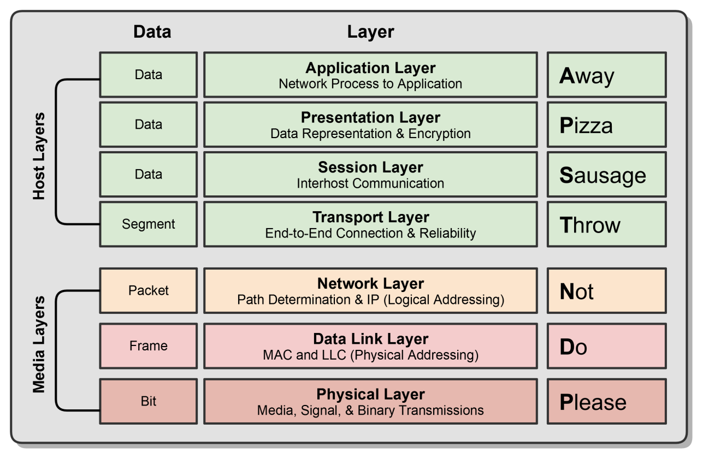
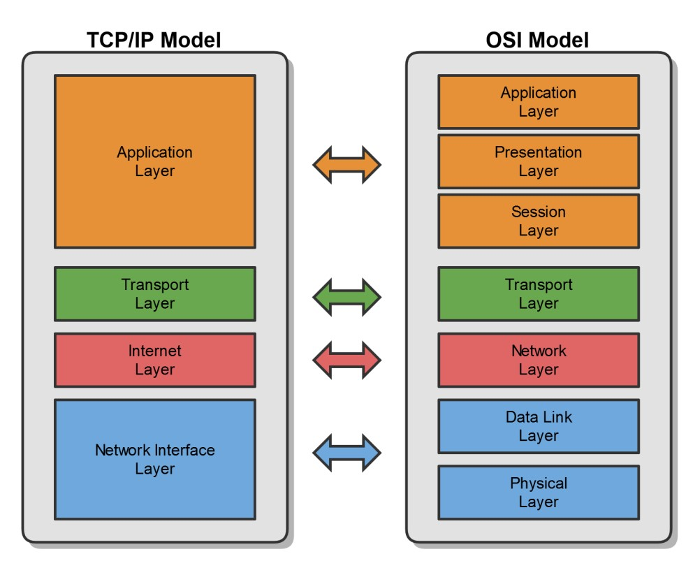

# OSI, TCP/IP And Encapsulation

## Overview

OSI và TCP/IP là hai mô hình giúp chia nhỏ network thành nhiều lớp. Mục tiêu không phải học thuộc tên lớp, mà là biết sự cố đang nằm ở lớp nào và nên dùng công cụ gì để kiểm tra.



## OSI Model

| OSI Layer | Đơn vị dữ liệu | Vai trò chính | Ví dụ |
| --- | --- | --- | --- |
| 7. Application | Data | protocol gần application | HTTP, DNS, SSH, SMTP |
| 6. Presentation | Data | format, encode, encryption | TLS, serialization, compression |
| 5. Session | Data | duy trì session/connection context | RPC/session handling |
| 4. Transport | Segment/Datagram | end-to-end connection, port, reliability | TCP, UDP |
| 3. Network | Packet | logical addressing và routing | IP, ICMP |
| 2. Data Link | Frame | MAC addressing, switching, VLAN | Ethernet, ARP context, 802.1Q |
| 1. Physical | Bit | signal, cable, radio, optics | copper, fiber, Wi-Fi PHY |

Một lỗi "không vào được website" có thể nằm ở nhiều lớp: DNS layer 7, TLS layer 6, TCP port layer 4, route layer 3, VLAN layer 2 hoặc cable layer 1.

## TCP/IP Model

TCP/IP thường gom OSI thành ít lớp hơn:



| TCP/IP Layer | Gần tương ứng OSI | Ví dụ |
| --- | --- | --- |
| Application | OSI 5-7 | HTTP, DNS, SSH, SMTP |
| Transport | OSI 4 | TCP, UDP |
| Internet | OSI 3 | IP, ICMP |
| Network Interface | OSI 1-2 | Ethernet, Wi-Fi, VLAN |

Trong vận hành, TCP/IP model thường thực dụng hơn vì map gần với tool:

- `curl`, `dig`, `openssl`: application/TLS/DNS.
- `ss`, `nc`, `tcpdump`: transport.
- `ip route`, `ping`, `traceroute`: internet layer.
- `ip link`, `ethtool`, switch port, VLAN: network interface.

## Encapsulation Và De-Encapsulation

Khi data đi xuống stack, mỗi lớp thêm header của nó:

```text
Application data
  -> TCP/UDP segment
  -> IP packet
  -> Ethernet frame
  -> bits on wire
```

Khi nhận, host bóc ngược lại:

```text
bits
  -> frame
  -> packet
  -> segment/datagram
  -> application data
```

Điều này giải thích vì sao packet capture có nhiều lớp header. Một gói HTTP qua TCP/IP/Ethernet không chỉ có payload HTTP, mà còn có Ethernet header, IP header và TCP header.

## Troubleshooting Theo Layer

| Triệu chứng | Lớp nghi ngờ | Kiểm tra nhanh |
| --- | --- | --- |
| interface down | L1/L2 | `ip link`, `ethtool`, switch port |
| cùng subnet không ping được | L2/L3 | ARP table, VLAN, firewall local |
| ping gateway được nhưng không ra ngoài | L3 | default route, upstream route, NAT |
| ping IP được nhưng không resolve domain | L7 DNS | `dig`, `nslookup`, resolver config |
| TCP timeout | L3/L4/security | route, firewall, security group |
| TCP connect được nhưng HTTP lỗi | L7 | `curl -v`, app log, proxy log |
| TLS handshake fail | L6/L7 | cert, SNI, cipher, time sync |

## Common Misunderstandings

- OSI không phải là implementation bắt buộc; nó là mental model.
- TCP/IP không thay thế hoàn toàn OSI; nó là mô hình thực dụng hơn cho Internet.
- Layer 2 dùng MAC để forward trong một broadcast domain; Layer 3 dùng IP để route giữa network.
- DNS thành công không chứng minh service sống; nó chỉ chứng minh tên đã resolve.

## Related Pages

- [Addressing, Ports And Sockets](./03-addressing-ports-and-sockets.md)
- [Common Network Protocols And Ports](../04-protocols-and-services/01-common-network-protocols-and-ports.md)
- [Network Troubleshooting Tools](../07-network-operations-lifecycle/03-network-troubleshooting-tools.md)
