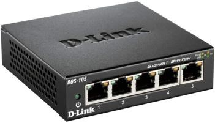

# Ethernet, Media, Topologies And Layer 2

## Overview

Ethernet là công nghệ Layer 1/Layer 2 phổ biến nhất trong LAN/datacenter. Nó định nghĩa cách frame được truyền trên media vật lý và cách thiết bị trong cùng Layer 2 segment giao tiếp qua MAC address.

Trong môi trường hiện đại, Ethernet thường đi cùng:

- Switch.
- VLAN.
- Trunk/access port.
- Bond/LACP.
- Bridge hoặc OVS trong virtualization/container platform.

## Ethernet Frame Mental Model

Ở mức đơn giản, Ethernet frame chứa:

```text
Destination MAC
Source MAC
EtherType / VLAN tag
Payload
FCS
```

Switch đọc destination MAC để forward frame. Nếu chưa biết MAC nằm ở port nào, switch có thể flood frame trong VLAN tương ứng.

## Switch Hoạt Động Như Thế Nào



Switch học MAC bằng cách nhìn source MAC của frame đi vào port:

1. Frame đi vào port.
2. Switch ghi `source MAC -> ingress port` vào MAC table.
3. Nếu biết destination MAC, switch forward ra đúng port.
4. Nếu chưa biết destination MAC, switch flood trong cùng VLAN.

Kiểm tra trên Linux bridge:

```bash
bridge fdb show
bridge link
```

Trên switch thật, khái niệm tương đương là MAC address table/CAM table.

## Hub, Switch Và Router

| Thiết bị | Lớp chính | Hành vi |
| --- | --- | --- |
| Hub | L1 | lặp tín hiệu ra mọi port |
| Switch | L2 | forward frame theo MAC/VLAN |
| Router | L3 | route packet giữa các subnet |

Trong cloud/private cloud, router có thể là physical router, Linux router, virtual router, VRF hoặc cloud route table.

## Topology Vật Lý Và Logic

Topology vật lý là cách cáp nối thật. Topology logic là cách traffic được phân đoạn và forward.

Ví dụ:

- Nhiều server cắm cùng switch vật lý nhưng nằm ở VLAN khác nhau.
- Một host có OVS bridge tạo nhiều virtual network cho VM.
- Kubernetes overlay tạo pod network logic nằm trên underlay Ethernet/IP.

Khi troubleshoot, cần biết mình đang debug topology vật lý hay topology logic.

## Media Và Cabling

Các loại media thường gặp:

- Copper twisted pair: dùng RJ-45, phổ biến cho 1G/10G tùy chuẩn và chiều dài.
- Fiber optic: dùng cho khoảng cách xa hơn, bandwidth cao hơn, phổ biến trong datacenter uplink.
- Coaxial: ít dùng trong LAN hiện đại, còn gặp trong ISP/cable.
- Wireless: dùng radio, chịu ảnh hưởng bởi nhiễu, khoảng cách và vật cản.

Một số điểm vận hành:

- Cáp sai chuẩn có thể gây link flap hoặc không đạt tốc độ mong muốn.
- Fiber cần đúng loại module, wavelength, connector và single-mode/multi-mode.
- Copper cần chú ý cable category, chiều dài, PoE và EMI.
- Link up không đảm bảo packet không lỗi; cần xem CRC/error/drop.

Kiểm tra nhanh trên Linux:

```bash
ip link show <interface>
ethtool <interface>
ethtool -S <interface>
```

## Layer 2 Failure Modes

| Triệu chứng | Nguyên nhân hay gặp |
| --- | --- |
| link down | cáp/module/port shutdown/sai speed |
| MAC flapping | loop L2, dual connection sai thiết kế |
| broadcast storm | loop hoặc broadcast domain quá lớn |
| host cùng subnet không thấy nhau | sai VLAN, port isolation, ARP/firewall |
| throughput thấp | duplex mismatch, CRC, oversubscription |

## Best Practices

- Chuẩn hóa VLAN, trunk/access port và naming convention.
- Dùng LACP/bonding đúng mục tiêu: redundancy hoặc aggregate throughput theo flow hashing.
- Bật loop protection phù hợp như STP/RSTP hoặc thiết kế leaf-spine rõ ràng.
- Theo dõi error counter, discard, CRC, link flap.
- Tách broadcast domain theo security và failure domain, không chỉ theo tiện cấu hình.

## Related Pages

- [Addressing, Ports And Sockets](../01-foundations/03-addressing-ports-and-sockets.md)
- [VLAN, LACP And Layer 2 Operations](./02-vlan-lacp-and-layer2-operations.md)
- [Network Troubleshooting Tools](../07-network-operations-lifecycle/03-network-troubleshooting-tools.md)
