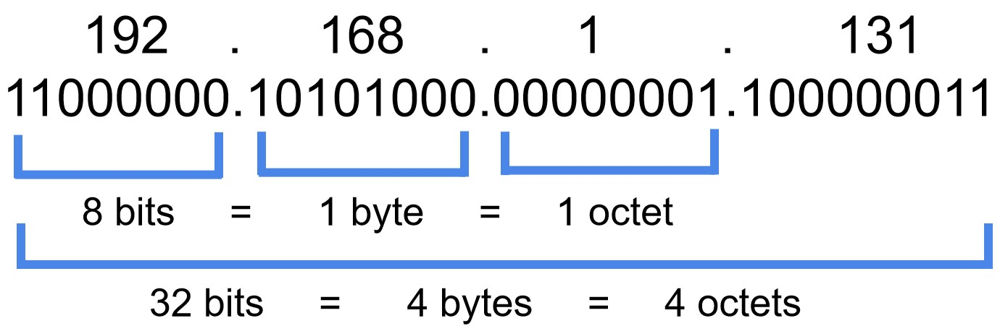

# IPv4 Addressing And Subnetting

## Overview

IPv4 addressing giúp xác định host nằm trong network nào và cần route ra sao. Subnetting là kỹ thuật chia một network lớn thành nhiều network nhỏ hơn để quản lý broadcast domain, routing, security boundary và capacity.



## IPv4 Anatomy

IPv4 dài 32 bit, thường viết thành 4 octet:

```text
192.168.1.131
```

Mỗi octet có 8 bit. CIDR notation cho biết prefix network dài bao nhiêu bit:

```text
192.168.1.131/24
```

Vá»›i `/24`:

- Network portion: 24 bit.
- Host portion: 8 bit.
- Network thường là `192.168.1.0`.
- Broadcast thường là `192.168.1.255`.
- Usable host thường từ `192.168.1.1` đến `192.168.1.254`.

## Public, Private Và Loopback

Private IPv4 ranges:

| Range | CIDR |
| --- | --- |
| 10.0.0.0 - 10.255.255.255 | `10.0.0.0/8` |
| 172.16.0.0 - 172.31.255.255 | `172.16.0.0/12` |
| 192.168.0.0 - 192.168.255.255 | `192.168.0.0/16` |

Loopback:

```text
127.0.0.0/8
```

`127.0.0.1` luôn trỏ về chính host local, không đi ra network card thật.

### Public/Private Và Static/Dynamic

Public IPv4 là địa chỉ có thể route trên Internet public. Private IPv4 chỉ có ý nghĩa trong network nội bộ hoặc VPC/VNet/project network và thường cần NAT, proxy, VPN hoặc private interconnect để nói chuyện ra ngoài.

Static IP là địa chỉ được giữ ổn định cho một host/service, phù hợp với endpoint cần allowlist, DNS record cố định, VPN gateway, load balancer frontend hoặc hệ thống legacy. Dynamic IP được cấp theo lease hoặc theo lifecycle resource, phù hợp cho client, ephemeral VM, container node hoặc môi trường autoscaling.

Nhầm lẫn phổ biến trong cloud là coi private IP đồng nghĩa với "an toàn". Private IP giảm exposure trực tiếp từ Internet, nhưng service vẫn có thể bị truy cập qua VPN, peering, bastion, load balancer, NAT rule, compromised workload hoặc route sai. Security boundary vẫn cần IAM, firewall/security group, routing control và logging.

## Subnet Mask Và CIDR

| CIDR | Subnet mask | Host bits | Usable hosts |
| --- | --- | ---: | ---: |
| `/24` | `255.255.255.0` | 8 | 254 |
| `/25` | `255.255.255.128` | 7 | 126 |
| `/26` | `255.255.255.192` | 6 | 62 |
| `/27` | `255.255.255.224` | 5 | 30 |
| `/28` | `255.255.255.240` | 4 | 14 |
| `/29` | `255.255.255.248` | 3 | 6 |
| `/30` | `255.255.255.252` | 2 | 2 |

Công thức nhanh:

```text
Number of addresses = 2 ^ host_bits
Usable hosts = 2 ^ host_bits - 2
```

Trừ 2 vì IPv4 subnet truyền thống dành một địa chỉ cho network và một địa chỉ cho broadcast.

## Cách Nghĩ Khi Chia Subnet

1. Xác định network gốc, ví dụ `192.168.1.0/24`.
2. Xác định cần bao nhiêu subnet hoặc mỗi subnet cần bao nhiêu host.
3. Chọn prefix phù hợp.
4. Tính block size.
5. Liệt kê network address, usable range và broadcast.
6. Gán subnet theo chức năng: user, server, storage, management, DMZ, transit.

Ví dụ chia `192.168.1.0/24` thành các subnet `/26`:

| Subnet | Usable range | Broadcast |
| --- | --- | --- |
| `192.168.1.0/26` | `192.168.1.1 - 192.168.1.62` | `192.168.1.63` |
| `192.168.1.64/26` | `192.168.1.65 - 192.168.1.126` | `192.168.1.127` |
| `192.168.1.128/26` | `192.168.1.129 - 192.168.1.190` | `192.168.1.191` |
| `192.168.1.192/26` | `192.168.1.193 - 192.168.1.254` | `192.168.1.255` |

## Routing Mental Model

Host quyết định gửi packet như sau:

1. Nếu destination thuộc cùng subnet, gửi trực tiếp qua Layer 2 bằng ARP.
2. Nếu destination khác subnet, gửi tới default gateway.
3. Router nhìn routing table để chọn next hop.
4. Nếu không có route, packet bị drop hoặc trả ICMP unreachable tùy thiết bị/policy.

Kiểm tra trên Linux:

```bash
ip addr
ip route
ip route get <destination-ip>
ping <gateway-ip>
traceroute <destination-ip>
```

## Common Mistakes

- Nhầm `/24` là "class C" cố định. CIDR không phụ thuộc classful thinking cũ.
- Gán IP host trùng network address hoặc broadcast address.
- Quên default gateway.
- Subnet overlap giữa site-to-site VPN, VPC, Kubernetes pod CIDR hoặc service CIDR.
- Nhìn `kubectl top`/dashboard rồi kết luận network còn "rảnh"; routing và subnet không hoạt động theo cách đó.

## Related Pages

- [Routing, NAT And Virtual Router](./02-routing-nat-and-virtual-router.md)
- [VLAN, LACP And Layer 2 Operations](../02-ethernet-switching/02-vlan-lacp-and-layer2-operations.md)
- [Network Troubleshooting Tools](../07-network-operations-lifecycle/03-network-troubleshooting-tools.md)
