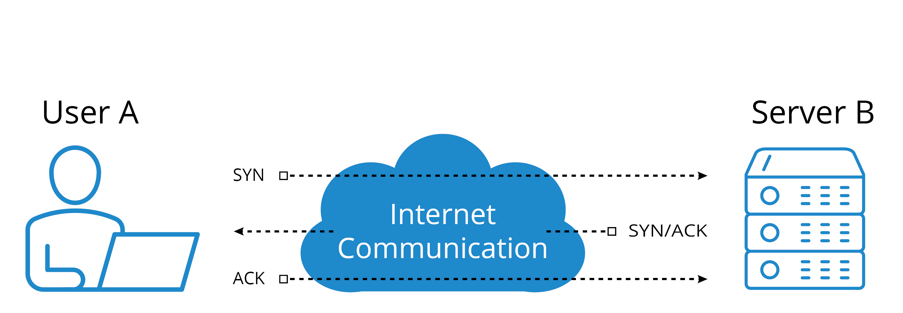
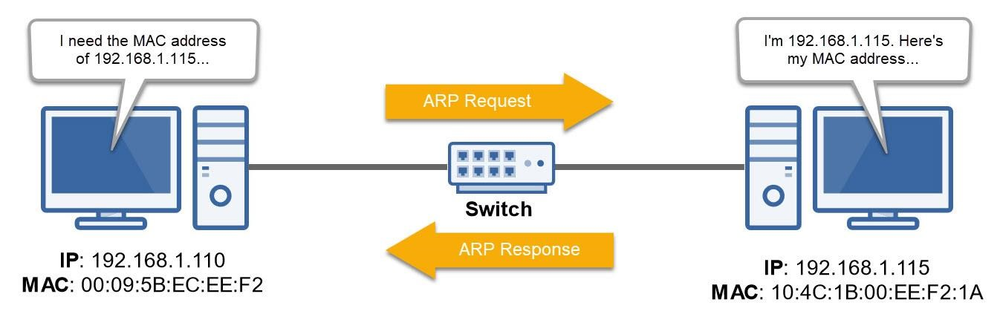

# Common Network Protocols And Ports

## Overview

Protocol là bộ quy tắc để các hệ thống trao đổi dữ liệu. Port giúp multiplex nhiều service trên cùng một IP. Khi troubleshoot, cần tách rõ:

- Protocol đang dùng là gì?
- Chạy trên TCP hay UDP?
- Port nào đang listen?
- Client có connect được tới port đó không?
- Application protocol có trả response hợp lệ không?

## TCP Và UDP

| Tiêu chí | TCP | UDP |
| --- | --- | --- |
| Connection | connection-oriented | connectionless |
| Reliability | có sequence, ACK, retransmission | best effort |
| Ordering | đảm bảo thứ tự stream | application tự xử lý nếu cần |
| Overhead | cao hơn | thấp hơn |
| Ví dụ | HTTP, HTTPS, SSH, SMTP | DNS, NTP, VoIP, QUIC |

TCP phù hợp khi cần reliable stream. UDP phù hợp khi cần latency thấp, application tự xử lý retry hoặc mất gói chấp nhận được.

TCP không chỉ là "có kết nối". Nó duy trì trạng thái phiên bằng sequence number, ACK, retransmission và flow control. Khi packet đến sai thứ tự hoặc bị mất, TCP có cơ chế phát hiện và gửi lại phần thiếu; đổi lại latency có thể tăng khi network congestion hoặc packet loss. UDP thì ngược lại: gửi datagram nhanh, ít overhead, nhưng application phải tự chấp nhận mất gói, tự retry hoặc tự kiểm soát thứ tự nếu cần.

## TCP Three-Way Handshake



TCP connection bắt đầu bằng:

```text
Client -> Server: SYN
Server -> Client: SYN/ACK
Client -> Server: ACK
```

Khi debug TCP:

- Không thấy SYN đi ra: client/local firewall/routing.
- SYN đi ra nhưng không có SYN/ACK: network path, firewall, service không listen.
- Có SYN/ACK nhưng connection reset: application, proxy, policy hoặc TLS mismatch.
- Handshake thành công nhưng throughput thấp: kiểm tra retransmission, receive window, congestion, packet loss, MTU và proxy/load balancer ở giữa.

## ARP

ARP map IPv4 address sang MAC address trong cùng Layer 2 segment.



Flow đơn giản:

```text
Host A: Ai có IP 192.168.1.115?
Host B: Tôi có IP đó, MAC của tôi là ...
```

Kiểm tra:

```bash
ip neigh
arp -n
tcpdump -ni <interface> arp
```

Nếu ARP lỗi trong cùng subnet, hãy kiểm tra VLAN, port isolation, duplicate IP, local firewall hoặc bridge/OVS rule.

## Common Protocols

| Protocol | Port | TCP/UDP | Vai trò |
| --- | ---: | --- | --- |
| DNS | 53 | UDP/TCP | resolve name sang IP |
| DHCP | 67/68 | UDP | cấp IP/gateway/DNS động |
| NTP | 123 | UDP | đồng bộ thời gian |
| SNMP | 161/162 | UDP | monitoring/network management |
| LDAP | 389 | TCP/UDP | directory service |
| LDAPS | 636 | TCP | LDAP qua TLS |
| SMB | 445 | TCP | file sharing Windows/Samba |
| SSH | 22 | TCP | remote shell/tunnel/SFTP |
| Telnet | 23 | TCP | remote shell không mã hóa, tránh dùng production |
| RDP | 3389 | TCP/UDP | remote desktop |
| FTP | 20/21 | TCP | file transfer kiểu cũ |
| SFTP | 22 | TCP | file transfer qua SSH |
| TFTP | 69 | UDP | file transfer đơn giản, hay gặp trong boot/network device |
| SMTP | 25 | TCP | gửi mail server-to-server |
| SMTPS | 465 | TCP | SMTP qua TLS theo cấu hình legacy/implicit TLS |
| POP3 | 110 | TCP | lấy mail kiểu download |
| IMAP | 143 | TCP | truy cập mailbox trên server |
| IMAPS | 993 | TCP | IMAP qua TLS |
| POP3S | 995 | TCP | POP3 qua TLS |
| NetBIOS Session | 139 | TCP | legacy Windows/Samba session service |
| Syslog | 514 | UDP/TCP | log forwarding legacy; production hiện đại thường dùng TCP/TLS port riêng |
| HTTP | 80 | TCP | web không TLS |
| HTTPS | 443 | TCP | web qua TLS |

## Common Server Roles

Một server role là vai trò dịch vụ mà một máy chủ hoặc cụm máy chủ cung cấp cho client. Một host có thể chạy nhiều role, nhưng khi thiết kế production nên tách role theo boundary vận hành, bảo mật, scaling và failure domain.

| Server role | Protocol thường gặp | Vai trò | Ghi chú vận hành |
|---|---|---|---|
| Web server | HTTP/HTTPS | Phục vụ website, API, static content hoặc reverse proxy endpoint | Cần TLS, access log, health check, capacity và WAF/proxy nếu expose Internet. |
| Mail server | SMTP, IMAP, POP3 | Gửi, nhận và lưu/truy cập email | Cần DNS MX/SPF/DKIM/DMARC, queue monitoring và anti-spam policy. |
| DNS server | DNS UDP/TCP 53 | Resolve domain name sang IP hoặc phục vụ authoritative zone | DNS lỗi có thể làm app giống như down dù service vẫn chạy. |
| Proxy server | HTTP/HTTPS, SOCKS | Trung gian giữa client và Internet/service backend | Có thể filter, cache, hide internal IP, enforce policy và ghi log truy cập. |
| FTP/SFTP server | FTP, SFTP | Upload/download file | FTP không mã hóa; ưu tiên SFTP/FTPS trong môi trường nhạy cảm. |
| Origin server | HTTP/HTTPS | Nơi giữ nội dung gốc phía sau CDN/edge | Nên giới hạn access từ edge/CDN, bảo vệ cache purge và origin credential. |

Khi troubleshoot, đừng chỉ hỏi "server có sống không". Hãy hỏi đúng lớp:

1. DNS có resolve đúng IP không?
2. Route/firewall/security policy có cho traffic tới server không?
3. Port có listen không?
4. Protocol-level response có hợp lệ không?
5. Log ứng dụng có lỗi auth, TLS, backend dependency hoặc rate limit không?

## Port, Socket Và Process

Kiểm tra service listen:

```bash
ss -lntup
```

Kiểm tra connect TCP:

```bash
nc -vz <host> <port>
```

Kiểm tra HTTP/HTTPS:

```bash
curl -v http://example.com
curl -vk https://example.com
```

Packet capture theo port:

```bash
tcpdump -ni <interface> host <ip> and port <port>
```

## Production Notes

- Telnet, FTP và HTTP không mã hóa; chỉ dùng khi có lý do rõ hoặc trong lab.
- DNS có thể dùng UDP hoặc TCP; zone transfer và response lớn thường cần TCP.
- Firewall stateful có thể cho phép reply traffic dù inbound rule nhìn không rõ ràng.
- Một port open không chứng minh application đúng; cần kiểm tra protocol-level response.
- Time drift làm hỏng TLS, Kerberos, token validation và distributed systems.

## Related Pages

- [Addressing, Ports And Sockets](../01-foundations/03-addressing-ports-and-sockets.md)
- [DNS, DHCP And Core Network Protocols](./02-dns-dhcp-and-core-protocols.md)
- [HTTP Và Web Application Operations](./06-http-web-application-operations.md)
- [NTP And Time Synchronization](./05-ntp-time-synchronization.md)
- [Network Troubleshooting Tools](../07-network-operations-lifecycle/03-network-troubleshooting-tools.md)
