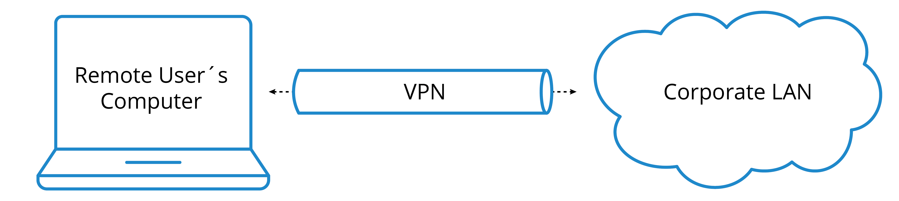
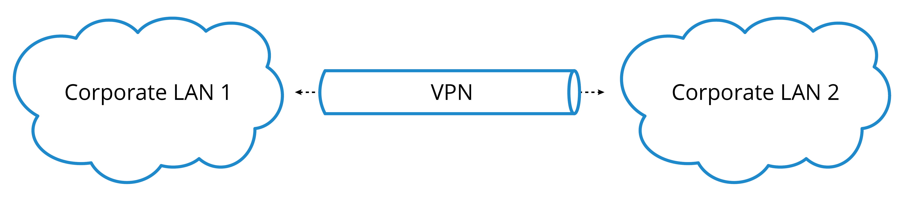

# Proxy, Load Balancer, VPN And Expose Endpoints

## Overview

Proxy, reverse proxy, load balancer, VPN và tunnel đều là các lớp trung gian điều khiển đường đi của traffic. Điểm khác nhau nằm ở phía chúng bảo vệ và kiểu kết nối chúng tạo ra.

## Forward Proxy

Forward proxy nằm phía client/user network. Client gửi request tới proxy, proxy thay client đi ra Internet hoặc tới service bên ngoài.

Use case:

- Kiểm soát truy cập Internet cho user nội bộ.
- Ghi log, audit, URL filtering.
- Cache nội dung phổ biến.
- Ẩn IP client thật ở một mức nhất định.

```text
Client -> Forward Proxy -> Internet
```

Forward proxy không tự tạo anonymity hoàn chỉnh. Proxy operator vẫn có thể thấy source nội bộ, destination, thời gian truy cập và một phần metadata; nếu traffic không được mã hóa end-to-end, proxy hoặc đường tới proxy còn có thể đọc payload. Trong môi trường doanh nghiệp, proxy nên được xem là control để enforce policy và audit, không phải công cụ che giấu trách nhiệm vận hành.

## Reverse Proxy

Reverse proxy nằm phía server. Client từ Internet chỉ nhìn thấy reverse proxy, còn backend thật nằm phía sau.

Use case:

- TLS termination.
- Route theo hostname/path/header.
- Caching.
- Rate limit.
- Che giấu backend internal.
- Ghi access log và thêm security header.

```text
Internet -> Reverse Proxy -> Backend service
```

Ví dụ phổ biến: Nginx, HAProxy, Traefik, Envoy, cloud/application load balancer.

## HTTPS Termination Va Backend HTTP

Mot pattern pho bien la terminate TLS o reverse proxy, sau do proxy request ve backend HTTP nam tren localhost/private network:

```text
Client HTTPS
-> Nginx/HAProxy/Envoy terminates TLS
-> backend HTTP service on localhost/private subnet
```

Pattern nay huu ich cho app legacy khong tu ho tro TLS, nhung production can:

- khong expose backend HTTP truc tiep ra Internet;
- truyen dung `Host`, `X-Forwarded-For`, `X-Forwarded-Proto` neu app can;
- cau hinh timeout/body size phu hop workload;
- health check backend that, khong chi check proxy process;
- theo doi access log va error log cua proxy.

`502 Bad Gateway` thuong la dau hieu proxy da nhan request nhung upstream/backend khong san sang, sai port, sai DNS, bi firewall chan, hoac app crash. Khi debug, kiem tra backend listener truoc khi sua TLS.

## Load Balancer

Load balancer phân phối request/connection tới nhiều backend để tăng availability và capacity.

| Loại | Hành vi |
|---|---|
| L4 load balancer | Forward TCP/UDP theo IP/port, ít hiểu application |
| L7 load balancer | Hiểu HTTP/TLS metadata, route theo host/path/header/cookie |

Health check là phần bắt buộc. Không có health check tốt, load balancer có thể gửi traffic tới backend đã lỗi hoặc loại backend khỏe vì check sai.

## Cloud LB, Ingress And Internal Reverse Proxy

```text
Internet
  -> Cloud Load Balancer
  -> Ingress Controller / Reverse Proxy
  -> Service / Pod / Backend
```

Trong Kubernetes, Ingress Controller là reverse proxy chuyên dụng để route request vào service. Cloud LB thường nhận traffic public trước, còn Ingress xử lý logic HTTP nội bộ.

## VPN Overlay

VPN tạo private path giữa user/site và service:

```text
User/Site -> VPN tunnel -> Private network/service
```

Remote access VPN nối một user/device từ xa vào network nội bộ hoặc private service:



Site-to-site VPN nối hai network/site với nhau, thường dùng cho branch, partner, datacenter hoặc cloud VPC/VNet:



Use case:

- Remote access.
- Site-to-site connectivity.
- Truy cập admin dashboard không public Internet.
- Kết nối lab/private cloud.

Ví dụ: WireGuard, IPsec, OpenVPN, Tailscale, ZeroTier.

Phân biệt các lớp:

- VPN tạo tunnel và mã hóa traffic đi qua tunnel.
- Routing quyết định prefix nào đi vào tunnel.
- Firewall/ACL quyết định ai được truy cập resource nào sau khi vào tunnel.
- Identity/MFA quyết định user/device nào được phép tạo phiên VPN.

Các protocol phổ biến có trade-off khác nhau. IPsec thường gặp trong site-to-site và network appliance; OpenVPN linh hoạt, dựa trên TLS và hay dùng cho remote access; WireGuard gọn, hiệu năng tốt, nhưng vẫn cần thiết kế key rotation, peer inventory và route policy rõ. Không chọn protocol chỉ theo tên; chọn theo client support, vận hành key/cert, observability, HA và khả năng rollback.

Production guardrails cho VPN:

- Bật MFA cho remote access và gắn quyền theo role/device posture.
- Ghi log connect/disconnect, source IP, user, device và prefix được cấp.
- Kiểm soát split tunnel: nếu bật, biết rõ traffic nào đi qua VPN và traffic nào đi thẳng Internet.
- Không coi VPN là boundary duy nhất; resource nội bộ vẫn cần firewall, least privilege và audit.
- Trước khi thay route/VPN policy, có console hoặc out-of-band path vì lỗi route có thể làm mất SSH/admin access.
- Validate sau thay đổi bằng route table, DNS nội bộ, reachability tới service mẫu và log deny/allow ở firewall.

## Expose Local Endpoint

Expose local endpoint là đưa service đang chạy ở `127.0.0.1` hoặc private network ra một URL có thể truy cập từ bên ngoài.

```text
Internet
  -> Public URL / DNS
  -> Gateway / Reverse Proxy
  -> Tunnel / Port Forward / VPN
  -> Local service
```

Reverse tunnel hữu ích khi máy local nằm sau NAT/firewall và không thể mở inbound:

```text
Local machine ---> Tunnel server <--- Internet user
```

Ví dụ công cụ: `ssh -R`, cloudflared tunnel, ngrok, FRP.

## Security Checklist

- Luôn dùng TLS cho endpoint public.
- Có authentication: OAuth, mTLS, Basic Auth có kiểm soát, identity-aware proxy hoặc VPN.
- Không expose database/admin dashboard trực tiếp ra Internet.
- Dùng IP allowlist hoặc policy theo identity khi có thể.
- Bật access log, rate limit và request size limit.
- Tunnel tạm thời cần TTL và owner rõ ràng.
- Kiểm tra secret/token trong URL/log trước khi chia sẻ.

## Troubleshooting Checklist

Kiểm tra local service có listen và trả lời:

```bash
ss -lntp | grep ':4000'
curl -v http://127.0.0.1:4000
```

Kiểm tra DNS public và TLS/HTTP path:

```bash
dig demo.example.com
curl -vk https://demo.example.com
```

Tách lỗi theo đoạn:

1. DNS.
2. TLS/SNI/certificate.
3. Public load balancer.
4. Reverse proxy route.
5. Tunnel/VPN health.
6. Backend listener.
7. Application log.

## Related Pages

- [Common Network Protocols And Ports](./01-common-network-protocols-and-ports.md)
- [HTTP Và Web Application Operations](./06-http-web-application-operations.md)
- [Network Troubleshooting Tools](../07-network-operations-lifecycle/03-network-troubleshooting-tools.md)
- [Network Services, NAT And QoS](../06-ccna-advanced-networking-and-security/01-network-services-nat-and-qos.md)
