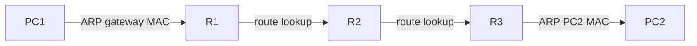

# Routing, Packet Life And IPv4 Subnetting

## Overview

Routing là quá trình đưa packet từ subnet này sang subnet khác. IPv4 addressing và subnetting là nền để router biết network nào là local, network nào cần next hop, và route nào cụ thể hơn.

## Host Sending Logic

Khi một host muốn gửi packet, nó không "hỏi router" ngay lập tức. Nó quyết định theo subnet mask:

1. Nếu destination IP cùng subnet, host gửi frame đến MAC của destination.
2. Nếu destination IP khác subnet, host gửi frame đến MAC của default gateway.
3. ARP được dùng để tìm MAC trong local broadcast domain.
4. Router nhận frame, bỏ Ethernet header cũ, đọc IP packet, tra routing table, rồi đóng gói lại frame mới ở interface outbound.



## Routing Table

Routing table trả lời câu hỏi: destination network này đi ra đâu?

Một route có các thành phần chính:

- destination prefix, ví dụ `10.10.20.0/24`;
- next hop hoặc exit interface;
- source/protocol của route: connected, static, OSPF, etc.;
- administrative distance để so độ tin cậy giữa route source;
- metric để chọn route tốt nhất trong cùng routing protocol.

Longest prefix match luôn là nguyên tắc quan trọng: route cụ thể hơn thắng route tổng quát hơn.

Ví dụ: destination `10.10.20.50` sẽ chọn `10.10.20.0/24` thay vì `10.10.0.0/16` nếu cả hai cùng tồn tại.

## Static And Default Routes

Static route phù hợp cho mạng nhỏ, route ổn định hoặc default path ra upstream.

```text
ip route 10.20.0.0 255.255.0.0 10.0.0.2
ip route 0.0.0.0 0.0.0.0 10.0.0.254
```

Default route là route cuối cùng khi không có prefix cụ thể hơn. Với host, default gateway là cách diễn đạt tương tự ở endpoint.

Floating static route dùng administrative distance cao hơn để làm backup cho route động hoặc static chính.

## Life Of A Packet

Điểm dễ nhầm: IP source/destination thường giữ nguyên end-to-end, nhưng MAC source/destination thay đổi ở từng hop Layer 2.

Qua mỗi router:

- router nhận Ethernet frame từ link trước;
- kiểm tra FCS ở Layer 2;
- bỏ frame header/trailer;
- giảm TTL trong IP header;
- tra route;
- đóng gói packet vào frame mới với MAC next hop;
- gửi ra interface outbound.

Khi debug, đừng chỉ hỏi "IP đúng chưa"; hãy hỏi thêm "MAC next hop đúng chưa" và "VLAN/local segment đúng chưa".

## IPv4 Addressing

IPv4 address dài 32 bit, thường viết dạng dotted decimal. Prefix length cho biết bao nhiêu bit là network phần còn lại là host.

Ví dụ:

```text
192.168.10.34/24
network:   192.168.10.0
broadcast: 192.168.10.255
usable:    192.168.10.1 - 192.168.10.254
```

Các địa chỉ cần nhớ:

- network address: định danh subnet, không gán cho host;
- broadcast address: gửi tới mọi host trong subnet IPv4;
- usable host range: phần có thể gán cho host/interface;
- private ranges: `10.0.0.0/8`, `172.16.0.0/12`, `192.168.0.0/16`;
- loopback: `127.0.0.0/8`;
- link-local IPv4: `169.254.0.0/16`.

## Subnetting Mental Model

Subnetting là mượn bit từ host portion để tạo nhiều network nhỏ hơn. Cần thành thạo hai chiều:

- từ prefix tính số subnet và host;
- từ yêu cầu số host chọn prefix phù hợp.

Một số mốc nhanh:

| Prefix | Mask | Usable hosts |
|---|---|---:|
| /24 | 255.255.255.0 | 254 |
| /25 | 255.255.255.128 | 126 |
| /26 | 255.255.255.192 | 62 |
| /27 | 255.255.255.224 | 30 |
| /28 | 255.255.255.240 | 14 |
| /29 | 255.255.255.248 | 6 |
| /30 | 255.255.255.252 | 2 |
| /32 | 255.255.255.255 | 1 host route |

## FLSM And VLSM

FLSM dùng cùng prefix cho mọi subnet. Nó dễ tính nhưng dễ lãng phí.

VLSM dùng nhiều prefix khác nhau theo nhu cầu từng segment. Cách làm thực tế:

1. Liệt kê LAN/WAN cần cấp IP.
2. Sắp xếp từ nhu cầu host lớn nhất đến nhỏ nhất.
3. Cấp subnet lớn trước, nhỏ sau.
4. Giữ biên rõ ràng để route summarization dễ hơn nếu có thể.
5. Ghi lại network, usable range và broadcast.

## Troubleshooting Checklist

- Host có đúng IP/mask/gateway không?
- Destination cùng subnet hay khác subnet theo mask của host?
- ARP table có MAC của destination/gateway không?
- Router có connected route cho subnet local không?
- Static/default route có next hop reachable không?
- Có route cụ thể hơn đang override default route không?
- ACL/firewall có chặn ICMP/TCP/UDP làm bạn hiểu sai routing không?
