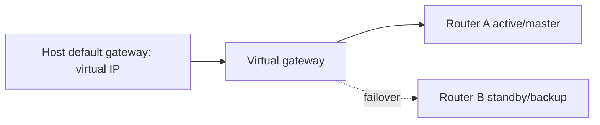

# Dynamic Routing, FHRP, IPv6, TCP/UDP And ACL

## Overview

Phần cuối của CCNA Volume 1 chuyển từ nền tảng sang các protocol giúp network thích nghi, chịu lỗi và kiểm soát traffic: dynamic routing, OSPF, first-hop redundancy, IPv6, TCP/UDP và access control list.

## Dynamic Routing

Static route đơn giản nhưng không scale tốt khi topology lớn hoặc thay đổi thường xuyên. Dynamic routing cho router trao đổi thông tin và tự cập nhật routing table.

Khi so route, cần nhớ hai khái niệm:

- Administrative distance so độ tin cậy giữa các nguồn route khác nhau.
- Metric so đường tốt nhất trong cùng một routing protocol.

Route selection thường đi theo thứ tự:

1. Longest prefix match.
2. Administrative distance thấp hơn.
3. Metric tốt hơn trong cùng protocol.

## OSPF

OSPF là link-state IGP. Mỗi router xây Link-State Database, chạy SPF để tính shortest path tree, rồi đưa route tốt nhất vào routing table.

Các điểm cần nắm:

- Router ID định danh router trong OSPF domain.
- Neighbor hình thành khi thông số OSPF tương thích.
- Area giúp scale LSDB; area 0 là backbone.
- Cost là metric chính, thường dựa trên bandwidth tham chiếu.
- Passive interface vẫn quảng bá network nhưng không gửi hello ra interface đó.
- Default route có thể được quảng bá từ edge router khi thiết kế yêu cầu.

```text
router ospf 1
 router-id 1.1.1.1
 network 10.0.0.0 0.255.255.255 area 0
 passive-interface default
 no passive-interface GigabitEthernet0/1
```

Checklist debug OSPF:

- interface có cùng subnet không?
- area ID có khớp không?
- hello/dead timer có khớp không?
- authentication có khớp không?
- MTU mismatch có làm adjacency kẹt không?
- network type có phù hợp không?
- route có vào LSDB nhưng bị route tốt hơn override không?

## First Hop Redundancy Protocols

Host thường chỉ có một default gateway. Nếu gateway đó chết, host mất đường ra ngoài dù còn router khác. FHRP giải quyết bằng virtual IP/MAC cho default gateway.

Các FHRP phổ biến:

- HSRP: Cisco proprietary, active/standby.
- VRRP: standard, master/backup.
- GLBP: Cisco proprietary, có cơ chế load sharing gateway.

Mental model:



## IPv6 Addressing

IPv6 dài 128 bit, viết dạng hexadecimal, chia bằng dấu `:`. Cần thành thạo rút gọn:

- bỏ leading zero trong từng hextet;
- dùng `::` một lần để thay chuỗi hextet toàn zero dài nhất;
- prefix length thay subnet mask dotted decimal.

Các loại địa chỉ cần nhớ:

- Global unicast: routable trên Internet, thường bắt đầu vùng `2000::/3`.
- Link-local: dùng trong local link, thường `fe80::/10`, luôn cần cho neighbor/router discovery.
- Multicast: `ff00::/8`.
- Anycast: cùng một địa chỉ gán cho nhiều node, routing đưa tới node gần nhất theo topology.
- Loopback: `::1`.
- Unspecified: `::`.

## IPv6 NDP And Routing

IPv6 không dùng ARP. Neighbor Discovery Protocol dùng ICMPv6 để làm address resolution, router discovery và Duplicate Address Detection.

Các thao tác cần hiểu:

- Neighbor Solicitation/Advertisement thay cho ARP request/reply.
- Router Solicitation/Advertisement giúp host tìm router và prefix.
- Solicited-node multicast giảm nhu cầu broadcast.

IPv6 static route có thể dùng global unicast next hop hoặc link-local next hop. Nếu dùng link-local next hop, thường phải chỉ rõ exit interface.

```text
ipv6 unicast-routing
ipv6 route 2001:db8:20::/64 2001:db8:12::2
ipv6 route ::/0 GigabitEthernet0/1 fe80::2
```

## TCP And UDP

Layer 4 thêm khái niệm port để nhiều application cùng dùng một IP.

TCP:

- connection-oriented;
- có three-way handshake;
- sequence/acknowledgment;
- retransmission và flow control;
- hợp HTTP(S), SSH, SMTP, database protocol cần reliability.

UDP:

- connectionless;
- overhead thấp;
- không tự đảm bảo delivery/order;
- hợp DNS query, VoIP, streaming, telemetry hoặc protocol tự xử lý reliability.

Khi debug, cần phân biệt "IP route tới được" với "port/service dùng được". Ping ICMP thành công không chứng minh TCP port mở.

## Standard ACL

Standard ACL match chủ yếu theo source IPv4. Vì ít tiêu chí, nó thường nên đặt gần destination để tránh chặn nhầm traffic tới các đích khác.

```text
ip access-list standard BLOCK-GUEST
 deny 10.10.30.0 0.0.0.255
 permit any
interface GigabitEthernet0/1
 ip access-group BLOCK-GUEST out
```

ACL có implicit deny ở cuối. Nếu không có permit phù hợp, traffic bị chặn.

## Extended ACL

Extended ACL match protocol, source, destination và port. Vì cụ thể hơn, thường đặt gần source để chặn sớm traffic không mong muốn.

```text
ip access-list extended ALLOW-WEB
 permit tcp 10.10.10.0 0.0.0.255 host 10.10.20.10 eq 443
 deny ip any any log
interface GigabitEthernet0/10
 ip access-group ALLOW-WEB in
```

Các lỗi ACL phổ biến:

- quên implicit deny;
- wildcard mask ngược với subnet mask;
- apply sai direction;
- đặt standard ACL quá gần source làm chặn rộng;
- thứ tự ACE sai, deny/permit cụ thể bị dòng trước bắt mất;
- chỉnh ACL production không có rollback.

## Troubleshooting Checklist

- Routing table có route đúng và cụ thể nhất không?
- OSPF neighbor đạt full adjacency chưa?
- FHRP active/standby có đúng priority và tracking không?
- IPv6 interface có link-local không?
- NDP có resolve được neighbor không?
- TCP port có listen không, hay chỉ ICMP ping được?
- ACL hit count có tăng ở dòng deny/permit nào?
- Direction ACL là inbound hay outbound so với interface?
