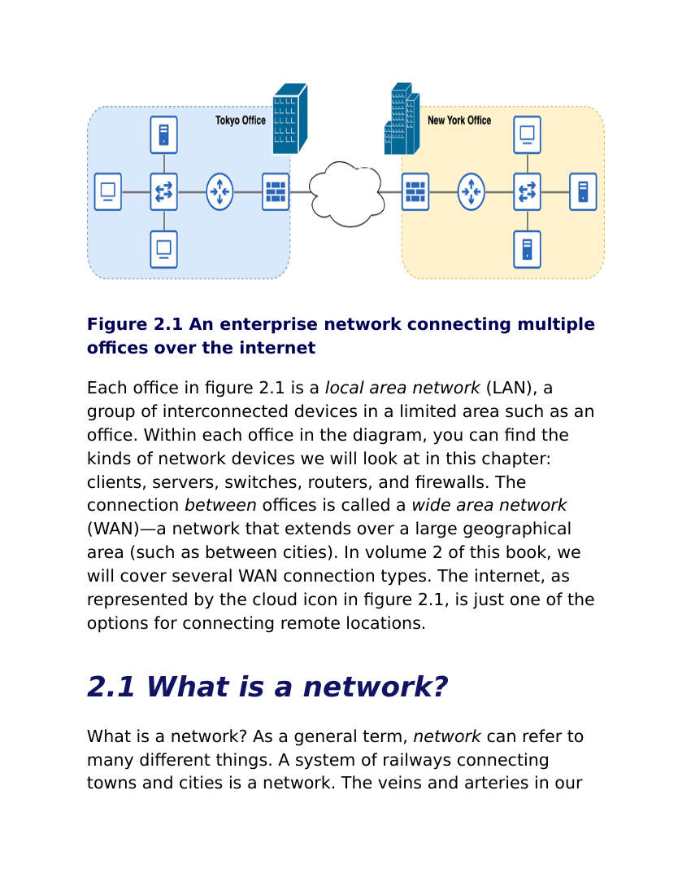
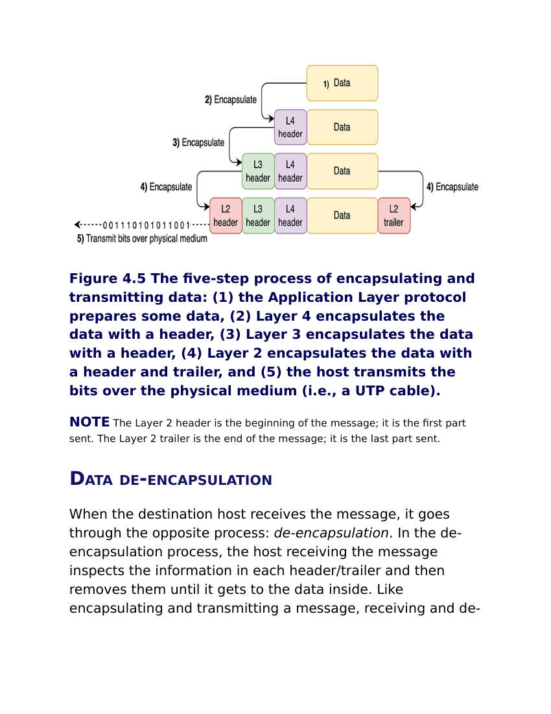
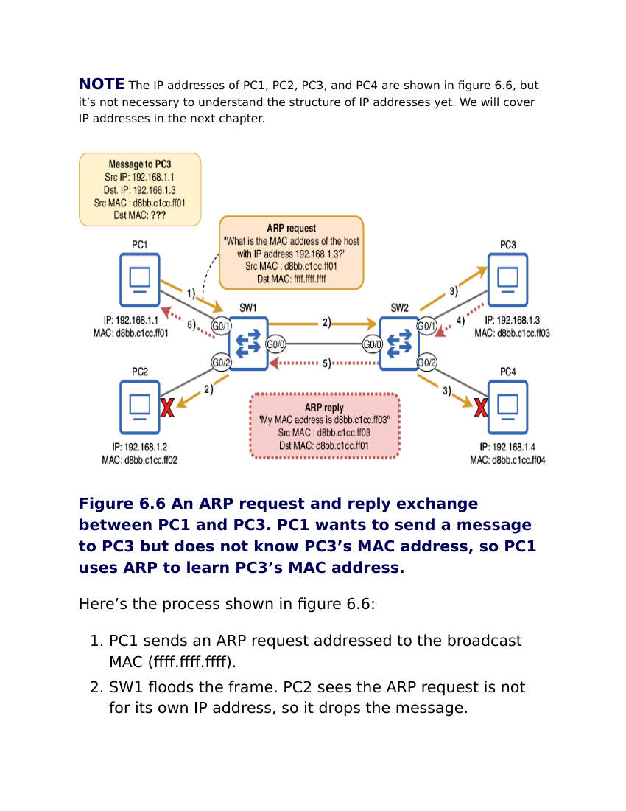
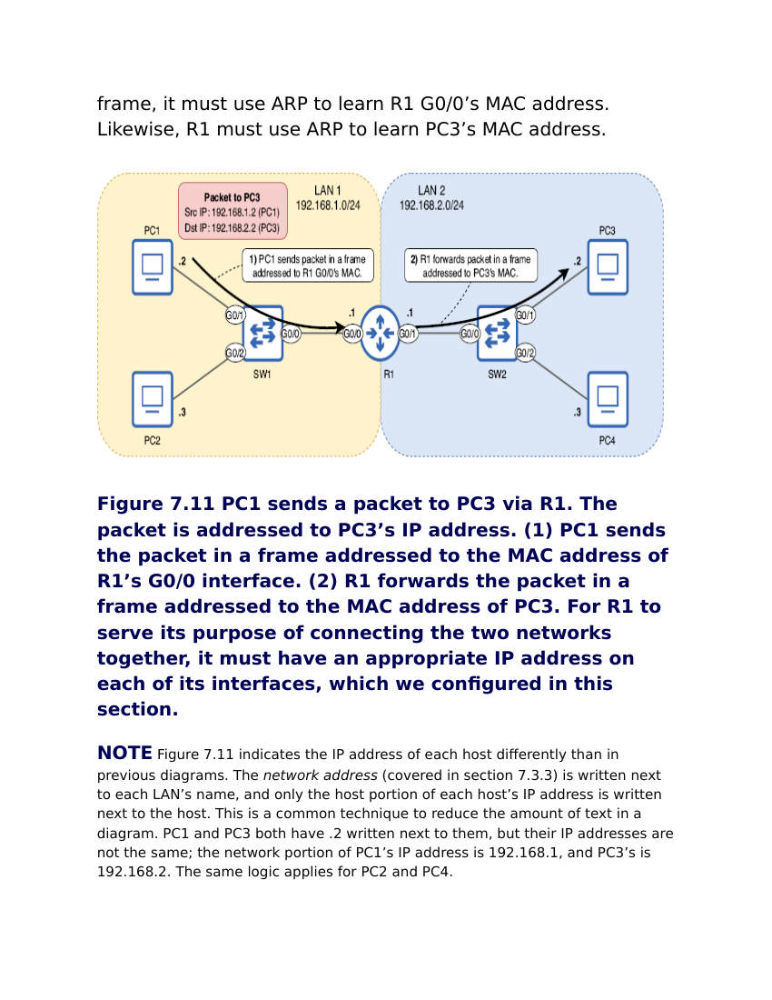
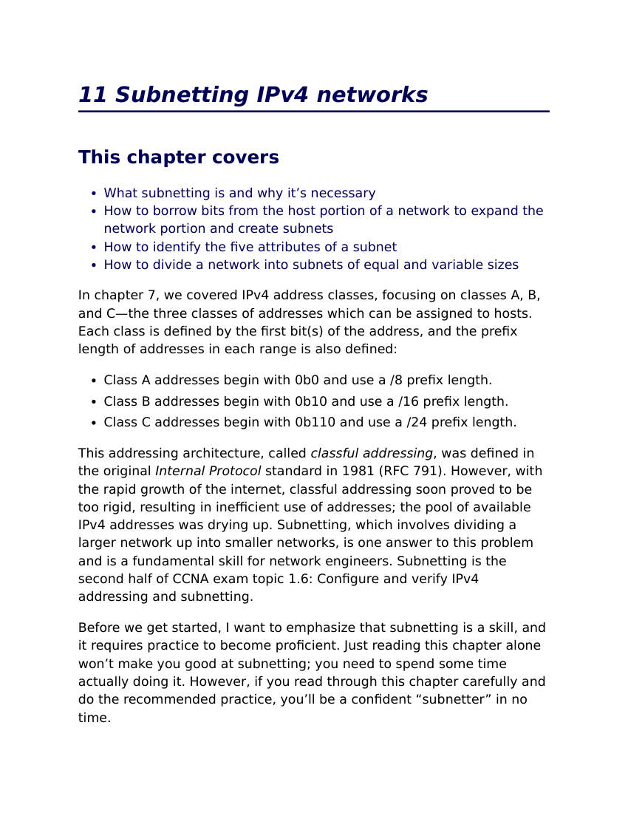
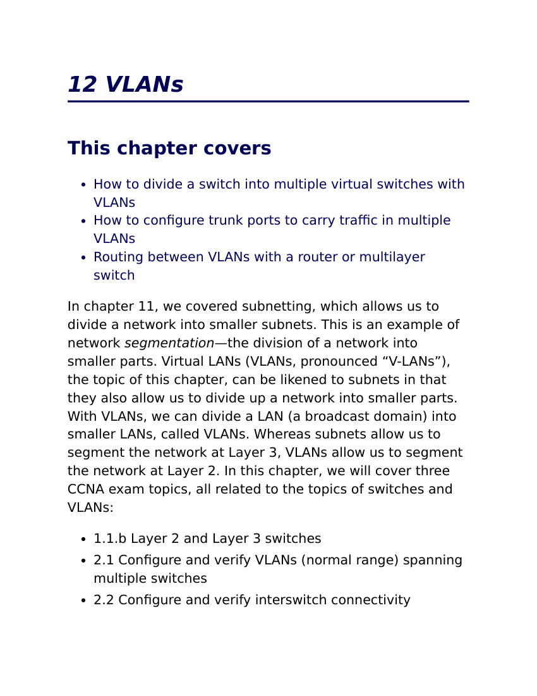
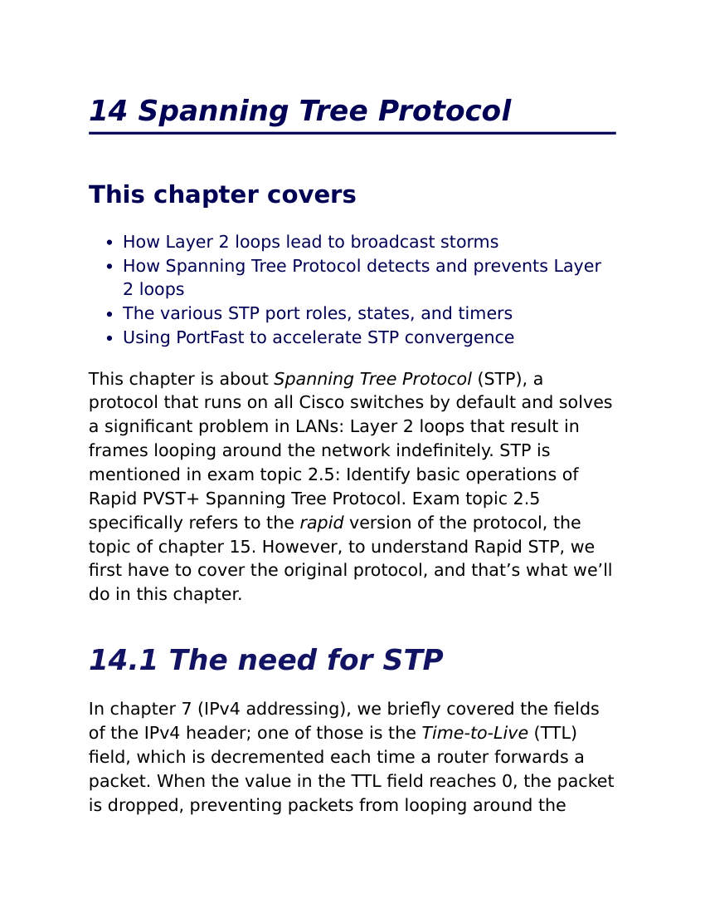
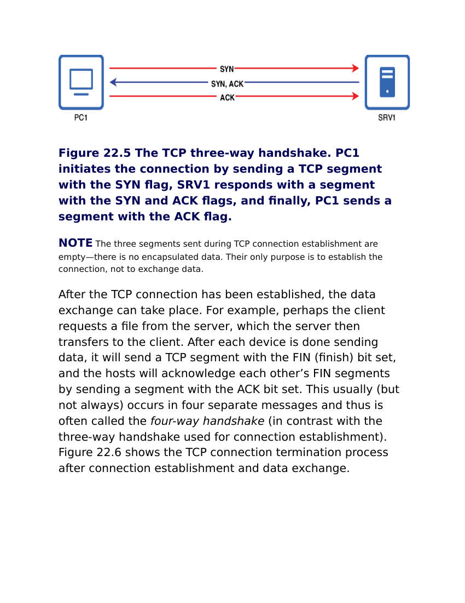
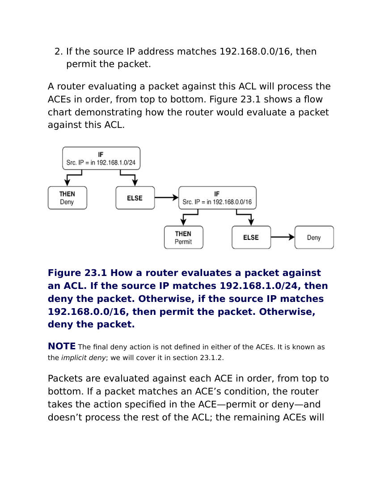

# CCNA Fundamentals And Protocols Knowledge Notes

## Overview

Bộ note này đúc kết từ `_inbox/Acing_the_CCNA_Exam_Volume_1_Fundamentals_and_Protocols_Jeremy_McDowell.docx`. File DOCX là bản convert theo từng trang ảnh, nhưng có OCR text trong mô tả ảnh, nên nội dung chính có thể đọc và chuyển hóa được.

Mục tiêu của cụm note này không phải thay thế sách luyện thi. Nó biến kiến thức CCNA Volume 1 thành bản đồ học networking nền tảng: hiểu thiết bị, media, OSI/TCP/IP, Ethernet, IPv4, routing, subnetting, VLAN, STP/RSTP, EtherChannel, OSPF, FHRP, IPv6, TCP/UDP và ACL.

## Knowledge Map

- [Network Fundamentals, Devices, Media, Models And IOS](./01-network-fundamentals-devices-media-models-ios.md)
- [Routing, Packet Life And IPv4 Subnetting](./02-routing-packet-life-and-ipv4-subnetting.md)
- [Layer 2, VLAN, STP, RSTP And EtherChannel](./03-layer2-vlan-stp-rstp-and-etherchannel.md)
- [Dynamic Routing, FHRP, IPv6, TCP/UDP And ACL](./04-dynamic-routing-fhrp-ipv6-tcp-udp-and-acl.md)

## Selected Original Visuals

Các ảnh dưới đây là page snapshot gốc được trích chọn lọc từ DOCX, ưu tiên trang có sơ đồ/flow quan trọng.

| Topic | Image |
|---|---|
| Enterprise network and LAN/WAN view |  |
| Encapsulation process |  |
| ARP request/reply |  |
| Packet forwarding via router |  |
| IPv4 subnetting practice area |  |
| VLAN chapter starting topology |  |
| STP chapter starting topology |  |
| TCP three-way handshake |  |
| ACL decision flow |  |

## Reading Strategy

Đọc theo thứ tự nếu nền tảng còn yếu:

1. Thiết bị, cáp, OSI/TCP/IP và IOS CLI.
2. IPv4, routing table, đường đi của packet và subnetting.
3. VLAN, trunk, STP/RSTP và EtherChannel.
4. OSPF, FHRP, IPv6, TCP/UDP và ACL.

Nếu đã có kinh nghiệm vận hành, dùng cụm note này như checklist ôn: mỗi mục phải trả lời được "nó giải quyết vấn đề gì", "nó hoạt động ở layer nào", "lệnh kiểm tra là gì" và "lỗi thường gặp là gì".

## Related Pages

- [Network Overview](../Overview.md)
- [OSI, TCP/IP And Encapsulation](../01-foundations/02-osi-tcpip-and-encapsulation.md)
- [Ethernet, Media, Topologies And Layer 2](../02-ethernet-switching/01-ethernet-media-topologies-and-layer2.md)
- [IPv4 Addressing And Subnetting](../03-ip-routing-subnetting/01-ipv4-addressing-and-subnetting.md)
- [Common Network Protocols And Ports](../04-protocols-and-services/01-common-network-protocols-and-ports.md)
