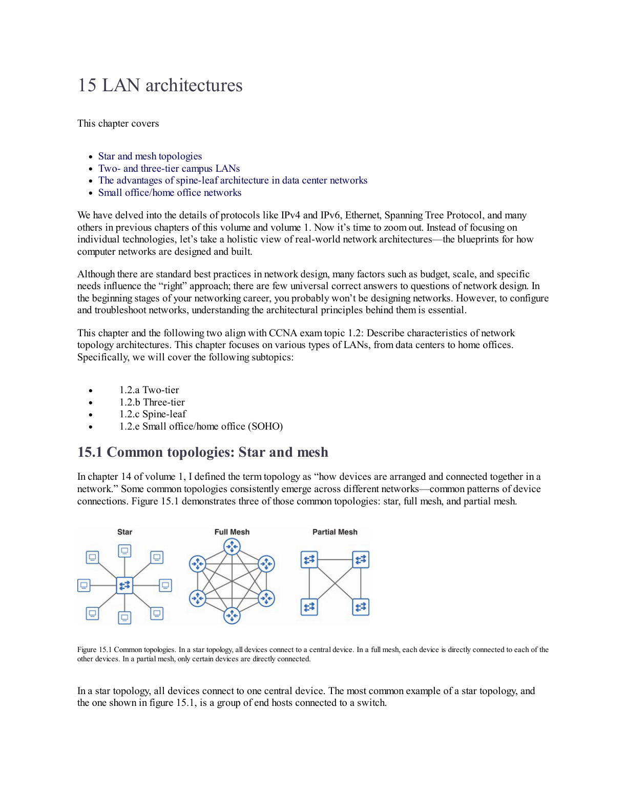

# LAN, WAN, Virtualization And Cloud Architectures

## Overview

Architecture giúp bạn nhìn network không chỉ là từng command. CCNA Volume 2 gom ba nhóm lớn: campus/data center LAN, WAN/VPN, và abstraction hiện đại như virtualization, VRF, container, cloud.

## Campus LAN Architecture

Thiết kế campus thường dùng mô hình phân lớp:

- Access layer: nơi endpoint/AP/IP phone/server access kết nối vào.
- Distribution layer: policy boundary, inter-VLAN routing, summarization, redundancy.
- Core layer: chuyển tiếp tốc độ cao giữa distribution block.

Hai-tier collapsed core gộp core và distribution, hợp mạng vừa/nhỏ. Three-tier tách rõ access, distribution, core, hợp mạng lớn hơn.

Nguyên tắc thực tế:

- access layer cần security control như 802.1X, Port Security, DHCP Snooping, DAI;
- distribution là nơi tốt để đặt routing, ACL, FHRP, route summarization;
- core nên đơn giản, nhanh, ổn định, hạn chế policy phức tạp.

## Data Center Spine-Leaf

Thiết kế data center truyền thống ba tầng dễ tạo oversubscription và đường đi không đều. Spine-leaf tạo topology phẳng hơn:

- mỗi leaf nối tới mọi spine;
- server nối vào leaf;
- east-west traffic có path ngắn và tương đối nhất quán;
- scale bằng cách thêm leaf/spine theo nhu cầu.

Spine-leaf thường kết hợp overlay như VXLAN EVPN trong data center hiện đại, nhưng ở mức CCNA cần nắm mental model: leaf là access cho endpoint/server, spine là fabric forwarding trung tâm.

## WAN Architecture

WAN nối nhiều site qua khoảng cách xa. Các lựa chọn có trade-off:

- leased line/MPLS: predictable hơn nhưng tốn chi phí;
- internet broadband: rẻ, rộng, nhưng cần bảo mật/chất lượng bổ sung;
- cellular 4G/5G: backup hoặc site tạm;
- redundant internet connections: tăng availability nhưng cần routing/failover rõ.

SD-WAN thường dùng nhiều underlay khác nhau và tạo overlay tunnel được controller quản lý.

## VPN

VPN tạo kênh bảo mật trên network không tin cậy.

- Site-to-site VPN thường dùng IPsec để nối site với site.
- Remote access VPN thường dùng TLS/SSL hoặc IPsec để user truy cập từ xa.

Không nhầm VPN với routing. VPN tạo tunnel và bảo mật; routing quyết định prefix nào đi vào tunnel.

## Virtualization And Containers

Virtual machine ảo hóa cả OS, có hypervisor quản lý tài nguyên. Container chia sẻ kernel của host, nhẹ hơn, khởi động nhanh hơn, nhưng isolation khác VM.

Trong hạ tầng hiện đại, network phải phục vụ cả hai:

- VM cần virtual switch, port group, VLAN/overlay;
- container cần bridge/overlay/CNI, service discovery, policy;
- observability phải nhìn được cả physical, virtual và workload layer.

## VRF

VRF cho phép một thiết bị giữ nhiều routing table độc lập. Nó giống như tạo nhiều router logic trên cùng thiết bị vật lý.

Use case:

- tách tenant/customer;
- tách management plane khỏi production;
- overlapping IP address giữa khách hàng;
- segmentation trong campus/data center.

Lưu ý: VRF tách routing table, không tự động tạo firewall policy. Nếu muốn traffic giữa VRF đi qua nhau, cần route leaking hoặc firewall/L3 policy rõ ràng.

## Cloud Computing

Cloud nên được nhìn theo ba trục:

- Essential characteristics: on-demand self-service, broad network access, resource pooling, rapid elasticity, measured service.
- Service models: IaaS, PaaS, SaaS.
- Deployment models: public, private, hybrid, community/multi-cloud tùy ngữ cảnh.

Network engineer cần hiểu cloud networking: VPC/VNet, subnet, route table, security group/NSG, NAT gateway, load balancer, VPN/Direct Connect/ExpressRoute, private endpoint.

## Troubleshooting Checklist

- Lỗi nằm ở access, distribution, core hay WAN edge?
- Topology có loop hoặc asymmetric routing không?
- Redundancy có thật sự test failover chưa?
- VPN tunnel up nhưng route/policy có đúng không?
- VRF đúng routing table chưa?
- Cloud route table/security group/NACL/firewall có cùng cho phép traffic không?
- Overlay có che mất lỗi underlay không?
