# CCNA Advanced Networking And Security Knowledge Notes

## Overview

Bộ note này đúc kết từ `_inbox/Acing_the_CCNA_Exam_Volume_2_Advanced_Networking_and_Security_Jeremy_McDowell.docx`. File DOCX là bản convert theo từng trang ảnh, có OCR text trong mô tả ảnh, nên có thể đọc được nội dung chính và chuyển hóa thành note học.

Volume 2 đi tiếp từ nền tảng Volume 1, tập trung vào các phần vận hành và thiết kế hay gặp trong mạng doanh nghiệp: network services, security controls, network architecture, wireless LAN và network automation.

## Knowledge Map

- [Network Services, NAT And QoS](./01-network-services-nat-and-qos.md)
- [Security Concepts, Port Security, DHCP Snooping And DAI](./02-security-port-security-dhcp-snooping-dai.md)
- [LAN, WAN, Virtualization And Cloud Architectures](./03-lan-wan-virtualization-and-cloud-architectures.md)
- [Wireless LAN Fundamentals, Architectures, Security And WLC](./04-wireless-lan-fundamentals-architectures-security-wlc.md)
- [Network Automation, REST APIs, Data Formats, Ansible And Terraform](./05-network-automation-rest-apis-data-formats-ansible-terraform.md)

## Selected Original Visuals

Các ảnh dưới đây là page snapshot gốc được trích chọn lọc từ DOCX, dùng để giữ lại các sơ đồ/hình minh họa quan trọng. Không trích toàn bộ sách.

| Topic | Image |
|---|---|
| NTP hierarchy | 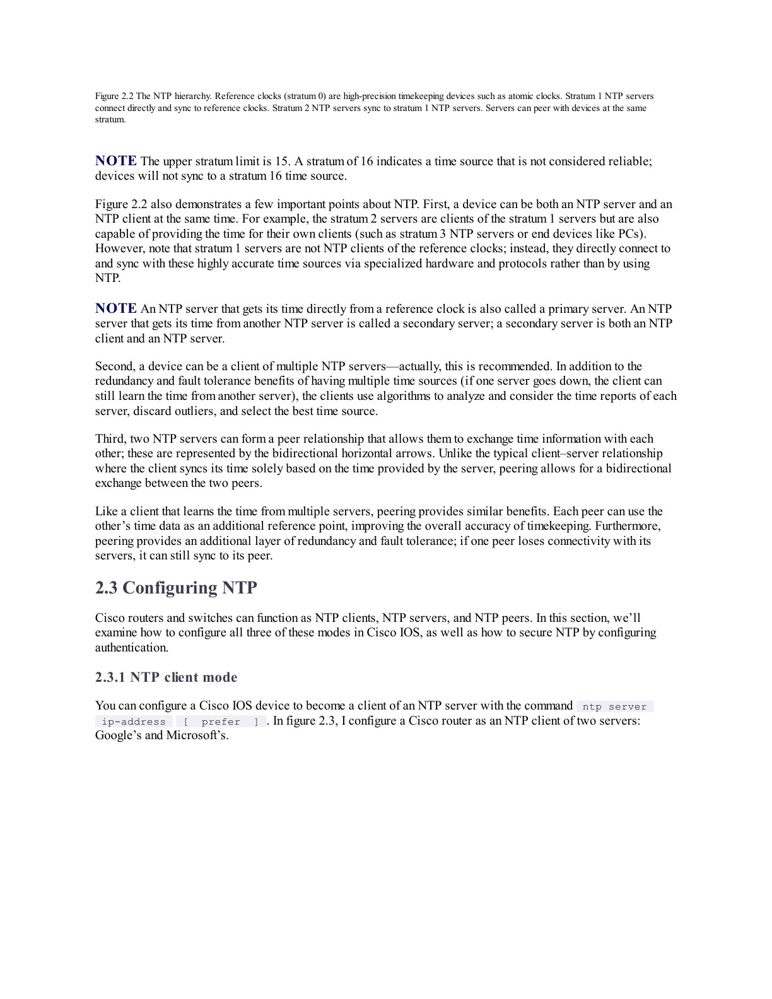 |
| DHCP DORA | 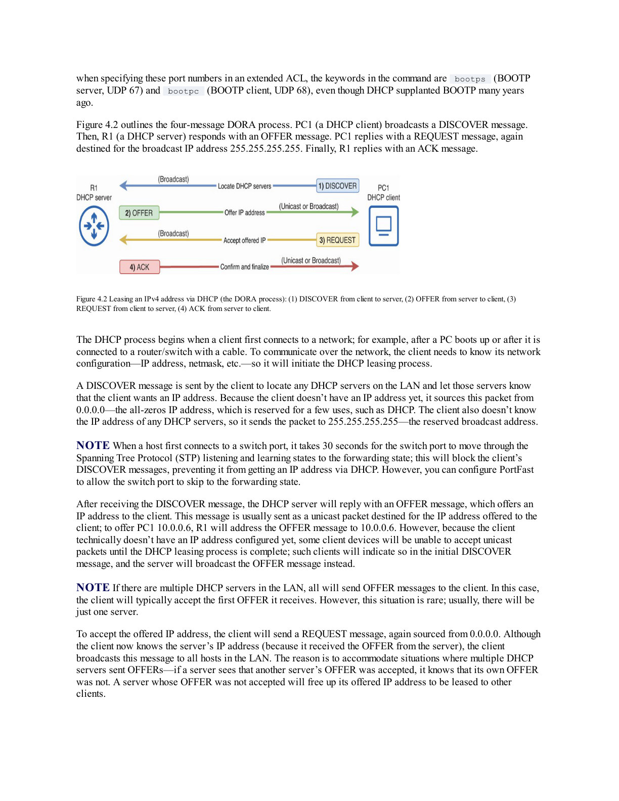 |
| NAT private/public translation | 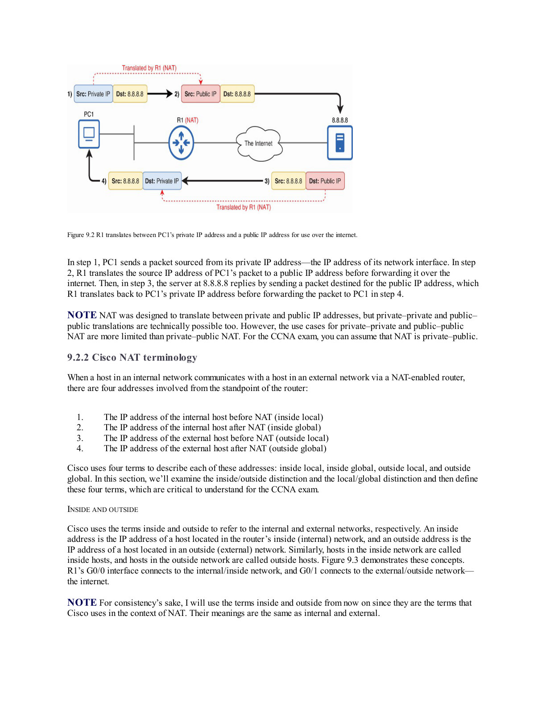 |
| QoS policing and shaping | 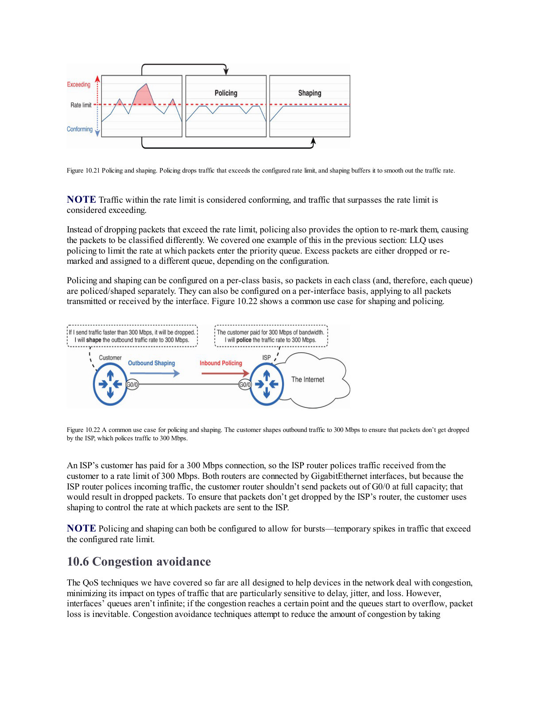 |
| 802.1X access control | 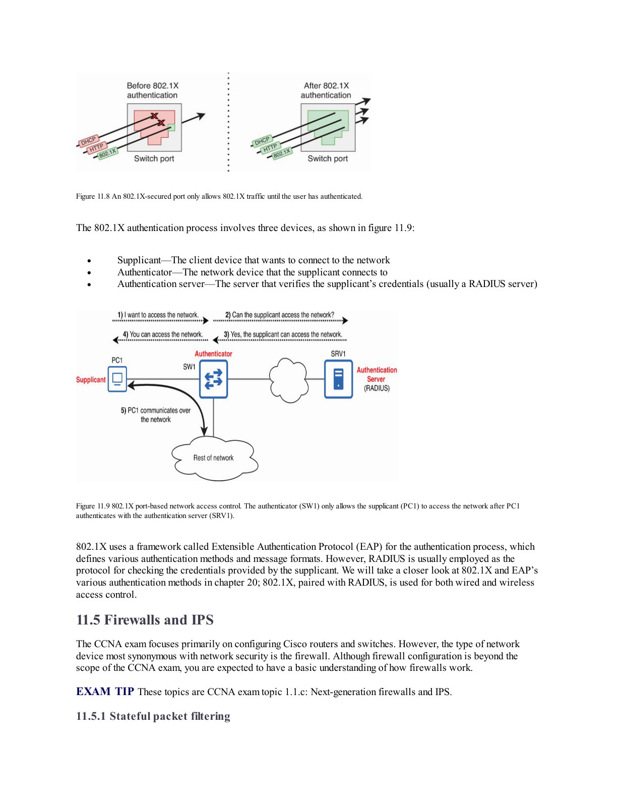 |
| Port Security and MAC flooding | 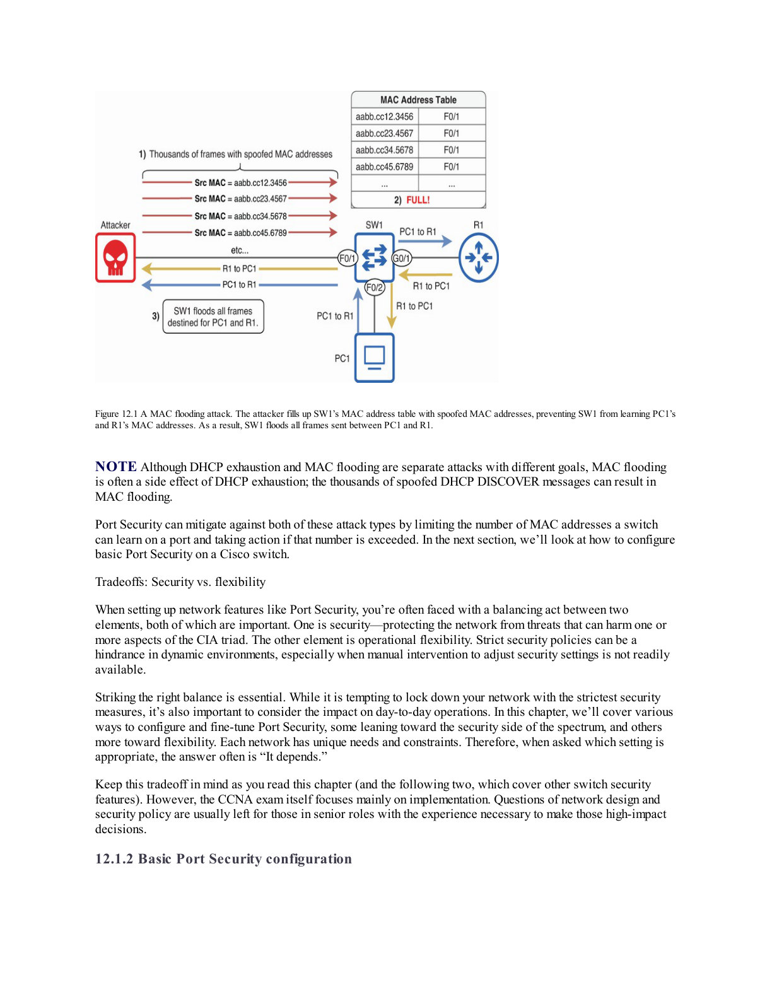 |
| LAN architecture |  |
| Lightweight AP and WLC | 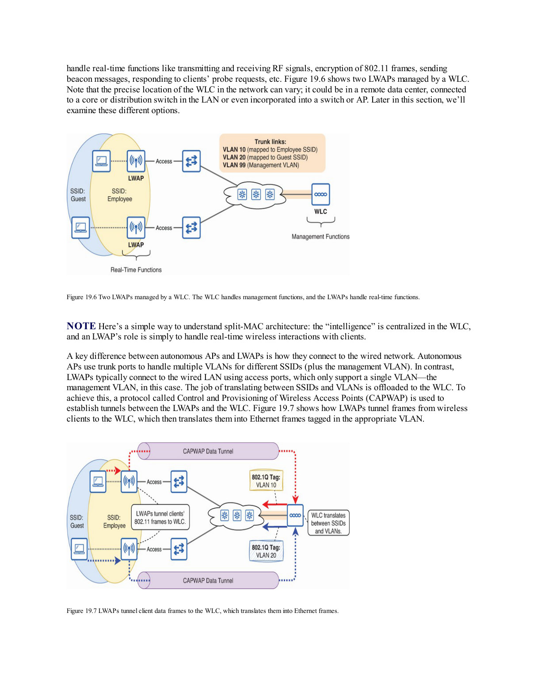 |
| WPA3 SAE | 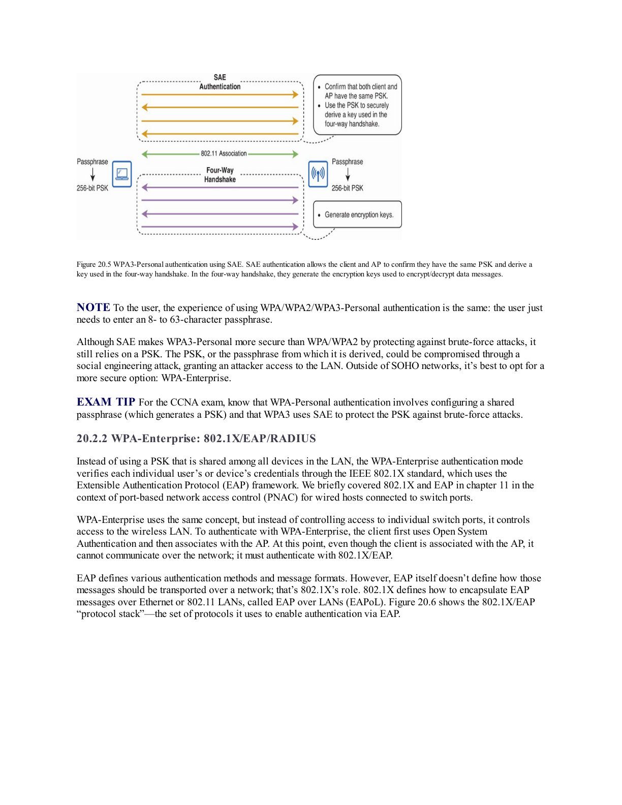 |
| SDN and ACI fabric | 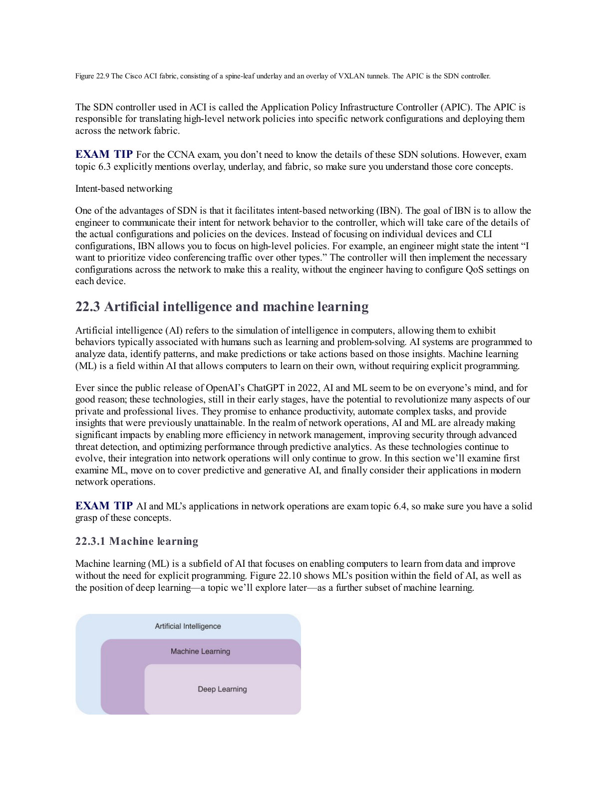 |
| HTTP request format | 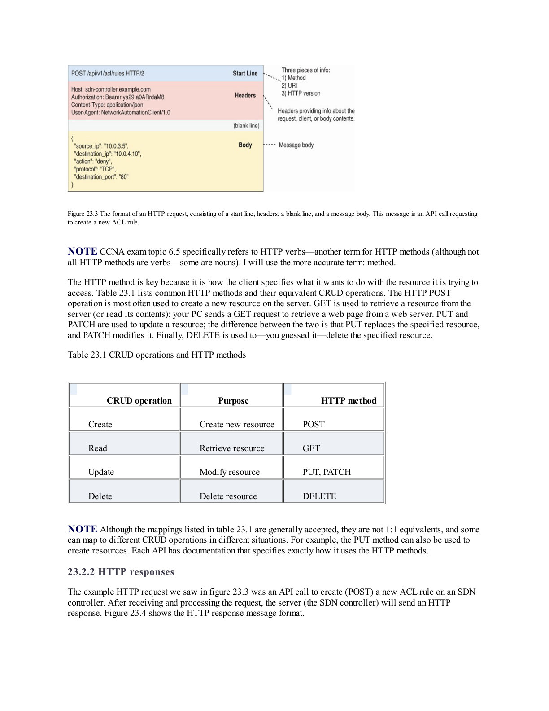 |
| Ansible operations | 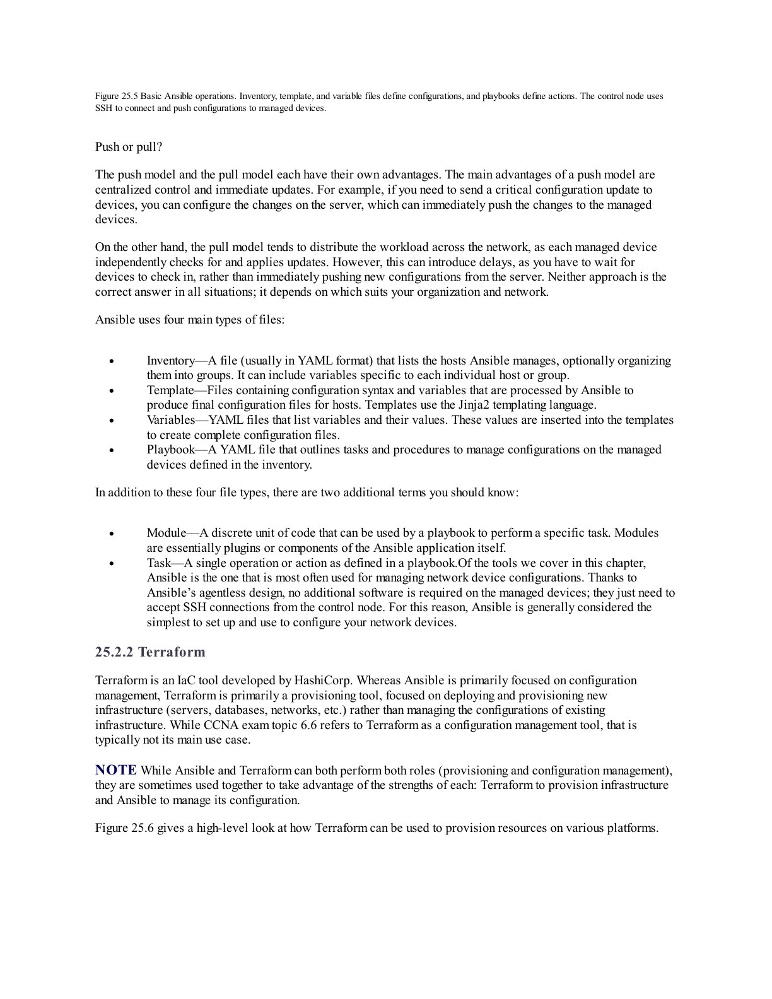 |

## Reading Strategy

Nếu mục tiêu là vận hành mạng thật, đọc theo luồng:

1. Network services trÆ°á»›c: CDP/LLDP, NTP, DNS, DHCP, SSH, SNMP, Syslog, TFTP/FTP, NAT, QoS.
2. Security controls: biết threat trước, rồi map sang port security, DHCP Snooping và DAI.
3. Architecture: hiểu campus, data center, WAN, VPN, VRF và cloud để nhìn topology lớn.
4. Wireless: hiểu RF, 802.11, AP/WLC, WPA và WLAN config.
5. Automation: REST API, JSON/YAML, Ansible/Terraform để nối network với DevOps/SRE workflow.

## Related Pages

- [CCNA Fundamentals And Protocols](../05-ccna-fundamentals-and-protocols/overview.md)
- [Network Overview](../Overview.md)
- [Common Network Protocols And Ports](../04-protocols-and-services/01-common-network-protocols-and-ports.md)
- [Proxy, Load Balancer, VPN And Expose Endpoints](../04-protocols-and-services/03-proxy-load-balancer-vpn-and-expose-endpoints.md)
- [Terraform Overview](../../../05-infrastructure-automation/04-infrastructure-as-code/overview.md)
