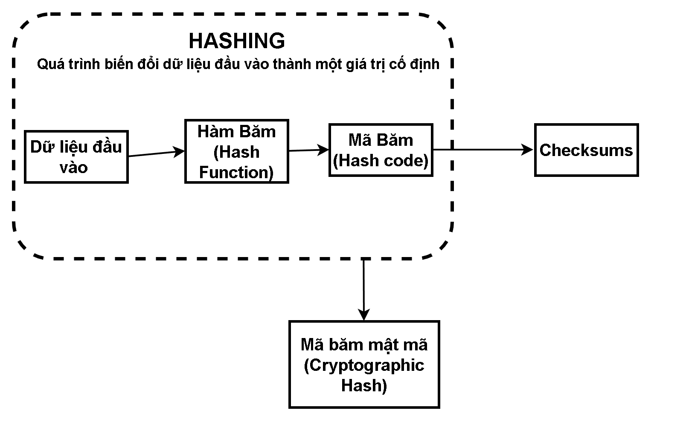

#  —  Hashing 
## 1. Hashing
- Hashing là quá trình biến dữ liệu đầu vào thành một giá trị cố định bằng một hàm băm.
- Mục đích : 
    - **Tạo giá trị đại diện:** Ta muốn một “**dấu vân tay**” của dữ liệu để dễ kiểm tra, so sánh hoặc tìm kiếm.

    - **Tính toán nhanh:** Hashing thường được thiết kế để thực hiện nhanh, kể cả trên dữ liệu lớn.

- **Không phải mọi hashing đều giống nhau** . Tùy thuộc vào mục tiêu khác nhau thì thuật toán sử dụng cũng khác nhau. 
    - Ví dụ : Hashing trong an ninh và hashing trong cấu trúc dữ liệu tuy dùng cùng từ, nhưng mục tiêu hoàn toàn khác nhau. 
        - Mục tiêu của hashing trong cấu trúc dữ liệu là tối ưu hóa hiệu suất tra cứu bằng cách **phân phối dữ liệu vào một bảng băm (hash table)** một cách hiệu quả
        - Mục tiêu của hashing trong an ninh là bảM vệ dữ liệu nhạy cảm thông qua các **hàm băm một chiều không thể đảo ngược**
        

## 2. Hash Code
- Hash code là đầu ra của hashing. Tùy ngữ cảnh, nó có thể là:
    - **Một mã integer đơn giản:** Dùng trong hash table, ví dụ như hashCode() trong Java.
    - **Một chuỗi dài mang tính chất mật mã:** Ví dụ SHA-256, SHA-3. Đây là dạng hash code phục vụ bảo mật.
- Hash code không phải là một thuật toán; nó chỉ là kết quả của thuật toán. Giống như “ảnh chụp” từ máy ảnh: ảnh và máy ảnh là hai thứ khác nhau.

## 3. Checksum
- Checksum là một loại hash code được thiết kế để phát hiện lỗi ngẫu nhiên trong dữ liệu.
    - Ví dụ: CRC32, Adler-32, Internet Checksum.
- **Đặc điểm:** 
    - **Nhanh:** Checksum được tối ưu cho tốc độ vì thường dùng trong mạng hoặc file systems.
    - **Không chống giả mạo:** Checksum không bảo vệ khỏi hành vi cố ý chỉnh sửa dữ liệu. Một kẻ tấn công có thể sửa dữ liệu và tính checksum mới dễ dàng.

## 4. Cryptographic Hash
- Là loại hashing đặc biệt được thiết kế để chống sửa đổi, chống va chạm, và khó đảo ngược.
- Tính chất:
    - Rất khó tìm hai dữ liệu khác nhau nhưng cho ra cùng hash.
    - Không thể suy ngược dữ liệu gốc từ hash.
    - Thay đổi 1 bit → hash thay đổi hoàn toàn (“avalanche effect”).