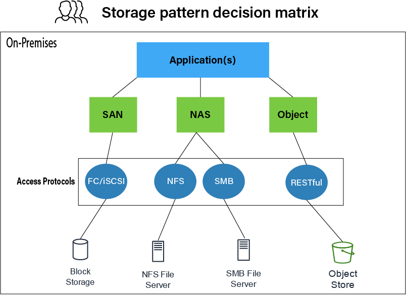

# Các kiểu lưu trữ dữ liệu

Cách dữ liệu được sắp xếp và quản lý ở cấp độ hệ thống:

## 1. Phân loại theo cấu trúc (Structure Classification)
**Block Storage (Lưu trữ Khối):**
- **Cơ chế:** 
    - Lưu trữ khối hoạt động bằng cách chia dữ liệu thành các khối có kích thước cố định và lưu trữ chúng dưới dạng các đơn vị riêng lẻ. Các khối có kích thước từ vài kilobyte đến vài megabyte. Chúng có thể được xác định trước trong quá trình cấu hình.
    - Hệ điều hành cung cấp cho mỗi khối một địa chỉ hoặc mã số khối duy nhất, được tạo bản ghi trong một bảng tra cứu dữ liệu. Địa chỉ sử dụng một lược đồ tạo địa chỉ khối logic (LBA), cho phép chỉ định một mã số tuần tự cho mỗi khối.
    - Lưu trữ khối cho phép truy cập trực tiếp vào các khối dữ liệu riêng lẻ. Bạn có thể đọc hoặc ghi dữ liệu vào các khối cụ thể mà không cần phải truy xuất hoặc sửa đổi toàn bộ tập dữ liệu mà khối đó thuộc về. 

- **Ứng dụng:** Cơ sở dữ liệu, máy ảo (VMs). Cung cấp hiệu suất và độ trễ thấp nhất.

**File Storage (Lưu trữ Tệp):**

- **Cơ chế:** 
    - Dữ liệu được lưu trữ trong một cấu trúc thư mục phân cấp (hierarchical directory structure), cung cấp quyền truy cập chung vào dữ liệu tệp. Hệ thống lưu trữ này sử dụng một cơ sở hạ tầng từ xa của các máy chủ để lưu trữ dữ liệu. Nhà cung cấp dịch vụ đám mây duy trì các máy chủ và quản lý dữ liệu trên đám mây. Tệp chứa siêu dữ liệu như tên tệp, kích thước, dấu thời gian và quyền.
    - Bạn có thể tạo, sửa đổi, xóa và đọc các tệp. Bạn cũng có thể sắp xếp chúng một cách hợp lý trong các cây thư mục để truy cập một cách trực quan. Nhiều người dùng có thể truy cập đồng thời vào các tệp giống nhau. Bảo mật cho lưu trữ tệp trực tuyến được quản lý với quyền của người dùng và nhóm, từ đó quản trị viên có thể kiểm soát quyền truy cập vào dữ liệu tệp dùng chung.

- **Ứng dụng:** Chia sẻ tệp qua mạng (NFS, SMB), home directories.

**Object Storage (Lưu trữ Đối tượng):**

- **Cơ chế:** 
    - Lưu trữ đối tượng sẽ lưu trữ và quản lý dữ liệu dưới dạng các đơn vị rời rạc được gọi là **đối tượng**. Một đối tượng thường bao **gồm dữ liệu thực tế** — chẳng hạn như tài liệu, hình ảnh hoặc giá trị dữ liệu — **và siêu dữ liệu được liên kết của đối tượng**. **Siêu dữ liệu là thông tin bổ sung về đối tượng** mà bạn có thể sử dụng để truy xuất đối tượng. Siêu dữ liệu có thể bao gồm các thuộc tính như mã định danh duy nhất, tên đối tượng, kích thước, ngày tạo và các thẻ được xác định tùy chỉnh.
    - Các hệ thống lưu trữ đối tượng **sử dụng một không gian tên phẳng** để các đối tượng được lưu trữ mà không cần tới **cấu trúc phân cấp**. Thay vào đó, mã định danh duy nhất của đối tượng cung cấp địa chỉ cho đối tượng ngay bên trong hệ thống lưu trữ. **Thuật toán băm tạo ra ID từ nội dung của đối tượng, đảm bảo rằng các đối tượng có cùng nội dung sẽ có cùng mã định danh.**
- **Ứng dụng:** Dữ liệu phi cấu trúc (ảnh, video, backup), kho dữ liệu (data lakes). (Ví dụ: AWS S3, Google Cloud Storage).

### Điểm khác biệt chính giữa lưu trữ đối tượng, lưu trữ khối và lưu trữ tệp

Lưu trữ đối tượng, lưu trữ khối và lưu trữ tệp trên đám mây có một số điểm khác biệt chính.

**Quản lý tệp**
- Các giải pháp lưu trữ đối tượng hỗ trợ lưu trữ các tệp dưới dạng đối tượng. Việc truy cập chúng bằng các ứng dụng hiện có đòi hỏi viết mã mới và sử dụng API cũng như có kiến thức trực tiếp về ngữ nghĩa đặt tên. 

- Tương tự, lưu trữ khối có thể được sử dụng làm thành phần lưu trữ cơ bản của giải pháp lưu trữ tệp tự quản lý. Tuy nhiên, mối quan hệ 1-1 cần thiết giữa máy chủ và dung lượng khiến nó khó có thể sở hữu khả năng điều chỉnh quy mô, tính sẵn sàng và mức giá hợp lý như của giải pháp lưu trữ tệp được quản lý toàn phần. Bạn cần thêm ngân sách và tài nguyên quản lý để hỗ trợ các tệp trên lưu trữ khối.

- Chỉ lưu trữ theo tệp hỗ trợ các giao thức ở cấp độ tệp và các mô hình quyền phổ biến. Bạn không cần viết mã mới để tích hợp với các ứng dụng được định cấu hình để hoạt động với lưu trữ tệp được chia sẻ.

**Quản lý siêu dữ liệu**
- Siêu dữ liệu lưu trữ đối tượng có thể chứa bất kỳ lượng thông tin nào về một đối tượng. Lượng thông tin này bao gồm tên, loại nội dung, ngày tạo, kích thước hoặc các thông tin đầu vào được xác định tùy chỉnh khác. Bằng cách sử dụng lược đồ siêu dữ liệu linh hoạt, bạn có thể tạo các trường bổ sung giúp bạn định vị dữ liệu. 

- Lưu trữ khối sẽ lưu trữ ít siêu dữ liệu nhất có thể để duy trì hiệu năng cao. Một cấu trúc siêu dữ liệu cơ bản nhất đảm bảo chi phí vận hành tối thiểu trong quá trình truyền dữ liệu. Lưu trữ khối chủ yếu sử dụng mã định danh duy nhất cho mỗi khối khi tìm kiếm, dò tìm và truy xuất dữ liệu.

- Lưu trữ tệp trên đám mây sử dụng siêu dữ liệu để mô tả dữ liệu chứa trong tệp. Bạn có thể truy cập và thay đổi siêu dữ liệu được đính kèm với tệp. Chức năng này phụ thuộc vào quyền truy cập của bạn. Hệ thống lưu trữ đám mây sử dụng danh sách kiểm soát truy cập (ACL) để kiểm soát quyền của những cá nhân có thể truy cập và thay đổi siêu dữ liệu.

**Hiệu năng**
- Hệ thống lưu trữ đối tượng ưu tiên số lượng lưu trữ hơn tính khả dụng. Với hệ thống có khả năng mở rộng linh hoạt, bạn có thể lưu trữ khối lượng lớn dữ liệu phi cấu trúc trong một hệ thống lưu trữ đối tượng. Tuy nhiên, bạn sẽ gặp phải độ trễ cao hơn khi truy cập vào các tệp này. Lưu trữ đối tượng cũng có thông lượng thấp hơn so với lưu trữ khối và lưu trữ trên đám mây. 

- Lưu trữ khối cung cấp hiệu năng cao, độ trễ thấp và tốc độ truyền dữ liệu nhanh chóng. Vì nó hoạt động ở cấp độ khối, bạn có thể truy cập trực tiếp dữ liệu và đạt được hiệu suất I/O cao. Bạn sử dụng lưu trữ khối cho các ứng dụng cần truy cập nhanh vào dữ liệu bạn đã lưu trữ, như máy ảo hoặc cơ sở dữ liệu. 

- Lưu trữ tệp trên đám mây có thể mang lại hiệu năng cao, nhưng đây không phải là ưu điểm chính khiến bạn nên sử dụng kiểu lưu trữ này. Thay vào đó, lưu trữ tệp trên đám mây tập trung vào việc lưu trữ dữ liệu theo cách trực quan để con người truy cập. Chia sẻ tệp, cộng tác và kho lưu trữ được chia sẻ là những thứ thường thấy ở lưu trữ tệp trên đám mây hơn là hiệu năng cao.

**Hệ thống lưu trữ vật lý**
- Lưu trữ đối tượng thường sử dụng môi trường lưu trữ phân tán trên nhiều nút lưu trữ hoặc máy chủ khác nhau.

- Mặt khác, lưu trữ khối sử dụng RAID, SSD và ổ đĩa cứng (HDD) để lưu trữ.

- Cuối cùng, lưu trữ tệp trên đám mây sử dụng thiết bị lưu trữ gắn vào mạng (NAS) trong một hệ thống tại chỗ. Trong đám mây, dịch vụ lưu trữ tệp có thể được thiết lập trên lưu trữ khối vật lý cơ bản.

**Khả năng điều chỉnh quy mô**
- Kho lưu trữ đối tượng cung cấp khả năng điều chỉnh quy mô gần như vô hạn, tới hàng petabyte và hàng tỷ đối tượng.

- Lưu trữ khối cung cấp khả năng điều chỉnh quy mô bằng cách bổ sung thêm nhiều dung lượng lưu trữ hơn hoặc mở rộng dung lượng hiện có. Khả năng điều chỉnh quy mô phụ thuộc vào khả năng của hệ thống lưu trữ khối trong việc xử lý nhu cầu tăng cao về I/O và yêu cầu về dung lượng.

- Do hệ thống phân cấp và định đường dẫn vốn có, lưu trữ tệp gặp phải những hạn chế về điều chỉnh quy mô và có quy mô kém linh hoạt nhất trong ba hình thức lưu trữ này.

## 2. Khi nào nên sử dụng lưu trữ đối tượng, lưu trữ khối và lưu trữ tệp?

- Trường hợp sử dụng lý tưởng nhất của lưu trữ đối tượng là với lượng lớn dữ liệu phi cấu trúc. Điều này đặc biệt đúng khi độ bền, dung lượng lưu trữ không giới hạn, khả năng điều chỉnh quy mô và quản lý siêu dữ liệu phức tạp là những yếu tố liên quan tới hiệu năng tổng thể.

- Lưu trữ khối cung cấp khả năng xử lý dữ liệu tốc độ cao, độ trễ thấp và lưu trữ hiệu năng cao. Bất kỳ dịch vụ nào đòi hỏi khả năng truy cập nhanh vào dữ liệu đều hoạt động tốt với lưu trữ khối. Ví dụ: phân tích theo thời gian thực, điện toán hiệu năng cao và các hệ thống có nhiều giao dịch nhanh chóng đều được lợi từ lưu trữ khối.

- Trường hợp sử dụng lý tưởng nhất của lưu trữ tệp trên đám mây là khi nhiều người dùng cần truy cập đồng thời vào một hệ thống tệp được chia sẻ. Ngoài ra, khả năng kiểm soát truy cập ở cấp độ tệp cho phép bạn thiết lập quyền và danh sách kiểm soát truy cập (ACL) để tăng cường bảo mật. Ví dụ: môi trường làm việc cộng tác yêu cầu chia sẻ tệp giữa các nhóm làm việc từ xa sử dụng lưu trữ tệp. 

| Tính năng               | Lưu trữ đối tượng                                                                                                                                 | Lưu trữ khối                                                                                                                           | Lưu trữ tệp trên đám mây                                                                                                                               |
|-------------------------|---------------------------------------------------------------------------------------------------------------------------------------------------|----------------------------------------------------------------------------------------------------------------------------------------|--------------------------------------------------------------------------------------------------------------------------------------------------------|
| Quản lý tệp             | Lưu trữ tệp dưới dạng đối tượng. Truy cập các tệp trong kho lưu trữ đối tượng bằng các ứng dụng hiện có thì cần viết mã mới và sử dụng API.         | Có thể lưu trữ tệp nhưng cần thêm ngân sách và tài nguyên quản lý để hỗ trợ các tệp trên kho lưu trữ khối.                               | Hỗ trợ các giao thức ở cấp độ tệp và các mô hình quyền phổ biến. Có thể sử dụng bởi các ứng dụng đã được cấu hình để làm việc với kho lưu trữ tệp được chia sẻ. |
| Quản lý siêu dữ liệu    | Có thể lưu trữ siêu dữ liệu không giới hạn cho bất kỳ đối tượng nào. Xác định các trường siêu dữ liệu tùy chỉnh.                                   | Sử dụng rất ít siêu dữ liệu liên quan.                                                                                                 | Lưu trữ siêu dữ liệu giới hạn chỉ liên quan đến các tệp.                                                                                               |
| Hiệu năng               | Lưu trữ dữ liệu không giới hạn với độ trễ tối thiểu.                                                                                              | Hiệu suất cao, độ trễ thấp và truyền dữ liệu nhanh chóng.                                                                              | Mang lại hiệu suất cao để truy cập tệp được chia sẻ.                                                                                                   |
| Kho lưu trữ vật lý      | Phân phối trên nhiều nút lưu trữ.                                                                                                                 | Phân phối trên các SSD và HDD.                                                                                                         | Máy chủ NAS tại chỗ hoặc kho lưu trữ khối vật lý cơ bản.                                                                                               |
| Khả năng điều chỉnh quy mô | Quy mô không giới hạn.                                                                                                                            | Hơi hạn chế.                                                                                                                           | Hơi hạn chế.                                                                                                                                           |