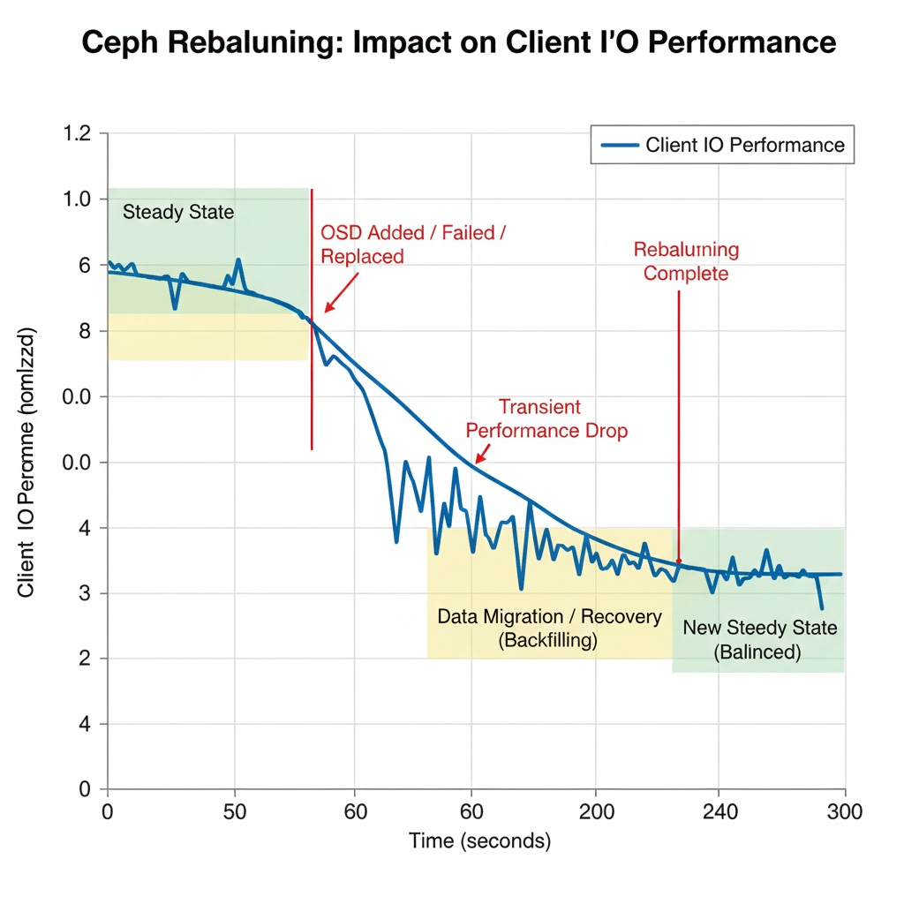
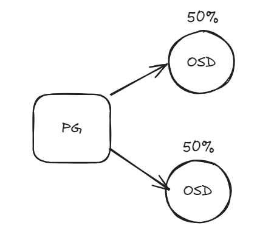
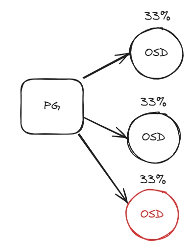
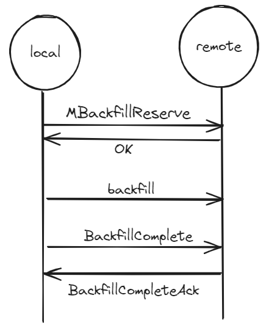

title: "Các khái niệm cốt lõi" 

# Tổng quan 
- RADOS (Reliable Autonomic Distributed Object Store) là lớp lưu trữ cốt lõi và nền tảng của toàn bộ hệ thống Ceph Storage. RADOS cung cấp dịch vụ lưu trữ đối tượng phân tán, đáng tin cậy với khả năng tự quản trị và tự phục hồi. Tất cả các phương thức truy cập Ceph như RBD (RADOS Block Device), CephFS (File System), RADOSGW (Object Gateway) và librados đều được xây dựng trên RADOS layer.

- RADOS là trung tâm của Ceph storage cluster, còn được gọi là Ceph Storage Cluster. Đây là một dịch vụ lưu trữ phân tán, hoạt động dựa trên các storage nodes thông minh có khả năng tự quản lý và tự phục hồi. RADOS không giao tiếp trực tiếp với client mà hoạt động như backend storage layer, nằm bên dưới các client interfaces.

- Kiến trúc Ceph được chia làm 2 phần chính :
    + RADOS Layer (Tầng dưới): Nằm trong Ceph cluster, quản lý việc lưu trữ, phân tán và bảo vệ dữ liệu
    + Client Interface Layer (Tầng trên): Cung cấp các giao diện truy cập như RBD, CephFS, RADOSGW để client tương tác với cluster

- Các đặc điểm chính của RADOS :
    + **Reliable (Đáng tin cậy):** RADOS đảm bảo độ tin cậy cao thông qua :
        * **Data Replication:** Tự động sao chép dữ liệu theo replication factor được cấu hình
        * **Erasure Coding:** Hỗ trợ mã hóa xóa để tối ưu không gian lưu trữ
        * **Data Durability:** Đảm bảo dữ liệu không bị mất ngay cả khi có lỗi phần cứng
        * **High Availability:** Duy trì khả năng truy cập dữ liệu ngay cả khi một số nodes bị lỗi
    + **Autonomic (Tự quản trị):** RADOS có khả năng tự động quản lý và vận hành:
        * **Self-managing:** Tự động quản lý việc phân bố dữ liệu, cân bằng tải
        * **Self-healing:** Tự động phát hiện và sửa lỗi khi có sự cố xảy ra
        * **Self-monitoring:** Liên tục giám sát trạng thái của cluster và các components
        * **Autonomic Management:** Giảm thiểu công việc quản trị thủ công, tự động xử lý các tác vụ như rebalancing, recovery
    + **Distributed (Phân tán):** RADOS phân tán dữ liệu trên toàn bộ cluster:
        * **Data Distribution:** Sử dụng thuật toán CRUSH để phân tán dữ liệu đồng đều
        * **No Single Point of Failure:** Không có điểm lỗi đơn lẻ trong kiến trúc
        * **Scale-out Architecture:** Khả năng mở rộng tuyến tính bằng cách thêm nodes
        * **Intelligent Storage Nodes:** Các OSD thông minh, có khả năng ra quyết định phân tán
    + **Object Store:** RADOS lưu trữ dữ liệu dưới dạng objects:
        * **Flat Namespace:** Không gian tên phẳng trong mỗi pool, không có cấu trúc thư mục
        * **Object Structure:** Mỗi object bao gồm identifier, binary data và metadata
        * **Scalability:** Có thể quản lý hàng triệu đến hàng tỷ objects

## Cơ chế Replication
RADOS sử dụng primary-copy replication model bao gồm:
- **Write Process:** 
    1. **Client Request:** Client gửi write request tới Primary OSD của PG
    2. **Validation:** Primary OSD validate request, gán sequence number
    3. **Parallel Replication:** Primary gửi write operation tới tất cả Replica OSDs đồng thời
    4. **Local Write:** Primary cũng write data locally
    5. **Acknowledgment:** Mỗi Replica OSD persist data và gửi ACK về Primary
    6. **Client Confirmation:** Primary chỉ confirm với client sau khi nhận đủ ACK từ min_size OSDs
- **Read Process:** 
    1. Read requests được xử lý tại Primary OSD
    2. Primary có bản copy mới nhất và authoritative của dữ liệu
    3. Giúp đảm bảo strong consistency cho read operations

- RADOS duy trì số lượng replicas theo cấu hình:
    + **Pool Size:** Số lượng copies của mỗi object (thường là 2 hoặc 3)
    + **Min Size:** Số lượng copies tối thiểu cần có để PG hoạt động (thường là 2)
    + **Automatic Replication:** Tự động tạo và duy trì replicas
    + **Different Failure Domains:** Replicas được đặt trên các failure domains khác nhau (host, rack, datacenter)

- Ngoài ra RADOS hỗ trợ **erasure coding** giúp :
    + **Space Efficiency:** Tiết kiệm không gian hơn replication (ví dụ: k=8, m=3 thay vì 3 replicas)
    + **Data Chunks:** Chia data thành k data chunks và m coding chunks
    + **Fault Tolerance:** Có thể phục hồi dữ liệu khi mất tối đa m chunks
    + **Trade-offs:** Tiết kiệm không gian nhưng CPU overhead cao hơn và recovery chậm hơn

## Consistency Model
- RADOS cung cấp strong consistency model, tuân theo CP principles trong CAP theorem:
    + Linearizable: Tất cả clients thấy cùng một view của data
    + Synchronous Replication: Write phải được replicate đến min_size OSDs trước khi acknowledge
    + Read-Your-Writes: Client đọc được ngay dữ liệu vừa ghi thành công
    + No Stale Reads: Không có trường hợp đọc dữ liệu cũ sau khi write đã được confirm

- Quy trình đảm bảo consistency cho write operations:
    1. Primary OSD nhận write request
    2. Write đồng thời tới tất cả replicas trong Acting Set
    3. Chỉ acknowledge client sau khi nhận đủ ACKs từ min_size OSDs
    4. Sequence numbers đảm bảo thứ tự operations
    5. Short-term logs giúp recovery nhanh khi có intermittent failures

# CRUSH 
## Tổng quan 
- CRUSH là trái tim của Ceph — một **thuật toán ánh xạ dữ liệu phi tập trung**, được đề xuất trong paper “CRUSH: Controlled, Scalable, Decentralized Placement of Replicated Data” (Sage Weil, SC’06).
>Nó xác định vị trí lưu trữ dữ liệu mà **không cần bảng metadata trung tâm**, giúp Ceph scale tới hàng nghìn node.

- CRUSH là một cải tiến từ thuật toán RUSH ("Replication Under Scalable Hashing"). Cho phép:
    + Ánh xạ có kiểm soát (controlled mapping): người dùng có thể định nghĩa topology và chính sách replication.
    + Khả năng mở rộng: không cần tra cứu bảng metadata.
    + Tối thiểu di chuyển dữ liệu: khi thêm node mới, chỉ các phần liên quan bị remap.

- **Mục tiêu **:Thuật toán này **phân phối dữ liệu ngẫu nhiên có kiểm soát** (“*controlled pseudo-random*”) nhằm đảm bảo:
    + Dữ liệu trải đều trên toàn cluster.
    + Replica được tách theo failure domain.
    + Khi thêm/xóa node, dữ liệu di chuyển tối thiểu cần thiết.

> CRUSH là nền tảng của Ceph. Tất cả lớp cao hơn (RADOS, CephFS, RGW) đều dựa trên CRUSH để định vị dữ liệu.

> Một CRUSH map được thiết kế tốt = cân bằng dữ liệu, đảm bảo an toàn, phục hồi nhanh và scale mượt mà khi mở rộng cluster.

- CRUSH hoạt động dựa trên 2 khối:
    + **CRUSH Algorithm** – hàm ánh xạ xác định vị trí lưu object.
    + **CRUSH Map** – cấu trúc phân cấp mô tả hạ tầng vật lý (root, datacenter, rack, host, osd) và chính sách replication.

## CRUSH Algorithm
- Sử dụng hàm hash để ánh xạ dữ liệu vào OSD dựa trên cấu trúc cluster (rack, host). Hỗ trợ replication hoặc erasure coding. Khi thêm/xóa node, CRUSH tự cân bằng dữ liệu.

### Đặc tính Ánh xạ Xác định (Deterministic Mapping)
1. Nguyên lý Ánh xạ Xác định
Ánh xạ xác định là thuộc tính đảm bảo rằng với một tập hợp đầu vào cố định, thuật toán CRUSH sẽ luôn sinh ra cùng một kết quả đầu ra. Cụ thể, khi biết:
- Object ID (hoặc Placement Group ID)
- CRUSH Map (mô tả topology cluster và các rule)
- CRUSH Rule (chính sách placement)

bất kỳ client hoặc daemon nào trong hệ thống cũng sẽ tính toán ra chính xác cùng một danh sách OSD đích để lưu trữ hoặc truy xuất dữ liệu.
> Tính chất này được triển khai thông qua một hàm băm (hash function) xác định trong thuật toán CRUSH. Hàm này xử lý các đầu vào nêu trên để tạo ra một chuỗi các lựa chọn OSD một cách nhất quán và có thể dự đoán được.
>

- Ý nghĩa Kiến trúc
Đặc tính này là **nền tảng cho kiến trúc phi tập trung (decentralized) của Ceph**:
    - **Không cần Tra cứu Metadata Trung tâm:** Client có thể xác định chính xác vị trí dữ liệu mà không cần liên hệ với một dịch vụ metadata tập trung. Điều này loại bỏ điểm tắc nghẽn (bottleneck) và điểm lỗi đơn (single point of failure).
    - **Nhất quán Toàn cục:** Tất cả các thành phần trong cluster (Client, OSD, Monitor) đều có khả năng độc lập tính toán và đạt được kết quả ánh xạ giống hệt nhau, đảm bảo tính nhất quán của dữ liệu.
### Tối ưu Hiệu suất mở rộng
Ánh xạ xác định trực tiếp dẫn đến hiệu quả trong việc quản lý dữ liệu khi cluster thay đổi:
- **Di chuyển Dữ liệu Tối thiểu (Minimal Remapping):** Khi cluster được mở rộng (thêm OSD) hoặc thu hẹp (xóa OSD), CRUSH Map thay đổi. Khi đó, thuật toán được thiết kế để chỉ những dữ liệu được ánh xạ tới các OSD bị ảnh hưởng trực tiếp bởi sự thay đổi (ví dụ: OSD bị xóa hoặc vùng dữ liệu được phân bổ lại cho OSD mới) mới cần di chuyển.
- **Tiệm cận Lý thuyết:** Lượng dữ liệu di chuyển này được chứng minh là tiệm cận với giới hạn tối thiểu lý thuyết (theoretical minimum) cho bất kỳ thuật toán phân phối dữ liệu nào. Trong thực tế, điều này có nghĩa là khi thêm một OSD mới có trọng số (weight) chiếm 1% tổng dung lượng cluster, thì chỉ có khoảng 1% dữ liệu toàn cluster là cần được di chuyển để tái cân bằng.

> Tính chất deterministic mapping, kết hợp với cấu trúc hierarchy và các bucket algorithm (như Straw2), cho phép CRUSH đạt được sự cân bằng giữa tính ngẫu nhiên để phân phối đều (load balancing) và tính xác định để giảm thiểu di chuyển dữ liệu, từ đó tạo nên một hệ thống lưu trữ phân tán có khả năng mở rộng cao và hiệu quả.

## CRUSH Lookup
CRUSH lookup là quá trình tính toán ánh xạ giữa object (hoặc PG) và danh sách OSD.  Điểm quan trọng là **tất cả client, OSD, MON đều có thể tự tính được cùng một kết quả, miễn cùng CRUSH map.**

### Quy trình thực tế trong Ceph


1. Client nhận cluster map (từ MON).
2. Khi ghi dữ liệu:
- Object → hash → Placement Group (PG).
- PG ID được đưa vào CRUSH cùng rule tương ứng.
- CRUSH trả về danh sách OSDs (primary + replicas hoặc EC shards).

3. Client gửi trực tiếp tới primary OSD, không cần trung gian.
4. Primary OSD tự đồng bộ sang các replica OSD còn lại.
- Cơ chế phân phối tính toán
- Tất cả phép tính lookup diễn ra ở client/daemon → không gây tải cho MON.
- Lookup là metadata computation distributed, không centralized.
- CRUSH loop chạy trong không gian của client (C++ hoặc librados), cho phép tốc độ lookup microsecond-level.
- Với cùng CRUSH map + input (object, rule), output luôn giống nhau (deterministic mapping).
- Khi thêm hoặc xóa OSD, lượng dữ liệu di chuyển (remap) tiệm cận mức tối thiểu lý thuyết.
- Điểm đặc biệt cho CRUSH Lookup là không phụ thuộc vào hệ thống. Ceph cung cấp tính linh hoạt cho client thực hiện tính toán theo metadata khi cần bằng cách chạy CRUSH loop với tài nguyên của chính client, giảm công việc tại centrel.
- Với các hoạt động tại Ceph cluster, client tương tác với Ceph monitor nhận lại cluster map. Cluster map giúp client biết trạng thái cấu hình Ceph cluster. Data được chuyển thành object với obj và pool name/IDs. Obj sau đối hashed với số vị trí group để sinh ra vị trí group cuối cùng mà không yêu cầu Ceph pool.
- Tính toán ví trị group sẽ thông qua CRUSH lookup để quyết định vị trí primary OSD lưu và lấy lại. Sau tính toán, chiết xuất OSD ID, client liên hệ với OSD trực tiếp, lưu data. Tất các tính toán thực hiện bởi client, do đó nó không ảnh hưởng tới hiệu năng cluster. Khi data ghi tới primary OSD, node tương tự thực hiện hoạt động CRUSH lookup và tính toán vị trí secondary placement groups (vị trí phụ thứ yếu) và OSD, vì thế data được nhân rộng khắp Cluster cho tính HA.

## CRUSH Hierarchy
- CRUSH có khả năng nhận thức hạ tầng, hoàn toàn do user cấu hình. Nó duy trì nested hierarchy (phân cấp lồng nhau) cho tất cả thành phần của hạ tầng.
Các thành phần được biết tới = failure zones hay CRUSH buckets.

### Cấu trúc CRUSH Map
CRUSH Map chứa list các bucket có sẵn tập hợp các thiết bị trong các vị trí vật lý. Đồng thời chứa list rule cho phép CRUSH tính toán nhân bản data trên các Ceph pool khác nhau.
- Cấu trúc CRUSH Map gồm các tầng:
```
root → datacenter → row → rack → host → osd
```


- Mỗi tầng là một **bucket**, có thể chứa bucket con hoặc thiết bị.
- CRUSH sử dụng topology này để phân phối dữ liệu qua các failure zones, đảm bảo an toàn và sẵn sàng.

#### Phân phối replica
- Khi nhân bản dữ liệu, CRUSH chọn replica ở các bucket khác nhau (ví dụ, 3 host khác rack).
- Nếu một node/rack bị lỗi, các replica còn lại vẫn khả dụng.

#### Lợi ích của cấu trúc hierarchy
Cấu trúc hierarchy giúp CRUSH:
- Đảm bảo tính High Availability (HA).
- Giữ phân phối công bằng dựa trên weight.
- Cho phép tận dụng commodity hardware mà vẫn duy trì độ tin cậy cao.

#### Cơ chế đảm bảo an toàn dữ liệu
- Dựa trên hạ tầng, CRUSH truyền data, nhân bản data trên khắp failure zones khiến data an toàn, có sẵn kể cả khi 1 số thành phần lỗi.
=> Đây là cách CRUSH loại bỏ các thành phần có khả năng lỗi trên hạ tầng lưu trữ, đồng thời nó sử dụng các thiết bị thông thường mà vẫn đảm bảo tính HA (ko phải thiết bị chuyên dụng).


## CRUSH Buckets
CRUSH bucket là các container logic chứa các thiết bị (OSD) hoặc bucket con, sử dụng các thuật toán khác nhau để lựa chọn item khi ánh xạ dữ liệu. Việc lựa chọn loại bucket phù hợp ảnh hưởng trực tiếp đến:
- Hiệu năng ánh xạ dữ liệu

- Mức độ di chuyển dữ liệu khi cluster thay đổi

- Khả năng cân bằng tải

### Các Loại Bucket 
- Uniform bucket: 
    + Sử dụng hash trực tiếp, giả định tất cả items có cùng weight
    + Độ phức tạp: O(1) nên tốc độ cực nhanh => Tốc độ ánh xạ nhanh nhất
    + Phải remap toàn bộ dữ liệu khi thay đổi weight hoặc thêm/xóa item => Nhược điểm
    + Sử dụng cho cluster đồng nhất 100% (rất hiếm trong thực tế)
- List bucket: 
    + Duyệt tuần tự từ đầu đến cuối danh sách
    + Độ phức tạp: O(n) => Tốc độ chậm với danh sách lớn => Thêm item mới dễ dàng
    + Xóa item tốn chi phí, hiệu năng giảm khi số lượng item tăng => Nhược
    + Sử dụng cho Legacy systems, không khuyến nghị cho cluster mới
- Tree bucket: 
    + Sử dụng cây nhị phân cân bằng để tìm kiếm
    + Độ phức tạp: O(log n) - cân bằng tốt => Cân bằng giữa tốc độ chọn và chi phí tái cấu trúc
    + Remap trung bình khi có thay đổi 
    + Sử dụng cho cluster lớn cần cân bằng giữa performance và maintenance

- — bucket: 
    + Mỗi item "rút thăm" với độ dài straw tỷ lệ với weight
    + Độ phức tạp: O(n) - nhưng thực tế nhanh hơn List bucket =>  Đảm bảo tính công bằng (fairness) và minimal remap
    + Có bias nhất định khi weight thay đổi

- Straw2 bucket (Mặc định hiện nay): 
    + Phiên bản cải tiến của Straw, sử dụng thuật toán "rút thăm" với xác suất tỷ lệ weight
    + Độ phức tạp: O(n) - tương đương Straw 
    + Giảm bias khi weight thay đổi, đảm bảo minimal remap (di chuyển dữ liệu tối thiểu) và ngẫu nhiên có kiểm soát để cân bằng tải => Ưu điểm cải tiến lớn nhất
    + Nhược điểm: Chậm hơn Uniform và Tree
    + Mặc định dùng cho mọi bucket mới trong Ceph (từ Nautilus).

**So sánh nhanh :**

| Kiểu bucket | Cơ chế | Độ phức tạp | Thêm item | Xóa item | Remap khi đổi weight | Phạm vi sử dụng |
|-------------|---------|-------------|-----------|----------|---------------------|-----------------|
| **Uniform** | Hash trực tiếp | O(1) | Remap toàn bộ | Remap toàn bộ | Remap toàn bộ | Cluster đồng nhất |
| **List** | Duyệt tuần tự | O(n) | Dễ dàng | Tốn kém | Remap ít | Legacy |
| **Tree** | Cây nhị phân | O(log n) | Trung bình | Trung bình | Remap trung bình | Map lớn |
| **Straw** | Rút thăm | O(n) | Nhanh | Nhanh | Remap tối thiểu | Được thay thế bởi Straw2 |
| **Straw2** | Rút thăm cải tiến | O(n) | Nhanh | Nhanh | **Remap tối thiểu** | **Mặc định hiện nay** |

**Khuyến nghị :**
- Cluster mới: Luôn sử dụng Straw2 làm bucket type mặc định

- Cluster đồng nhất tuyệt đối: Cân nhắc Uniform nếu đảm bảo không thay đổi hardware

- Cluster lớn với OSD count cao: Straw2 vẫn là lựa chọn tối ưu

- Legacy migration: Chuyển đổi dần từ List/Tree sang Straw2 để tận dụng minimal remap

### Weight Balancing
#### Khái niệm về OSD Weight
Mỗi OSD có trọng số (weight) phản ánh khả năng lưu trữ hoặc hiệu năng.
=> Để làm được điều đó, CRUSH cấp phát weights trên mỗi OSD. Cân năng càng cao trên OSD thì khả năng lưu trữ của chính OSD càng cao.

#### Cơ chế phân phối dữ liệu theo weight

- CRUSH ghi nhiều dữ liệu hơn vào OSD có weight cao hơn, từ đó CRUSH ghi nhiều data tới những OSD này, duy trì tính cân bằng trên các thiết bị.
- CRUSH ghi data công bằng trên khắp cluster disk, tăng hiệu năng, tính bảo đảm, đưa tất cả disk vào cluster.
- Nó chắc rằng tất cả cluster disk được sử dụng bằng nhau kể cả khả năng lưu trữ khác nhau.

#### Tối ưu hóa khi thay đổi weight
Khi weight thay đổi, thuật toán chỉ dịch chuyển lượng dữ liệu tối thiểu.


## CRUSH Rules & Placement
- CRUSH Rule là định nghĩa cách dữ liệu được phân phối trên cluster.
- Thông thường sẽ có 2 kiểu:
    - Replicated Rules: cho replication pool.
    - Erasure Coded Rules: cho EC pool (giúp tiết kiệm dung lượng).

- Cú pháp 
```
rule replicated_rule {
    step take default
    step chooseleaf firstn 3 type host
    step emit
}
```
- `take`: điểm bắt đầu (root hoặc bucket cụ thể).
- `chooseleaf firstn 3 type host`: chọn 3 OSD trên 3 host khác nhau.
- `emit`: xuất kết quả.

### Replicated pools
CRUSH chọn N OSD khác nhau để lưu N replica.
Các replica nằm ở failure domain tách biệt (host hoặc rack khác nhau).

### Erasure-coded pools
- Cơ chế hoạt động
    + Dữ liệu chia thành k+m shard (k data, m parity).
    + CRUSH chọn OSD cho từng shard dựa theo rank.

- EC rules khác replication rule ở chỗ :
    + Giữ thứ tự strict giữa rank → shard.
    + Dùng lựa chọn `indep` để xử lý placement độc lập.

## Cơ chế Recovery (Khôi phục)
### Thời gian chờ và Phát hiện lỗi
- **Cơ chế phát hiện:** Ceph sử dụng heartbeat mechanism để phát hiện OSD `down`. Các OSD liên tục gửi tin nhắn heartbeat cho nhau và báo cáo trạng thái tới Monitor.
- **Thời gian chờ mặc định:** 300 giây trước khi đánh dấu OSD là `down` và bắt đầu recovery.
- **Tùy chỉnh:** Thông qua parameter `mon_osd_down_out_interval` trong cấu hình Ceph Cluster.
```bash
# Ví dụ tùy chỉnh thời gian chờ
mon_osd_down_out_interval = 600  # Tăng lên 600 giây
```

### Quá trình khôi phục
1. Xác định PGs cần khôi phục:
- Monitor xác định các Placement Groups (PGs) bị ảnh hưởng bởi OSD failure
- Đánh dấu PG trạng thái degraded

2. Chọn nguồn khôi phục:
- Primary OSD của PG sẽ chọn replica OSDs còn lại làm nguồn khôi phục
- CRUSH đảm bảo replicas được phân tán trên các failure domain khác nhau

3. Đồng bộ dữ liệu:
- Dữ liệu được sao chép từ replicas còn lại sang OSD thay thế
- Sử dụng versioning để đảm bảo consistency

### Tối ưu hóa di chuyển dữ liệu
- **Parallel Recovery:** Multiple PGs được recovery đồng thời
- **Backfill Recovery:** Recovery không ảnh hưởng đến client I/O
- **Throttling Controls:** Có thể điều chỉnh tốc độ recovery để tránh ảnh hưởng hiệu năng

```bash
# Các tham số tối ưu recovery
osd_recovery_max_active = 3      # Số PGs recovery đồng thời
osd_recovery_max_single_start = 1 # Số operations recovery khởi tạo đồng thời
osd_recovery_sleep = 0           # Thời gian nghỉ giữa các recovery operations
```

## Cơ chế Rebalancing
### Điều kiện kích hoạt Rebalancing
- **Thêm OSD/host mới:** CRUSH tự động tính toán lại data distribution
- **Thay đổi CRUSH Map:** Điều chỉnh weights, rules, hoặc topology
- **OSD failure kéo dài:** Khi OSD bị đánh dấu `out` của cluster

### Quy trình Rebalancing
1. Tính toán data movement:
- CRUSH algorithm tính toán PGs cần di chuyển dựa trên weight changes
- Chỉ những PGs bị ảnh hưởng bởi thay đổi topology mới được remap

2. Backfill process:
- Dữ liệu được di chuyển từ OSDs hiện tại sang OSDs mới
- Quá trình chạy nền, ưu tiên thấp hơn client I/O

3. Parallel execution:
- Nhiều OSDs tham gia đồng thời vào quá trình backfill
- Tự động điều chỉnh tốc độ dựa trên cluster load

### Ví dụ thực tế tính toán lượng dữ liệu di chuyển
**Ví dụ:**
Nếu Ceph cluster chứa 2000 OSDs, 1 hệ thống mới được thêm vào với 20 OSDs mới => 1% data sẽ được chuyển trong quá trình tái cân bằng, tất cả OSDs đã có sẽ làm việc song song khi chuyển data, giữ các hoạt động diễn ra bình thường.

- Công  thức ước tính:
```
Data_movement_percentage = (New_total_weight - Old_total_weight) / Old_total_weight × 100%
```
- Cluster hiện tại: 2000 OSDs, tổng weight = 2000

- Thêm 20 OSDs mới, mỗi OSD weight = 1.0

- Lượng data di chuyển ≈ (2020 - 2000) / 2000 × 100% = 1%

## Cơ chế tái cấu trúc layout
### Nguyên lý Minimal Data Movement
- **Deterministic mapping:** Cùng input (PG + CRUSH Map) → cùng output OSDs
- **Incremental changes:** Chỉ PGs bị ảnh hưởng trực tiếp bởi topology changes mới remap
- **Straw2 algorithm:** Đảm bảo minimal remap khi thay đổi weights

### Quy trình tái ánh xạ
1. Client/OSD computation:
- Mỗi client và OSD tự tính toán mapping mới khi CRUSH Map thay đổi
- Không cần centralized coordination

2. Graceful degradation:
- Trong thời gian remap, hệ thống vẫn phục vụ I/O
- Dữ liệu được đọc từ cả vị trí cũ và mới trong quá trình chuyển đổi

3. Atomic updates:
- PG mappings được cập nhật atomic qua Monitor
- Đảm bảo consistency trên toàn cluster


# Pools 
- Pool là phân vùng logic để lưu trữ objects trong Ceph cluster. Bạn có thể hiểu Pool giống như một "container" hay "bucket" lớn chứa dữ liệu.

- **Tại sao cần Pools?**
    + **Tách biệt dữ liệu:** Mỗi pool có thể có cấu hình riêng (replication, performance)
    + **Quản lý dễ dàng:** Phân chia workload khác nhau vào các pools khác nhau
    + **Bảo mật:** Có thể set quyền truy cập khác nhau cho từng pool
    + **Linh hoạt:** Mỗi pool có thể dùng storage strategy khác nhau

## Cách pool hoạt động 
```
                Client Application
                       ↓
                Pool (logical partition)
                       ↓
                Placement Groups (PGs)
                       ↓
                OSDs (physical storage)
```
- Khi bạn lưu data:
    + Data được chia thành objects
    + Objects được gán vào một Pool cụ thể
    + Pool phân phối objects qua các PGs
    + PGs được map tới các OSDs theo CRUSH algorithm

## Các loại pools 
Có 2 loại pool chính trong Ceph, mỗi loại phù hợp cho use case khác nhau.

### Replicated Pools
**Cách hoạt động:** Tạo nhiều bản copy giống hệt nhau của mỗi object.
**Ví dụ minh họa:**
```
Object gốc: 1GB
Size = 3 (3 replicas)
→ Tổng dung lượng dùng: 3GB (lưu 3 bản copy)
```
- **Ưu điểm:**
    - Hiệu suất cao (đọc/ghi nhanh)
    - Hỗ trợ đầy đủ operations (partial write, omap, etc.)
    - Đơn giản, dễ hiểu và quản lý
    - Recovery nhanh khi có lỗi

- **Nhược điểm:**
    - Tốn storage (overhead 200-300%)
    - Đắt tiền hơn về mặt storage cost

- **Khi nào dùng Replicated:**
```
    - Database (MySQL, PostgreSQL)
    - VM images (RBD)
    - Workload cần low latency
    - Hot data (được truy cập thường xuyên)
    - Metadata pools (CephFS metadata, RGW index)
```

**Ví dụ thực tế:**
```bash
## Tạo replicated pool với 3 copies
ceph osd pool create vm-images 128 128 replicated
ceph osd pool set vm-images size 3
ceph osd pool set vm-images min_size 2
```

### Erasure-coded Pools
**Cách hoạt động:** Chia data thành chunks (k data + m coding), giống RAID 5/6.
**Ví dụ minh họa:**
```
Object gốc: 1GB
Profile: k=4, m=2 (4 data chunks + 2 coding chunks)
→ Mỗi chunk: 256MB
→ Tổng dung lượng dùng: 1.5GB (6 chunks × 256MB)
→ Overhead: 50% (thay vì 200% của replicated)
```

- **Công thức:**
    - Tổng chunks: k + m
    - Overhead: (k + m) / k
    - Chịu lỗi: Có thể mất tối đa m chunks

- **Khi nào dùng Erasure-coded:**
    - Cold storage (backup, archive)
    - Object storage (S3/Swift via RGW)
    - Large files ít thay đổi (images, videos, genomics data)
    - Data pools cho RBD/CephFS (chú ý: metadata phải dùng replicated)

> Erasure-coded pools không hỗ trợ omap operations, vì vậy không thể dùng cho metadata pools của RGW hoặc RBD. Chỉ nên dùng cho data pools.

## Pool-level settings (size, min_size, pg_num)
```
size - Số lượng replicas
```
=> Tổng số copies của mỗi object (bao gồm primary copy).

- Giá trị phổ biến:

    + `size = 2`: `1 primary` + `1 replica` (⚠️ rủi ro cao)
    + `size = 3`: `1 primary` + `2 replicas` (✅ recommend cho production)
    + `size = 4`: `1 primary` + `3 replicas` (dùng cho data critical)

```bash
# Xem size hiện tại
ceph osd pool get vm-images size
# Set size
ceph osd pool set vm-images size 3
# Verify
ceph osd pool ls detail | grep vm-images
```
### Pool quotas
- Quota giúp giới hạn dung lượng hoặc số objects mà một pool có thể chứa, tránh pool nào đó "ăn hết" storage.
- Hai loại quota
    + `max_bytes`: Giới hạn tổng dung lượng (bytes)
    + `max_objects`: Giới hạn số lượng objects

**Set quota:**
```bash
# Set pool quota
ceph osd pool set-quota <pool-name> [max_objects <obj-count>] [max_bytes <bytes>]

## Ví dụ 
# Giới hạn pool chỉ được dùng 1TB
ceph osd pool set-quota vm-images max_bytes 1099511627776

# Hoặc dùng đơn vị dễ đọc (nếu client hỗ trợ)
# 1TB = 1099511627776 bytes
# 1GB = 1073741824 bytes

# Giới hạn 1 triệu objects
ceph osd pool set-quota vm-images max_objects 1000000

# Set cả hai
ceph osd pool set-quota vm-images max_bytes 1099511627776 max_objects 500000

# Xem quota của pool
ceph osd pool get-quota vm-images

# Xem quota trong context với usage
ceph df detail
# Remove quota
## Remove quota bằng cách set về 0 
ceph osd pool set-quota vm-images max_bytes 0
ceph osd pool set-quota vm-images max_objects 0
```
>- Lưu ý :
>    + Khi pool đạt quota, write operations sẽ bị fail
>    + Quota không "hard block" ngay lập tức, có thể vượt một chút trong khi replication
>    + Quota được tính trên "raw" storage, không phải logical storage
>    + Với replication size=3, 1GB data sẽ tính là 3GB quota

## Application tags
- Application tag là label để đánh dấu pool được dùng cho service nào (CephFS, RBD, RGW). Từ Ceph Luminous trở đi, mỗi pool bắt buộc phải có application tag trước khi sử dụng.

- Tại sao cần application tags?

    + Security: Prevent unauthorized applications from using pool
    + Management: Dashboard và tools biết pool dùng cho gì
    + Automation: Tự động áp dụng settings phù hợp
    + Monitoring: Dễ dàng track pool theo application
```bash
### Enable application tag
ceph osd pool application enable <pool-name> <app-name>
## Ví dụ 
## RBD pool
ceph osd pool application enable vm-images rbd
## CephFS pools
ceph osd pool application enable cephfs_data cephfs
ceph osd pool application enable cephfs_metadata cephfs
## RGW pools
ceph osd pool application enable .rgw.root rgw
ceph osd pool application enable default.rgw.buckets.data rgw

## Kiểm tra application tags
ceph osd pool ls detail | grep application # List all pools with their applications
ceph osd pool application get vm-images # Get application của một pool cụ thể

### Custom application names
## Bạn có thể dùng custom name cho applications khác:
# Application tự định nghĩa
ceph osd pool application enable backup-pool backup
ceph osd pool application enable log-pool logging
ceph osd pool application enable metrics-pool metrics

## Set metadata cho application:
# Set metadata key-value
ceph osd pool application set <pool> <app> <key> <value>

# Ví dụ
ceph osd pool application set vm-images rbd department engineering
ceph osd pool application set vm-images rbd owner john@company.com

# Get metadata
ceph osd pool application get vm-images rbd

## Disable application
# Remove application tag (cẩn thận!)
ceph osd pool application disable <pool> <app> --yes-i-really-mean-it

# Ví dụ
ceph osd pool application disable old-pool rbd --yes-i-really-mean-it
```

# Cluster Maps


Cluster maps là "GPS" giúp client và OSD biết vị trí dữ liệu. MON duy trì và phân phối.

- **OSD Map**: Liệt kê tất cả OSD (ID, trạng thái up/in).
    - **Cơ chế vận hành**: Cập nhật khi OSD join/leave.
    
- **CRUSH Map**: Định nghĩa cấu trúc cluster (host, rack) và rule phân bổ.
    - **Cơ chế vận hành**: Dùng để tính vị trí PG.
    
- **PG Map**: Vị trí từng PG (OSD nào là primary/replicas).
    - **Cơ chế vận hành**: Giúp client đọc/ghi trực tiếp OSD mà không qua MON.
    - **Ví dụ**: OSD Map như danh sách địa điểm, CRUSH Map như tuyến đường.

- **Monitor Map** chứa cluster fsid, vị trí, tên, địa chỉ và TCP port của mỗi monitor, cùng với epoch và thời gian tạo/sửa đổi

# Cơ chế xác thực - Authentication
- CephX Authentication Model
    - **CephX** là **cơ chế xác thực nội bộ của Ceph**, được thiết kế tương tự **Kerberos** nhằm đảm bảo mọi giao tiếp giữa client và daemon đều được **xác minh danh tính và bảo vệ an toàn**.
    - Cơ chế hoạt động như sau: **Client gửi yêu cầu xác thực đến Monitor (MON)** bằng cặp username/secret key. Nếu hợp lệ, MON **cấp một session ticket (keyring)** có thời hạn; client dùng ticket này để **ký và xác thực các yêu cầu** tới OSD, MDS hay MON khác mà không cần gửi lại mật khẩu.
    - Cách làm này giống như **mua vé vào rạp**: người dùng lấy vé từ quầy (MON) rồi dùng nó để ra vào rạp (OSD). CephX giúp **ngăn truy cập trái phép**, **giảm rủi ro lộ khóa**, hỗ trợ **ACL và LDAP**, và được **kích hoạt mặc định trong mọi cụm Ceph**.

## Authentication flow


- Quy trình :
    1. Client đọc file `/etc/ceph/ceph.conf` để tìm địa chỉ các monitor.
    2. Tải file keyring (ví dụ: `/etc/ceph/ceph.client.admin.keyring`).
    3. Kết nối đến một monitor và trình bày thông tin xác thực (credentials).
    4. Monitor xác thực bằng cơ chế CephX.

```
Configuration Files

## /etc/ceph/ceph.conf
[global]
mon_host = 10.10.1.11,10.10.1.12,10.10.1.13
auth_cluster_required = cephx
auth_service_required = cephx
auth_client_required = cephx

## /etc/ceph/ceph.client.admin.keyring
[client.admin]
key = AQbVaBB1AAAABBAAH1kcPMpLVPUP7rGRQxQ==
caps mon = "allow *"
caps osd = "allow *"
caps mds = "allow *"
```

- Cluster Map nhận được :
```
Maps Received:
Monitor Map: List of all monitors (epoch: 3)
OSD Map: All OSDs, their state, pools (epoch: 547)
CRUSH Map: Topology and placement rules
PG Map: Placement group states (if needed)
```

- Client-Side Calculation
```
CRUSH Calculation Process:
1. Split data: Break into 4MB objects
2. Hash object name: hash(object_name) % pg_num = PG_ID
3. CRUSH(PG_ID): Returns OSD list [primary, secondary1, secondary2]
4. No network call needed! All calculated locally
```

```
Example Calculation
## Object: rbd_data.1234.00000001
## Pool: rbd-pool (pg_num=128, size=3)

hash("rbd_data.1234.00000001") => 0x7a3b9c
0x7a3b9c % 128 = 47 ## PG 1.2f

CRUSH(PG 1.2f) -> [OSD.5, OSD.2, OSD.8]
                 ^ Primary
```
- Phân tích ví dụ : 
  + Đầu vào: Đối tượng cần tìm là rbd_data.1234.00000001 nằm trong rbd-pool có 128 PG (pg_num=128) và 3 bản sao (size=3).
  + Bước 1 (Băm): Tên đối tượng được băm ra giá trị 0x7a3b9c (giá trị thập lục phân).
  + Bước 2 (Tìm PG): Giá trị băm được lấy phần dư cho 128: 0x7a3b9c % 128 = 47. Trong Ceph, 47 được biểu diễn dưới dạng PG 1.2f (ký hiệu pool ID và PG ID).
  + Bước 3 (Tìm OSD): Thuật toán CRUSH nhận PG 1.2f và tính toán ra danh sách OSD: [OSD.5, OSD.2, OSD.8].

  => Kết luận: Máy khách biết rằng OSD 5 là OSD chính (Primary), và OSD 2, OSD 8 giữ các bản sao (replica). Máy khách sẽ kết nối trực tiếp với OSD.5 để thực hiện thao tác đọc/ghi.

- Sao chép song song :
Bước này là khâu thực hiện thao tác ghi (write) dữ liệu vào cụm Ceph, dựa trên vị trí OSD đã được tính toán ở Bước trước đó.
1. Tiếp nhận và Ghi cục bộ:
  + OSD Chính (Primary OSD) nhận đối tượng dữ liệu từ máy khách.
  + Nó lập tức ghi dữ liệu vào journal (nhật ký) hoặc đĩa cục bộ của nó.

2. Sao chép Song song:
  + Ngay sau khi ghi cục bộ, OSD Chính đồng thời gửi các bản sao (replicas) của đối tượng đến tất cả các OSD thứ cấp (Secondary OSDs) được xác định bởi CRUSH Map.

3. Đảm bảo Nhất quán (Consistency):
  + OSD Chính phải chờ xác nhận (ACK) từ TẤT CẢ các OSD thứ cấp rằng họ đã ghi dữ liệu thành công.

4. Phản hồi Máy khách:
  + Chỉ sau khi nhận được xác nhận từ tất cả các bản sao (bao gồm cả ghi thành công trên OSD Chính), OSD Chính mới gửi một tín hiệu ACK (Acknowledgement) duy nhất trở lại máy khách. Tín hiệu này báo hiệu rằng thao tác ghi đã hoàn tất và an toàn trong cụm.

## Kiểm soát quyền rwx trên các dịch vụ - Capabilities & authorization
Capabilities (hay còn gọi là "caps") là cách Ceph kiểm soát quyền truy cập của người dùng hoặc client đối với các dịch vụ như MON, OSD, MDS, MGR. Chúng định nghĩa những hành động nào được phép thực hiện, như đọc (read), viết (write) hoặc thực thi (execute).

- Capabilities được viết dưới dạng chuỗi: `dịch_vụ 'allow <hành_động>'`. Các hành động phổ biến:
    `allow *`: Quyền đầy đủ.
    `allow rwx`: Đọc, viết, thực thi.
    `allow profile <dịch_vụ>`: Quyền mặc định cho dịch vụ (ví dụ: `profile osd` cho OSD).

Bạn có thể giới hạn quyền theo pool hoặc namespace cụ thể, ví dụ: `osd 'allow rw pool=liverpool'`.

- Khi client kết nối, CephX kiểm tra capabilities trong keyring để xác nhận quyền. Nếu không có quyền phù hợp, yêu cầu sẽ bị từ chối. Điều này giúp bảo mật, chỉ cho phép người dùng làm những gì cần thiết.

# Cơ chế Erasure Coding 
- Ceph đảm bảo độ bền và khả dụng của dữ liệu thông qua 2 kỹ thuật chính là **Erasure Coding** ( Data + parity) và **Replication** ( Full copies of data )
- **Erasure Coding (EC)** là một kỹ thuật bảo vệ dữ liệu giúp tiết kiệm không gian lưu trữ đáng kể so với phương pháp nhân bản (Replication) truyền thống, trong khi vẫn cung cấp khả năng chịu lỗi cao. Nó là xương sống cho các hệ thống lưu trữ phân tán, mạnh mẽ và có khả năng mở rộng đến quy mô exabyte.

- **Ví dụ đơn giản:** Thay vì lưu 3 bản sao của một file (tốn 3TB để lưu 1TB dữ liệu), EC "chia nhỏ" dữ liệu và tính toán thêm các phần dự phòng, giúp bạn chỉ cần dung lượng ít hơn (ví dụ: 1.5TB cho 1TB dữ liệu) mà vẫn chịu được lỗi của ổ cứng.

## Nguyên lý Hoạt động


Erasure Coding hoạt động dựa trên hai khái niệm chính:
- `k` (Data Chunks): Dữ liệu được chia thành `k` phần bằng nhau.
- `m` (Coding Chunks): Hệ thống tính toán và tạo ra `m` phần dữ liệu mã hóa (parity) từ `k` phần trên.

- Cách thức:
1. Khi bạn ghi một object vào Ceph, EC sẽ chia nó thành `k` khối dữ liệu.
2. Từ `k` khối này, nó tính toán ra `m` khối mã hóa.
3. Tất cả `k + m` khối này được phân tán lưu trữ trên các ổ đĩa (OSD) khác nhau trong cluster.

- Khi xảy ra sự cố: Nếu có tối đa `m` ổ đĩa bị lỗi, hệ thống có thể sử dụng bất kỳ k khối nào còn lại (bao gồm cả data chunks và coding chunks) để tính toán và khôi phục lại toàn bộ dữ liệu gốc.
+ Ví dụ: Với cấu hình `k=4, m=2`:
    * Dữ liệu được chia thành 4 phần.
    * Tạo ra 2 phần parity.
    * Tổng cộng 6 phần được lưu trên các OSD khác nhau.
    * Hệ thống vẫn hoạt động bình thường ngay cả khi 2 OSD bất kỳ cùng lúc bị lỗi.

## Tại sao Erasure Coding lại quan trọng?
1. Tiết kiệm chi phí & Không gian
- **Hiệu suất lưu trữ cao:** So với replication (lưu 3 bản sao, overhead 200%), EC có overhead thấp hơn nhiều. Ví dụ, profile k=4, m=2 chỉ có overhead 50% (dùng 1.5GB để lưu 1GB dữ liệu).
- **Giảm TCO (Tổng chi phí sở hữu):** Bạn cần ít ổ cứng hơn để đạt được cùng một mức độ bảo vệ dữ liệu.

2. Khả năng chịu lỗi vượt trội & Mở rộng quy mô
- **Chịu lỗi linh hoạt:** Bạn có thể cấu hình để chịu được lỗi của nhiều hơn 2 ổ đĩa (ví dụ: m=3 chịu được lỗi 3 OSD), điều mà RAID truyền thống khó làm được.
- **Mở rộng đến Exabyte:** Kiến trúc phân tán giúp EC mở rộng dễ dàng, phù hợp với nhu cầu dữ liệu lớn.

3. Kiến trúc "Software-Defined"
- **Không phụ thuộc phần cứng:** EC được thực thi bằng phần mềm trong Ceph, không cần đến các card RAID đắt tiền. Nó có thể chạy trên bất kỳ phần cứng tiêu chuẩn nào.
- **Thông minh với CRUSH:** Thay vì dùng một bảng metadata tập trung để tìm dữ liệu (có thể gây nghẽn cổ chai), EC sử dụng thuật toán CRUSH để tính toán vị trí của các khối dữ liệu. Điều này giúp tăng hiệu năng và độ trễ thấp trong các hệ thống quy mô lớn. CRUSH hiểu rõ cơ sở hạ tầng (ổ đĩa, node, rack, trung tâm dữ liệu) để đảm bảo các khối được phân tán một cách an toàn.

### So sánh với Replication và RAID

| Đặc điểm | Replication | RAID | Erasure Coding |
|---------|-------------|------|----------------|
| **Chi phí lưu trữ** | Cao (3x dung lượng) | Trung bình | Thấp (1.5x dung lượng) |
| **Khả năng chịu lỗi** | Phụ thuộc số bản sao | RAID 5: 1 lỗi, RAID 6: 2 lỗi | Linh hoạt, cấu hình được |
| **Hiệu năng khôi phục** | Nhanh | Chậm | Nhanh hơn RAID |
| **Kiến trúc** | Phần mềm, đơn giản | Phụ thuộc phần cứng | Phần mềm, phân tán |
| **Khả năng mở rộng** | Hạn chế | Rất hạn chế | Rất tốt |
| **Tính phù hợp** | Dữ liệu nóng, performance cao | Server đơn lẻ | Dữ liệu lớn, cold storage |

## Cấu hình & Sử dụng trong Ceph

Tạo một Erasure Coded Pool
```bash
# Tạo một pool EC với profile mặc định (k=2, m=1)
ceph osd pool create my_ec_pool erasure

# Tạo pool với profile tùy chỉnh (ví dụ: k=4, m=2)
ceph osd erasure-code-profile set myprofile k=4 m=2 crush-failure-domain=host
ceph osd pool create my_custom_ec_pool erasure myprofile
```

**Lưu ý quan trọng:**
- Không sửa profile sau khi tạo pool: Hãy lên kế hoạch kỹ lưỡng trước khi tạo pool, vì bạn không thể thay đổi profile k và m sau đó.
- Cân nhắc hiệu suất: Ghi dữ liệu vào pool EC thường chậm hơn so với pool replicated vì cần nhiều thao tác tính toán và ghi.
- Một số tính năng mới (Ceph Octopus trở lên):
+ Cho phép ghi một phần (partial writes) để tối ưu hiệu suất.
+ Quá trình recovery được tối ưu, chỉ cần K shards để khôi phục.
+ Lưu ý: Tính năng Cache Tiering cho EC đã bị deprecated kể từ phiên bản Ceph Reef.

> Erasure Coding không chỉ là một sự thay thế cho Replication hay RAID, mà nó là một bước tiến công nghệ, định hình tương lai của lưu trữ phân tán. Với ưu điểm vượt trội về tiết kiệm chi phí, khả năng mở rộng và chịu lỗi linh hoạt, EC là lựa chọn hàng đầu cho các hệ thống lưu trữ đám mây và big data, nơi mà khối lượng dữ liệu tăng lên chóng mặt hàng năm.
>


# Replication (Nhân bản Dữ Liệu) - Cơ chế Chịu lỗi Mặc định
- Replication là phương pháp mặc định của Ceph để đảm bảo tính sẵn sàng và chịu lỗi, đặc biệt hiệu quả cho dữ liệu cần hiệu năng cao (hot data).

- Ceph tạo ra nhiều bản sao đầy đủ của cùng một đối tượng (object) và lưu trữ chúng trên các OSD khác nhau.


##  **Cơ chế hoạt động :**
1. **Client Tính toán:** Client sử dụng CRUSH Lookup để xác định OSD Primary cho dữ liệu. </br> 
2. **Client Ghi:** Client ghi dữ liệu tới OSD Primary. </br> 
3. **OSD Primary Nhân bản:** OSD Primary chịu trách nhiệm nhân bản dữ liệu tới các OSD Secondary/Replica theo số lượng bản sao quy định (thường là 3 bản sao, tức 2 replicas). </br> 
4. **Xác nhận (ACK):** Chỉ sau khi nhận được xác nhận (ACK) từ tất cả OSD (Primary và Secondary) rằng dữ liệu đã được ghi an toàn, OSD Primary mới gửi ACK lại cho Client.

- **Ưu điểm :**
+ **Hiệu năng Đọc/Ghi cao:** Ghi nhanh (chỉ cần ghi 1 lần tới Primary, sau đó Replication là nội bộ OSD), đọc có thể được phân tán. </br> 
+ **Độ trễ thấp:** Phù hợp cho các ứng dụng đòi hỏi độ trễ thấp (như Block Device - RBD). </br> 
+ **Phục hồi Nhanh:** Dữ liệu đã đầy đủ, chỉ cần copy bản sao hiện có.

- **Nhược điểm :** Chi phí Lưu trữ cao: Với mức nhân bản mặc định là 3, bạn cần 3 lần dung lượng đĩa vật lý để lưu trữ dữ liệu (overhead 200%).

>Toàn bộ quá trình nhân bản giữa OSD Primary và Secondary diễn ra trên Cluster Network (Mạng riêng). Do đó, nếu mạng này chậm, nó sẽ ảnh hưởng trực tiếp đến tốc độ ghi của client, vì client phải chờ ACK. 

## Pool size và min_size
pool size thiết lập số lượng replicas cho objects trong pool, trong khi min_size thiết lập số lượng replicas tối thiểu cần có để PGs active và cho phép I/O operations Scaleway
Write chỉ được acknowledge lại cho client khi min_size requirement của pool được đáp ứng, tức là write đã được persist trên ít nhất min_size OSDs Medium
Để high availability, Ceph Storage Cluster nên lưu nhiều hơn 2 copies của object (size = 3 và min_size = 2) để có thể tiếp tục chạy ở degraded state trong khi vẫn duy trì data safety

###  Primary-copy Replication
Trong mỗi Placement Group, Ceph gán một OSD làm Primary. Primary OSD điều phối tất cả write operations cho PG đó và đảm bảo consistency giữa các replicas Medium
Ceph OSDs sử dụng CRUSH algorithm để xác định vị trí lưu trữ của object replicas, và clients cũng dùng CRUSH để xác định vị trí của object Red Hat

# PG (Placement Group)


- Khi Ceph cluster nhận yêu cầu từ data storage, nó sẽ chia thành nhiều phẩn đc gọi là placement groups (PG). Tuy nhiên, CRUSH data đầu tiên được chia nhỏ thành tập các Obj, dựa trên hoạt động hash trên tên obj , mức nhân bản, tổng các placement groups trong hệ thông, placement groups IDs được sinh ra tương ứng.

- Placement groups là tập logical (logical collection) các obj được nhân bản trên các OSDs để nâng cao tính bảo đảm trong storage system. Dựa trên mức nhân bản của Ceph pool, mỗi placement group sẽ được nhân bản, phân tán trên nhiều hơn 1 OSD tại Ceph cluster. Ta có thể cân nhắc placement group như logical container giữ nhiều obj = logical container is mapped to multiple OSDs. Placement groups (vị trí nhóm) được thiết kế đáp ứng khả năng mở rộng, hiệu suất cao trong Ceph storage system.


- Nếu không có placement groups, nó sẽ khó cho việc quản trị, theo dõi các obj được nhân bản (hảng triệu obj được nhân bản) tới hàng trăm các OSD khác nhau. Thay vì quản lý tất cả obj riêng biệt, hệ thông cần quản lý placement group với numerous objects (số lượng nhiều các obj). Nó khiến ceph dễ quản lý và giảm bớt sự phức tạp. Mỗi placement group yêu cầu tài nguyên hệ thống, CPU và Memo vì chúng cần quản lý nhiều obj.

- Số lượng placement group trong cluster cần được tính toán tỉ mỉ. Thông thường, tăng số lượng placement groups trong cluster sẽ giảm bớt gánh nặng trên mỗi OSD, nhưng cần xem xét theo quy chuẩn. 50-100 placement groups trên mỗi OSD được khuyến cáo. Nó tránh tiêu tốn quá nhiều tài nguyên trên mỗi OSD node. Khi data tăng lên, ta cần mở rộng cluster cùng với nhiều chỉnh số lượng placement groups. Khi thiệt bị được thêm, xóa khởi cluster, các placement group sẽ vẫn tồn tại – CRUSH sẽ quản lý việc tài cấp pháp placement groups trên toàn cluster.

> PGP is the total number of placement groups for placement purposes. This should be equal to the total number of placement groups.

<details>

<summary> Tính toán số PG cần thiết - Calculating PG numbers</summary>

Quyết đinh PG là bước cần thiết khi xây dựng nên tảng Ceph storage cluster cho doanh nghiệp. Placement group có thể tăng hoặc làm ảnh hưởng tới hiệu năng storge.
Công thức tính tổng placement group cho Ceph cluster:
```
Total PGs = (Total_number_of_OSD * 100) / max_replication_count

Kết quả có thể làm tròn gần nhất theo 2 ^ đơn vị.
```
__Ví dụ thực tế__
```
Tổng OSDs = 160, mức nhận bản = 3, tổng pool = 3 => Tông PGs = 1777.7 => kết quả tính theo 2^.. = 2048 PGs trên mỗi pool.
```

> Việc cân bẳng tông PGs/pool với số PGs/OSD rất quan trọng, nó ảnh hưởng tới hđ OSD, giảm tiển trình khôi phục.

</details>


# Failure Domain và Storage Tiers
## Tổng quan
- Trong kiến trúc lưu trữ phân tán Ceph, việc đảm bảo dữ liệu không bị mất và luôn sẵn sàng truy cập là yêu cầu tối quan trọng. Hai khái niệm cốt lõi đạt được mục tiêu này là **Failure Domain** (Phân Vùng Lỗi) và **Storage Tiers** (Phân Cấp Lưu Trữ).
- **Failure Domain** giúp Ceph hiểu về cấu trúc vật lý của cơ sở hạ tầng để phân phối dữ liệu sao cho khi một thành phần bị lỗi (disk, server, rack, thậm chí cả datacenter), dữ liệu vẫn có thể được truy cập từ các bản sao hoặc các mảnh dữ liệu còn lại trên các phân vùng lỗi khác. **Storage Tiers** cho phép tận dụng các loại thiết bị lưu trữ khác nhau **(HDD, SSD, NVMe)** để tối ưu hóa hiệu năng và chi phí.


## Failure Domain (Phân Vùng Lỗi)
Failure Domain (FD) là bất kỳ thành phần nào trong cơ sở hạ tầng có thể gặp lỗi đồng thời và ảnh hưởng đến tất cả các thiết bị con bên trong nó. Hiểu đơn giản, Failure Domain là ranh giới mà khi một sự cố xảy ra (mất điện, hỏng phần cứng, lỗi mạng), tất cả các tài nguyên trong ranh giới đó sẽ không khả dụng cùng lúc.

**Các cấp độ Failure Domain phổ biến**
- Ceph hỗ trợ nhiều cấp độ phân vùng lỗi, được định nghĩa trong CRUSH map dưới dạng các "`bucket types`" hay bucket level:
    + `osd`: Cấp độ thấp nhất - một thiết bị lưu trữ đơn lẻ. Khi một OSD lỗi, chỉ dữ liệu trên thiết bị đó bị ảnh hưởng.
    + `host`: Một máy chủ vật lý. Khi máy chủ lỗi (hỏng mainboard, RAM, mất nguồn local), tất cả các OSD trên máy đó đều mất.
    + `chassis`: Khung máy chứa nhiều node (phổ biến trong blade servers). Một chassis lỗi có thể làm mất nhiều host.
    + `rack`: Tủ rack chứa nhiều máy chủ. Sự cố tại rack (mất nguồn từ PDU, lỗi switch mạng rack) ảnh hưởng tất cả các host trong rack đó.
    + `row`: Dãy rack trong datacenter.
    + `pdu`: Thanh nguồn (Power Distribution Unit). Nhiều rack có thể chia sẻ cùng PDU.
    + `room`: Phòng máy chủ. Sự cố như hỏng điều hòa, cháy có thể làm mất cả phòng.
    + `datacenter`: Trung tâm dữ liệu. Thiên tai, mất kết nối Internet, mất điện diện rộng ảnh hưởng toàn bộ datacenter.
    + `root`: Gốc của cây phân cấp, thường đại diện cho toàn bộ cluster.

**Tầm quan trọng của Failure Domain**
Không khai báo đúng Failure Domain là một trong những sai lầm phổ biến nhất khi triển khai Ceph. Nếu không cấu hình, Ceph có thể ngẫu nhiên đặt cả 3 bản sao (replicas) của một đối tượng lên 3 OSD nằm trên cùng một máy chủ, hoặc tệ hơn, 3 máy chủ trong cùng một rack. Khi đó:

- **Máy chủ lỗi:** Nếu 3 replicas trên cùng host, dữ liệu hoàn toàn mất khả năng truy cập cho đến khi máy phục hồi.
- **Rack mất điện:** Nếu 3 replicas phân bố trên 3 host nhưng cả 3 host đều trong cùng rack, khi rack mất nguồn, dữ liệu cũng không thể truy cập.

>**Nguyên tắc quan trọng:** Failure Domain phải được thiết lập ở cấp độ cao nhất mà cluster có thể chấp nhận mất mà vẫn duy trì dữ liệu khả dụng. Với cluster nhỏ (3-10 nodes), thường dùng `host` làm failure domain. Với cluster lớn hơn, nên dùng `rack` hoặc thậm chí `datacenter` cho stretch clusters.


### Vai trò của Failure Domain trong CRUSH Map
CRUSH (Controlled Replication Under Scalable Hashing) là thuật toán độc đáo giúp Ceph xác định chính xác nơi lưu trữ và truy xuất dữ liệu mà không cần tra cứu bảng metadata tập trung. Đây là một trong những lý do chính khiến Ceph có khả năng mở rộng gần như vô hạn.

Khi một client muốn đọc/ghi một object, thay vì hỏi một server trung tâm "object X nằm ở đâu?", client tự tính toán vị trí bằng cách:
1. Hash tên object và pool ID
2. Ánh xạ hash value vào một Placement Group (PG)
3. Áp dụng CRUSH algorithm với CRUSH map để xác định tập OSDs chịu trách nhiệm cho PG đó

### CRUSH Map và Failure Domain
CRUSH Map chứa ba thành phần chính:

Devices: Danh sách các OSD (leaf nodes)
Buckets: Cấu trúc phân cấp nhóm các OSD theo topology vật lý
Rules: Các quy tắc chỉ định cách CRUSH chọn OSD cho từng pool

Failure Domain được nhúng vào Buckets hierarchy. Khi tạo CRUSH rule, chúng ta chỉ định failure domain type và CRUSH đảm bảo các replicas/shards được phân tán qua các bucket của type đó.

**Ví dụ minh họa:** Một cluster có cấu trúc:
```
root default
├── rack rack1
│   ├── host node1 (osd.0, osd.1)
│   └── host node2 (osd.2, osd.3)
└── rack rack2
    ├── host node3 (osd.4, osd.5)
    └── host node4 (osd.6, osd.7)
```

- Nếu CRUSH rule có failure domain = host, với 3 replicas, CRUSH sẽ chọn 3 OSD từ 3 host khác nhau (ví dụ: osd.0, osd.2, osd.4).
- Nếu CRUSH rule có failure domain = rack, với 3 replicas, CRUSH sẽ:

    + Chọn 1 OSD từ rack1 (giả sử osd.1 từ node1)
    + Chọn 1 OSD từ rack2 (giả sử osd.5 từ node3)
    + Chọn 1 OSD thứ 3... và gặp vấn đề vì chỉ có 2 racks!

→ Lưu ý quan trọng: Số lượng failure domains phải >= số replicas. Nếu cluster chỉ có 2 racks mà dùng failure domain = rack với size = 3, một số PG sẽ không đủ replicas (degraded) hoặc không thể tạo được (inconsistent).

[**==> Kiến thức cần nắm về cây CRUSH**](/08-storage-and-distributed-systems/02-Ceph-Storage/00-fundamentals/03-CRUSH.md#crush-hierarchy)

## Storage Tiers (Phân Cấp Lưu Trữ)
### Device Class
Trước đây (pre-Luminous), để tạo storage tiers, admin phải tạo nhiều CRUSH hierarchies song song (một tree cho HDDs, một tree cho SSDs) trong cùng một CRUSH map. Điều này phức tạp, dễ lỗi và khó bảo trì.

Từ Luminous (12.2.x) trở đi, Ceph giới thiệu Device Class - một cách elegant hơn để phân loại OSDs theo loại phần cứng.

- Device Class là một thuộc tính được gán cho mỗi OSD, chỉ định loại thiết bị vật lý mà OSD đó chạy trên. Ceph tự động phát hiện và gán device class khi OSD khởi động, dựa trên thông tin từ kernel Linux.

- Ba device classes mặc định:

    + `hdd`: Traditional spinning disks (HDD)
    + `ssd`: Solid State Drives (SATA/SAS SSD)
    + `nvme`: NVMe SSDs (PCIe SSD)

### Auto-detection
Khi một OSD daemon khởi động lần đầu, nó kiểm tra thiết bị vật lý (qua `/sys/block/<device>/queue/rotational`, SMART data, etc.) và tự động set device class:
```bash
# Xem device class của các OSDs
ceph osd tree

# Output:
ID  CLASS  WEIGHT   TYPE NAME       STATUS  REWEIGHT  PRI-AFF
-1         36.0000  root default
-3         12.0000      host node1
 0    hdd   3.0000          osd.0     up    1.00000  1.00000
 1    hdd   3.0000          osd.1     up    1.00000  1.00000
 2    ssd   1.0000          osd.2     up    1.00000  1.00000
 3    nvme  0.5000          osd.3     up    1.00000  1.00000
```

### Manual Override
Đôi khi auto-detection không chính xác (ví dụ: VM sử dụng virtual disks), ta có thể set thủ công:

```bash
# Set device class cho OSD
ceph osd crush set-device-class <class> <osd-id...>

# Ví dụ: Đặt osd.5 và osd.6 thành ssd
ceph osd crush set-device-class ssd osd.5 osd.6

# Nếu OSD đã có class, phải remove trước
ceph osd crush rm-device-class osd.5
ceph osd crush set-device-class ssd osd.5

# Tạo custom device class (ví dụ: nvme-ultra-fast)
ceph osd crush set-device-class nvme-ultra-fast osd.10
```

### Shadow CRUSH Hierarchy
Khi device classes được sử dụng, Ceph tự động tạo "shadow hierarchy" cho mỗi class. Đây là các bản copy ảo của CRUSH tree, mỗi bản chỉ chứa OSDs của một class cụ thể.

- Ví dụ, nếu có root `default`, Ceph tạo:

+ `default~hdd`: Shadow tree chỉ chứa HDD OSDs
+ `default~ssd`: Shadow tree chỉ chứa SSD OSDs
+ `default~nvme`: Shadow tree chỉ chứa NVMe OSDs

> User không cần (và không nên) tạo/quản lý shadow trees này thủ công. Chúng được quản lý tự động bởi Ceph.


## Áp dụng Storage Tiers bằng Device Class
### Tạo Pools cho các Tiers khác nhau

Giả sử ta muốn:

- Hot tier (high IOPS): Dùng NVMe cho RBD images của VMs quan trọng
- Warm tier (balanced): Dùng SSD cho CephFS metadata và RGW index pools
- Cold tier (high capacity): Dùng HDD cho CephFS data và RGW data pools

**Bước 1:** Tạo CRUSH rules cho từng tier
```bash
# Hot tier - NVMe, failure domain = host
ceph osd crush rule create-replicated hot_tier default host nvme

# Warm tier - SSD, failure domain = rack  
ceph osd crush rule create-replicated warm_tier default rack ssd

# Cold tier - HDD, failure domain = rack
ceph osd crush rule create-replicated cold_tier default rack hdd
```

**Bước 2:** Tạo pools và gán rules
```bash
# Hot tier pool
ceph osd pool create rbd_hot 128 128 replicated hot_tier
ceph osd pool set rbd_hot size 2  # NVMe đắt, chỉ cần 2 replicas
ceph osd pool application enable rbd_hot rbd

# Warm tier pool  
ceph osd pool create cephfs_metadata 64 64 replicated warm_tier
ceph osd pool set cephfs_metadata size 3
ceph osd pool application enable cephfs_metadata cephfs

# Cold tier pool
ceph osd pool create cephfs_data 512 512 replicated cold_tier  
ceph osd pool set cephfs_data size 3
ceph osd pool application enable cephfs_data cephfs
```

**Bước 3:** Cấu hình CephFS để sử dụng hai pools
```bash
ceph fs new mycephfs cephfs_metadata cephfs_data
```

**Kết quả:** CephFS metadata (inodes, dentries) được lưu trên SSDs (warm_tier) để đảm bảo latency thấp cho operations như `ls`, `stat`. File data được lưu trên HDDs (cold_tier) để tiết kiệm chi phí.


## Ví dụ thực tế với Erasure Coding
Thường dùng erasure coding cho cold storage để tối ưu dung lượng:

```bash
# Tạo erasure code profile: 8 data chunks + 3 parity chunks
# Yêu cầu ít nhất 11 racks (hoặc 11 hosts nếu dùng host failure domain)
ceph osd erasure-code-profile set ec_cold \
    k=8 m=3 \
    crush-failure-domain=rack \
    crush-device-class=hdd

# Tạo pool
ceph osd pool create ec_archive erasure ec_cold
ceph osd pool application enable ec_archive rgw

# Cấu hình RGW data pool
radosgw-admin zone placement modify \
    --rgw-zone=default \
    --placement-id=default-placement \
    --data-pool=ec_archive
```
=> **Lợi ích:** Với k=8, m=3, overhead chỉ là 37.5% (so với 200% của replication size=3), tiết kiệm được 62.5% dung lượng!

## Mixed Device Classes trong cùng một Pool
Một use case thú vị là kết hợp nhiều device classes trong cùng một CRUSH rule để tối ưu performance và cost.

### Primary OSD trên SSD, Replicas trên HDD
Đối với workloads write-heavy, ta có thể đặt primary replica trên SSD (để ghi nhanh) và secondary replicas trên HDD:

```bash
# Manual edit CRUSH map (chưa có CLI command cho này)
ceph osd getcrushmap -o /tmp/crushmap.bin
crushtool -d /tmp/crushmap.bin -o /tmp/crushmap.txt

# Edit crushmap.txt, thêm rule:
# rule mixed_replicated {
#     id 10
#     type replicated
#     step take default class ssd
#     step chooseleaf firstn 1 type host
#     step emit
#     step take default class hdd  
#     step chooseleaf firstn -1 type host
#     step emit
# }

crushtool -c /tmp/crushmap.txt -o /tmp/crushmap_new.bin
ceph osd setcrushmap -i /tmp/crushmap_new.bin

# Apply to pool
ceph osd pool create mixed_pool 128 128
ceph osd pool set mixed_pool crush_rule mixed_replicated
ceph osd pool set mixed_pool size 3
```

**Lưu ý:** Cách này có trade-offs:

- **Ưu điểm:** Write latency thấp (vào SSD trước), cost tiết kiệm hơn all-SSD
- **Nhược điểm:**
    + Khi primary SSD OSD fail, một HDD OSD sẽ lên làm primary tạm thời → performance drop
    + Read performance không ổn định (có thể hit HDD replicas)
    + Tăng độ phức tạp quản lý


- **Best practice:** Thường chỉ dùng trong trường hợp rất đặc biệt.Thay vào đó, nên:
    + Dùng pure SSD pools cho hot data
    + Dùng pure HDD pools cho cold data
    + Dùng tiering/replication giữa pools (nếu cần)

##  BlueStore và vai trò trong Storage Tiers
Từ Luminous, BlueStore là storage backend mặc định, thay thế FileStore legacy. BlueStore viết trực tiếp lên raw block device, không qua filesystem trung gian (như XFS trong FileStore).


##  Thiết kế Failure Domain

Quy tắc chọn Failure Domain

1. Đánh giá rủi ro thực tế:

    - Có bao nhiêu racks? Nguồn điện mỗi rack có độc lập không?
    - Switches mạng top-of-rack có SPOF (single point of failure) không?
    - Datacenter có multi-zone/multi-room không?


2. So sánh với replica count:

    - Size 3, min_size 2: Cần ít nhất 3 failure domains
    - EC k=4 m=2: Cần ít nhất 6 failure domains


3. Trade-off giữa availability và performance:

    - Failure domain càng lớn (rack, datacenter) → availability càng cao nhưng latency có thể tăng (cross-rack, cross-DC network)
    - Failure domain càng nhỏ (host) → latency thấp nhưng dễ bị outage
  
Ví dụ Decision Tree
```
Cluster size < 3 nodes?
├─ Yes → KHÔNG nên chạy production Ceph (không đủ HA)
└─ No
    │
    Cluster 3-10 nodes, same rack?
    ├─ Yes → failure_domain = host (chấp nhận risk rack failure)
    └─ No
        │
        Cluster 10+ nodes, multiple racks?
        ├─ Yes → failure_domain = rack (khuyến nghị)
        └─ No
            │
            Cluster multi-datacenter?
            └─ Yes → failure_domain = datacenter (stretch cluster)
```


### Stretch Clusters (Multi-site)
Đặc biệt với stretch clusters (cụm trải qua nhiều DC), cần:

- **3 sites:** 2 sites chính + 1 arbitrator site (chỉ chứa MON, không chứa data)
- Network latency < 5ms giữa các sites (khuyến nghị < 2ms)
- Failure domain = datacenter
- `min_size` phải được set cẩn thận để tránh *split-brain*

### Device Class Best Practices
1. Luôn verify device class sau khi deploy OSDs
```bash
# Sau khi deploy, check ngay
ceph osd tree | grep -E 'hdd|ssd|nvme'

# Nếu sai, fix ngay
ceph osd crush rm-device-class osd.X
ceph osd crush set-device-class ssd osd.X
```
2. Consistent device class trong cùng host 
Tránh mix HDD và SSD trong cùng một failure domain (host) khi dùng host-level failure domain. Lý do: CRUSH sẽ ưu tiên chọn OSDs từ cùng một host nếu weights tương đương → không đạt được isolation mong muốn.

3. Custom device classes cho special hardware
Nếu có hardware đặc biệt (ví dụ: Intel Optane, NVMe-oF, high-endurance SSD), tạo custom class:
```bash
ceph osd crush set-device-class optane osd.20 osd.21
ceph osd crush rule create-replicated optane_pool default host optane
```

4. Document device class mapping
Tạo inventory rõ ràng:

```
Host         OSD IDs      Device Class    Hardware
---------------------------------------------------------
node1       0-11         hdd             12x HGST 8TB 7200rpm
node1       12-13        ssd             2x Samsung 883 1.92TB
node2       14-25        hdd             12x HGST 8TB 7200rpm
node2       26-27        nvme            2x Samsung 983 960GB
```

# Ceph nvme-of
## NVMe-oF là gì?
- Là một giao thức mạng cho phép truy cập các thiết bị lưu trữ NVMe từ xa.
- Sử dụng các kết nối mạng tốc độ cao (như InfiniBand, RoCE) thay vì bus PCIe thông thường.
- Giúp thu hẹp đáng kể khoảng cách về hiệu suất giữa lưu trữ cục bộ và lưu trữ từ xa, giảm độ trễ xuống chỉ còn vài micro giây. 

## Các thuật ngữ NVMe và Ánh xạ với Ceph (Terminology)
Khi làm việc với Ceph NVMe-oF Gateway, việc hiểu rõ các thuật ngữ của giao thức NVMe và cách chúng ánh xạ tới các thực thể Ceph là rất quan trọng:
- **Namespace:** Đây là đơn vị lưu trữ cơ bản nhất trong NVMe, tương đương với một **iSCSI/FC LUN**. Trong kiến trúc Ceph NVMe-oF Gateway, một Namespace được ánh xạ trực tiếp tới một RBD Image trong Ceph Cluster.
- **Subsystem:** Đây là thực thể chính mà **Initiator (Host)** kết nối tới, sử dụng địa chỉ IP và Port. Subsystem là một Container logic chứa nhiều Namespace và được nhận dạng bằng một tên duy nhất gọi là **NQN (NVMe Qualified Name)**. Nó đóng vai trò quan trọng trong việc định nghĩa các chính sách kiểm soát truy cập (Access Control) cấp cao.
- **IO Controller:** Đây là một phiên làm việc (session) được tạo ra trên Target (Gateway) cho mỗi kết nối của Host tới một Subsystem. **IO Controller** chịu trách nhiệm xử lý các luồng I/O (Read/Write) cho Namespace. Nếu cùng một Host kết nối tới nhiều Subsystem, sẽ có nhiều IO Controller được tạo ra.
- **Initiator (Host):** Là máy chủ khách gửi yêu cầu I/O và khởi tạo kết nối tới Subsystem.
- **Gateway (Target):** Là điểm cuối (Endpoint) chạy giao thức NVMe/TCP. Đây là nơi triển khai SPDK để xử lý I/O Path.


## Kiến trúc và cấu tạo của Ceph NVME-oF Gateway
Kiến trúc của **Ceph NVMe/TCP Gateway**


Kiến trúc của **Ceph NVMe-oF Gateway** được thiết kế để tách biệt rõ ràng giữa quản lý và I/O, đồng thời hỗ trợ mở rộng.

- Các Thành phần Chính của Gateway:
    + **Control Plane:** Thành phần này chịu trách nhiệm quản lý và cấu hình Gateway, bao gồm việc đọc và lưu trữ cấu hình. Nó cung cấp Management API thông qua gRPC và hỗ trợ bảo mật bằng mTLS để đảm bảo giao tiếp quản lý an toàn.
    + **I/O Path:** Phần này được triển khai bằng SPDK (Storage Performance Development Kit). Control Plane sẽ cấu hình SPDK, sau đó SPDK đảm nhiệm việc xử lý luồng I/O hiệu năng cao.
    + **Cấu hình:** Cấu hình của Gateway (bao gồm thông tin Subsystem và Namespace) được lưu trữ trong một đối tượng Ceph OMAP, đảm bảo rằng tất cả các Gateway trong cùng một nhóm đều đọc và chia sẻ cùng một trạng thái cấu hình.

- Hỗ trợ Đa Gateway (Multiple Gateways):
    + **Kiến trúc hỗ trợ triển khai nhiều Gateway** trên cùng một Ceph Cluster. Mục đích kép là để Phân tán Tải (Load Distribution) I/O NVMe/TCP trên nhiều Node Ceph và đạt được Tính Sẵn sàng Cao (HA).
    + **Gateway Group:** Là một tập hợp các Gateway được cấu hình để chia sẻ cùng một tập hợp Subsystem và Namespace, phục vụ cho một nhóm Initiator nhất định. Việc này cũng cho phép phân chia tài nguyên và cô lập người dùng (Multi-tenancy).


# HIGH AVAILABILITY (HA) VÀ FAILOVER
Các cơ chế kỹ thuật giúp Ceph NVMe-oF Gateway đạt được tính sẵn sàng cao, khả năng chịu lỗi, và phục hồi nhanh khi sự cố.

## Kiến trúc Tổng thể HA Group

- NVMe-oF Gateway được triển khai theo mô hình nhóm, gọi là HA Group (High Availability Group). Đây là đơn vị cơ bản đảm bảo tính sẵn sàng cao cho dịch vụ NVMe-oF.
- Mỗi HA Group phải có ít nhất 2 Gateway để đảm bảo khả năng dự phòng. Nếu chỉ có một Gateway duy nhất, hệ thống sẽ không đạt trạng thái HA thực sự.


- Tất cả các Gateway trong cùng một HA Group **chia sẻ cùng một cấu hình Ceph cluster**. Các thông tin về Subsystem, Namespace mapping, ANA Group, QoS, Access Control, và các khóa bảo mật đều được **đồng bộ thông qua Ceph Manager (MGR) module** `nvmeof`.

=> **Lợi ích:**

- Giảm downtime khi một Gateway lỗi.
- Tự động cân bằng tải (Load Balancing) giữa các Gateway.
- Cấu hình được quản lý tập trung, tránh sai lệch cấu hình giữa các node.

## Cơ chế Hoạt động của HA
Tính sẵn sàng cao được đảm bảo thông qua sự phối hợp của ba thành phần chính: Discovery, Multipath, và NVMe ANA (Asymmetric Namespace Access).

- **Discovery và Multipath**


+ Khi Host gửi lệnh Discovery tới bất kỳ Gateway nào trong nhóm, Gateway đó sẽ trả về danh sách đầy đủ IP của tất cả Gateway trong HA Group.

+ Host sau đó thực hiện kết nối NVMe Connect tới toàn bộ các Gateway này, tạo ra các đường dẫn I/O song song (multipath).
Việc thiết lập multipath là bắt buộc để đạt được khả năng Failover tự động.


+ **Yêu cầu:**
Host phải bật tính năng multipath:
```
nvme multipath enable
```
và sử dụng trình điều khiển NVMe native có hỗ trợ ANA.

- **Quản lý Đường dẫn I/O với NVMe ANA:**
    + Hệ thống sử dụng giao thức NVMe ANA (Asymmetric Namespace Access), tương tự như cơ chế ALUA trong SCSI.
    ANA cho phép Gateway thông báo cho Host biết đường dẫn nào đang Optimized (Active) và đường dẫn nào đang Non-optimized (Standby).


- Phân chia trách nhiệm:
    + Mỗi Gateway trong nhóm chịu trách nhiệm cho một tập hợp Namespace nhất định, gọi là ANA Group.
    + ANA Group là tập hợp các Namespace mà Gateway đó là Owner (chủ sở hữu chính).
    + I/O tới Namespace đó sẽ được định tuyến qua đường dẫn Optimized của Gateway Owner.

- Cân bằng tải:
    + Các Namespace (RBD Image) được chia đều giữa các Gateway trong nhóm.
    + Khi có nhiều Gateway hoạt động, hệ thống đạt trạng thái Active-Active (mỗi Gateway chủ sở hữu một phần workload).

- **Cơ chế Failover:**
    + Khi một Gateway gặp sự cố hoặc ngừng phản hồi:
        * Ceph NVMe Monitor sẽ phát hiện mất tín hiệu (beacon timeout).
        * ANA Group của Gateway đó sẽ được chuyển giao (Take Over) sang một Gateway khác trong cùng nhóm.
    + Gateway mới nhận quyền sở hữu sẽ:
        * Đánh dấu các đường dẫn I/O qua nó là Optimized.
        * Thông báo trạng thái cập nhật cho các Host thông qua ANA transition event.
    + Quá trình Failover diễn ra trong suốt, không yêu cầu Host reconnect thủ công.
    Các I/O đang hoạt động sẽ được tự động chuyển hướng sang đường dẫn mới.
    + Cơ chế Block Listing được sử dụng để ngăn chặn tình trạng I/O đồng thời từ nhiều đường dẫn khác nhau, đảm bảo tính toàn vẹn dữ liệu.

## Failback (Phục hồi Chủ sở hữu)
- Khi Gateway bị lỗi phục hồi hoạt động và gửi lại tín hiệu Beacon:
    + NVMe Monitor sẽ kích hoạt quy trình Failback, trả lại quyền sở hữu ANA Group ban đầu.
    + ANA state trên Host sẽ tự động cập nhật lại để đưa đường dẫn về trạng thái Optimized.
- Việc này giúp khôi phục trạng thái cân bằng tải ban đầu giữa các Gateway.

## Giám sát và Phát hiện Lỗi (NVMe Monitor)

Việc giám sát liên tục là yếu tố then chốt để kích hoạt quá trình Failover.
- **Dịch vụ NVMe Monitor:** Đây là một dịch vụ giám sát mới được triển khai như một phần của Ceph Monitor (MON) đóng vai trò trung tâm giám sát trạng thái hoạt động của các Gateway trong từng HA Group.
- **Hoạt động:** Mỗi Gateway định kỳ gửi Beacon (heartbeat signal) tới NVMe Monitor để báo cáo trạng thái hoạt động. Các thông tin được gửi bao gồm: **ID của Gateway, trạng thái hoạt động, danh sách ANA Group mà nó sở hữu, và thông tin cấu hình đồng bộ.**
- **Phát hiện lỗi và Kích hoạt Failover:** 
+ Nếu NVMe Monitor không nhận được Beacon liên tiếp trong nhiều chu kỳ (ví dụ 3 chu kỳ 5s), nó sẽ:
    * Đánh dấu Gateway đó là Dead.
    * Kích hoạt quy trình Failover để chuyển ANA Group của Gateway đó sang các Gateway còn lại trong nhóm.

>Thời gian phát hiện lỗi và failover có thể điều chỉnh thông qua tham số cấu hình trong Ceph MGR.

- **Đồng bộ Cấu hình:** Các Gateway trong cùng một HA Group chia sẻ cùng database cấu hình thông qua Ceph cluster.
Khi cấu hình được thay đổi trên một Gateway (ví dụ tạo Subsystem hoặc thêm Namespace), thay đổi đó sẽ được cập nhật tự động tới toàn bộ nhóm


# TÍNH NĂNG QUẢN LÝ VÀ BẢO MẬT (MANAGEMENT & SECURITY)

Các tính năng giúp vận hành Ceph NVMe-oF dễ dàng, an toàn và tuân thủ các quy tắc QoS

## Quản lý Chất lượng Dịch vụ (QoS)
Khả năng kiểm soát I/O là quan trọng để cô lập và bảo vệ các ứng dụng khác nhau.
- Đặc điểm QoS: Chức năng QoS được xây dựng trên nền tảng của SPDK và được cấu hình thông qua API của Gateway.
- Áp dụng: QoS được áp dụng ở cấp độ Namespace và từng Gateway riêng lẻ (hiện chưa hỗ trợ QoS phân tán trên nhiều Gateway).
- Giới hạn: Có thể thiết lập các giới hạn cứng (Maximum Limit) cho các thông số:
    + Tổng IOPS (Max IOPS).
    + Tổng Băng thông (Max Bandwidth).
    + IOPS ghi tối đa (Max Write IOPS).

## Kiểm soát Truy cập (Access Control)
Cơ chế phân quyền được thực hiện theo lớp để đảm bảo an ninh mạng.

- Subsystem Masking:
    + Đây là lớp kiểm soát truy cập mặc định của giao thức NVMe.
    + Nó cho phép định nghĩa danh sách các Host NQN được phép kết nối tới một Subsystem. Host nào không nằm trong danh sách sẽ bị từ chối kết nối.

- Namespace Masking (Đang phát triển):
    + Cung cấp lớp kiểm soát truy cập chi tiết hơn (Fine-Grained).
    + Cho phép chỉ định danh sách các Host NQN được phép truy cập vào từng Namespace riêng lẻ trong Subsystem. Điều này cần thiết để chia sẻ Subsystem nhưng hạn chế quyền truy cập vào các LUN cụ thể.

## Xác thực và Mã hóa
Bảo mật được phân loại thành bảo mật lưu lượng I/O và bảo mật giao tiếp quản lý.

- **Xác thực Inbound (CHAP):**
    + Sử dụng giao thức **CHAP (Challenge-Handshake Authentication Protocol)** để xác thực Host (Initiator) khi kết nối.
    + Lưu ý: CHAP CHỈ là cơ chế xác thực (Authentication), không phải kiểm soát truy cập (Access Control). Nó chỉ đảm bảo Host là chính chủ, không giới hạn quyền truy cập của Host đó sau khi kết nối.


+ Có thể cấu hình **Uni-directional** (chỉ Host xác thực) hoặc Bi-directional (cả Host và Target xác thực lẫn nhau).

- **Mã hóa In Transit (TLS):**
    + Mã hóa lưu lượng I/O giữa Host và Gateway. Hỗ trợ chế độ PKS (Pre-Shared Keys).
    + **Hạn chế:** Hiện tại, hầu hết các trình khởi tạo (Initiator) của Linux và ESXi Downstream vẫn chưa hỗ trợ TLS cho NVMe-oF I/O.

- **mTLS (Management Plane):**
    + Sử dụng **Mutual TLS** để bảo mật kênh giao tiếp gRPC (Control Plane) giữa CLI/API và Gateway. Cấu hình này được quản lý thông qua Ceph ADM và đảm bảo các lệnh quản lý không bị nghe lén.

# HIỆU SUẤT VÀ KHẢ NĂNG MỞ RỘNG (PERFORMANCE & SCALING)
Các vấn đề về tài nguyên, giới hạn mở rộng và chiến lược tối ưu hiệu suất của Ceph NVMe-oF.

## Thách thức về Tài nguyên và I/O

Việc sử dụng **SPDK (Storage Performance Development Kit)** mang lại hiệu suất cao nhưng cũng đặt ra yêu cầu cao về tài nguyên.

- **Vấn đề Safe Context:**

+ Mỗi Bev (Namespace) trong SPDK cần cấp phát các Safe Context (các luồng và tài nguyên Ceph).

+ Mỗi Safe Context yêu cầu nhiều tài nguyên (vài luồng, hàng chục MB RAM). Nếu cấp phát 1:1, hệ thống sẽ nhanh chóng cạn kiệt CPU và RAM (hàng chục nghìn luồng, hàng chục GB RAM).

+ **Giải pháp Default:** Ceph sử dụng cơ chế cấp phát 1 Safe Context cho một nhóm Namespaces (ví dụ: 1 Safe Context cho 32 Namespace hoặc 42 VMs) để cân bằng giữa hiệu suất và tài nguyên. Cấu hình này có thể điều chỉnh được.

- **Sử dụng CPU:**

+ SPDK sử dụng mô hình **Polling (thăm dò)** trên các **Reactor Cores** (mỗi Reactor chiếm 1 Core) để đạt độ trễ thấp. Do đó, các Reactor Cores thường chạy ở mức **100% CPU**. Cần phân bổ Core CPU riêng biệt cho Reactor.

- **Tối ưu hóa Bộ nhớ:** SPDK yêu cầu sử dụng Huge Pages (Bộ nhớ Lớn) để đạt hiệu suất cao nhất. Việc không sử dụng Huge Pages sẽ ảnh hưởng lớn đến độ trễ và thông lượng.

## Khả năng Mở rộng (Scale Limits)

Các giới hạn được đặt ra dựa trên việc sử dụng tài nguyên CPU/RAM để đảm bảo độ ổn định.

- **Giới hạn Hiện tại (Tentacle/Phiên bản mới):**

+ **Gateways/Group:** Tối đa 8.

+ **Subsystem/Cluster:** Tối đa 128.

+ **Namespace (trong nhóm):** Tối đa 1024.

+ **Host/Subsystem:** Tối đa 128.

- **Mở rộng Cluster:** Việc tăng số lượng OSD trong cụm sẽ cải thiện độ ổn định và thông lượng của NVMe-oF Gateway, đặc biệt là giảm thiểu độ trễ.

## Các Hướng Phát triển Hiệu suất trong Tương lai
Các nỗ lực tập trung vào việc giảm thiểu chi phí xử lý và tối ưu hóa đường dẫn dữ liệu.

- **Giảm Tài nguyên:**

+ Thay đổi thuật toán phân bổ Safe Context để tối ưu hóa việc sử dụng luồng và bộ nhớ.

+ Giảm số lượng luồng và bộ nhớ tiêu thụ cho mỗi Safe Context.

- **Mô hình Reactor:** Chuyển sang mô hình Reactor cho libRBD và librados để phù hợp với kiến trúc SPDK, giúp giảm chi phí copy dữ liệu và cải thiện khả năng mở rộng.

- **Tối ưu Hóa Messenger (Backend):**

+ Cải thiện Messenger (giao tiếp nội bộ giữa các daemon) để giảm thiểu thao tác **Data Copy** và tận dụng khả năng Zero-Copy Network (chuyển dữ liệu trực tiếp giữa bộ nhớ đệm ứng dụng và phần cứng mạng).

- **Offload Hardware:** Tận dụng bộ tăng tốc phần cứng (Hardware Accelerators) như:

+ **Intel DSA (Data Stream Accelerator):** Offload các tính toán nặng như CRC (kiểm tra tính toàn vẹn) và mã hóa/giải mã.

+ **TLS Offload:** Chuyển các tác vụ TLS (nếu được áp dụng cho Messenger) sang Card Mạng (NIC).

# Ceph Rebalance 
- "Rebalance" trong Ceph là **quá trình di chuyển dữ liệu (CRUSH objects) giữa các thiết bị lưu trữ (OSD) khi cấu trúc của cụm bị thay đổi**, chẳng hạn như khi thêm hoặc bớt OSD. 
=> Quá trình này nhằm mục đích **phân phối lại dữ liệu** để **đảm bảo tính cân bằng và hiệu suất của hệ thống**, **tránh tình trạng OSD nào đó bị quá tải** trong khi OSD khác lại không dùng hết công suất. 



- Cơ chế hoạt động 
    1. Khi một OSD mới được thêm vào hoặc một OSD cũ bị gỡ bỏ, các thành phần của Ceph như Monitor và Manager sẽ phát hiện ra sự thay đổi cấu trúc này.
    2.  Dựa trên sự thay đổi, Ceph sử dụng thuật toán CRUSH (Controlled Replication Under Scalable Hashing) để tính toán lại vị trí dữ liệu phù hợp trên các OSD mới hoặc còn lại.
    3. Ceph bắt đầu di chuyển dữ liệu (các object) từ các OSD cũ sang các OSD mới hoặc phân bổ lại trên các OSD còn lại. Quá trình này diễn ra song song với hoạt động đọc/ghi thông thường, nhưng có thể ảnh hưởng đến hiệu suất trong thời gian ngắn.
    4. Sau khi quá trình di chuyển hoàn tất, Ceph sẽ cập nhật lại bản đồ trạng thái của cụm để phản ánh sự phân phối dữ liệu mới. Các máy khách (clients) và OSD sẽ sử dụng bản đồ mới này để truy cập dữ liệu một cách hiệu quả hơn.
    5. Việc phân bổ lại dữ liệu giúp hệ thống cân bằng tải, giảm tải cho các OSD quá tải, tăng cường khả năng chịu lỗi và cải thiện hiệu suất đọc/ghi tổng thể của cụm Ceph. 

## Automatic rebalancing triggers
- Automatic Rebalancing xảy ra khi tham số ClusterMap thay đổi. Khi tham số này đổi, kết quả đầu ra (danh sách các OSD lưu trữ) thay đổi. Ceph phát hiện sự sai lệch giữa vị trí dữ liệu hiện tại và vị trí dữ liệu được tính toán, từ đó kích hoạt quá trình di chuyển dữ liệu để đồng bộ hóa.
- Rebalancing được kích hoạt bởi các sự kiện thay đổi OSDMap Epoch (phiên bản của bản đồ OSD). Cụ thể là sự thay đổi trạng thái `IN/OUT` và `WEIGHT` của OSD.
    - `UP/DOWN`: Trạng thái kết nối (Liveness). OSD có đang chạy và giao tiếp với Monitor không?
        - Nếu OSD chết —> `DOWN`.
        - Lưu ý: Chỉ `DOWN` thôi thì chưa kích hoạt Rebalancing ngay (để tránh trường hợp mạng chập chờn - flapping).
    - `IN/OUT`: Trạng thái phân bổ dữ liệu (Data Placement).
        - `IN`: OSD này có trong CRUSH map và được phép chứa dữ liệu.
        - `OUT`: OSD này bị loại khỏi CRUSH map (trọng số về 0).
—> Trigger thực sự là khi trạng thái chuyển sang `OUT` hoặc từ `OUT` sang `IN` : 

- **Scale Out (Thêm Node)**: OSD mới được thêm vào, trạng thái từ `OUT` —> `IN`. Trọng số (Weight) của toàn cluster tăng lên. CRUSH tính toán lại và thấy một số PG cần chuyển sang OSD mới này.
- **Scale In/Failure (Mất Node)**:
    - OSD bị `DOWN`.
    - Sau khoảng thời gian `mon_osd_down_out_interval` (mặc định 600s), Monitor tự động đánh dấu nó là `OUT`.
    - Lúc này Rebalancing mới bắt đầu để tái tạo (recover) các bản sao bị thiếu.
- Thay đổi trọng số của OSD (`ceph osd crush reweight`):
    - Weight đại diện cho dung lượng đĩa (TB).

    - Nếu bạn đổi Weight của `OSD.1` từ 1.0 xuống 0.8, xác suất hàm CRUSH chọn `OSD.1` giảm xuống. Các PGs "dư thừa" sẽ bị đẩy sang các OSD khác.

## Workflow
Quá trình này diễn ra qua các giai đoạn của PG State Machine:

- Bước 1: **Map Update & Notification**
    - Monitor cluster cập nhật OSDMap mới (tăng số Epoch).
    - Monitor gửi map mới này cho các OSD thông qua giao thức OSD heartbeat hoặc khi OSD report lên.
- Bước 2: **Peering (Đồng bộ trạng thái - Không phải copy dữ liệu)**
Đây là bước quan trọng nhất về mặt logic. Khi OSD nhận map mới, các OSD thuộc cùng một PG sẽ "họp" lại (Peering).
- **Up Set:** Là danh sách các OSD nên chứa PG theo tính toán của CRUSH map mới.
- **Acting Set:** Là danh sách các OSD đang chứa PG thực tế (có thể bao gồm OSD cũ chưa kịp xóa).

Trong quá trình Rebalancing, *Up Set* thay đổi (có thêm OSD mới hoặc mất OSD cũ). Các OSD sẽ so sánh log (PGLog) để xác định object nào đang thiếu, object nào đã cũ.
- Bước 3: **Data Movement (Recovery & Backfill)**
Sau khi Peering xong, Ceph biết được sự chênh lệch (delta). Nó thực hiện một trong hai hành động:
1. **Recovery (Phục hồi):**
    - Dùng khi OSD bị `DOWN` một thời gian ngắn rồi `UP` lại.
    - Chỉ copy các object bị thay đổi trong thời gian OSD bị down (dựa trên PGLog).
    - Tốn ít tài nguyên.
2. **Backfill (Lấp đầy):**
    - Dùng khi thêm OSD mới (`OUT` —> `IN`) hoặc mất hẳn OSD (`IN` —> `OUT`).
    - Vì OSD mới hoàn toàn trống (không có lịch sử/PGLog), Ceph không thể so sánh delta.
    - Nó phải quét toàn bộ nội dung của PG từ OSD nguồn và copy toàn bộ sang OSD đích.
    - Đây là *tác vụ gây tải nặng nhất (High I/O)*.
- Bước 4: **Active + Clean**
    - Khi dữ liệu đã đồng bộ xong:Acting Set sẽ đồng nhất với Up Set.
    - PG chuyển sang trạng thái `active+clean`.
    - Cluster đạt trạng thái cân bằng (Health OK).

> Rebalancing là con dao hai lưỡi. Nó giúp đảm bảo tính sẵn sàng (Availability) và độ bền dữ liệu (Durability) mà không cần can thiệp thủ công. Tuy nhiên khi một lượng lớn dữ liệu di chuyển qua mạng nội bộ (Cluster Network), nó tranh chấp băng thông với Client Network (Public Network) và tranh chấp IOPS của ổ cứng. Điều này gây tăng độ trễ (latency) cho ứng dụng.

- Một số tham số cấu hình cũ dùng đẻ kiểm soát giới hạn tốc độ kiểm soát giới hạn tốc độ :
    - `osd_max_backfills`: Giới hạn số PG được backfill song song trên 1 OSD.
    - `osd_recovery_sleep`: Thời gian nghỉ giữa các lần copy để nhường IO cho Client.

## Balancer module 
- Trong kiến trúc Ceph, tính năng Balancer được triển khai như một module của Ceph Manager (MGR). Mục tiêu của nó là **tự động điều chỉnh sự phân bố của các Placement Groups (PGs) để đạt được sự đồng đều tối ưu nhất trên tất cả các Object Storage Daemons (OSDs)**, vượt qua những giới hạn vốn có của thuật toán CRUSH trong việc phân bổ hoàn hảo.

- Tính năng Balancer **hoạt động trên MGR daemon**. Nó **giám sát mức độ tải (PG count và dung lượng) của từng OSD** và **so sánh với mức trung bình lý tưởng**. Nếu độ lệch (variance) vượt quá ngưỡng cho phép, nó sẽ tính toán các bước cần thiết để **đưa cluster về trạng thái cân bằng**.

### `upmap`
- `upmap` là cơ chế hiện đại và được khuyến nghị sử dụng. Nó cung cấp khả năng **điều chỉnh trực tiếp và chính xác vị trí của các PGs**.

- Cơ chế hoạt động :
1. **Tính toán Độ lệch:** Balancer (`mgr/balancer`) xác định OSD nào đang quá tải (chứa nhiều PG hơn mức trung bình) và OSD nào đang thiếu tải (chứa ít PG hơn mức trung bình).
2. **Tạo Mapping Tường minh (Explicit Mapping):** Balancer tính toán một tập hợp các PG cần di chuyển. Thay vì chỉ thay đổi trọng số và hy vọng CRUSH tính toán đúng, `upmap` tạo ra một vector ánh xạ gọi là `upmap` entry.
3. **Ghi vào OSDMap:** Các `upmap` entries này được ghi vào OSD Map (bản đồ cụm).Ví dụ: Balancer xác định PG 1.a nên nằm trên OSD.5 thay vì OSD.10. Nó thêm ánh xạ: $PG_{1.a} \rightarrow \{OSD.3, OSD.5, OSD.7\}$ (giả sử replica=3).
4. **Override CRUSH:** Khi các OSD nhận OSDMap mới, chúng sẽ ưu tiên tuân theo `upmap` entry này. Điều này ghi đè lên kết quả mà thuật toán CRUSH tính toán.
5. **Kích hoạt Rebalancing:** Việc thay đổi vị trí PG trong OSDMap sẽ kích hoạt quá trình Peering và sau đó là `Backfill/Recovery` (quá trình di chuyển dữ liệu thực tế).

> **Ưu điểm :** 
> **Độ chính xác cao:** Giúp cluster đạt được sự cân bằng gần như hoàn hảo (thường là độ lệch dưới 5%).
> **Hiệu quả:** Phù hợp với các cluster có số lượng PG lớn (nên có ít nhất 50-100 PGs/OSD để tối ưu).

### `crush-compat`
- `crush-compat` là một chiến lược cũ hơn, ít chính xác hơn và thường được coi là phương pháp "gần đúng" để đạt được cân bằng.
- Cơ chế hoạt động : 
    1. **Tính toán Độ lệch:** Tương tự, Balancer xác định OSD quá tải/thiếu tải.
    2. **Thao túng `Reweight`:** Thay vì tạo ánh xạ PG trực tiếp, `crush-compat` chỉ điều chỉnh thuộc tính `reweight` của các OSD trong OSD Map.
        - `Reweight` là một thuộc tính bổ sung, không phải là CRUSH weight (dựa trên dung lượng), mà là một chỉ số tạm thời để thay đổi xác suất CRUSH chọn OSD đó.
    3. **Tác động gián tiếp:** Nếu OSD.1 quá tải PG, crush-compat giảm reweight của OSD.1 (ví dụ: từ 1.0 xuống 0.95).
    4. **CRUSH Re-run:** Việc giảm reweight làm thay đổi đầu vào của thuật toán CRUSH. Trong các OSDMap Epoch tiếp theo, CRUSH sẽ có xu hướng chọn OSD khác thay vì OSD.1 cho các PGs mới hoặc PGs cần di chuyển.

> CRUSH-Compat chỉ ảnh hưởng đến kết quả của CRUSH chứ không điều khiển trực tiếp vị trí PG.
> Phải mất nhiều lần tính toán lại (nhiều OSDMap Epoch) để đạt được trạng thái cân bằng, và độ chính xác không cao bằng `upmap`.
## Các hoạt động của Ceph Rebalance 
### 1. Recovery 
- **Recovery (Phục hồi)** là quá trình tự động và ưu tiên cao nhất của Ceph nhằm khôi phục mức độ dự phòng (redundancy level) dữ liệu đã được định nghĩa cho cluster (ví dụ: khôi phục từ 2 bản sao lên 3 bản sao).
=> **Mục tiêu :** Đảm bảo tính Bền vững (Durability) và Sẵn sàng (Availability) của dữ liệu. Bất cứ khi nào số lượng bản sao (replica) của một Placement Group (PG) giảm xuống dưới mức yêu cầu (do một OSD bị lỗi hoặc bị rút ra), Recovery sẽ được kích hoạt.


### 1.1. Cơ chế hoạt động của Recovery
- Quá trình Recovery là một chuỗi các sự kiện logic và vật lý, được điều phối bởi các Ceph Monitor và được thực thi bởi các OSD.

**Kích hoạt (Trigger)**
- Recovery được kích hoạt khi:
1. **OSD Failure:** Một OSD chuyển từ trạng thái UP sang DOWN.
2. **Monitor Action:** Sau một thời gian chờ (thông số mon_osd_down_out_interval), nếu OSD vẫn DOWN, Monitor sẽ đánh dấu OSD đó là OUT trong OSDMap mới.
3. **PG State Change:** Các PGs đang chứa dữ liệu trên OSD bị lỗi sẽ chuyển sang trạng thái degraded (suy thoái) hoặc stale (cũ kỹ), báo hiệu cluster không còn an toàn.

**Giai đoạn Peering và Lựa chọn OSD mới**
1. **Peering:** Các OSD còn lại trong **Acting Set** (tập hợp các OSD chịu trách nhiệm cho PG đó) tiến hành Peering. Chúng so sánh **PG Log** (nhật ký ghi nhận các lần thay đổi object) để xác định:
    - **Primary OSD:** OSD đóng vai trò chính (thường là OSD hoạt động lâu nhất).
    - **Authoritative Log:** Nhật ký thay đổi cuối cùng và đầy đủ nhất.
    - **Object bị thiếu:** Xác định chính xác object nào đã có trên các bản sao còn lại nhưng bị mất/cũ trên OSD mới.

2. **CRUSH Re-run:** Với OSDMap mới (đã loại bỏ OSD lỗi), thuật toán CRUSH được chạy lại để tìm ra một OSD mới để thay thế cho OSD bị lỗi trong Up Set (tập hợp các OSD lý tưởng).

**Giai đoạn Data Transfer (Phục hồi)**
Quá trình copy dữ liệu thực tế diễn ra.
### 1.2. Recovery throttling
- **Recovery Throttling** là tập hợp các tham số cấu hình được sử dụng để kiểm soát tốc độ và mức độ ưu tiên của các hoạt động khôi phục và di chuyển dữ liệu (Recovery/Backfill) trên các OSD. Mục tiêu chính là ngăn chặn quá trình khôi phục làm bão hòa tài nguyên mạng (network I/O) và đĩa (disk I/O), đảm bảo hiệu năng của các tác vụ của client không bị ảnh hưởng nghiêm trọng.

| Tham số                  | Phạm vi kiểm soát | Giải thích kỹ thuật                                                                                                                              |
|--------------------------|-------------------|--------------------------------------------------------------------------------------------------------------------------------------------------|
| osd_max_backfills        | PG Count          | Số lượng Backfill (di chuyển toàn bộ PG) mà một OSD có thể xử lý đồng thời. Giới hạn này áp dụng cho cả nguồn (source) và đích (destination) của Backfill. |
| osd_recovery_max_active  | Operation Count   | Số lượng các Recovery Operations (các tác vụ khôi phục nhỏ, không phải full Backfill) được phép hoạt động đồng thời trên một OSD.                       |
| osd_recovery_op_priority | Priority          | Mức độ ưu tiên của các tác vụ khôi phục so với các tác vụ của client. Giá trị cao hơn (thường là 5 cho client, 10 cho recovery) có nghĩa là hệ thống sẽ ưu tiên Recovery hơn. |
| osd_recovery_max_bytes   | Bandwidth         | Giới hạn tổng băng thông tối đa (tính bằng bytes/giây) dành cho tất cả các tác vụ Recovery và Backfill gộp lại trên một OSD.                           |
| osd_recovery_sleep       | Delay             | Khoảng thời gian nghỉ (tính bằng giây) giữa các thao tác khôi phục. Việc chèn thời gian nghỉ giúp "nhường" tài nguyên cho client.                         |

- Các tham số Recovery Throttling (Giới hạn tốc độ phục hồi) là các tham số quản lý Quality of Service (QoS) của Ceph. Chúng kiểm soát sự cân bằng giữa tốc độ khôi phục và hiệu năng của client.

Nếu các tham số này thay đổi, nó sẽ ảnh hưởng trực tiếp đến hệ thống như sau:
- **Thay đổi Tham số Giới hạn Song song (osd_recovery_max_active, osd_max_backfills)**
    - **Tăng giá trị (Ví dụ: Tăng osd_recovery_max_active):**

        - **Tác động:** Cho phép nhiều thao tác khôi phục và di chuyển dữ liệu chạy đồng thời hơn trên mỗi OSD.

        - **Hệ quả:** Tốc độ phục hồi dữ liệu và cân bằng tải tăng nhanh. Cluster sớm đạt trạng thái an toàn (active+clean).

        - **Đánh đổi:** Tăng gánh nặng lên tài nguyên đĩa (IOPS) và mạng (Network Throughput), dẫn đến tăng độ trễ (latency) và giảm hiệu năng I/O cho các tác vụ của client.

    - **Giảm giá trị:**

        - **Tác động:** Giới hạn số lượng tác vụ song song.

        - **Hệ quả:** Tốc độ phục hồi chậm lại.

        - **Lợi ích:** Đảm bảo I/O dành cho client luôn được ưu tiên, giảm thiểu ảnh hưởng đến hiệu năng ứng dụng.

- **Thay đổi Tham số Ưu tiên (osd_recovery_op_priority)**
    - **Tăng giá trị:**
        - **Tác động:** Tăng mức độ ưu tiên của các yêu cầu Recovery/Backfill so với yêu cầu của client.
        - **Hệ quả:** Hệ thống sẽ ưu tiên xử lý dữ liệu nội bộ trước, dẫn đến việc khôi phục nhanh hơn. Client phải chờ đợi, độ trễ client tăng đáng kể.

- **Thay đổi Tham số Băng thông (osd_recovery_max_bytes)**
    - **Tăng/Giảm giá trị:** Giới hạn tổng băng thông tối đa mà quá trình Recovery/Backfill được phép sử dụng. Đây là cách trực tiếp nhất để kiểm soát tải mạng, giúp quản trị viên đảm bảo rằng băng thông mạng vẫn còn đủ cho Client I/O.


> Việc điều chỉnh các tham số này là một sự đánh đổi (Trade-off):
> $$\text{Tốc độ Recovery} \uparrow \Leftrightarrow \text{Client Latency} \uparrow$$

## 2. Backfill 
- `backfill` là quá trình sao chép dữ liệu sang các thiết bị lưu trữ mới (OSD) hoặc sau khi một OSD bị lỗi, để đảm bảo tính sẵn sàng và phân tán dữ liệu đúng với cấu hình. Cơ chế hoạt động là sau khi một OSD bị lỗi hoặc được thêm vào, các cặp dữ liệu (PG - Placement Group) bị ảnh hưởng sẽ được lên lịch để sao chép (**backfill**) sang OSD đích để đảm bảo dữ liệu vẫn được lưu trữ trên đủ số bản sao theo quy định. 

  <=>  

- Backfill được quản lý bởi remote AsyncReserver thuộc OSD Service giúp xếp hàng và giới hạn số lượng backfill đồng thời (mặc định theo `osd_max_backfills`), tránh overload OSD khi có nhiều PG cần backfill đến nó.


**Cơ chế hoạt động của Backfill trong Ceph:**
1. **Khi nào Backfill diễn ra:** Backfill được kích hoạt trong các tình huống sau:
- Một OSD mới được thêm vào cụm.
- Một OSD hiện có bị lỗi hoặc ngắt kết nối.
- Một OSD được đưa vào chế độ "backfill" hoặc "up" sau khi "down" hoặc "out".
2. Quá trình Backfill:



- **Chỉ định OSD nguồn và đích:** Khi một OSD mới được thêm vào, hoặc khi một OSD bị lỗi, các PG (nhóm vị trí dữ liệu) trên OSD đó sẽ được chỉ định lại cho các OSD khác làm đích sao lưu.
- **Sao chép dữ liệu:** Ceph sẽ bắt đầu sao chép dữ liệu của các PG đó từ OSD nguồn sang OSD đích. Quá trình này được gọi là "backfill".
- **Đảm bảo tính nhất quán:** Trong quá trình này, Ceph vẫn duy trì tính nhất quán của dữ liệu và cho phép ghi dữ liệu mới vào hệ thống.
- **Hoàn tất Backfill:** Sau khi quá trình sao chép hoàn tất, OSD đích sẽ được cập nhật thông tin về các PG được chỉ định, và quá trình này sẽ kết thúc.
3. Cơ chế điều chỉnh trong Ceph:
- **Số lượng backfill đồng thời:** Bạn có thể giới hạn số lượng backfill đồng thời trên mỗi OSD bằng cách cấu hình osd_max_backfills để tránh quá tải hệ thống.
- **Kiểm soát tỷ lệ đầy:** Ceph có thể từ chối yêu cầu backfill nếu OSD đã đạt đến một tỷ lệ đầy nhất định (ví dụ: backfill_full_ratio) để tránh làm đầy ổ đĩa.
- **Thử lại khi thất bại:** Nếu một yêu cầu backfill bị từ chối do OSD quá tải, Ceph sẽ thử lại sau một khoảng thời gian nhất định (được cấu hình bằng osd_backfill_retry_interval).
- **Tối ưu hóa hiệu năng:** Ceph cũng có các tham số để quản lý hiệu năng của quá trình backfill, như osd_backfill_scan_min và osd_backfill_scan_max, để kiểm soát khoảng thời gian quét dữ liệu.

### 2.1.  Backfill priority
- **Backfill Priority** đề cập đến cách Ceph xử lý ưu tiên của các tác vụ di chuyển khối lượng lớn (**Backfill**) so với các tác vụ khôi phục nhỏ (Recovery) và các yêu cầu I/O của client.

- **Bối cảnh:** Khi một OSD mới được thêm vào, quá trình **Backfill** (di chuyển toàn bộ PGs) diễn ra. Nếu không được ưu tiên, quá trình này có thể kéo dài, khiến OSD mới không sớm tham gia vào gánh tải.

- **Cơ chế:** Trong các phiên bản Ceph hiện đại, Ceph sử dụng Priority Queue và các bộ lập lịch I/O (như `mClock` hoặc `cfq` truyền thống) để quản lý luồng dữ liệu. **Backfill** thường được đặt ở một mức ưu tiên được kiểm soát.

- **Mục tiêu:** Đảm bảo rằng việc di chuyển dữ liệu lớn diễn ra đủ nhanh để đạt được trạng thái cân bằng và an toàn nhanh nhất có thể, nhưng vẫn tôn trọng giới hạn tốc độ đặt ra bởi Recovery Throttling (ví dụ: `osd_max_backfills`) để không làm đình trệ toàn bộ hệ thống.

## Recovery vs Backfill

|Tính năng| Recovery | Backfill|
|---------|----------|---------|
| Mục đích|	Khôi phục bản sao bị thiếu/cũ (sau lỗi). |	Cân bằng tải toàn bộ PG (sau khi thêm OSD). |
| Dữ liệu copy |	Chỉ copy các object bị thiếu/cũ (dựa trên PG Log). |	Copy toàn bộ object trong PG (full copy).|
| Thời điểm	| Xảy ra ngay khi có sự cố. |	Xảy ra khi OSDMap thay đổi trọng số/topo.|

Các OSD còn lại (Primary và các Replica) sẽ gửi yêu cầu copy các object bị thiếu tới OSD mới được chọn. Sau khi tất cả dữ liệu đã được copy và đồng bộ, PG chuyển về trạng thái active+clean.


# Status flags
- Đây là các cờ trạng thái toàn cục (cluster-wide flags) mà quản trị viên có thể đặt trên hệ thống để tạm thời vô hiệu hóa các hành vi tự động của Ceph, thường được sử dụng trong quá trình bảo trì hoặc khắc phục sự cố.

## `noout` 
**Commands:** `ceph osd set/unset noout`
- **Mục đích:** Ngăn OSD tự động bị đánh dấu là OUT. Nếu một OSD chuyển sang trạng thái DOWN (không hoạt động), Monitor sẽ chờ khoảng thời gian mon_osd_down_out_interval (mặc định 600s) trước khi đánh dấu nó là OUT để kích hoạt Rebalancing. Cờ noout sẽ ngăn Monitor thực hiện việc đánh dấu OUT này.
- **Ứng dụng:** Dùng khi thực hiện bảo trì ngắn hạn trên máy chủ (ví dụ: cập nhật firmware, khởi động lại) để ngăn Ceph lãng phí tài nguyên cho việc khôi phục dữ liệu không cần thiết.

##  `noreblance`
- **Commands:** `ceph osd set/unset norebalance`
- **Mục đích:** Ngăn chặn quá trình Rebalancing (di chuyển PG) tự động. Điều này ngăn CRUSH tính toán lại và di chuyển các PGs ngay cả khi có thay đổi OSDMap (ví dụ: thêm/xóa OSD).
- **Ứng dụng:** Dùng trong thời gian tải client cao điểm hoặc khi quản trị viên đang chuẩn bị cho một thay đổi topo lớn (ví dụ: thêm hàng chục OSDs cùng lúc) và muốn kiểm soát thủ công thời điểm bắt đầu Rebalancing.

## Use case 
### 1. Cụm ceph bị lỗi đầy ổ thì phải tắt backfill và rebalance

- Việc tắt Rebalance và Backfill khi cụm Ceph gần đạt ngưỡng đầy là một biện pháp kiểm soát khủng hoảng (crisis mitigation) bắt buộc. Nó được thực hiện để ngăn chặn lỗi dây chuyền khiến cluster không còn khả năng ghi dữ liệu, dẫn đến treo ứng dụng của client.

 - Nguyên nhân : Vấn đề bắt nguồn từ các ngưỡng đầy đĩa (fullness thresholds) được cấu hình trên các OSD (Object Storage Daemon).
    - `nearfull` - `90%` : OSD sẽ bắt đầu liên tục đưa ra các cảnh báo 
    - `backfillfull` - cũng thường bằng nearfull - `90 %` : OSD sẽ từ chối các quá trình Backfills
    - `full` - `95%` : OSD sẽ từ chối tất cả các tác vụ ghi (write) mới.
    - `failsafe_full` - `98%` : Ngưỡng chặn cứng, OSD sẽ tự `shutdown`.

=> Ngưỡng quan trọng nhất là full (mặc định 95%). Khi một OSD chạm ngưỡng này, nó phải dừng nhận tất cả các lệnh ghi mới. Đây là cơ chế bảo vệ thiết yếu nhằm duy trì tính toàn vẹn dữ liệu (data integrity) và đảm bảo OSD vẫn còn không gian cho các tác vụ nội bộ như ghi metadata hoặc xử lý log. Khi OSD chính của một Placement Group (PG) dừng ghi, toàn bộ PG đó sẽ bị đánh dấu là unwritable (không thể ghi được).

- Trong điều kiện cluster sắp đầy, việc bật tính năng `Rebalance` và `Backfill` sẽ gây ra phản ứng tiêu cực. `Backfill` và Recovery là các quy trình tốn nhiều tài nguyên, được thiết kế để di chuyển toàn bộ PGs (`Backfill`) hoặc các object bị thiếu (Recovery) giữa các OSD để đảm bảo cân bằng và dự phòng. Quá trình này yêu cầu không gian trống tạm thời trên OSD đích để lưu trữ bản sao dữ liệu.

- Tuy nhiên, khi tổng dung lượng trống của cluster là rất nhỏ (ví dụ: trung bình 90% đã được sử dụng), các thao tác di chuyển dữ liệu này sẽ tăng tốc độ làm đầy các OSD còn lại. OSD đang ở mức 90% sẽ nhanh chóng chạm ngưỡng full (95%) khi nhận các khối dữ liệu `Backfill`. Điều này dẫn đến lỗi dây chuyền (domino effect), khiến số lượng OSD bị dừng ghi tăng lên theo cấp số nhân.

- Quá trình `Backfill` (di chuyển toàn bộ PG) và Recovery (khôi phục bản sao bị thiếu) cần một lượng lớn không gian trống tạm thời trên OSD đích để sao chép dữ liệu.

    - Giả sử: Cluster đang ở mức 92%. OSD A đang 95% (full). OSD B đang 90%.

    - Rebalance chạy: Nó cố gắng di chuyển dữ liệu từ OSD A sang OSD B.

    - Hệ quả: OSD B nhận dữ liệu, dung lượng nhanh chóng tăng từ 90% lên 95% và chạm ngưỡng full.

    - Lỗi dây chuyền: OSD B cũng dừng ghi. Hệ thống lại cố gắng di chuyển dữ liệu khỏi OSD B sang OSD C (ví dụ đang 88%). OSD C nhanh chóng chạm ngưỡng full.

- Quá trình Rebalancing, thay vì giải quyết vấn đề, lại đẩy nhanh tốc độ OSD còn lại bị đầy, dẫn đến việc cluster nhanh chóng mất khả năng ghi hoàn toàn.

- Khi một lượng lớn PGs trở nên `unwritable` do OSD chính (Primary OSD) của chúng chạm ngưỡng full, cluster sẽ bước vào trạng thái Write Stall (tạm dừng ghi). Đây là tình trạng nghiêm trọng nhất vì ứng dụng của client hoàn toàn bị treo.

- Việc sử dụng cờ `norebalance` (`ceph osd set norebalance`) ngay lập tức ngăn chặn các OSD tự động cố gắng di chuyển PGs, giúp ổn định số lượng OSD đang hoạt động và cho phép quản trị viên có thời gian để:

    - Thêm OSD mới vào cluster (giải pháp lâu dài).

    - Xóa dữ liệu không cần thiết (giải pháp tạm thời, thường bằng cách sử dụng cờ nofull sau khi có thể ghi lại).

# Cơ chế khóa trong Ceph -  Exclusive Locks
- **Cách hoạt động :**
    - **Kiến trúc phân tán:** Ceph phân phối dữ liệu trên nhiều máy chủ, cho phép nhiều máy khách truy cập cùng một lúc. Tuy nhiên, để duy trì tính toàn vẹn dữ liệu, Ceph cần một cơ chế để điều phối các thao tác ghi và đọc.
    - **Phân phối dữ liệu:** Dữ liệu trong Ceph được phân phối dưới dạng các đối tượng (object), khối (block) hoặc tệp (file) trên một cụm máy chủ (cluster).
    - **Quản lý quyền truy cập: **Khi một client muốn ghi vào một đối tượng, nó phải yêu cầu một "khóa" cho đối tượng đó. Nếu có nhiều client yêu cầu cùng một đối tượng, Ceph sẽ quản lý các yêu cầu này theo một thứ tự nhất định.
    - **Tính nhất quán:** Cơ chế khóa giúp đảm bảo rằng chỉ một client có thể ghi vào một đối tượng tại một thời điểm nhất định, ngăn chặn tình trạng "ghi đè" dữ liệu và đảm bảo dữ liệu luôn ở trạng thái nhất quán.
    - **Bảo mật và độ tin cậy:** Ngoài việc đảm bảo tính nhất quán, cơ chế khóa còn giúp bảo vệ dữ liệu khỏi truy cập trái phép hoặc lỗi do xung đột đồng thời. 


# Ceph log và File Locations
- `/etc/ceph/ceph.conf` : Chứa cấu hình cluster ceph (chứa các tham số của daemon ..) . 
- `/var/lib/ceph` : Chứa dữ liệu các daemon (osd/mon/mgr..) trên node .
    - `/var/lib/ceph/osd/ceph-<id>/` : Thư mục quan trọng nhất thường chứa :
        - Dữ liệu object thực tế (PG, object store – BlueStore)
        - RocksDB metadata (nếu dùng BlueStore)
        - WAL / DB (nếu cấu hình tách riêng)
        - Keyring của OSD
        Các dữ liệu disk VM (RBD image) thực chất được lưu dưới dạng object trong các OSD này.
    - `/var/lib/ceph/mon/ceph-<node>/` : Thư mục chứa thông tin về monitor map , cluster map , thông tin về paxos cũng như là keyring của monitor.
        > Đây là nơi giữ metadata quan trọng của cluster 
    - `/var/lib/ceph/mgr/` : Thư mục chưa thông tin state của manager module, module cache và keyring mgr .
    - `/var/lib/ceph/mds/` : Thư mục tồn tại khi có sử dụng cephFS lưu trữ metadatacache , journal và keyring .
- `/var/log/ceph` : Thư mục log chứa tất cả log dạng file để tra cứu. 

> Log của osd là cục bộ trên node chứa osd đó, nên để debug osd phải truy cập node tương ứng 
> Tên file thường kèm NODE_NAME hoặc NUMBER để dễ phân biệt daemon nào phát sinh log.
>Kiểm tra `ceph.audit.log` khi nghi ngờ vấn đề liên quan authentication/cephx.


