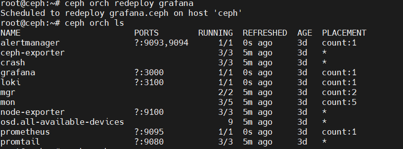

# Các câu lệnh thường dùng

## 1. Giám sát và Trạng thái (Monitoring and Health)
### ceph -s
Hiển thị tóm tắt trạng thái của cluster.

```
# ceph -s
cluster 1c528497-24e0-4af7-bb18-d43a8d31cecc
health HEALTH_OK
```

### ceph -w

Theo dõi trạng thái đang diễn ra.

### rados df
Hiển thị mức sử dụng (usage) của từng pool và tổng thể.
```
# rados df
pool_name       total_objects   objects     total_avail     clones      copie
rbd             176             9220M       4824G           0           528
total_used      700M            total_space 4833G           missing_on_primary
0               degraded        0           unfound         0           rd_ops
0               rd              351         wr_ops          700M        wr
```

Tuyệt vời! Tôi sẽ chuyển đổi lại nội dung theo yêu cầu của bạn: sử dụng định dạng Markdown chi tiết hơn, phân loại lớn thành tiêu đề cấp 2 (##), các lệnh thành tiêu đề cấp 3 (###), và đặt toàn bộ các ví dụ (Example) vào trong các khối code block (```) để hiển thị đầy đủ.
### ceph df
Hiển thị tổng quan mức sử dụng đĩa, toàn cục và theo từng pool.
```
# ceph df
GLOBAL
POOLS
name        size        avail       ID      raw used    %raw used       max avail       objects
rbd         11172G      11172G      0       501M        0               3724G           0

```
### ceph health detail
Hiển thị chi tiết về các vấn đề sức khỏe (trạng thái hệ thống).
```
# ceph health detail
HEALTH_WARN mon.ceph4 low disk space;
mon.ceph5 low disk space;
mon.ceph6 low disk space
18% avail
mon.ceph4 low disk space
mon.ceph5 low disk space -- 22% avail
mon.ceph6 low disk space 16% avail
```
### ceph osd df tree
Hiển thị cây sử dụng đĩa liên kết với cây CRUSH.
```
# ceph osd df tree
ID  -1  -2  0       3       4       8
weight  10.91034    3.63678 0.90919 0.90919 0.90919 0.90919
reweight    11172G  3724G   1.00000 1.00000 1.00000 1.00000
size    501M    168M    931G    931G    931G    931G
use 11172G  3724G   44760k  42752k  42804k  42616k
avail   0.00    0.00    931G    931G    931G    931G
%use    1.00    1.01    0.00    0.00    0.00    0.00
var 0   0   1.05    1.0 1.0 1.0
type    root    host    69      63      62      62
name    default ceh3    ods.0   ods.3   ods.4   ods.8
```
## 2. Làm việc với Pools và OSDs (Working With Pools and OSDs)
### ceph osd tree
Liệt kê các host, OSD của chúng, trạng thái hoạt động (up/down), trọng số OSD, và reweight cục bộ.
```
# ceph osd tree
ID  -1  class   weight      type    name        host    osd.0   osd.3   osd.6
-10 4.72031 root    default 2.71317 osd.0   osd.3   osd.6
0   hdd     0.90439 osd.0   up      1.00000 PRI-AFF 1.00000 1.00000 1.00000
3   hdd     0.90439 osd.3   up      1.00000 PRI-AFF 1.00000 1.00000 1.00000
6   hdd     0.90439 osd.6   up      1.00000 PRI-AFF 1.00000 1.00000 1.00000
```
### ceph osd stat
In ra bản tóm tắt của bản đồ OSD (OSD map).
```
# ceph osd stat
9 osds: 9 up, 9 in
```
### ceph osd deep-scrub <id>
Hướng dẫn Ceph thực hiện quy trình deep scrubbing (kiểm tra tính nhất quán) trên một OSD.

```
# ceph osd deep-scrub osd.0
osd.0 instructed to deep-scrub
```
### ceph osd find <id>
Hiển thị vị trí của một OSD cụ thể (tên host, cổng, và chi tiết CRUSH).
```
# ceph osd find 0
{
"osd": 0,
"ip": "10.12.xxx.xxx:6804/61412",
"crush_location": {
"host": "ceph4",
"root": "default"
}
}
```
### ceph osd map pool object
Định vị một đối tượng từ một pool. Hiển thị các nhóm vị trí chính và bản sao cho đối tượng đó.
```
# ceph osd map rbd benchmark_data_ceph1_268097_object865
osdmap e115 pool 'rbd' (3) object 'benchmark_data_ceph1_268097_object865' -> pg 3.c9f193ff (3.7f) -> up ([4,6,8], p4) acting ([4,6,8, p4)
```
### ceph osd metadata <id>
Hiển thị siêu dữ liệu OSD (thông tin host và thông tin host).
```
# ceph osd metadata 0
{
"id": 0,
"arch": "x86_64",
"back_addr": "10.12.xxx.xxx:6805/61412",
"back_iface": "eno1",
}
```
### ceph osd out <id>

Đưa một OSD ra khỏi cluster, cân bằng lại dữ liệu của nó sang các OSD khác.
```
# ceph osd out 0
marked out osd.0
```
### ceph osd pool create <pool-name> <pg-number> <pgs-number>
Tạo một pool nhân bản mới với số lượng nhóm vị trí (PG) nhất định.
 
```
# ceph osd pool create test 64 64
pool 'test' created
```
### ceph osd pool delete <pool-name> <pool-name> --yes-i-really-really-mean-it
Xóa một pool. Phải chỉ định tên pool hai lần để xác nhận.
```
# ceph osd pool delete test test --yes-i-really-really-mean-it
pool 'test' removed
```

### ceph osd pool get <pool> all
Lấy tất cả các tham số cho một pool
 
```
# ceph osd pool get rbd all
size: 3
min_size: 2...
```

### ceph osd pool ls detail

Liệt kê các pool và chi tiết của các pool đó.
```
# ceph osd pool ls detail
pool 1 'rbd' replicated size 3 min_size 2 crush_rule 0 object_hash rjenkins
pg_num 128 pgp_num 128 last_change 65 flags hashpspool stripe_width 0
```
### ceph osd pool set <parameter> <value>

Đặt một tham số của pool, ví dụ: "size", "min_size", hoặc "pg_num".

```
# ceph osd pool set rbd min_size 1
set pool 1 min_size to 1
```
### ceph osd reweight <id> <weight>

Tạm thời ghi đè trọng số (weight) cho một OSD.

 
```
# ceph osd reweight 0 0.5 # use 50% of default space on osd.0
```
### ceph osd reweight-by-utilization <percent>

Thay đổi trọng số của OSD dựa trên mức độ sử dụng của chúng.
```
# ceph osd reweight-by-utilization 110
moved 7/576 (1.21528%)
avg 64
stddev 26.7623 -> 26.8328 (expected baseline 7.54247)
min osd.1 with 18 -> 18 pgs (0.28125 -> 0.28125 * mean)
max osd.4 with 102 -> 102 pgs (1.59375 -> 1.59375 * mean)

```
### ceph osd scrub <id>
Khởi tạo một quy trình scrub "nhẹ" trên một OSD.


```
# ceph osd scrub osd.0
osd.0 instructed to scrub
```
### ceph osd test-reweight-by-utilization <percent>

Kiểm tra xem việc đặt trọng số OSD dựa trên mức sử dụng sẽ ảnh hưởng đến việc di chuyển dữ liệu như thế nào.
 
```
# ceph osd test-reweight-by-utilization 110
no change
moved 3/576 (0.520833%)
avg 64
```
### ceph osd set <flag>

Đặt các cờ (flag) khác nhau trên hệ thống con OSD.

```
# ceph osd set noout
# ceph osd set norebalance
```
## 3. Làm việc với Nhóm Vị trí (Working With Placement Group)
### ceph pg pg-id query
Truy vấn thống kê và siêu dữ liệu khác về một nhóm vị trí (PG). Hữu ích cho việc khắc phục sự cố.

```
# ceph pg 1.c query
{
"state": "active+clean",
"snap_trimq": "[",
"epoch": 72,
"up": [
7,
38
3,
8
],
...
}
```

### ceph pg pg-id list_missing

Liệt kê các đối tượng không tìm thấy (unfound objects).
 
```
# ceph pg 1.c list_missing
{
"num_missing": 0,
"num_unfound": 0,
"objects": [],
}
```
### ceph pg dump [--format]
Hiển thị thống kê và siêu dữ liệu cho tất cả các nhóm vị trí (PGs). Định dạng có thể là plain hoặc json.

```
# ceph pg dump
dumped all
version 1409550
stamp 2017-10-24 08:51:54.763931
last_osdmap_epoch 0
last_pg_scan 0
full_ratio 0
nearfull_ratio 0...
```

### ceph pg dump_stuck inactive unclean stale undersized degraded
Hiển thị các nhóm vị trí (PG) bị kẹt (stuck PGs).
```
# ceph pg dump_stuck unclean
ok
3.6
pg_stat
active+undersized+
degraded
stat
3.6
active+undersized+
degraded
[7,8]
up
[8,4]
7
up_primary
8
[7,8]
acting
[8,4]
acting_primary
7
8
```

### ceph pg scrub pg-id
Khởi tạo quy trình scrub trên nội dung của các nhóm vị trí.
 
```
# ceph pg scrub 3.0
instructing pg 3.0 on osd.1 to scrub
```

### ceph pg deep-scrub pg-id
Khởi tạo quy trình deep scrub trên nội dung của các nhóm vị trí.

 
```
# ceph pg deep-scrub 3.0
instructing pg 3.0 on osd.1 to deep-scrub
```
### ceph pg repair {pg-id}
Khắc phục các nhóm vị trí (PG) không nhất quán.
```
# ceph pg repair 3.0
instructing pg 3.0 on osd.1 to repair
```
## 4. Tương tác với Daemons (Interaction With Individual Daemons)
### ceph daemon <osd.id> dump_ops_in_flight
Hiển thị danh sách các hoạt động đang hoạt động hiện tại cho một OSD. Hữu ích nếu một hoặc nhiều hoạt động không hoạt động, bị kẹt hoặc bị chặn.
```
# ceph daemon osd.0 dump_ops_in_flight
{
"ops": [
"description": "osd_op(client.24153.0:45 3.33
3:cd6d298e:::benchmark_data_ceph1_268097_object44:h
ead [set-alloc-hint object_size 4194304 write_size
4194304,write 0~4194304] snapc $0=[]$
ondisk+write+known_if_redirected e115)",
"initiated_at": "2017-10-24
}
```

### ceph daemon <daemon-name> help

In ra danh sách các lệnh mà một daemon hỗ trợ.


 
```
#ceph daemon osd.0 help
{
"calc_objectstore_db_histogram": "Generate key value
histogram of kvdb(rocksdb) which used by bluestore",
"compact": "Commpact object store's omap. WARNING:
Compaction probably slows your requests"...
}
```
### ceph daemon <daemon-name> mon_status
In ra thông tin trạng thái cấp cao cho một Monitor.
```
# ceph daemon mon.ceph1 mon_status
{
"name": "ceph1",
"rank": 0,
"state": "leader",
"election_epoch": 6,
"quorum": [
0.
1.
2
],
...
}
```
### ceph daemon <osd.id> status
In ra thông tin trạng thái cấp cao cho một OSD.
```
# ceph daemon osd.0 status
{
"cluster_fsid":
"82282e8f-b8ff-4ec2-b564-e06a3e514fb7",
"osd_fsid": "f05ea8f0-df33-440b-8921-511a93f2ec96",
"whoami": 0,
}
```
### ceph daemon <daemon-name> perf dump
In ra thống kê hiệu suất.
```
# ceph daemon client.radosgw.primary perf dump
"cct": ("total_workers": 16, "unhealthy_workers": 0).
"client.radosgw.primary": { "req": 1156723,....
```

## 5. Xác thực và Ủy quyền (Authentication and Authorization)
### ceph auth list
Liệt kê các tài khoản người dùng đã được cài đặt.
```
# ceph auth list
installed auth entries:
osd.0
key:
AQDUICRZKW5JERAA+DFBSVZLsmd0gj
FK6TxS7A==
caps: [mgr] allow profile osd
caps: [mon] allow profile osd
caps: [osd] allow *
```
### ceph auth get-or-create
Lấy chi tiết người dùng, hoặc tạo người dùng nếu chưa tồn tại.
```
# ceph auth get-or-create client.rbd mon
'allow r' osd 'allow rw pool=rbd'
[client.rbd] key = Axxxxxxxxxxx==
```
### ceph auth delete
Xóa một người dùng.
### ceph auth caps
Thêm hoặc xóa quyền hạn cho một người dùng. Quyền hạn được nhóm theo loại daemon (mon, osd, mds).
```
# ceph auth caps client.bob mon 'allow *'
osd 'allow *' mds 'allow *' updated caps
for client.user1
```
## 6. Tiện ích Lưu trữ Đối tượng (Object Store Utility - RADOS)
### rados -p pool put object file

Tải một tệp lên một pool, đặt tên cho đối tượng kết quả.
### rados -p pool ls

Liệt kê các đối tượng trong một pool.

### rados -p pool get object file
Tải xuống một đối tượng từ một pool vào một tệp cục bộ.
### rados -p pool rm object
Xóa một đối tượng khỏi một pool.

### rados -p pool listwatchers object

Liệt kê những watcher của một đối tượng trong pool.
```
#rados -p rbd listwatchers
benchmark_data_cephl_268097_object
865watcher 12.10.x.x:0/330978585
client.28223 cookie $=1$
```

### rados bench seconds mode [-b object-size] [-t threads ]
Chạy thử nghiệm hiệu năng tích hợp (benchmark) trong một khoảng thời gian nhất định (giây).
 ```
#rados bench -p rbd 120 write
--no-cleanup
hints $=1$
Maintaining 16 concurrent writes of
4194304 bytes to objects of size 4194304
for up to 120 seconds or 0 objects
```
### `ceph orch redeploy `
- Lệnh ceph orch redeploy là một công cụ mạnh mẽ, ép buộc Ceph áp dụng lại cấu hình dịch vụ và khởi động lại các daemon. Redeploy thực hiện việc khởi động lại hoàn toàn kèm theo việc áp dụng lại cấu hình, trong khi restart chỉ khởi động lại một cách nhẹ nhàng mà không đọc lại toàn bộ cấu hình. Chỉ nên sử dụng redeploy khi thực sự cần thiết, chẳng hạn để các thay đổi về cấu hình hoặc phiên bản có hiệu lực.



#### Một số thay đổi quan trọng 
1. Khi chỉnh sửa các tham số đòi hỏi phải khởi động lại dịch vụ để áp dụng:

```bash
ceph config set mds mds_cache_memory_limit 8G
ceph orch redeploy mds
```

2. Khi một số daemon đang chạy các phiên bản khác nhau sau khi nâng cấp

```bash
ceph orch redeploy mon  # Dành cho sự khác biệt phiên bản monitor
```

3. Khi các dịch vụ ở trạng thái thất bại hoặc lỗi và không tự phục hồi:
```bash
ceph orch redeploy grafana
```

4. Sau khi áp dụng các bản vá CVE đòi hỏi khởi động lại dịch vụ:

```bash
ceph orch redeploy all  # Dành cho cập nhật bảo mật toàn cụm
```

5. Khi dịch vụ bị giết do hết bộ nhớ (OOM) hoặc chạm giới hạn tài nguyên:

```bash
ceph orch redeploy osd --name osd.12  # Dành cho OSD cụ thể đang gặp vấn đề
```

6. Sau khi cập nhật chứng chỉ SSL cho RGW hoặc dashboard MGR:
```bash
ceph orch redeploy rgw
```

7. Khi chỉnh sửa thiết lập mạng cụm ảnh hưởng đến giao tiếp daemon:
```bash
ceph orch redeploy mon
```

8. Đối với các cảnh báo như "daemon không chạy phiên bản mới nhất" hoặc "cấu hình chưa áp dụng":

```bash
ceph orch redeploy mds.mycluster
```

- Khi Không Nên Sử Dụng Redeploy:
    - Để khởi động lại thông thường (thay vào đó dùng ceph orch restart)
    - Trong giờ cao điểm làm việc (gây gián đoạn dịch vụ tạm thời)
    - Là bước khắc phục sự cố đầu tiên (kiểm tra nhật ký trước với ceph logs)

> Luôn kiểm tra trạng thái dịch vụ trước:
> ```bash
>ceph orch ps --daemon-type mds  # Kiểm tra trạng thái >MDS trước khi redeploy
>ceph orch redeploy mds --dry-run  # Xem trước những gì sẽ xảy ra
```
