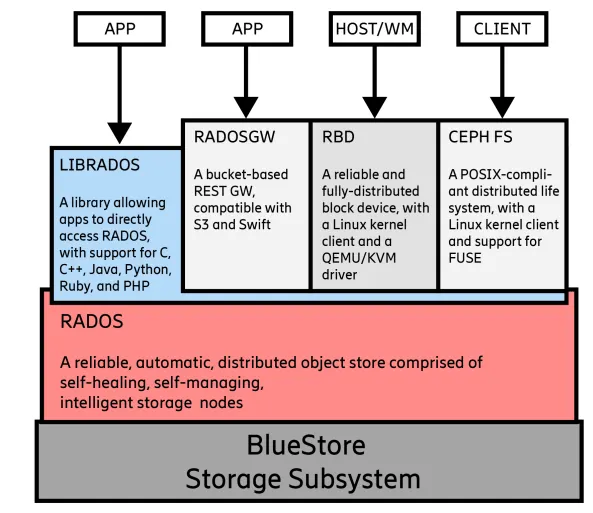

# Kiến trúc Ceph 

## 1. Tổng quan về Ceph
- Ceph là một nền tảng lưu trữ phân tán mã nguồn mở, được thiết kế để cung cấp một hệ thống lưu trữ hợp nhất với khả năng hỗ trợ đồng thời ba mô hình phổ biến: **object storage, block storage và file storage**. Thay vì phụ thuộc vào một thiết bị lưu trữ trung tâm có chi phí cao và khó mở rộng, Ceph phân tán dữ liệu lên nhiều node trong cùng một cụm, từ đó cho phép hệ thống tăng trưởng theo chiều ngang và duy trì tính sẵn sàng cao ngay cả khi một số thành phần gặp sự cố.

> Key note: Ceph không phải là ba hệ lưu trữ tách biệt gồm block, file và object, mà là một lõi lưu trữ duy nhất có thể trình bày ra ngoài bằng ba kiểu giao diện khác nhau. Điểm cốt lõi của kiến trúc Ceph là: backend thật chỉ có một, còn RBD, CephFS và RGW chỉ là ba cách truy cập khác nhau vào cùng một lõi đó. Vì vậy, khi học Ceph, phải luôn tự hỏi “thứ mà ứng dụng nhìn thấy là gì” và “thứ mà Ceph thực sự lưu bên dưới là gì”, vì hai thứ đó rất thường không trùng nhau.

- Điểm quan trọng của Ceph không chỉ nằm ở việc lưu trữ dữ liệu trên nhiều máy chủ, mà còn ở cách hệ thống tổ chức, định vị và bảo vệ dữ liệu. Ceph sử dụng cơ chế phân phối dữ liệu theo **object**, ánh xạ qua **Placement Group (PG)** và xác định vị trí lưu trữ bằng **thuật toán CRUSH**. Nhờ đó, hệ thống không cần một bộ điều phối I/O tập trung cho từng thao tác đọc ghi, giúp giảm bottleneck và tăng khả năng mở rộng khi số lượng node hoặc dung lượng lưu trữ tăng lên.

- Trong thực tế, Ceph thường được sử dụng trong các môi trường cần dung lượng lớn, tính sẵn sàng cao và khả năng mở rộng linh hoạt, chẳng hạn như hạ tầng cloud, nền tảng ảo hóa, hệ thống backup, kho dữ liệu media, hoặc các hệ thống lưu trữ cho ứng dụng phân tán. Với kiến trúc không phụ thuộc phần cứng chuyên dụng, Ceph đặc biệt phù hợp với mô hình triển khai trên phần cứng thông thường, giúp doanh nghiệp tiết kiệm chi phí đầu tư ban đầu và dễ dàng mở rộng khi cần thiết.

### Vì sao cần Ceph

- Các hệ thống lưu trữ truyền thống như SAN hoặc NAS thường được xây dựng theo hướng tập trung, nghĩa là dữ liệu và hiệu năng phụ thuộc vào một cụm thiết bị chuyên dụng hoặc một vài storage controller trung tâm. Mô hình này có thể phù hợp trong phạm vi nhỏ hoặc nhu cầu ổn định, nhưng khi hệ thống tăng trưởng nhanh về dữ liệu hoặc số lượng workload, chi phí mở rộng thường rất cao và việc nâng cấp cũng trở nên phức tạp hơn.

- Ceph ra đời để giải quyết các hạn chế này bằng cách tiếp cận theo hướng **distributed storage**. Thay vì dồn tải vào một thiết bị trung tâm, Ceph phân tán cả dữ liệu lẫn trách nhiệm xử lý I/O ra nhiều node. Khi cần thêm dung lượng hoặc hiệu năng, có thể mở rộng bằng cách bổ sung node hoặc đĩa mới vào cluster thay vì thay thế toàn bộ thiết bị lưu trữ hiện có. Điều này giúp hệ thống linh hoạt hơn, giảm phụ thuộc vào vendor và tránh được mô hình scale-up tốn kém.

- Các ưu điểm chính của Ceph có thể tóm tắt như sau:

   - Hỗ trợ scale-out bằng cách bổ sung node hoặc OSD mới vào cluster
   - Không phụ thuộc vào storage appliance chuyên dụng
   - Cung cấp đồng thời object, block và file trên cùng một nền tảng
   - Có cơ chế replication, self-healing và rebalance
   - Hạn chế điểm lỗi tập trung trong kiến trúc lưu trữ
   Phù hợp với môi trường cloud, virtualization và hạ tầng dữ liệu lớn

### Các loại dịch vụ lưu trữ Ceph cung cấp

- Ceph không chỉ là một cụm ổ đĩa phân tán, mà là một nền tảng cung cấp nhiều kiểu truy cập dữ liệu khác nhau trên cùng một lõi lưu trữ. Ở tầng dịch vụ, Ceph có thể phục vụ object storage thông qua giao diện tương thích S3 hoặc Swift, block storage thông qua RBD, và file storage thông qua CephFS. Dù khác nhau về cách ứng dụng nhìn thấy dữ liệu, các mô hình này đều sử dụng chung nền tảng RADOS để lưu trữ và phân phối dữ liệu xuống các OSD trong cluster.

   - **Object Storage:** phù hợp cho dữ liệu phi cấu trúc như ảnh, video, file backup, log, archive
   - **Block Storage:** phù hợp cho VM, container hoặc ứng dụng cần block device
   - **File Storage:** phù hợp cho các ứng dụng cần truy cập theo mô hình file/thư mục truyền thống

> Cả ba đều là các lớp dịch vụ nằm phía trên lõi lưu trữ Ceph. Chúng khác nhau ở cách ứng dụng truy cập dữ liệu, nhưng đều dựa vào cùng một cơ chế phân phối và lưu trữ bên dưới.

## 2. Kiến trúc tổng thể của Ceph

- Ceph được xây dựng như một hệ thống gồm nhiều daemon chuyên trách, phối hợp với nhau để tạo thành một cụm lưu trữ phân tán thống nhất. Mỗi daemon giữ một vai trò riêng: có daemon đảm nhiệm việc duy trì trạng thái và bản đồ cluster, có daemon chịu trách nhiệm lưu trữ dữ liệu thực tế, có daemon cung cấp giao diện truy cập cho ứng dụng, và có daemon hỗ trợ quản trị hoặc metadata. Nhờ sự phân tách vai trò này, Ceph vừa linh hoạt trong triển khai, vừa dễ mở rộng và thay thế từng thành phần khi cần.

- Ở góc nhìn kiến trúc, có thể hình dung Ceph như một hệ thống gồm hai phần lớn. 
   - Phần thứ nhất là mặt điều khiển và quản trị, bao gồm MON và MGR, chịu trách nhiệm giữ trạng thái cụm, quản lý bản đồ phân phối dữ liệu và cung cấp khả năng giám sát. 
   - Phần thứ hai là mặt dữ liệu, chủ yếu do OSD đảm nhiệm, nơi dữ liệu thực tế được ghi xuống đĩa, nhân bản, phục hồi và cân bằng lại trong cluster. Các dịch vụ như RGW hoặc CephFS đứng ở lớp giao tiếp với ứng dụng, nhưng cuối cùng dữ liệu vẫn đi xuống lõi RADOS và được lưu trữ thông qua OSD.

### Các thành phần chính trong cluster
- MON (Monitor)

   - Monitor là thành phần giữ vai trò duy trì trạng thái logic của cluster. MON không lưu dữ liệu người dùng, nhưng lại rất quan trọng vì nó quản lý các bản đồ của cụm như monitor map, osd map, crush map và một số thông tin cấu hình liên quan. Client và các daemon khác cần lấy các bản đồ này để biết cluster đang có những thành phần nào, trạng thái của chúng ra sao và dữ liệu sẽ được ánh xạ như thế nào.

   - MON hoạt động dựa trên cơ chế đồng thuận để đảm bảo toàn cluster nhìn thấy một trạng thái nhất quán. Vì vậy, trong thực tế người ta thường triển khai số lượng MON là số lẻ, phổ biến là 3 hoặc 5 node, nhằm duy trì quorum khi một node gặp lỗi.

- MGR (Manager)
 
   - Manager là thành phần hỗ trợ quản trị và giám sát. Nếu MON giữ vai trò duy trì trạng thái cốt lõi của cluster, thì MGR giúp người vận hành quan sát cluster một cách trực quan hơn thông qua dashboard, metrics và các module tích hợp như Prometheus. MGR không thay thế MON mà hoạt động bổ trợ, cung cấp thêm thông tin vận hành và các tiện ích quản trị cần thiết.

   - Trong các môi trường triển khai thực tế, MGR thường được dùng để:

      - cung cấp dashboard quản trị
      - xuất metrics phục vụ monitoring
      - hỗ trợ các module mở rộng của Ceph
      - OSD (Object Storage Daemon)

- OSD là thành phần quan trọng nhất ở mặt dữ liệu, vì đây là nơi dữ liệu được lưu trữ thực tế. Mỗi OSD thường gắn với một thiết bị lưu trữ hoặc một phần tài nguyên lưu trữ cụ thể. OSD chịu trách nhiệm nhận yêu cầu đọc ghi, lưu object xuống đĩa, đồng bộ replica, tham gia recovery khi có lỗi và thực hiện rebalance khi cluster thay đổi topology.

- Có thể xem OSD là “xương sống” của cluster Ceph. Khi nói Ceph lưu dữ liệu trên nhiều node, điều đó thực chất có nghĩa là dữ liệu đang được phân phối trên nhiều OSD khác nhau trong cluster.

- MDS (Metadata Server)

   - Metadata Server là thành phần chỉ cần thiết khi sử dụng CephFS. Vai trò của MDS là quản lý metadata của filesystem như cấu trúc thư mục, quyền truy cập, inode và các thông tin cần thiết để thao tác file diễn ra hiệu quả. MDS không thay thế OSD trong việc lưu dữ liệu file; dữ liệu thực tế vẫn nằm trên OSD, còn MDS chủ yếu xử lý metadata.

- RGW (RADOS Gateway)

   - RGW là dịch vụ cung cấp object storage thông qua các giao thức tương thích S3 hoặc Swift. Khi ứng dụng cần truy cập Ceph theo kiểu object storage qua HTTP API, RGW sẽ là lớp gateway tiếp nhận yêu cầu và chuyển đổi chúng xuống lõi lưu trữ Ceph. Tuy nhiên, ở góc độ kiến trúc tổng quan, RGW chỉ là một lớp giao tiếp; dữ liệu sau cùng vẫn được quản lý và lưu trữ bởi RADOS và OSD.

- Bảng tóm tắt vai trò các thành phần

| Thành phần | Vai trò chính                                         | Có lưu dữ liệu người dùng trực tiếp không |
| ---------- | ----------------------------------------------------- | ----------------------------------------- |
| MON        | Duy trì cluster map, trạng thái và quorum             | Không                                     |
| MGR        | Quản trị, dashboard, metrics, module mở rộng          | Không                                     |
| OSD        | Lưu dữ liệu thực tế, replication, recovery, rebalance | Có                                        |
| MDS        | Quản lý metadata cho CephFS                           | Không lưu dữ liệu chính                   |
| RGW        | Cung cấp API object storage tương thích S3/Swift      | Không phải lớp lưu trữ cuối cùng          |

## 3. Đặc điểm kiến trúc của Ceph
- Kiến trúc không có central gateway

   - Một trong những điểm khác biệt quan trọng của Ceph so với nhiều hệ thống lưu trữ truyền thống là Ceph không bắt buộc mọi thao tác đọc ghi phải đi qua một storage controller hay gateway trung tâm. Thay vào đó, client chỉ cần lấy cluster map từ MON, sau đó có thể tự tính toán vị trí dữ liệu và giao tiếp trực tiếp với OSD phù hợp.

   - Cách tiếp cận này đem lại hai lợi ích lớn. Thứ nhất, nó giảm áp lực lên một điểm trung tâm, từ đó hạn chế nguy cơ bottleneck khi số lượng client tăng cao. Thứ hai, nó giúp kiến trúc mở rộng tốt hơn, bởi vì khi cluster lớn dần, client vẫn có thể tự xác định vị trí dữ liệu mà không cần tra cứu qua một metadata service tập trung cho từng I/O. Đây là một trong những nền tảng giúp Ceph đạt được khả năng scale-out hiệu quả.

- Kiến trúc phân lớp

   - Nếu nhìn Ceph theo góc độ kiến trúc logic, hệ thống có thể được chia thành ba lớp. Ở trên cùng là lớp dịch vụ, nơi ứng dụng truy cập dữ liệu thông qua object, block hoặc file. Ở giữa là lõi RADOS, chịu trách nhiệm quản lý object, phân phối dữ liệu, ánh xạ qua PG và chọn vị trí lưu trữ bằng CRUSH. Ở dưới cùng là lớp lưu trữ vật lý, nơi các OSD sử dụng backend lưu trữ để ghi dữ liệu xuống thiết bị thực tế.

   - Cách phân lớp này giúp việc hiểu Ceph trở nên rõ ràng hơn. Các dịch vụ như RBD, RGW hay CephFS không trực tiếp quyết định dữ liệu nằm ở đâu trên đĩa; chúng chỉ là lớp cung cấp giao diện cho ứng dụng. Việc phân phối, nhân bản và lưu object cuối cùng đều do lõi RADOS và các OSD đảm nhiệm.

- Có thể tóm tắt luồng kiến trúc phân lớp như sau:

   - Lớp dịch vụ: RBD, RGW, CephFS
   - Lõi lưu trữ: RADOS, PG, CRUSH, replication logic
   - Lớp vật lý: OSD, disk, SSD/HDD/NVMe, backend BlueStore

## 4. Các khái niệm cơ bản trong Ceph
- Để hiểu kiến trúc Ceph, cần nắm rõ một số khái niệm nền tảng. Đây là các khái niệm xuất hiện xuyên suốt trong mọi mô hình triển khai và gần như quyết định cách dữ liệu được tổ chức trong cluster.

- **Pool**

   - Pool là vùng logic dùng để nhóm dữ liệu theo chính sách lưu trữ nhất định. Mỗi pool có thể được cấu hình số replica, quy tắc CRUSH, hoặc các thuộc tính khác phù hợp với loại workload cần phục vụ. Trong thực tế, người vận hành thường tạo nhiều pool khác nhau để tách biệt loại dữ liệu hoặc tách biệt chính sách vận hành giữa các dịch vụ.

   - Một object trong Ceph luôn thuộc về một pool cụ thể. Điều đó có nghĩa là trước khi dữ liệu được ánh xạ xuống OSD nào, hệ thống phải biết object đó đang thuộc pool nào và pool đó áp dụng chính sách phân phối nào.

- **Object**

   - Object là đơn vị lưu trữ cơ bản trong Ceph. Dù ứng dụng nhìn thấy dữ liệu dưới dạng block device, file hay object API, thì ở tầng lõi, Ceph vẫn quản lý dữ liệu dưới dạng object. Đây là điểm rất quan trọng, vì nó cho thấy lõi lưu trữ của Ceph có tính thống nhất: nhiều giao diện truy cập khác nhau, nhưng cuối cùng đều hội tụ về cùng một mô hình object-based storage.

- **Placement Group (PG)**

   - Placement Group là lớp trung gian giữa object và OSD. Ceph không ánh xạ từng object trực tiếp tới từng OSD, vì làm như vậy sẽ khiến metadata và quá trình quản lý trở nên quá phức tạp khi số lượng object lớn. Thay vào đó, object trước tiên được ánh xạ vào một PG, và PG mới được ánh xạ tới một tập OSD.

   - Nhờ có PG, Ceph có thể cân bằng dữ liệu, thực hiện recovery và rebalance hiệu quả hơn. Đây là một trong những cơ chế quan trọng giúp cluster xử lý hàng triệu hoặc hàng tỷ object mà không cần quản lý từng object theo kiểu thủ công hay tập trung.

- **CRUSH**

   - CRUSH là thuật toán xác định vị trí lưu trữ dữ liệu trong Ceph. Thay vì hỏi một metadata server trung tâm “object này nằm ở đâu”, Ceph cho phép client hoặc OSD tự tính ra vị trí dữ liệu dựa trên object, pool và CRUSH map. Cách làm này khiến hệ thống có tính phân tán cao hơn, giảm phụ thuộc vào một điểm điều phối trung tâm cho từng thao tác đọc ghi.

   - CRUSH không chỉ chọn OSD một cách ngẫu nhiên. Nó còn tuân theo topology của cluster, ví dụ phân tán replica theo host, rack hoặc failure domain đã định nghĩa. Nhờ vậy, Ceph vừa cân bằng dữ liệu, vừa hỗ trợ tăng khả năng chịu lỗi của toàn hệ thống.

- **Replica và Primary OSD**

   - Với pool dạng replicated, mỗi PG sẽ được gán cho một nhóm OSD. Trong nhóm đó, một OSD đóng vai trò primary, còn các OSD khác giữ replica. Primary OSD là đầu mối xử lý yêu cầu đọc ghi từ client, đồng thời điều phối việc sao chép dữ liệu sang các replica để đảm bảo dữ liệu được bảo vệ theo chính sách cấu hình.

   - Cơ chế này cho phép Ceph duy trì dịch vụ khi một OSD hoặc một node bị lỗi. Khi thành phần primary không còn khả dụng, cluster có thể bầu chọn lại vai trò primary trong tập OSD của PG tương ứng để tiếp tục phục vụ dữ liệu.

- **BlueStore**

   - BlueStore là backend lưu trữ mặc định của Ceph OSD trong các phiên bản hiện đại. Khác với kiến trúc cũ dựa trên filesystem trung gian, BlueStore cho phép OSD quản lý dữ liệu trực tiếp trên thiết bị lưu trữ, đồng thời sử dụng cơ chế metadata riêng để tối ưu hiệu năng và độ tin cậy.

   - Ở góc độ kiến trúc, BlueStore là lớp gần với phần cứng nhất trong OSD. Nó không thay đổi các nguyên lý phân phối dữ liệu của Ceph, nhưng ảnh hưởng trực tiếp đến cách dữ liệu được ghi xuống đĩa và hiệu năng của hệ thống lưu trữ.

- Bảng tóm tắt các khái niệm cốt lõi

| Khái niệm   | Ý nghĩa                                                    |
| ----------- | ---------------------------------------------------------- |
| Pool        | Vùng logic chứa dữ liệu với chính sách lưu trữ riêng       |
| Object      | Đơn vị lưu trữ cơ bản trong Ceph                           |
| PG          | Lớp trung gian để ánh xạ object đến OSD                    |
| CRUSH       | Thuật toán xác định vị trí dữ liệu trong cluster           |
| Primary OSD | OSD chịu trách nhiệm chính cho một PG                      |
| Replica OSD | OSD giữ bản sao dữ liệu của PG                             |
| BlueStore   | Backend lưu trữ của OSD để ghi dữ liệu xuống thiết bị thực |

## 5. Luồng dữ liệu trong Ceph

- Luồng dữ liệu của Ceph được thiết kế theo hướng phân tán và cluster-aware. Client không gửi dữ liệu vào một storage controller tập trung rồi chờ controller đó chuyển tiếp xuống đĩa, mà tự xác định vị trí dữ liệu dựa trên cluster map. Cơ chế này là nền tảng cho hiệu năng mở rộng và khả năng vận hành phân tán của Ceph.

- **Luồng ghi dữ liệu**

   - Khi một client thực hiện thao tác ghi, bước đầu tiên là lấy hoặc cập nhật cluster map từ MON. Từ các thông tin này, client biết được pool, cấu trúc PG và trạng thái OSD hiện tại của cluster. Dựa trên object cần ghi và các thông tin trong map, client hoặc tầng truy cập tương ứng sẽ xác định object thuộc PG nào, rồi từ PG đó suy ra tập OSD lưu trữ thông qua thuật toán CRUSH.

   - Sau khi xác định được tập OSD, client sẽ gửi yêu cầu đến primary OSD của PG tương ứng. Primary OSD chịu trách nhiệm tiếp nhận thao tác ghi, xử lý ghi cục bộ và điều phối việc đồng bộ dữ liệu sang các replica OSD còn lại. Chỉ khi điều kiện xác nhận ghi được đáp ứng theo cấu hình của pool, primary OSD mới phản hồi thành công cho client. Nhờ cơ chế này, Ceph có thể đảm bảo tính nhất quán và độ bền dữ liệu trong môi trường phân tán.

- Có thể tóm tắt luồng ghi ở mức khái quát như sau:

   - Client lấy cluster map từ MON
   - Xác định object thuộc pool và PG nào
   - Dùng CRUSH để xác định tập OSD của PG
   - Gửi yêu cầu ghi đến primary OSD
   - Primary OSD ghi dữ liệu và đồng bộ replica
   - Hoàn tất thao tác khi đạt điều kiện xác nhận ghi

- **Luồng đọc dữ liệu**

   - Luồng đọc dữ liệu của Ceph về bản chất cũng bắt đầu từ việc client nắm được cluster map. Từ object cần đọc, client xác định PG tương ứng và biết được primary OSD đang phụ trách PG đó. Theo cơ chế mặc định, client sẽ đọc dữ liệu từ primary OSD để đảm bảo nhận được phiên bản nhất quán và mới nhất.

   - So với luồng ghi, luồng đọc đơn giản hơn vì không cần quá trình nhân bản dữ liệu tới các replica trước khi trả lời. Dữ liệu được trả trực tiếp từ OSD về client. Chính vì vậy, trong nhiều trường hợp, thao tác đọc có độ trễ thấp hơn và luồng xử lý ngắn hơn so với thao tác ghi.

- So sánh luồng ghi và luồng đọc

| Tiêu chí             | Luồng ghi                                | Luồng đọc                        |
| -------------------- | ---------------------------------------- | -------------------------------- |
| Mục tiêu chính       | Đảm bảo độ bền và tính nhất quán dữ liệu | Truy xuất dữ liệu nhanh và đúng  |
| Thành phần điều phối | Primary OSD phối hợp với replica OSD     | Primary OSD                      |
| Độ phức tạp          | Cao hơn do có replication                | Thấp hơn                         |
| Độ trễ               | Thường cao hơn                           | Thường thấp hơn                  |
| Điều kiện phản hồi   | Sau khi đạt điều kiện xác nhận ghi       | Sau khi lấy được dữ liệu cần đọc |

> Điểm quan trọng cần nhấn mạnh là MON không trực tiếp xử lý dữ liệu người dùng. MON chỉ giữ vai trò cung cấp bản đồ cluster và trạng thái logic cần thiết để client và OSD biết cách làm việc với nhau. Việc đọc ghi thực tế diễn ra chủ yếu giữa client và OSD. Đây là yếu tố cốt lõi giúp Ceph tránh được mô hình “mọi I/O phải đi qua một bộ điều phối trung tâm”, từ đó tăng khả năng mở rộng của hệ thống khi số lượng client hoặc dung lượng dữ liệu tăng lên.

## 6. Tính sẵn sàng cao và khả năng mở rộng
- Ceph được xây dựng để vận hành trong môi trường mà lỗi phần cứng là điều phải chấp nhận thay vì phải cố loại bỏ hoàn toàn. Trong các cluster lớn, việc một ổ đĩa hỏng, một OSD down hoặc một node ngừng hoạt động là điều có thể xảy ra bất cứ lúc nào. Kiến trúc của Ceph vì vậy tập trung vào khả năng tiếp tục vận hành và phục hồi tự động, thay vì phụ thuộc vào một thiết bị “không được phép lỗi”.

- **Quorum của MON**

   - Do MON là thành phần giữ trạng thái logic của cluster, Ceph cần một số lượng MON đủ để duy trì quorum. Nếu mất quorum, cluster có thể không còn khả năng xác nhận trạng thái chính xác và việc vận hành bình thường sẽ bị ảnh hưởng. Đây là lý do vì sao số lượng MON thường được triển khai theo số lẻ.

      - Với 2 MON, nếu mất 1 MON thì cluster không còn đa số
      - Với 3 MON, cluster vẫn duy trì quorum khi mất 1 MON
      - Với 5 MON, cluster có thể chịu lỗi tốt hơn nhưng chi phí vận hành cũng cao hơn
- **Self-healing và recovery**

   - Khi một OSD hoặc một node gặp lỗi, Ceph không coi đó là tình huống ngoại lệ phải xử lý thủ công ngay lập tức ở mọi trường hợp. Thay vào đó, cluster sẽ đánh giá lại trạng thái PG, xác định nơi nào thiếu replica và tự động thực hiện quá trình recovery để đưa dữ liệu về trạng thái an toàn theo chính sách lưu trữ đã cấu hình.

   - Khả năng self-healing này là một trong những lý do Ceph phù hợp với hệ thống lưu trữ quy mô lớn. Hệ thống không chỉ phát hiện lỗi, mà còn có cơ chế tái phân phối dữ liệu để phục hồi mức redundancy mong muốn sau khi xảy ra lỗi phần cứng hoặc thay đổi topology.

- **Rebalance và scale-out**

   - Khi thêm node hoặc OSD mới vào cluster, Ceph sẽ không coi phần tài nguyên mới là một vùng hoàn toàn tách biệt. Thay vào đó, cluster sẽ dần rebalance dữ liệu để tận dụng tài nguyên vừa được bổ sung. Đây chính là cơ chế giúp Ceph mở rộng theo chiều ngang: khi cần thêm dung lượng hoặc tăng hiệu năng tổng thể, người vận hành có thể bổ sung phần cứng mới vào cluster thay vì thay thế toàn bộ hệ thống cũ.

   - Tuy nhiên, cần hiểu rằng scale-out trong Ceph không chỉ đơn giản là “thêm node là xong”. Việc mở rộng sẽ kéo theo quá trình rebalance, tiêu tốn băng thông, tài nguyên đĩa và thời gian để dữ liệu được phân phối lại theo topology mới. Vì vậy, đây là khả năng mạnh của Ceph, nhưng vẫn cần được thiết kế và vận hành hợp lý.

## 7. Kết luận

- Ceph là một hệ thống lưu trữ phân tán thống nhất, trong đó dữ liệu được quản lý dưới dạng object, phân phối thông qua Placement Group và được lưu trên các OSD theo thuật toán CRUSH. Các dịch vụ như object, block và file chỉ là các lớp truy cập ở phía trên; còn về bản chất, dữ liệu cuối cùng vẫn đi xuống cùng một lõi lưu trữ RADOS.

- Điểm mạnh kiến trúc của Ceph nằm ở việc loại bỏ sự phụ thuộc vào một storage controller trung tâm cho từng thao tác I/O, đồng thời tận dụng cơ chế replication, quorum, self-healing và rebalance để duy trì khả năng hoạt động trong môi trường có lỗi phần cứng. Nhờ đó, Ceph phù hợp cho các hệ thống cần vừa mở rộng tốt, vừa duy trì độ sẵn sàng cao, đặc biệt trong các hạ tầng cloud, ảo hóa và lưu trữ dữ liệu quy mô lớn.
