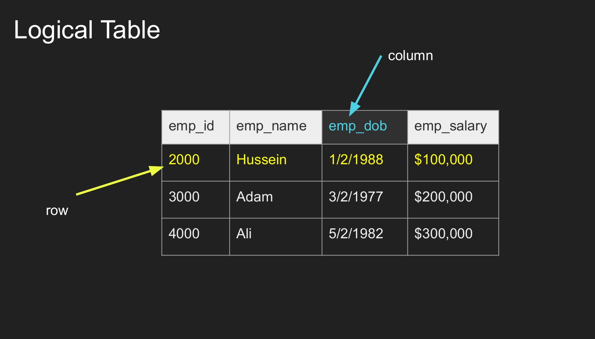
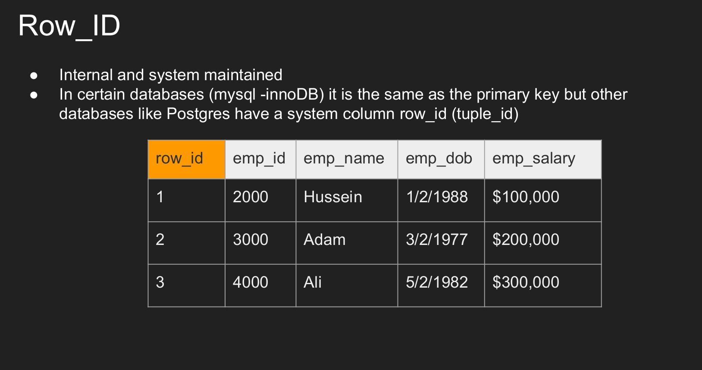
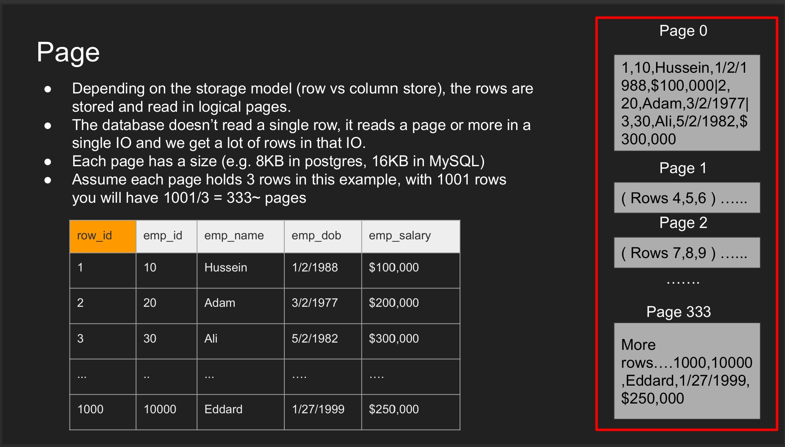
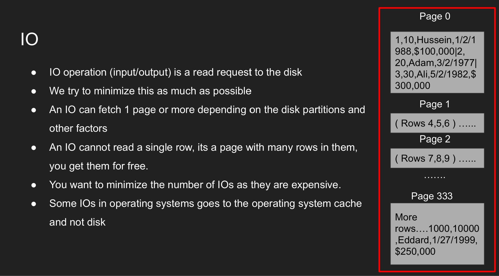
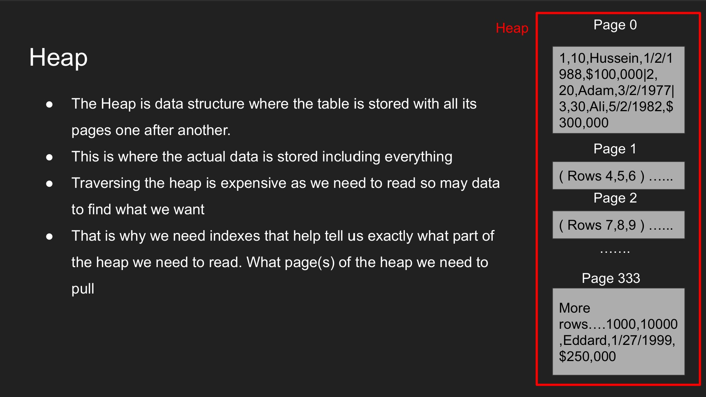
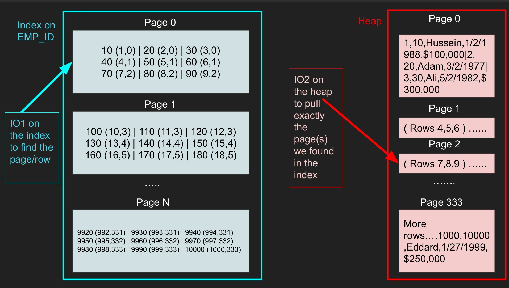

# Index: B-Tree, LSM, Hash, Full-Text

## Overview

Index là cấu trúc dữ liệu giúp database tìm dữ liệu nhanh hơn, đổi lại tốn storage, memory và chi phí ghi. Index không phải "càng nhiều càng tốt"; mỗi index là một phần phải được maintain khi insert, update hoặc delete.

## B-Tree

B-tree/B+tree là index phổ biến trong relational database.

Phù hợp cho:

- Equality lookup.
- Range query.
- ORDER BY theo key.
- Prefix match trong một số điều kiện.

Điểm cần chú ý:

- Composite index phụ thuộc thứ tự column.
- Low-cardinality column đứng một mình thường ít hiệu quả.
- Index có thể bị bỏ qua nếu predicate không selective hoặc statistics sai.

B+tree thường được database ưu tiên vì internal node chủ yếu dùng để điều hướng, leaf node chứa key và pointer/value, và leaf node có thể liên kết để range scan hiệu quả. Với query range, engine tìm leaf đầu tiên rồi đi ngang qua leaf liên tiếp thay vì tìm lại từ root cho từng key.

## Table, Page, Heap Và Row Identifier

Database không đọc từng row riêng lẻ từ disk. Storage engine thường đọc/ghi theo **page** hoặc **block**. Một page chứa nhiều row hoặc nhiều giá trị column tùy storage model, nên một I/O có thể mang theo dữ liệu dư mà query không cần, nhưng cũng có thể giúp các row gần nhau được đọc "miễn phí".

Logical table là mô hình mà user nhìn thấy: row, column và giá trị có cấu trúc.



Các khái niệm nền tảng:

- **Logical table**: hình ảnh logic mà user thấy, gồm row và column.
- **Page/block**: đơn vị I/O vật lý hoặc gần vật lý mà engine đọc/ghi.
- **Heap**: vùng lưu data row thực tế, thường là các page nối tiếp hoặc được quản lý bởi storage engine.
- **Row identifier**: địa chỉ nội bộ để tìm row, ví dụ tuple id trong PostgreSQL hoặc khóa clustered trong InnoDB.

Row identifier là địa chỉ nội bộ do engine duy trì để định vị row trong backend vật lý.



Page/block là đơn vị I/O quan trọng: engine thường đọc một page hoặc nhiều page, không đọc một cell hay một row đơn lẻ.



I/O càng ít và càng có khả năng hit cache thì query càng dễ có latency thấp.



Khi không có index phù hợp, engine có thể phải scan nhiều page của heap để tìm row. Khi có index phù hợp, engine đọc index trước để tìm key và vị trí row, sau đó fetch page tương ứng trong heap hoặc trong clustered index.

Heap là nơi chứa data row thực tế trong mô hình heap table.



```text
query predicate
-> index lookup hoặc table scan
-> page/block I/O
-> row visibility/filter
-> trả kết quả
```

Index cũng nằm trên disk theo page và cũng tốn I/O. Vì vậy index nhỏ, selective và hay nằm trong memory/cache thường cho latency tốt hơn index lớn, ít selective hoặc bị cache miss liên tục.

Index lookup thường là hai bước: tìm key trong index rồi fetch page/row tương ứng trong heap hoặc clustered storage.



## Secondary Index Và Clustered Index

Không phải engine nào cũng tổ chức table giống nhau:

- **Heap table + secondary index**: data row nằm trong heap; index trỏ tới row identifier hoặc vị trí tuple trong heap. PostgreSQL điển hình theo mô hình này.
- **Clustered index / Index Organized Table**: table được tổ chức theo một index chính; leaf page của index chứa hoặc định vị trực tiếp data row.
- **InnoDB clustered primary key**: primary key là clustered index; secondary index thường trỏ tới giá trị primary key, rồi engine dùng primary key để tìm row.

Hệ quả vận hành:

- Primary key quá rộng trong InnoDB có thể làm secondary index phình to vì secondary index phải mang theo giá trị primary key.
- Lookup qua secondary index có thể cần thêm bước fetch row thực tế, nên không phải lúc nào index lookup cũng chỉ là một I/O.
- Nếu query chỉ cần column đã có trong index, engine có thể dùng covering/index-only scan tùy engine và visibility rule.

## LSM Tree

LSM tree tối ưu write bằng cách ghi tuần tự vào memory/table log rồi compact xuống disk.

Phù hợp cho:

- Write-heavy workload.
- Distributed key-value/wide-column store.
- Time-series hoặc event ingestion lớn.

Tradeoff:

- Read có thể phải kiểm tra nhiều level nếu compaction chưa tối ưu.
- Compaction dùng CPU/disk I/O và có thể gây latency spike.
- Tombstone/delete cần được quản lý.

## Hash Index

Hash index tốt cho equality lookup theo key, nhưng không phù hợp cho range scan hoặc order.

Phù hợp cho:

- Exact key lookup.
- Cache/key-value style access.

## Full-Text Index

Full-text index phục vụ tìm kiếm token, phrase, ranking hoặc language analysis. Nó khác với B-tree index thông thường.

Phù hợp cho:

- Search theo text.
- Log/document search.
- Relevance ranking.

Nếu search trở thành workload chính, nên cân nhắc search engine chuyên dụng.

## Index Design Checklist

- Query nào chậm và có đáng tối ưu không?
- Predicate filter theo column nào?
- Sort/group theo column nào?
- Selectivity của column ra sao?
- Query trả ít row hay quét phần lớn table?
- Index mới có làm chậm write hoặc tăng storage quá mức không?
- Có duplicate/unused index không?

Với PostgreSQL production, `CREATE INDEX CONCURRENTLY` giảm blocking write nhưng chạy lâu hơn, không chạy trong transaction block thông thường và có thể để lại invalid index nếu fail. Covering/index-only pattern có thể giúp trả query từ index, nhưng đổi lại index lớn hơn và write path tốn chi phí hơn.

## Related Pages

- [Query Planner And Execution Plan](./05-query-planner-and-execution-plan.md)
- [Database Performance](./09-database-performance-latency-throughput-iops.md)
