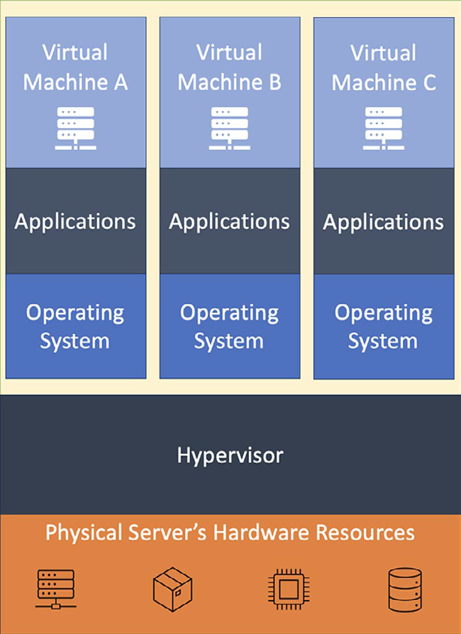

# Virtual Machines And Hypervisors

## Tổng Quan

Virtual machine là server logic chạy trên tài nguyên của một physical host. Hypervisor là lớp tạo, cô lập và điều phối CPU, memory, storage, network cho nhiều VM cùng dùng chung phần cứng.



Mental model:

```text
physical server hardware
  -> hypervisor
  -> virtual CPU / memory / disk / NIC
  -> guest OS
  -> application
```

VM hữu ích vì biến server thành resource có thể cấp phát qua phần mềm: tạo, stop/start, resize, snapshot, migrate, attach/detach disk, gắn network, áp policy và monitor từ xa.

## Hypervisor Type 1 Và Type 2

| Loại | Cách chạy | Dùng khi |
| --- | --- | --- |
| Type 1 / bare-metal hypervisor | Chạy trực tiếp trên physical server | Datacenter, cloud, production virtualization |
| Type 2 / hosted hypervisor | Chạy trên một host OS có sẵn | Desktop lab, local development, training |

Trong production cloud, người dùng thường không vận hành hypervisor trực tiếp. Provider hoặc private-cloud platform quản lý hypervisor, còn user quản lý VM, OS, application, data và configuration tùy shared responsibility model.

## Vì Sao Virtualize

- Tăng utilization của physical host thay vì để server dư CPU/RAM/disk.
- Cấp phát server nhanh hơn so với mua/cắm/cài physical server.
- Dễ chuẩn hóa image, template và baseline security.
- Hỗ trợ scale theo nhu cầu bằng resize hoặc thêm VM sau load balancer.
- Hỗ trợ migration, backup, snapshot và HA tốt hơn physical server đơn lẻ.
- Tách workload bằng isolation ở tầng VM, network và storage.

## VM Live Migration

Live migration di chuyển một VM đang chạy sang host khác với mục tiêu giảm downtime của workload. Mental model phổ biến:

```text
pre-copy memory pages
-> copy lại dirty pages trong lúc VM vẫn chạy
-> stop-and-copy phần còn lại
-> resume VM trên host đích
-> cập nhật network/storage binding
```

Migration hữu ích cho bảo trì host, cân bằng tải, giảm tiêu thụ điện hoặc di chuyển workload khỏi host có dấu hiệu lỗi. Nó không phải rollback hay backup: nếu guest OS hoặc application đã hỏng logic, migration chỉ chuyển trạng thái hỏng sang host khác.

Pre-check trước khi migrate VM production:

- Host đích đủ CPU/RAM/NUMA, compatible CPU flags và quota.
- Storage backend hỗ trợ đường truy cập từ host đích hoặc có kế hoạch copy disk an toàn.
- Network/VLAN/security group/port binding sẵn sàng ở host đích.
- Monitoring đang có latency, packet loss, disk IO và application health.
- Có maintenance window hoặc SLO chấp nhận được nếu workload nhạy latency.

Validation sau migration:

```bash
virsh dominfo <vm>
virsh domiflist <vm>
ping -c 3 <vm-ip>
ssh -o BatchMode=yes <user>@<vm-ip> 'hostname'
```

Rollback thường là migrate ngược về host cũ nếu host cũ còn healthy và binding chưa bị thay đổi phá vỡ. Nếu migration giữa data center, cần xử lý thêm IP reachability, DNS/session affinity, storage replication lag và firewall path; không nên xem nó giống live migration trong cùng một LAN/storage fabric.

## Rủi Ro Vận Hành

- Overcommit CPU/RAM quá mức gây noisy neighbor hoặc latency spike.
- VM image cũ dẫn tới missing patch hoặc config drift.
- Persistent disk, snapshot và backup bị hiểu nhầm là cùng một thứ.
- Network/firewall/security group sai làm service public ngoài ý muốn.
- Scale VM nhưng bottleneck thật nằm ở database, storage, queue hoặc external API.
- Không quản lý lifecycle khiến VM orphan, disk orphan và chi phí tăng.

## Checklist Production

- VM thuộc workload nào, owner nào, environment nào?
- OS image có baseline hardening, logging, time sync và patch policy không?
- Disk nào là boot disk, disk nào chứa data, backup/restore ra sao?
- VM cần private IP, public IP, NAT, load balancer hay bastion?
- IAM/service account có theo least privilege không?
- Monitoring có đủ CPU, memory, disk, network, process, log và application health không?
- Có tag/label để cost allocation và automation cleanup không?
- Nếu dùng spot/preemptible capacity, workload có chịu được interruption không?

## Trang Liên Quan

- [Compute Platforms](./overview.md)
- [Cloud Computing Core Mechanisms](../../04-cloud-edge/01-cloud-fundamentals/01-cloud-computing-core-mechanisms.md)
- [HA And Failover Patterns](../../01-architecture/04-reliability-and-dr/01-ha-and-failover-patterns.md)
