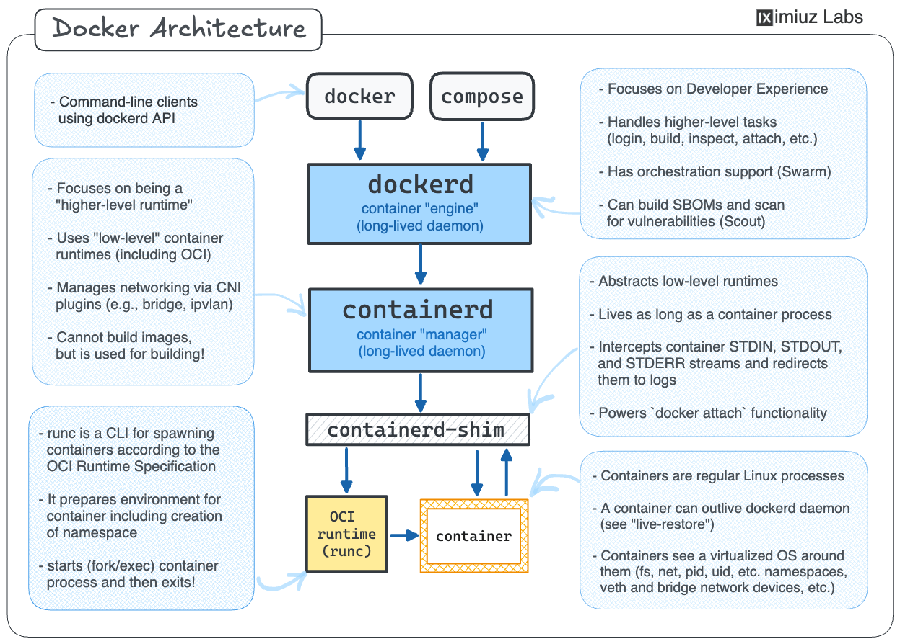
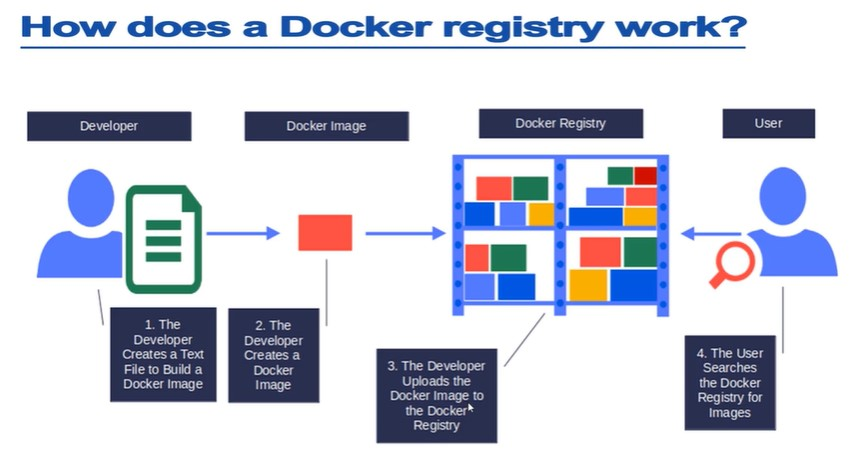

# Tổng quan về Docker
## Tại sao lại cần Docker

- Vấn đề cốt lõi mà Docker giải quyết là sự phức tạp và xung đột khi phải chạy nhiều ứng dụng với các yêu cầu thư viện, phiên bản phần mềm, hoặc cấu hình hệ điều hành khác nhau trên cùng một máy chủ. Trước đây, việc này giống như việc cố gắng lắp nhiều bộ phận từ những cỗ máy khác nhau vào một khung duy nhất – chúng thường xung đột và không tương thích. Docker đã thay đổi hoàn toàn điều đó bằng công nghệ container.
- Docker cho phép chúng ta đóng gói ứng dụng cùng với toàn bộ môi trường chạy ở tầng user-space của Linux, bao gồm runtime, thư viện và các công cụ cần thiết, thành một container. Container không chứa hệ điều hành hoàn chỉnh và không mang theo Linux kernel, mà luôn sử dụng kernel Linux do hệ thống bên dưới cung cấp. Trên máy Linux, container chạy trực tiếp trên kernel của host; còn trên macOS và Windows, Docker Desktop tạo sẵn một máy ảo Linux nhỏ để cung cấp kernel này, và các container được chạy bên trong máy ảo đó. Nhờ vậy, cùng một container Linux có thể chạy nhất quán trên các hệ điều hành khác nhau mà không phụ thuộc vào cấu hình môi trường của từng máy. Cách tiếp cận này loại bỏ sự khác biệt giữa môi trường phát triển, kiểm thử và production, đồng thời tối ưu tài nguyên và đơn giản hóa việc triển khai, khi toàn bộ môi trường ứng dụng có thể được khởi chạy chỉ bằng một lệnh `docker run`


## Cách Docker hoạt động
- Docker hoạt động dựa trên nguyên lý **chia sẻ nhân hệ điều hành (kernel)** của máy chủ vật lý. Khác với máy ảo (Virtual Machine) phải chạy một hệ điều hành hoàn chỉnh bên trong, gây nặng nề và tốn tài nguyên, một **container** của Docker không chứa cả một hệ điều hành. Thay vào đó, nó chỉ **đóng gói ứng dụng, các thư viện và dependencies cần thiết để ứng dụng đó chạy**. Toàn bộ container này sẽ chia sẻ và giao tiếp trực tiếp với kernel của hệ điều hành host (ví dụ: Linux) thông qua Docker Engine. Điều này giải thích tại sao Docker lại nhẹ và khởi chạy nhanh đến vậy.

- Tuy nhiên, chính vì phụ thuộc vào kernel của host nên có một hạn chế: bạn không thể chạy một container được thiết kế cho kernel Windows trên một host đang chạy kernel Linux, và ngược lại. Đây là lý do tại sao bạn cần Docker trên Windows Server để chạy các container Windows. Tóm lại, Docker hoạt động như một lớp trung gian thông minh, giúp quản lý và phân lập các ứng dụng để chúng chạy độc lập trong khi vẫn tận dụng chung một nền tảng hệ điều hành cơ bản, từ đó đạt được hiệu quả tối ưu cả về tính nhất quán lẫn tài nguyên.

## Kiến trúc Docker



Docker không chỉ là một binary duy nhất. Khi chạy một container bằng `docker run`, request thường đi qua nhiều lớp:

- `docker` CLI hoặc `docker compose` là client, gửi request tới Docker daemon qua Docker API.
- `dockerd` là daemon cấp cao, tập trung vào developer experience như build, login, inspect, attach, network và orchestration kiểu Swarm.
- `containerd` là container manager chạy lâu dài, quản lý lifecycle container, image, snapshot và gọi runtime cấp thấp.
- `containerd-shim` đứng giữa `containerd` và process container, giữ STDIN/STDOUT/STDERR, hỗ trợ `docker attach`, và giúp container có thể tiếp tục tồn tại ngay cả khi daemon cấp cao restart.
- OCI runtime như `runc` chuẩn bị namespace, cgroup, mount, capability rồi fork/exec process container.

Điểm quan trọng: container cuối cùng vẫn là Linux process bình thường, chỉ chạy trong một view hệ điều hành đã được cô lập bằng namespace, cgroup, rootfs và network device ảo.

## Docker Registry



Docker Registry là nơi lưu và phân phối image. Flow cơ bản:

```text
docker build -> docker tag -> docker push -> docker pull -> docker run
```

Trong lab có thể dùng Docker Hub. Trong môi trường nội bộ/production thường dùng private registry như Harbor, Nexus, GitLab Container Registry, ECR hoặc registry tương đương. Điều quan trọng là image phải có tag rõ ràng, quyền truy cập phù hợp, cơ chế scan và chính sách giữ/xóa image để không mất khả năng rollback.

## Docker Daemon Và Socket Là Boundary Bảo Mật

Docker CLI không trực tiếp “chạy container”; nó gửi request tới Docker daemon qua Docker API. Mặc định trên Linux, API thường được expose qua Unix socket:

```text
docker CLI -> /var/run/docker.sock -> dockerd -> containerd -> runc -> container process
```

Vì daemon có quyền tạo container, mount filesystem, gắn network và thao tác image, quyền truy cập `/var/run/docker.sock` gần như tương đương root trên host. Các pattern cần review như thay đổi bảo mật lớn:

- mount Docker socket vào container CI/CD;
- expose daemon qua TCP, đặc biệt `tcp://0.0.0.0:2375`;
- cho user vào group `docker` trên host production;
- chạy automation có quyền `docker run -v /:/host` hoặc privileged container.

Việc thêm user vào group `docker` chỉ nên được xem là cấp quyền host-admin, không phải tiện ích nhỏ để bỏ `sudo`. Trước khi cấp quyền này trên server dùng chung hoặc production, cần có owner rõ ràng, audit trail, cơ chế thu hồi quyền và kiểm soát ai được chạy image/command tùy ý. Với máy dev cá nhân, vẫn nên hiểu rằng một lệnh `docker run` có thể mount filesystem host, đọc credential local hoặc thay đổi network của host nếu user có quyền Docker socket.

Nếu cần remote build/deploy, ưu tiên TLS, SSH context, runner tách biệt, least privilege và audit log. Không mở Docker daemon plaintext ra network nội bộ với giả định “mạng private là an toàn”.

### Debug Docker API An Toàn

Docker API là HTTP API, nhưng không nên suy ra rằng có thể mở nó như một web API thông thường. Khi cần debug client/daemon mismatch, proxy, cert hoặc behavior bất thường, ưu tiên các bước read-only:

```bash
docker version
docker info
docker context ls
curl --unix-socket /var/run/docker.sock http://localhost/_ping
```

Nếu cần xem request/response giữa CLI và daemon, có thể dùng proxy Unix socket tạm thời trong lab hoặc host đã được cô lập:

```bash
socat -v UNIX-LISTEN:/tmp/dockerapi.sock,fork UNIX-CONNECT:/var/run/docker.sock
docker -H unix:///tmp/dockerapi.sock ps -a
```

Guardrails:

- Không expose `tcp://0.0.0.0:2375` trong production; đây là plaintext root-equivalent control plane của host.
- Nếu bắt buộc remote Docker API, dùng SSH context hoặc TLS mutual authentication, firewall allowlist, audit log và credential rotation.
- Không mount `/var/run/docker.sock` vào container CI/CD nếu runner không được xem như host-admin. Pattern này cho phép container tạo container khác với mount/privilege trên host.
- Thu thập log/evidence trước khi restart daemon, vì restart có thể làm mất ngữ cảnh incident hoặc ảnh hưởng container đang chạy tùy cấu hình.

## Restart Policy Không Thay Thế Supervisor/Orchestrator

`--restart` giúp Docker daemon xử lý container exit theo rule đơn giản:

| Policy | Ý nghĩa vận hành |
|---|---|
| `no` | không restart khi container thoát |
| `on-failure[:n]` | restart khi exit code khác 0, có thể giới hạn số lần |
| `always` | luôn restart, kể cả khi process thoát nhanh |
| `unless-stopped` | restart trừ khi operator đã stop thủ công |

Restart policy hữu ích cho service nhỏ trên một host, nhưng không thay thế health check, rollout, dependency ordering, log/metric alert và rollback. Nếu container liên tục `Restarting`, đừng chỉ tăng policy; cần đọc `docker logs`, `docker inspect`, exit code, OOM signal, mount/network lỗi và resource limit.

## Containers
Về bản chất, một **container** là một môi trường runtime nhẹ và độc lập, nơi một ứng dụng cụ thể được chạy. Bạn có thể hình dung nó như một căn phòng kín được trang bị đầy đủ nội thất và tiện nghi riêng (các thư viện, biến môi trường, file cấu hình) bên trong một tòa nhà lớn (máy chủ). Điều quan trọng là mọi container đều chia sẻ chung nền móng và hệ thống hạ tầng của tòa nhà (chính là kernel của hệ điều hành host), giúp chúng tiết kiệm tài nguyên hơn rất nhiều so với việc xây cả một tòa nhà riêng cho mỗi ứng dụng.

### Containers vs VMs
Sự khác biệt cốt lõi nằm ở kiến trúc. Một Máy ảo (VM) bao gồm cả một hệ điều hành khách (Guest OS) hoàn chỉnh chạy trên một lớp phần mềm gọi là hypervisor. Việc chạy nhiều bản sao OS như vậy rất tốn RAM, CPU và dung lượng lưu trữ. Trong khi đó, **container** không cần một OS riêng nào cả; chúng gói ứng dụng và các thành phần phụ thuộc lại và chia sẻ trực tiếp kernel của host, giúp chúng khởi chạy trong vài giây, nhẹ hơn hàng chục lần và hiệu suất gần như ngang bằng với việc chạy ứng dụng trực tiếp trên host.

### Containers vs Images
`image` là một khuôn mẫu (template) hoặc một bản thiết kế read-only (chỉ đọc) chứa tất cả các hướng dẫn để tạo ra một container. Nó bao gồm hệ điều hành thu gọn, mã ứng dụng, thư viện và các dependencies. Còn container là một thực thể (instance) đang chạy được khởi tạo từ image đó. Một image có thể dùng để tạo ra nhiều container giống hệt nhau. Khi container chạy, Docker tạo một lớp writable (có thể ghi) mỏng phía trên image để lưu mọi thay đổi trong phiên làm việc, trong khi bản thân image gốc vẫn luôn không thay đổi.

## Tại sao Docker quan trọng
Docker đóng vai trò như một chất xúc tác, phá vỡ rào cản giữa Development (phát triển) và Operations (vận hành) - hay còn gọi là DevOps. Sức mạnh của nó nằm ở khả năng chuẩn hóa môi trường chạy ứng dụng. Đối với developer, Docker loại bỏ hoàn toàn bài toán "nhưng trên máy tôi chạy được" bằng cách cho phép đóng gói ứng dụng cùng mọi thứ nó cần vào một image duy nhất. Image này trở thành một đơn vị thống nhất, có thể chạy y hệt trên bất kỳ máy tính nào có cài Docker, từ laptop của developer đến máy chủ testing, staging và production. Điều này tạo nên một pipeline CI/CD (Tích hợp liên tục/Triển khai liên tục) trơn tru và đáng tin cậy, where code is built into a container image once and then promoted through various environments with absolute consistency.

Trong kiến trúc hệ thống, Docker là nền tảng lý tưởng cho kiến trúc Microservices, nơi một ứng dụng lớn được tách thành nhiều dịch vụ nhỏ, độc lập. Mỗi microservice có thể được đóng gói và chạy trong container riêng của nó, cho phép các team phát triển độc lập, scale từng phần dịch vụ một cách linh hoạt và dễ dàng cập nhật hoặc rollback từng service mà không ảnh hưởng đến toàn bộ hệ thống. Ngoài ra, tính nhẹ và khởi động nhanh của container giúp tối ưu hóa tài nguyên server một cách tối đa, cho phép chạy mật độ service dày đặc hơn nhiều so với máy ảo truyền thống, từ đó tiết kiệm chi phí hạ tầng đáng kể. Tóm lại, Docker không chỉ là một công cụ đóng gói, mà là một công nghệ mang tính nền tảng giúp tự động hóa, đơn giản hóa và tăng tốc toàn bộ vòng đời phát triển phần mềm.


## Cài đặt Docker
### MacOS
Tải bộ cài [Docker Desktop](https://docs.docker.com/desktop/setup/install/mac-install/) for MAC , chạy install như thường

### Windows

Đối với Windows ngoài việc tải bộ cài thì còn phải kích hoạt Hyper-V ( Ở chế độ này không cài được VirtualBox nữa )

- Lệnh PowerShell kích hoạt :
```shell
Enable-WindowsOptionalFeature -Online -FeatureName Microsoft-Hyper-V -All

```

- Hoặc đơn giản có thể kích hoạt thông qua Windows features : App and Features => Programs and Features => Turn Windows Features on or off => Tích chọn Hyper-V


## Related Pages

- [Docker Commands](./00-docker-commands.md)
- [Docker Practice And Operations Patterns](../06-docker-practice-and-operations-patterns.md)
- [Container Vs VM Concepts](../Container%20vs%20VM%20concepts.md)
- [Image Layer, Dockerfile Best Practices](../Image%20layer,%20Dockerfile%20best%20practices.md)
- [Least Privilege Và Rootless Container](../Least%20privilege%20&%20rootless%20container.md)
- [Docker Network Modes](../03-Network%20mode%20bridge,%20host,%20overlay.md)
- [Docker Volumes, Bind Mount Và tmpfs](../04-Volumes,%20Bind%20mount,%20tmpfs.md)
- [Docker Compose Services](../05-Docker%20Compose%20services.md)
- [Private Registry, Nexus, Harbor](../Private%20registry,%20NexusHarbor.md)

