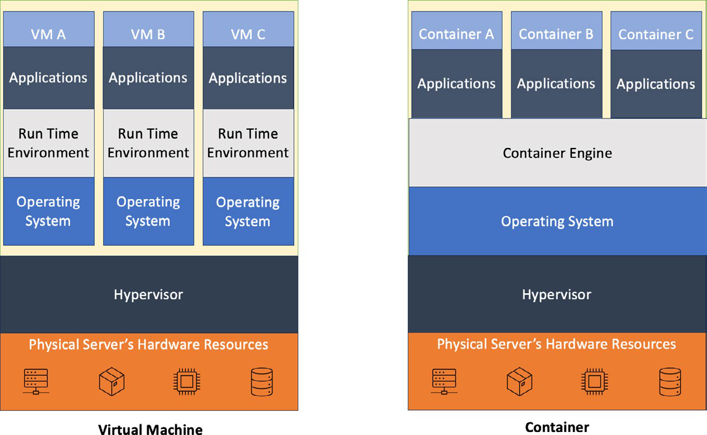

# Container Vs VM Concepts

## Overview

Container và virtual machine đều dùng để cô lập workload, nhưng chúng cô lập ở hai tầng khác nhau:

- **Virtual machine (VM)** ảo hóa phần cứng. Mỗi VM có guest OS, kernel riêng, process tree riêng và disk image riêng.
- **Container** cô lập process ở tầng operating system. Container đóng gói application, thư viện và root filesystem, nhưng vẫn dùng kernel của host.

Container không phải là "máy ảo nhỏ". Nó là một hoặc nhiều process chạy trong namespace, bị giới hạn bởi cgroup, nhìn thấy một root filesystem riêng và được chạy bởi container runtime.

## Mental Model

VM chia host theo chiều dọc: mỗi workload nhận một logical server gần như đầy đủ, gồm guest OS và runtime riêng. Container chia host ở phía trên kernel: nhiều workload dùng chung kernel host, còn mỗi workload có package application và dependency riêng.

| Khía cạnh | VM | Container |
|---|---|---|
| Tầng ảo hóa | Hardware virtualization | OS-level isolation |
| Kernel | Mỗi VM có kernel riêng | Dùng chung kernel host |
| Thành phần đóng gói | Guest OS, runtime, library, app | Runtime/library cần thiết và app |
| Startup | Chậm hơn vì phải boot OS | Nhanh hơn, thường tính bằng giây |
| Footprint | Nặng hơn về RAM/disk | Nhẹ hơn nếu image được tối ưu |
| Isolation boundary | Mạnh hơn ở tầng hypervisor | Phụ thuộc kernel/runtime/namespace/cgroup |
| Use case | Legacy app, OS riêng, isolation mạnh, appliance model | Microservice, CI/CD, dev/test, stateless workload, scale ngang |

## Container Building Blocks

Container runtime không chỉ "chạy một folder". Một container production thường dựa trên các primitive Linux sau:

| Primitive | Vai trò |
| --- | --- |
| Namespace | Cho process một view riêng về PID, mount, network, IPC, hostname, user/group hoặc cgroup |
| Layered / union filesystem | Ghép nhiều layer read-only với một writable layer mỏng cho runtime state |
| cgroup | Giới hạn và đo CPU, memory, IO, pids; là nền cho throttling và OOM trong container |
| Seccomp/AppArmor/SELinux/capability | Giới hạn syscall, quyền kernel và surface tấn công |

Vì container chia sẻ kernel host, isolation failure ở kernel/runtime có blast radius khác VM. Với workload khác trust level, tenant khác nhau, hoặc code không tin cậy, nên cân nhắc VM boundary, sandbox runtime, gVisor/Kata-like runtime, node pool riêng hoặc cluster riêng tùy mức rủi ro.

## Container Image Vs Running Container

`image` là artifact read-only được build một lần và promote qua các môi trường. `container` là instance đang chạy từ image đó. Runtime thường thêm một writable layer mỏng khi container chạy.

Hệ quả vận hành:

- Thay đổi bên trong container có thể mất khi container bị xóa.
- Dữ liệu quan trọng nên nằm trong volume, database, object storage hoặc external state store.
- Nên pin image bằng immutable tag hoặc digest trong production, không phụ thuộc tag mutable như `latest`.
- Image càng nhỏ và càng ít package thừa thì attack surface, pull time và scan noise càng thấp.

## Khi Nên Dùng Container

Container phù hợp khi cần:

- Đóng gói application và dependency nhất quán giữa dev, test, staging và production.
- Chạy microservice độc lập, có lifecycle và scaling riêng.
- Build image một lần rồi promote qua CI/CD pipeline.
- Tạo ephemeral environment cho test, job, review app hoặc local development.
- Scale ngang bằng replica thay vì clone cả VM.
- Chạy workload ở edge/IoT hoặc môi trường tài nguyên hạn chế, miễn là runtime và security baseline được quản lý tốt.

## Khi VM Vẫn Phù Hợp

VM vẫn là lựa chọn đúng khi:

- Workload cần kernel module, kernel version, driver hoặc OS riêng.
- Cần isolation boundary mạnh hơn giữa tenant hoặc workload có rủi ro cao.
- Ứng dụng legacy phụ thuộc init system, service manager, filesystem layout hoặc agent OS đầy đủ.
- Vendor appliance/license model yêu cầu VM hoặc bare OS.
- Team chưa có maturity về registry, image lifecycle, runtime security, observability và orchestration.

## Migration Từ VM Sang Container

Không nên hiểu migration từ VM sang container là "đóng gói nguyên cả server vào image" rồi coi như đã hiện đại hóa. Có thể tạo image từ filesystem của VM bằng archive/TAR hoặc `scratch` image để bootstrap một workload cũ, nhưng đây nên là bước chuyển tiếp có kiểm soát, không phải trạng thái production lâu dài.

Khi dùng pattern này, cần nhìn rõ các rủi ro:

- Filesystem snapshot của VM đang chạy có thể không nhất quán, đặc biệt với database, queue, file đang ghi hoặc service có state trong memory.
- Image tạo từ VM thường lớn, khó audit, khó scan, chứa package/thư viện thừa và có thể mang theo secret, SSH key, log hoặc dữ liệu người dùng.
- Container không capture kernel, systemd behavior, device driver, module, network topology hoặc scheduler semantics của VM.
- Process model khác VM: container sống/chết theo process chính; không tự có init system đầy đủ trừ khi bạn cố tình thêm supervisor.

Guardrails khi buộc phải bootstrap từ VM:

- Ưu tiên rebuild bằng Dockerfile/config management từ source rõ ràng. Chỉ dùng filesystem import khi không còn lựa chọn tốt hơn.
- Dừng ứng dụng hoặc lấy snapshot nhất quán trước khi archive filesystem; không tar trực tiếp hệ thống đang ghi dữ liệu quan trọng.
- Sanitize secret, log, SSH material, hostname riêng, cache package và dữ liệu runtime trước khi push image vào registry.
- Sau khi import, lập backlog tách service, externalize state, viết Dockerfile reproducible và thay image "VM dump" bằng image build chính thức.

## Performance And Scheduling Trade-offs

Container thường có overhead thấp hơn ở startup và I/O path vì không chạy guest OS riêng. Tuy vậy, kết luận "container luôn nhanh hơn VM" là quá đơn giản:

- VM hiện đại có hardware virtualization và virtio nên CPU/memory overhead có thể thấp.
- Benchmark I/O dễ bị lệch vì cache của host OS, storage backend và workload pattern.
- VM thường cho isolation và scheduling resource giữa workload độc lập tốt hơn trong môi trường multi-tenant.
- Container cần limits, request, QoS và node-level capacity guardrail; nếu không, noisy neighbor vẫn xảy ra.

Khi so sánh VM với container cho workload production, đo cùng một workload thật, cùng storage/network backend, cùng concurrency, cùng warm-up và cùng observability. Đừng dùng chỉ một metric trung bình; cần nhìn p95/p99 latency, throttling, OOM, IO wait, network retransmit và failure isolation.

## Production Guardrails

- Không coi container là security boundary tuyệt đối. Nếu workload khác trust level, cần tách node pool, VM, sandbox runtime hoặc cluster tùy mức rủi ro.
- Đặt CPU/memory requests và limits ở runtime/orchestrator; container nhẹ không có nghĩa là tự giới hạn tài nguyên.
- Không chạy container production bằng user `root` nếu không có lý do rõ ràng; ưu tiên read-only filesystem, drop capability và least privilege.
- Quét image để tìm vulnerability và secret trước khi deploy; không đưa token, private key, password hoặc customer data vào image layer.
- Log ra stdout/stderr hoặc logging agent; không ghi log chỉ vào writable layer bên trong container.
- Tách config và secret khỏi image; dùng environment, mounted secret, external secret manager hoặc platform-native secret theo chuẩn của môi trường.
- Có rollback plan cho image release. Rollback image không tự rollback database schema, queue message, object storage data hoặc external dependency.

## Common Misunderstandings

### Container không chứa OS đầy đủ

Image có thể có file tree giống Ubuntu, Debian hoặc Alpine, nhưng nó không mang kernel riêng. System call từ process trong container vẫn đi xuống kernel host.

### Container portable nhưng không magic

Image giúp đóng gói dependency, nhưng app vẫn có thể phụ thuộc CPU architecture, kernel capability, filesystem permission, network policy, DNS, secret, external service và runtime config của môi trường.

### Docker và Kubernetes không cùng một vai trò

Docker/Podman/containerd thuộc lớp build/chạy container. Kubernetes là orchestration layer: lưu desired state, schedule Pod lên node, self-heal, rollout, expose Service, gắn storage và enforce policy. Trong Kubernetes hiện đại, container runtime thường được nối qua CRI, không nên mặc định mọi cluster đều dùng Docker Engine trực tiếp.

## Related Pages

- [Virtual Machines And Hypervisors](../01-compute-platforms/01-virtual-machines-and-hypervisors.md)
- [Docker Overview](./01-docker/overview.md)
- [Docker Commands](./01-docker/00-docker-commands.md)
- [Volumes, Bind Mount, tmpfs](./04-Volumes,%20Bind%20mount,%20tmpfs.md)
- [Network Mode Bridge, Host, Overlay](./03-Network%20mode%20bridge,%20host,%20overlay.md)
- [Kubernetes](../03-container-orchestration/01-kubernetes/overview.md)
