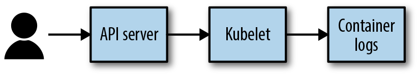
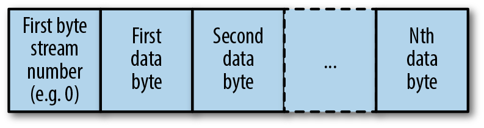
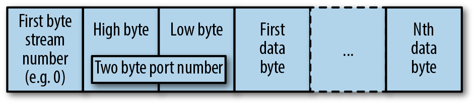
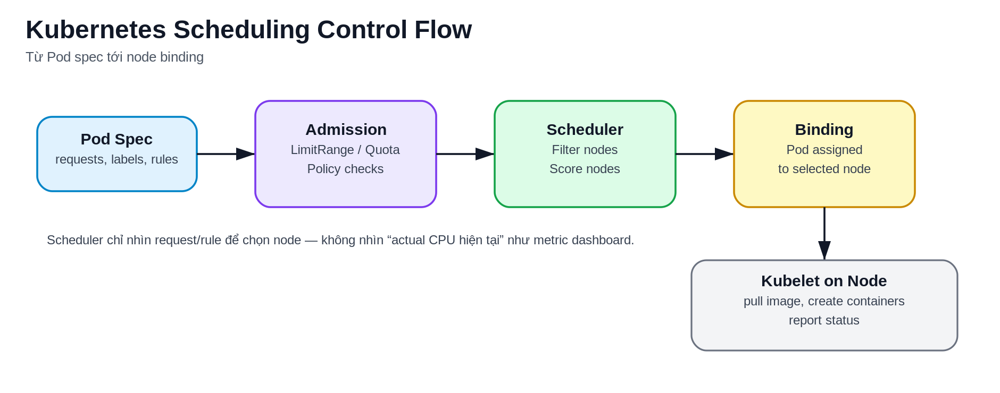
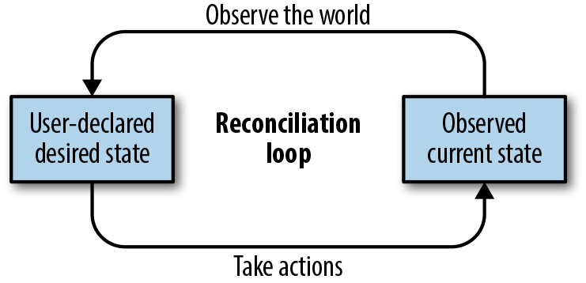

# Kubernetes Control Plane, Node Và Reconciliation

## Overview

Kubernetes không vận hành theo kiểu "chạy lệnh rồi xong". Mô hình cốt lõi của nó là **desired state**: user khai báo trạng thái mong muốn qua API, còn control plane liên tục quan sát actual state và reconcile để kéo hệ thống về gần desired state nhất có thể.

Nhìn đúng hơn, Kubernetes là một control plane cho hạ tầng ứng dụng: API Server nhận intent, controller biến intent thành hành động, scheduler chọn nơi chạy, kubelet thực thi trên node, còn network/storage/runtime plugin cung cấp phần hạ tầng cụ thể. Cách tách lớp này giúp app team không phải tự điều phối container từng node, đồng thời giúp platform team áp guardrail và chuẩn hóa vận hành.

## Mental Model

```text
User / CI/CD / Controller
        |
        v
   Kubernetes API Server
        |
        v
      etcd
        |
        +-----------------------+
        |                       |
        v                       v
    Scheduler              Controllers
        |                       |
        v                       v
      Node <--- kubelet --- Pod / Container Runtime
        |
        v
   kube-proxy / CNI / CSI / Add-ons
```

Điểm quan trọng:

- API Server là cổng vào duy nhất cho thao tác chuẩn với cluster.
- etcd lưu cluster state; không nên thao tác trực tiếp trừ khi có runbook quản trị etcd riêng.
- Scheduler chỉ quyết định Pod nên chạy ở node nào.
- Controller không chạy container trực tiếp; controller tạo/sửa object qua API.
- kubelet trên node mới là thành phần kéo image, mount volume và chạy container qua container runtime.

## Kubernetes As An API Platform

Kubernetes hữu ích không chỉ vì nó chạy container, mà vì nó chuẩn hóa cách mô tả và tự động hóa vòng đời workload:

- App team khai báo Pod, Deployment, Service, ConfigMap, Secret, HPA hoặc custom resource.
- Platform team quản lý policy, quota, admission, node pool, storage class, network và observability.
- Controller/operator biến object thành hành động lặp lại được thay vì runbook thủ công.
- GitOps/CI/CD có thể review, diff, apply và rollback dựa trên manifest thay vì thao tác trực tiếp từng node.

Vì vậy, khi debug Kubernetes, hãy đi theo object và controller chain thay vì chỉ hỏi "container đang ở máy nào". Cluster state nằm trong API; container thật nằm trên node.

## Cluster Management Mindset

Quản trị Kubernetes không chỉ là cài control plane rồi để đó. Platform team phải hiểu cả hai phía:

- Cluster được cấu thành từ component nào, component nào giữ state, component nào reconcile và component nào chạy data plane.
- Developer dùng API thế nào để deploy, sửa lỗi, scale và rollback ứng dụng.
- Cluster đang loại bỏ độ phức tạp nào cho người dùng, và đang thêm rủi ro vận hành nào như policy, quota, network, storage, security hoặc upgrade.

Một cluster production vì vậy cần tối thiểu bốn vòng vận hành:

```text
understand architecture
-> harden/tune/policy
-> observe/alert/respond
-> curate extensions/add-ons
```

Add-on như CI/CD controller, certificate manager, service mesh, FaaS hoặc custom operator có thể làm cluster hữu ích hơn, nhưng cũng mở thêm attack surface và failure mode. Trước khi đưa add-on vào cluster dùng chung, cần đánh giá owner, maturity, RBAC, CRD lifecycle, upgrade path, observability và rollback.

## API Server

API Server là front door của Kubernetes. Mọi thao tác như `kubectl apply`, controller reconcile, scheduler bind Pod, kubelet report status đều đi qua API Server.

Vai trò chính:

- Authentication: xác định caller là ai.
- Authorization: caller có được làm hành động đó không.
- Admission: request có được mutate/validate trước khi lưu không.
- API validation: object có hợp lệ theo schema không.
- Watch API: cho phép controller, scheduler, kubelet theo dõi thay đổi object.


Lệnh quan sát:

```bash
kubectl api-resources
kubectl api-versions
kubectl get --raw /readyz
kubectl get --raw /livez
```

### API Resource Discovery Và Watch

API Server không chỉ nhận manifest; nó còn công bố API surface để client và controller biết cluster đang hỗ trợ resource nào. `kubectl api-resources`, discovery endpoint và OpenAPI schema giúp tool biết resource thuộc API group nào, có namespaced hay cluster-scoped, hỗ trợ verb nào và nên serialize object ra sao.

Mental model khi viết automation:

- Dùng discovery thay vì hard-code mọi resource path nếu tool cần chạy trên nhiều cluster/version.
- Phân biệt core API group (`/api/...`) với named API group (`/apis/<group>/...`).
- `watch` dùng để nhận event thay đổi thay vì polling liên tục; controller production nên dựa trên informer/cache hoặc client library chuẩn.
- `resourceVersion` là cơ chế optimistic concurrency. Nếu update object cũ và gặp `409 Conflict`, client phải đọc lại object mới nhất rồi retry có kiểm soát, không ghi đè mù.

Ví dụ quan sát read-only:

```bash
kubectl api-resources
kubectl get --raw /api
kubectl get --raw /apis
kubectl get pods -n <namespace> --watch
```

### Specialized Requests: Logs, Exec Và Port Forward

Không phải request nào cũng là CRUD object. Một số thao tác như `kubectl logs`, `exec`, `attach`, `port-forward` và proxy cần API Server làm gateway tới kubelet hoặc service phía sau.



Với `kubectl logs`, client gọi API Server, API Server kiểm tra authn/authz rồi chuyển yêu cầu tới kubelet trên node đang chạy Pod. Vì vậy khi logs lỗi cần phân biệt:

- user/ServiceAccount có quyền `get pods/log` không;
- API Server có kết nối được kubelet không;
- kubelet/container runtime còn giữ log file không;
- Pod đã bị rotate/evict/recreated nên log cũ có thể không còn ở container hiện tại.

Các request streaming thường dùng nhiều channel trên cùng kết nối để tách stdout, stderr, stdin hoặc error stream. `port-forward` còn cần encode port đích trong frame.





Từ góc nhìn production, các lệnh này tiện cho debug nhưng không nên thay thế observability chuẩn. Log, metric và trace quan trọng phải được ship ra hệ thống tập trung; `kubectl exec`/`port-forward` nên được audit và giới hạn RBAC vì chúng mở đường tương tác trực tiếp với runtime workload.

### Debug API Server Và Client Request

Khi nghi vấn lỗi nằm ở API path, hãy debug từ lớp ít xâm lấn trước:

```bash
kubectl get --raw /readyz
kubectl get --raw /livez
kubectl get --raw /api
kubectl get --raw /apis
kubectl --v=8 get pods -n <namespace>
kubectl proxy
```

`kubectl --v=8` hoặc mức cao hơn giúp thấy request/response ở client side. Trên control plane tự quản, API Server log và audit log mới là nguồn chính để biết request bị reject ở authentication, authorization, admission, validation hay storage. Tránh bật verbosity quá cao lâu dài trong production vì log volume có thể rất lớn và chứa metadata nhạy cảm.

## etcd

etcd là key-value store lưu trạng thái Kubernetes. Nếu API Server là cổng vào, etcd là nơi ghi nhớ cluster đang có object nào và spec/status ra sao.

Rủi ro vận hành:

- etcd chậm làm toàn bộ control plane chậm.
- mất quorum có thể làm API write fail.
- backup etcd không đúng cách có thể không restore được cluster state.
- object quá nhiều hoặc event quá lớn có thể tạo áp lực lên control plane.

Checklist:

- Có backup etcd định kỳ nếu tự quản lý control plane.
- Theo dõi latency, DB size, leader change, quorum health.
- Không dùng etcd như database application.
- Với managed Kubernetes, hiểu rõ provider chịu trách nhiệm phần nào và bạn còn phải backup resource/application gì.

### etcd WAL, fsync Và Tín Hiệu Sức Khỏe

etcd ưu tiên consistency. Mỗi write phải đi qua consensus và write-ahead log; latency disk/fsync kém có thể làm API write chậm, controller reconcile chậm và toàn bộ control plane có cảm giác "ì" dù worker node vẫn đang chạy workload cũ.

Tín hiệu nên theo dõi nếu tự quản lý control plane:

- leader changes tăng bất thường;
- quorum/member health;
- WAL fsync duration;
- backend commit duration;
- DB size và nhu cầu defrag;
- API Server request latency và lỗi write.

Ví dụ kiểm tra nhanh trong cluster tự quản lý bằng static Pod:

```bash
kubectl -n kube-system get pods -l component=etcd
kubectl -n kube-system logs <etcd-pod>
```

Backup etcd phải dùng snapshot/tooling phù hợp với topology cluster. Copy thư mục data khi etcd đang chạy mà không hiểu consistency có thể tạo bản backup không restore được.

## Scheduler

Scheduler xử lý các Pod chưa có `spec.nodeName`, sau đó chọn node phù hợp nhất.

Luồng đơn giản:

1. Tìm Pod đang Pending và chưa bind node.
2. Lọc node không phù hợp theo resource, taint, node selector, affinity, volume constraint.
3. Chấm điểm các node còn lại.
4. Bind Pod vào node thắng cuộc qua API Server.



Scheduler không pull image, không chạy container và không sửa lỗi runtime. Nếu Pod đã bind node nhưng container lỗi, kubelet và controller liên quan sẽ xử lý phần sau.

## Controllers

Controller là vòng lặp reconcile. Nó liên tục hỏi:

```text
desired state là gì?
actual state là gì?
cần tạo/sửa/xóa object nào để kéo actual về desired?
```

Ví dụ:

- Deployment controller tạo/sửa ReplicaSet.
- ReplicaSet controller giữ số Pod replica đúng mong muốn.
- Job controller tạo Pod cho task chạy đến khi hoàn thành.
- Node controller phát hiện node không ready.
- EndpointSlice controller cập nhật backend cho Service.

Controller thường không thao tác trực tiếp node; nó làm việc qua API object. Đây là lý do Kubernetes có tính composable: nhiều controller có thể phối hợp qua API mà không cần biết sâu implementation của nhau.



Reconciliation loop có vẻ đơn giản, nhưng khi debug production cần nhớ rằng Kubernetes không có một "não trung tâm" giải thích mọi thứ. Nhiều controller độc lập cùng đọc desired state, quan sát actual state và ghi lại object/status qua API Server. Vì vậy triage tốt thường đi theo chuỗi object:

```text
Deployment
-> ReplicaSet
-> Pod
-> scheduler binding
-> kubelet/container runtime
-> Service/EndpointSlice
```

Nếu một bước không tiến triển, hãy xem `status`, `conditions` và `events` của object ở đúng lớp đó thay vì chỉ restart workload.

## Kubelet Và Container Runtime

kubelet chạy trên mỗi node, nhận PodSpec đã được scheduler bind về node đó và biến nó thành container thật.

Vai trò:

- Pull image.
- Tạo sandbox Pod.
- Gọi container runtime qua CRI.
- Mount volume.
- Chạy probe.
- Report Pod/Node status về API Server.

Container runtime hiện đại thường là `containerd` hoặc CRI-O. Docker Engine không còn là runtime trực tiếp theo mô hình dockershim cũ; khi học tài liệu cũ cần dịch mental model sang CRI/containerd.

### Kubelet Sync Loop Và Node Lease

kubelet không phải "chạy một lần rồi xong". Nó liên tục sync desired PodSpec từ API Server với actual state trên node:

```text
watch Pod bound tới node
-> tạo/cập nhật Pod sandbox
-> gọi CRI pull image và start container
-> gọi volume/CNI/probe path liên quan
-> report Pod status và Node status
-> renew NodeLease để báo node còn sống
```

Khi control plane tạm thời không sẵn sàng, container đang chạy trên node thường không chết ngay chỉ vì API Server mất kết nối. Nhưng kubelet không thể nhận desired state mới, không report status mới ổn định, và controller không thể ra quyết định chính xác. Vì vậy cần phân biệt lỗi node runtime với lỗi control plane/API connectivity.

Debug kubelet/node:

```bash
kubectl get node <node> -o yaml
kubectl get lease -n kube-node-lease
journalctl -u kubelet
crictl ps -a
```

## kube-proxy, CNI Và Service Data Path

Kubernetes tách rõ control plane và data plane:

- Service object là desired state cho endpoint ổn định.
- EndpointSlice chứa danh sách backend Pod IP.
- kube-proxy hoặc dataplane thay thế sẽ lập rule để traffic đi tới backend.
- CNI plugin cấp Pod network và enforce NetworkPolicy nếu plugin hỗ trợ.

Khi Service lỗi, không chỉ nhìn Service object. Cần kiểm tra Pod Ready, EndpointSlice, kube-proxy/CNI và network policy.

## Reconciliation Example

Khi apply một Deployment:

1. User gửi manifest tới API Server.
2. API Server validate/admission rồi lưu object vào etcd.
3. Deployment controller thấy Deployment mới, tạo ReplicaSet.
4. ReplicaSet controller tạo Pod theo replica mong muốn.
5. Scheduler bind từng Pod vào node.
6. kubelet trên node chạy container.
7. kubelet report status.
8. EndpointSlice controller thêm Pod Ready vào backend Service nếu label khớp.

Nếu Pod chết, Kubernetes không "sửa container cũ"; controller tạo Pod mới để desired replica vẫn đúng.

## Production Notes

- Control plane khỏe chưa đủ; app phải có probe, request/limit, rollout strategy và observability.
- Kubernetes tự phục hồi object theo spec, nhưng không tự sửa thiết kế app sai.
- HA cluster cần HA cho control plane, etcd, worker nodes, network, storage và image registry.
- Không dùng quyền `cluster-admin` cho automation hằng ngày.
- Với tài liệu cũ, chú ý API version đã thay đổi; luôn kiểm tra `kubectl explain` hoặc official docs của version cluster.

## Related Pages

- [Kubernetes Architecture](./overview.md)
- [Kubernetes Operations Quick Reference](../01-core-objects/00-kubernetes-operations-quick-reference.md)
- [Kubernetes Scheduling, Affinity, Taints, Topology Và Priority](../05-operations/03-scheduling-affinity-taints-topology-and-priority.md)
- [Kubernetes Networking, Services Và Ingress](../02-networking/overview.md)
- [Kubernetes Security And RBAC](../04-security/overview.md)
