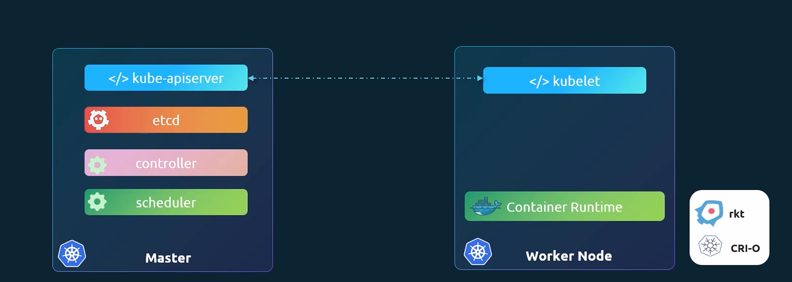
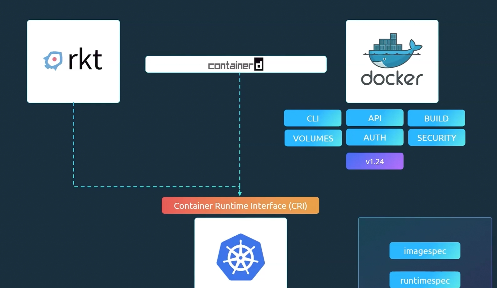

# Kubernetes Architecture 

## Nodes

## Cluster 
Tập hợp các nodes được nhóm lại với nhau , do vậy kể cả khi 1 node bị lỗi thì application vẫn có thể truy cập được 

### Master node 
Là một node khác được Kubernetes cài đặt bên trong 1 cluster và được cấu hình là một master . Node master sẽ giám sát các nodes trong cụm kiểm soát toàn bộ vòng đời của các container trong các nodes đang hoạt động ( hay còn gọi là worker node)

---

- Khi chúng ta cài đặt k8s , thực tế là chúng ta đang cài đặt các thành phần bao gồm 1 API server và dịch vụ `etcd`, `kubelet` , `container runtime` , `controllers` và `schedulers` .

    - API server hoạt động như là FE của k8s trong việc tương tác với cluster k8s 
    - etcd là một kho lưu trữ key value được Kubernetes sử dụng để lưu trữ toàn bộ dữ liệu dùng cho việc quản lý cluster . Thử tưởng tượng khi bạn có nhiều node master và node worker trong cụm thì etcd sẽ lưu trữ phân tán toàn bộ các thông tin trên toàn bộ nodes của cluster . Mục tiêu của etcd là đảm bảo rằng không có xung đột giữa các master.
    - Scheduler dùng để phân tán toàn bộ công việc hay các container trên toàn bộ nodes . Nó tìm kiếm các container mới tạo và gán chúng cho các node 
    - Controller là bộ não quản lý vòng đời của cluster ( orchestration) , nó có trách nhiệm phát hiện và phản ứng với các tình huống mà node hay container bị down . Các controller thường đưa ra quyết định thêm vào container mới trong một số trường hợp 
    - Container runtime là lớp ... bên dưới dùng để chạy các container . Trong nhiều trường hợp , nó có thể là Docker hay nhiều sự lựa chọn khác như Rocket hay CRI-O.
    - kubelet là một agent chạy trên từng node của cluster . Nó đảm bảo rằng các container chạy trên từng node hoạt động như kỳ vọng khi vận hàng 

- THường trên các master node sẽ có API server còn trên các node là các kubelet agent chịu trách nhiệm tương tác với master node để cung cấp các thông tin về sức khỏe của worker node nó đang kiểm soát đồng thời cũng là trung gian truyền đạt lệnh từ master . Các thông tin thu thập được sẽ được lưu trữ ở một kho lưu trữ key-value ( chính là etcd) trên master . Master node cũng có các controller quản lý và các scheduler

## Kubectl 
CLI của K8s 

## Container Runtime 

### rkt

### containerd

### docker 

