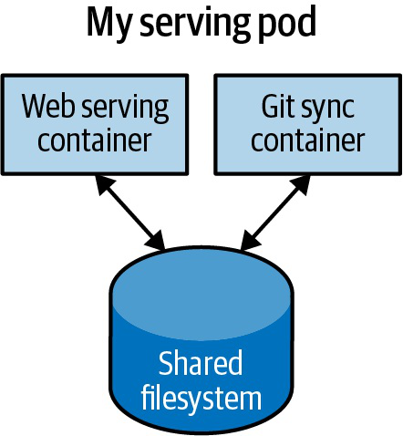
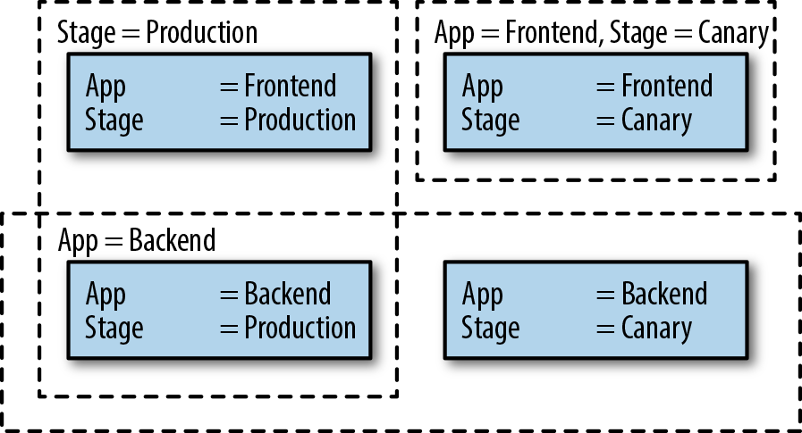

# Kubernetes Pods, Labels, Namespaces Và Metadata

## Overview

Pod là đơn vị chạy workload nhỏ nhất trong Kubernetes. Pod không chỉ là một container; nó là một group gồm một hoặc nhiều container chia sẻ network namespace, volume và lifecycle. Labels, selectors, annotations và namespaces là lớp metadata giúp Kubernetes controller, Service, policy và con người tìm đúng object cần quản lý.

Nguồn `Kubernetes in Action` đi rất kỹ từ Pod, label selector, annotation, namespace đến Downward API. `Kubernetes Up and Running` bổ sung cách nhìn labels/annotations như "keo dán" cho automation và tổ chức ứng dụng.

## Pod Mental Model

```text
Pod
├── container: app
├── container: sidecar/helper (optional)
├── shared network namespace
├── shared volumes
└── one lifecycle boundary
```

Một Pod nên gom các container cần:

- chạy cùng node,
- share localhost,
- share volume tạm hoặc socket,
- scale cùng nhau,
- chết/sống cùng nhau.

Nếu hai container có lifecycle và scale pattern khác nhau, thường nên tách thành hai Pod và kết nối qua Service.



## Pod Manifest Cơ Bản

```yaml
apiVersion: v1
kind: Pod
metadata:
  name: web
  labels:
    app: web
    tier: frontend
spec:
  containers:
  - name: nginx
    image: nginx:1.25
    ports:
    - containerPort: 80
```

`containerPort` chủ yếu là metadata để tài liệu hóa port app listen và để Service có thể reference theo named port. Kubernetes không tự chặn traffic chỉ vì `containerPort` khai sai; nếu app listen port khác, lỗi sẽ lộ ở Service `targetPort`, readiness probe hoặc traffic thật.

Container trong cùng một Pod share network namespace và port space. Vì vậy hai container trong cùng Pod không thể cùng bind một port. Nếu chúng cần trao đổi nội bộ, dùng `localhost:<port>` hoặc shared volume; nếu chúng có lifecycle/scale khác nhau, tách thành Pod/Service riêng thường rõ hơn.

Lệnh kiểm tra:

```bash
kubectl apply -f pod.yaml
kubectl get pod web -o wide
kubectl describe pod web
kubectl logs web
```

Trong production, hiếm khi tạo Pod trực tiếp. Dùng Deployment, StatefulSet, DaemonSet, Job hoặc CronJob để controller quản lý Pod thay bạn.

## Pod Sandbox Và Pause Container

Ở mức runtime, Pod thường bắt đầu bằng một **Pod sandbox**. Trên Linux, sandbox này hay được hiện thực bằng pause/infra container: một process rất nhỏ giữ network namespace và các namespace dùng chung của Pod. Sau khi sandbox được tạo, kubelet gọi CNI để gắn network cho namespace đó, rồi mới chạy container ứng dụng trong cùng không gian mạng.

Mental model:

```text
kubelet nhận PodSpec
-> CRI tạo Pod sandbox / pause container
-> CNI cấp IP, route, interface cho sandbox network namespace
-> CRI chạy app container trong sandbox đó
-> kubelet chạy probe và report status về API Server
```

Điều này giải thích vì sao nhiều container trong cùng Pod dùng chung `localhost`, cùng IP Pod và không thể bind trùng port. Khi debug sâu trên node, Pod sandbox cũng là lý do bạn có thể thấy container pause tồn tại dù app container đã restart.

Lệnh quan sát tùy runtime/node:

```bash
crictl pods
crictl ps -a --pod <pod-sandbox-id>
crictl inspectp <pod-sandbox-id>
```

Không nên thao tác thủ công vào sandbox trong production nếu chưa có runbook, vì kubelet sẽ tiếp tục reconcile theo PodSpec.

## Spec, Status, Conditions Và Events

Manifest ngắn người vận hành viết thường chỉ là phần desired state. Object đọc lại từ API sẽ có thêm default field, metadata, `status`, `conditions` và thông tin runtime do controller/kubelet cập nhật.

```text
spec        = trạng thái mong muốn
status      = trạng thái Kubernetes quan sát được
conditions  = các trạng thái độc lập như Ready, PodScheduled, ContainersReady
events      = dấu vết quyết định/lỗi từ scheduler, kubelet, controller
```

Khi debug, không chỉ nhìn cột `STATUS` trong `kubectl get pods`. Cột này có thể hiển thị reason như `CrashLoopBackOff`, `ImagePullBackOff` hoặc `ContainerCreating`, không phải lúc nào cũng là raw Pod phase.

Lệnh quan sát:

```bash
kubectl get pod <pod> -n <namespace> -o yaml
kubectl get pod <pod> -n <namespace> -o jsonpath='{.status.conditions}'
kubectl describe pod <pod> -n <namespace>
kubectl get events -n <namespace> --sort-by=.lastTimestamp
```

Events thường có TTL và không phải log dài hạn. Với sự cố production, cần thu thập events sớm hoặc có event/log pipeline tập trung.

## Labels Và Selectors

Label là key/value metadata dùng để group object. Selector là query để chọn object theo label.

Ví dụ label tốt:

```yaml
metadata:
  labels:
    app.kubernetes.io/name: checkout
    app.kubernetes.io/component: api
    app.kubernetes.io/part-of: ecommerce
    env: prod
```

Lọc object:

```bash
kubectl get pods -l app.kubernetes.io/name=checkout
kubectl get pods -l 'env in (staging,prod)'
kubectl get pods -l app.kubernetes.io/component!=worker
```

Labels ảnh hưởng trực tiếp tới:

- Service selector.
- ReplicaSet selector.
- NetworkPolicy podSelector.
- Pod affinity/anti-affinity.
- Topology spread constraints.
- Automation, dashboards và cost allocation.


### Dynamic Grouping Bằng Label Selector

Kubernetes cố tình tránh mô hình "danh sách static các object" cho nhiều luồng quan trọng. Thay vào đó, controller và Service thường chọn object bằng selector:

```text
group membership = all objects matching label selector
```

Điều này làm hệ thống thích nghi tốt hơn khi Pod được tạo, xóa, rollout hoặc reschedule. Ví dụ Service không cần biết tên từng Pod; nó chỉ cần selector ổn định như `app=checkout,tier=api`. EndpointSlice controller sẽ cập nhật backend khi Pod Ready và label khớp.



Rủi ro production nằm ở chỗ selector là hợp đồng sống giữa nhiều object:

- selector quá rộng có thể gom nhầm Pod;
- đổi label trong Pod template có thể làm Service mất endpoint;
- đổi selector của controller có thể làm controller không còn quản lý đúng Pod;
- label dùng cho traffic/policy không nên thay đổi tùy tiện như label dùng cho dashboard hoặc cost.

Annotation không thay thế được label selector. Dùng annotation cho metadata phụ; dùng label khi object cần được query, group, select hoặc áp policy.

### Label Cho Release Và Version

Label cũng là ngôn ngữ chung giữa workload, dashboard, policy, traffic routing và CI/CD. Với release workflow, nên chuẩn hóa label để phân biệt:

- app/component: workload này là gì;
- environment: đang chạy ở dev/staging/prod nào;
- version: application version hoặc image/runtime version đang phục vụ;
- release/instance: lần phát hành hoặc Helm release nào quản lý object.

Ví dụ convention gần với Kubernetes recommended labels:

```yaml
metadata:
  labels:
    app.kubernetes.io/name: checkout
    app.kubernetes.io/component: api
    app.kubernetes.io/instance: checkout-prod
    app.kubernetes.io/version: "1.6.9"
    app.kubernetes.io/managed-by: Helm
    env: prod
```

Không trộn label dùng để select Pod với label chỉ dùng để trace release nếu chưa có convention rõ. Selector ổn định là điều kiện để Service và controller không chọn nhầm Pod. Metadata phục vụ audit, release number hoặc link CI/CD run có thể đặt ở annotation nếu không cần query/select.

## Annotations

Annotation cũng là metadata key/value nhưng không dùng để select object. Dùng annotation cho thông tin phụ:

- owner/team,
- link runbook,
- CI/CD run ID hoặc release note URL,
- checksum config để trigger rollout,
- annotation của Ingress controller,
- metadata cho tool hoặc admission webhook.

Ví dụ:

```bash
kubectl annotate deployment checkout runbook=runbooks/checkout
```

Không dùng annotation thay label khi cần query hoặc selector.

## Namespaces

Namespace giúp chia cluster thành các vùng quản trị logic. Nó hữu ích cho naming, RBAC, quota, policy và lifecycle.

```bash
kubectl create namespace dev
kubectl get pods -n dev
kubectl config set-context --current --namespace=dev
```

Namespace phù hợp để tách:

- môi trường: `dev`, `staging`, `prod`;
- team hoặc project;
- app platform addon;
- tenant trong cluster nội bộ.

Namespace không phải sandbox bảo mật tuyệt đối. Nếu cần isolation mạnh, vẫn phải kết hợp RBAC, NetworkPolicy, Pod Security Admission, quota và đôi khi tách cluster.

Trong cluster dùng chung, tránh deploy application vào `default` vì thường thiếu quota, policy và ownership rõ. Cũng không nên đặt application vào `kube-system`; namespace này dành cho control-plane/node add-on như CoreDNS, kube-proxy, CNI, CSI hoặc metrics-server.

Một namespace production nên có tối thiểu:

- owner/team rõ;
- RBAC theo vai trò;
- ResourceQuota và LimitRange nếu chia sẻ cluster;
- NetworkPolicy hoặc egress control nếu có yêu cầu isolation;
- label/annotation phục vụ chargeback, audit và dashboard.

## Downward API

Downward API cho phép container biết metadata của chính Pod mà không cần gọi API Server.

Ví dụ inject Pod name và namespace:

```yaml
env:
- name: POD_NAME
  valueFrom:
    fieldRef:
      fieldPath: metadata.name
- name: POD_NAMESPACE
  valueFrom:
    fieldRef:
      fieldPath: metadata.namespace
```

Mount label/annotation thành file:

```yaml
volumes:
- name: podinfo
  downwardAPI:
    items:
    - path: labels
      fieldRef:
        fieldPath: metadata.labels
```

Dùng Downward API khi app cần biết nó đang chạy ở đâu, nhưng tránh làm app phụ thuộc quá sâu vào Kubernetes nếu mục tiêu là portable.

## Probe Readiness, Liveness Và Startup

Probe quyết định Kubernetes nhìn sức khỏe Pod ra sao:

| Probe | Ý nghĩa |
|---|---|
| `readinessProbe` | Pod đã sẵn sàng nhận traffic qua Service chưa |
| `livenessProbe` | Container có cần restart không |
| `startupProbe` | App khởi động lâu, cần trì hoãn liveness/readiness |

Readiness nên phản ánh khả năng phục vụ request thật. Liveness nên thận trọng; probe quá aggressive có thể tự tạo restart loop.

## Pod Lifecycle Checklist

- Pod có owner controller không.
- Container image có tag rõ, không phụ thuộc `latest`.
- Có request/limit phù hợp.
- Có readiness probe cho workload nhận traffic.
- Có liveness/startup probe khi app cần.
- Config/Secret được inject đúng cách.
- Log ghi ra stdout/stderr.
- Label khớp với Service, NetworkPolicy và dashboard.

## Related Pages

- [Core Objects Overview](./overview.md)
- [Kubernetes Operations Quick Reference](./00-kubernetes-operations-quick-reference.md)
- [Kubernetes Workload Controllers Và Rollout](./02-workload-controllers-and-rollout.md)
- [Kubernetes Networking, Services Và Ingress](../02-networking/overview.md)
- [Kubernetes Operations, Resources Và Observability](../05-operations/overview.md)
