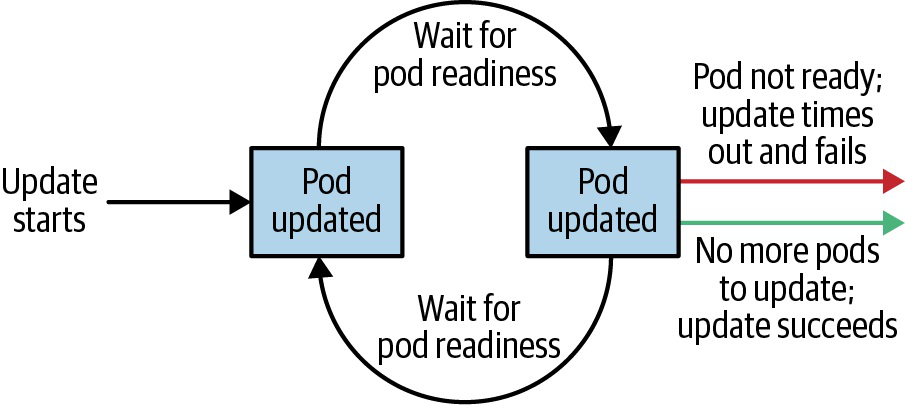

# Kubernetes Workload Controllers Và Rollout

## Overview

Pod tự thân không đủ cho production vì Pod có thể chết, node có thể mất, image có thể lỗi và app cần rollout/rollback. Kubernetes dùng workload controllers để giữ desired state: bao nhiêu replica, chạy trên node nào, update ra sao, task có hoàn thành chưa.

`Kubernetes in Action` giải thích kỹ ReplicationController, ReplicaSet, DaemonSet, Job, CronJob, Deployment và StatefulSet. `Kubernetes Up and Running` nhấn mạnh cách Deployment/ReplicaSet/DaemonSet/Job là các API object tách biệt, phối hợp qua label selector thay vì một object khổng lồ.

## Controller Map

| Controller | Dùng khi | Pod identity | Storage pattern |
|---|---|---|---|
| Deployment | stateless service, rollout/rollback | Pod thay thế được | thường không giữ state trong Pod |
| ReplicaSet | giữ số replica, thường do Deployment quản lý | Pod thay thế được | stateless |
| DaemonSet | một agent trên mỗi node hoặc subset node | gắn với node | hostPath/log/network agent |
| StatefulSet | stateful app cần identity ổn định | tên/DNS ổn định | PVC riêng qua `volumeClaimTemplates` |
| Job | task chạy đến khi hoàn thành | Pod tạm | output ngoài Pod |
| CronJob | Job chạy theo lịch | Pod tạm | output ngoài Pod |

## Deployment Và ReplicaSet

Deployment quản lý rollout ở cấp application. ReplicaSet giữ số Pod replica cụ thể. Khi update image/spec, Deployment tạo ReplicaSet mới và scale dần ReplicaSet cũ xuống.



Tài liệu Kubernetes cũ có thể dùng `ReplicationController`, `kubectl run` hoặc `kubectl resize` để minh họa scale. Với cluster hiện đại, hãy dịch mental model đó sang Deployment/ReplicaSet:

```text
desired replicas trong Deployment
-> Deployment controller tạo/cập nhật ReplicaSet
-> ReplicaSet giữ đúng số Pod
-> scheduler đặt Pod lên Node
-> kubelet chạy container thật
```

Đừng scale Pod trực tiếp. Pod là runtime instance có thể bị thay thế; controller mới là nơi giữ intent bền.

```yaml
apiVersion: apps/v1
kind: Deployment
metadata:
  name: web
spec:
  replicas: 3
  selector:
    matchLabels:
      app: web
  strategy:
    type: RollingUpdate
    rollingUpdate:
      maxSurge: 1
      maxUnavailable: 0
  template:
    metadata:
      labels:
        app: web
    spec:
      containers:
      - name: web
        image: nginx:1.25
        ports:
        - containerPort: 80
        readinessProbe:
          httpGet:
            path: /
            port: 80
```

Lệnh vận hành:

```bash
kubectl get deploy,rs,pod -l app=web
kubectl rollout status deployment/web
kubectl rollout history deployment/web
kubectl rollout undo deployment/web
kubectl scale deployment/web --replicas=5
```

## Điều Gì Thực Sự Trigger Rollout

Deployment tạo ReplicaSet mới khi phần `spec.template` thay đổi. Thay đổi image, env, resource, probe, volume mount, label/annotation trong Pod template đều có thể tạo revision mới.

Ngược lại, đổi metadata ở ngoài Pod template như `metadata.labels` của chính Deployment thường chỉ đổi thông tin của object Deployment, không tự làm Pod mới xuất hiện. Đây là lỗi phổ biến khi team kỳ vọng chỉ cần đổi label release ở Deployment là rollout sẽ chạy.

Selector của Deployment/ReplicaSet là hợp đồng nối controller với Pod. Với Kubernetes hiện đại, selector là phần rất nhạy cảm và thường không nên sửa sau khi đã tạo object:

- selector quá rộng có thể nhận nhầm Pod không thuộc workload;
- selector đổi không khớp template có thể làm rollout kẹt hoặc tạo object không quản lý Pod như mong muốn;
- nếu cần đổi selector nền tảng, thường nên tạo Deployment mới rồi migrate traffic có kiểm soát.

Safe check trước khi thay đổi label/selector:

```bash
kubectl get deploy <name> -n <namespace> -o yaml
kubectl get rs,pod -n <namespace> -l app=<app>
kubectl diff -f deployment.yaml
```

## Rollout Safety

Rollout an toàn cần hơn một image mới:

- readiness probe để chỉ Pod khỏe mới nhận traffic.
- `maxUnavailable` phù hợp với capacity.
- `maxSurge` phù hợp với quota và node capacity.
- metric/error budget để quyết định tiếp tục hay rollback.
- image tag bất biến hoặc digest để rollback đáng tin.
- `minReadySeconds` nếu app cần chứng minh Ready ổn định một thời gian trước khi được tính là Available.
- `progressDeadlineSeconds` để phát hiện rollout không tiến triển, nhưng lưu ý Kubernetes chỉ đánh dấu lỗi qua condition/rollout status, không tự rollback thay bạn.
- `revisionHistoryLimit` đủ lớn để còn lịch sử rollback gần nhất, nhưng không quá lớn đến mức giữ quá nhiều ReplicaSet cũ.

Khi rollout lỗi:

```bash
kubectl rollout status deployment/<name>
kubectl describe deployment <name>
kubectl get rs -l app=<app>
kubectl describe pod <pod>
kubectl logs <pod>
kubectl rollout undo deployment/<name>
```

Khi pause Deployment để canary thủ công, thay đổi mới sẽ không rollout tiếp cho đến khi resume. `kubectl rollout undo` cũng cần trạng thái rollout phù hợp; luôn kiểm tra `kubectl rollout status` và `kubectl rollout history` trước khi kết luận rollback đã chạy.

## DaemonSet

DaemonSet đảm bảo mỗi node phù hợp có một Pod. Use case:

- log agent,
- node exporter,
- CNI component,
- storage/node plugin,
- security/monitoring agent.

```bash
kubectl get daemonsets -A
kubectl rollout status daemonset/<name> -n <namespace>
kubectl describe daemonset <name> -n <namespace>
```

DaemonSet không phải cách chạy service replicated theo traffic. Nếu app cần nhiều replica sau Service, dùng Deployment.

## Job Và CronJob

Job dùng cho task có điểm kết thúc:

- migration,
- batch processing,
- one-shot import/export,
- test job.

CronJob dùng cho lịch định kỳ:

```bash
kubectl get jobs
kubectl get cronjobs
kubectl create job manual-run --from=cronjob/<cronjob-name>
kubectl logs job/<job-name>
```

Checklist:

- Đặt `backoffLimit`.
- Đặt `activeDeadlineSeconds` nếu task có nguy cơ treo.
- Đặt `ttlSecondsAfterFinished` nếu muốn cleanup.
- Log/output nên đi ra hệ thống ngoài Pod.
- Với workload chia shard, `completionMode: Indexed` giúp mỗi completion có index ổn định để app xử lý partition tương ứng.
- Nếu Job có sidecar thường chạy mãi, Job có thể không complete vì còn container chưa exit. Dùng native sidecar khi cluster/runtime hỗ trợ, hoặc thiết kế sidecar tự shutdown sau khi main task xong.

CronJob tạo Job theo lịch. Khi thiết kế CronJob production, cần quyết định rõ:

- `concurrencyPolicy: Allow` nếu Job overlap là chấp nhận được;
- `concurrencyPolicy: Forbid` nếu Job cũ còn chạy thì bỏ qua lần mới;
- `concurrencyPolicy: Replace` nếu lần mới phải thay lần đang chạy;
- `suspend: true` để tạm dừng lịch mà không xóa object;
- `successfulJobsHistoryLimit` và `failedJobsHistoryLimit` để tránh rác object;
- timezone/missed schedule behavior theo khả năng của cluster và controller hiện tại.

Xóa CronJob thường kéo theo owned Jobs/Pods theo cascading deletion. Nếu cần giữ Jobs/Pods để điều tra, phải dùng deletion propagation phù hợp hoặc export evidence trước.

## StatefulSet

StatefulSet dùng khi mỗi replica cần identity riêng và storage riêng. Pod thường có tên ổn định như:

```text
db-0
db-1
db-2
```

Điểm khác Deployment:

- Pod identity ổn định.
- DNS ổn định qua headless Service.
- PVC riêng cho từng replica.
- Thứ tự create/update/delete thường có ý nghĩa.

StatefulSet không tự biến database thành HA. App vẫn cần replication, backup, quorum, failover và restore strategy riêng.

Update StatefulSet cần thận trọng hơn Deployment:

- `RollingUpdate` thường cập nhật từ ordinal cao xuống thấp.
- `partition` cho phép staged rollout một phần Pod theo ordinal.
- `OnDelete` chỉ dùng template mới khi user/operator tự xóa Pod cũ.
- Scale down không tự xóa PVC để tránh mất dữ liệu, nên cleanup storage cần runbook riêng.

Với database/queue, readiness phải phản ánh trạng thái phục vụ an toàn như replica catch-up, quorum hoặc leader/primary role, không chỉ process còn sống.

## Choosing The Right Controller

Hỏi theo thứ tự:

1. Workload có phải task kết thúc không? Nếu có, dùng Job/CronJob.
2. Có cần một Pod trên mỗi node không? Nếu có, dùng DaemonSet.
3. Mỗi replica có cần identity/storage riêng không? Nếu có, cân nhắc StatefulSet.
4. Còn lại đa số stateless service dùng Deployment.

## Related Pages

- [Pods, Labels, Namespaces Và Metadata](./01-pods-labels-namespaces-and-metadata.md)
- [Kubernetes Workload Design And Best Practices](./03-workload-design-and-best-practices.md)
- [Kubernetes Storage, Volumes Và Stateful Workloads](../03-storage/overview.md)
- [Kubernetes Operations, Resources Và Observability](../05-operations/overview.md)
- [Kubernetes Troubleshooting Runbooks](../98-troubleshooting/overview.md)
