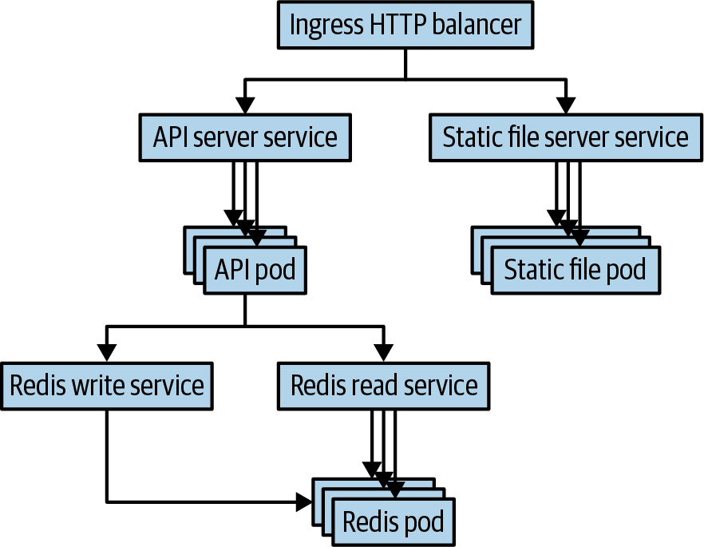

# Kubernetes Workload Design And Best Practices

## Overview

Note này chắt lọc từ PDF `Kubernetes_Best_Practices_Blueprints_for_Building_Successful_Applications.pdf`. PDF có outline rất rõ nhưng text bị encode theo font riêng, nên nội dung được nhập theo hướng tổng hợp domain thay vì copy trực tiếp.

Mục tiêu của trang là đặt một checklist thiết kế workload trước khi đi sâu vào từng object riêng lẻ. Khi đọc cùng các note `Deployment`, `Service`, `Ingress`, `ConfigMap`, `Secret`, `RBAC`, hãy dùng trang này như bản đồ tư duy vận hành.

## Workload Foundation

Một workload tốt trên Kubernetes không chỉ là manifest chạy được. Nó cần trả lời được:

- App chạy stateless hay stateful.
- Config nào thay đổi theo môi trường, config nào là secret.
- App có readiness/liveness/startup probe chưa.
- Requests/limits có phản ánh nhu cầu thật không.
- Rollout, rollback và versioning được kiểm soát như thế nào.
- Log, metric và alert có đủ để vận hành ngày 2 không.

Một app production thường là nhiều object phối hợp, không phải một Deployment đơn lẻ:



Mental model nên giữ khi đọc manifest:

```text
Ingress/Gateway -> Service -> Deployment/Pod stateless -> Service/DNS -> stateful backend/PVC hoặc external service
```

Tách API server, static file server và stateful backend giúp mỗi phần scale, rollout và debug theo đúng đặc tính của nó. Nhưng việc tách này chỉ an toàn khi repo manifest, label, Service selector, Ingress path, Secret, ConfigMap và storage ownership được quản lý nhất quán.

## Image Management

Không dùng tag mơ hồ như `latest` cho môi trường quan trọng. Image nên được build, scan, tag và promote theo pipeline rõ ràng.

Thực hành tốt:

- Pin image bằng version tag hoặc digest.
- Build image nhỏ, chỉ chứa runtime cần thiết.
- Không nhúng secret vào image layer.
- Scan vulnerability trước khi promote.
- Tách image build khỏi deploy manifest nếu pipeline có nhiều stage.

## Configuration, Secret Và RBAC

ConfigMap dành cho cấu hình không nhạy cảm; Secret dành cho password, token, key hoặc credential. Secret trong Kubernetes chỉ được base64 encode theo mặc định, vì vậy vẫn cần RBAC, encryption at rest và quy trình rotation.

Checklist:

- Không đặt secret trong ConfigMap hoặc plain manifest commit lên Git.
- Hạn chế quyền `get/list/watch secrets`.
- Dùng ServiceAccount riêng cho workload thay vì dùng default service account.
- Gắn role theo namespace trước khi dùng quyền cluster-wide.
- Với production, cân nhắc External Secrets, Vault hoặc cloud secret manager.

## Networking Và Exposure

Service là abstraction nội bộ; Ingress/Gateway API là lớp expose HTTP(S); LoadBalancer hoặc NodePort chỉ nên dùng khi đúng mô hình hạ tầng.

Khi thiết kế traffic:

- Dùng `ClusterIP` cho giao tiếp nội bộ.
- Dùng Ingress hoặc Gateway API cho HTTP routing.
- Dùng NetworkPolicy để giới hạn east-west traffic.
- Kiểm tra selector của Service có khớp label Pod.
- Không mở NodePort tràn lan trong production.

## Release Và Rollout

Deployment giúp rollout stateless workload, nhưng chiến lược release vẫn cần được thiết kế.

Các nguyên tắc nên có:

- Dùng readiness probe để Pod chỉ nhận traffic khi sẵn sàng.
- Review `maxUnavailable` và `maxSurge` theo sức chịu tải của app.
- Theo dõi `kubectl rollout status` và metric lỗi trong rollout.
- Có đường rollback nhanh bằng image tag/version trước đó.
- Với hệ thống quan trọng, cân nhắc canary, blue-green hoặc progressive delivery.

## Developer Workflow

Kubernetes shared cluster nên tách namespace theo team, môi trường hoặc project. Namespace không phải security boundary tuyệt đối, nhưng là boundary tốt cho quota, RBAC, naming và lifecycle.

Một developer namespace nên có:

- ResourceQuota và LimitRange.
- RoleBinding rõ cho user/group.
- NetworkPolicy mặc định nếu cluster yêu cầu isolation.
- Cách xem log/debug không cần quyền cluster-admin.
- Quy trình promote từ dev sang staging/prod.

Developer workflow nên đo được, không chỉ "có cluster dev":

- onboarding: từ user mới đến app mẫu chạy được trong thời gian ngắn;
- developing: build image, push và deploy nhanh vào namespace riêng;
- testing: smoke test chạy nhanh trước PR, full test chạy tự động trước merge;
- debugging: log, exec, port-forward và event phải truy cập được mà không cần quyền quá rộng;
- hygiene: namespace TTL hoặc cleanup automation để tránh tài nguyên dev tồn đọng.

## Observability

Monitoring, logging và alerting cần được thiết kế từ đầu. Một app chỉ chạy được nhưng không quan sát được sẽ khó vận hành khi có incident.

Nên theo dõi:

- Pod restart count, pending pod, failed scheduling.
- CPU/memory request vs usage.
- HTTP error rate, latency, saturation.
- Queue depth hoặc domain metric của app.
- Kubernetes event liên quan đến image pull, probe, scheduling và volume mount.

Phân biệt rõ:

- Metrics dùng để đo xu hướng, SLO và alert.
- Logs dùng để giải thích sự kiện chi tiết.
- Events dùng để hiểu quyết định của Kubernetes control plane.

## Policy Và Admission Control

Policy giúp chặn cấu hình rủi ro trước khi workload vào cluster. Admission controller hoặc policy engine như Gatekeeper/Kyverno nên được dùng để enforce các quy tắc nền.

Ví dụ policy nên có:

- Không chạy container privileged nếu không có lý do rõ.
- Không dùng host network/host PID tùy tiện.
- Bắt buộc requests/limits cho workload production.
- Bắt buộc image registry được phép.
- Chặn ServiceAccount token automount nếu workload không cần gọi API Server.

## Related Pages

- [Kubernetes Operations Quick Reference](./00-kubernetes-operations-quick-reference.md)
- [Core Objects Overview](./overview.md)
- [Pods, Labels, Namespaces Và Metadata](./01-pods-labels-namespaces-and-metadata.md)
- [Workload Controllers Và Rollout](./02-workload-controllers-and-rollout.md)
- [Kubernetes Networking, Services Và Ingress](../02-networking/overview.md)
- [Kubernetes Security, RBAC Và Pod Hardening](../04-security/overview.md)
- [Kubernetes Operations, Resources Và Observability](../05-operations/overview.md)
- [Scheduling, Affinity, Taints, Topology Và Priority](../05-operations/03-scheduling-affinity-taints-topology-and-priority.md)
- [Observability Logs, Metrics, Events Và Traces](../05-operations/02-observability-logs-metrics-events-and-traces.md)
- [Image Pull Errors](../98-troubleshooting/image-pull-errors.md)
