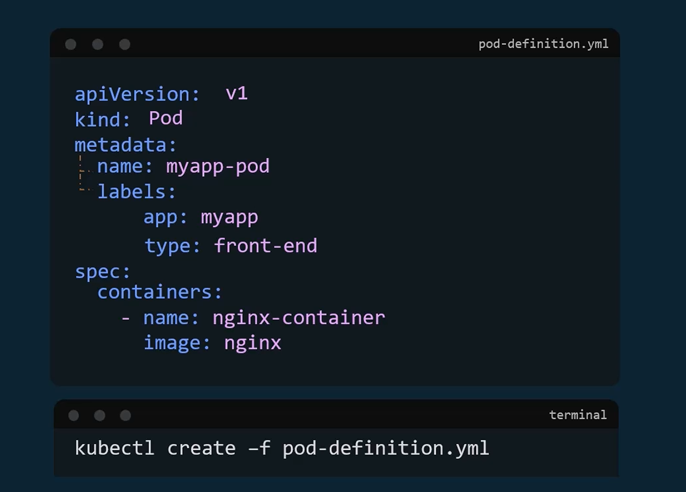
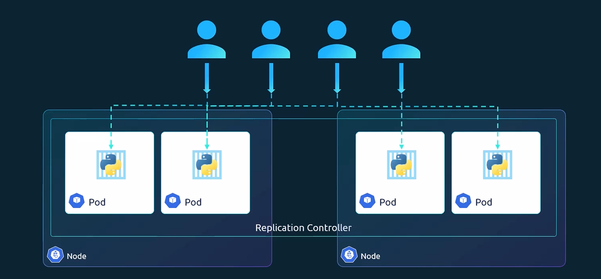
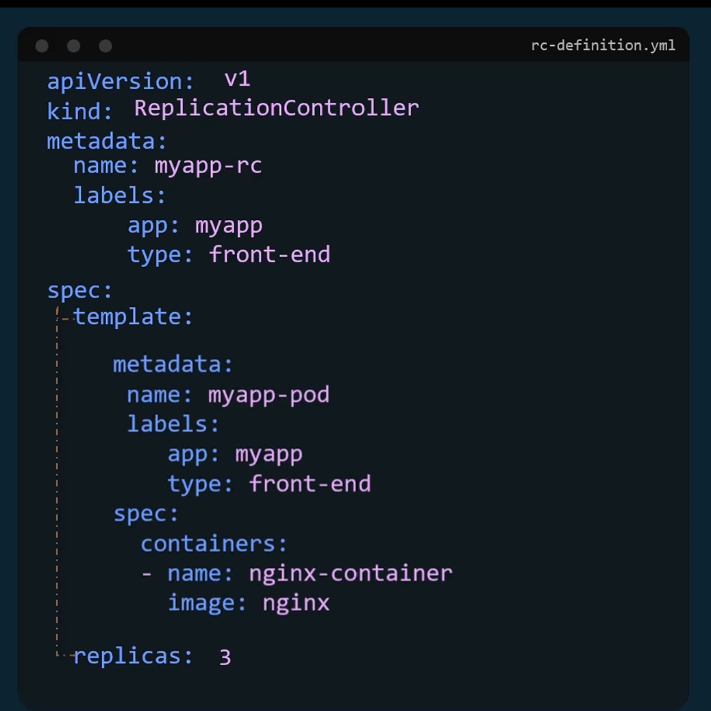
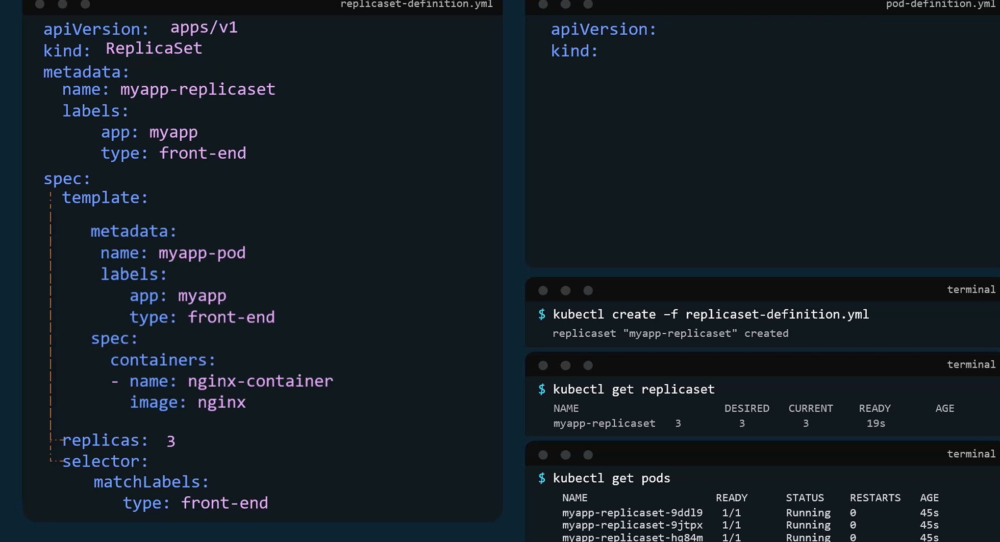
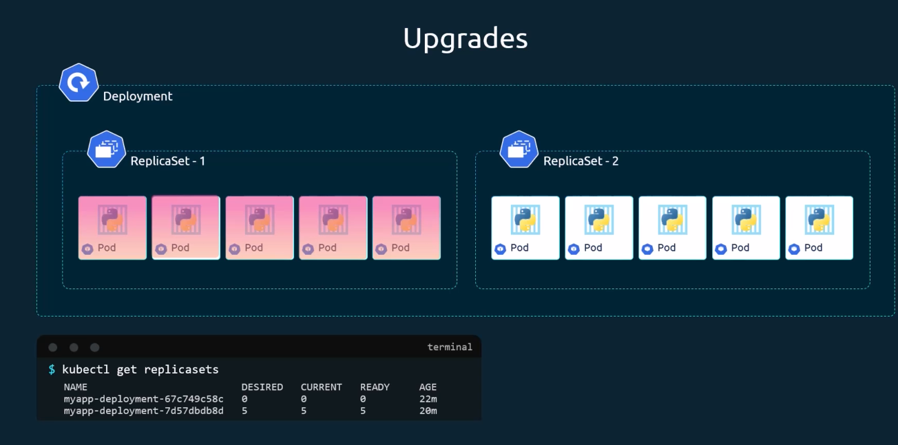
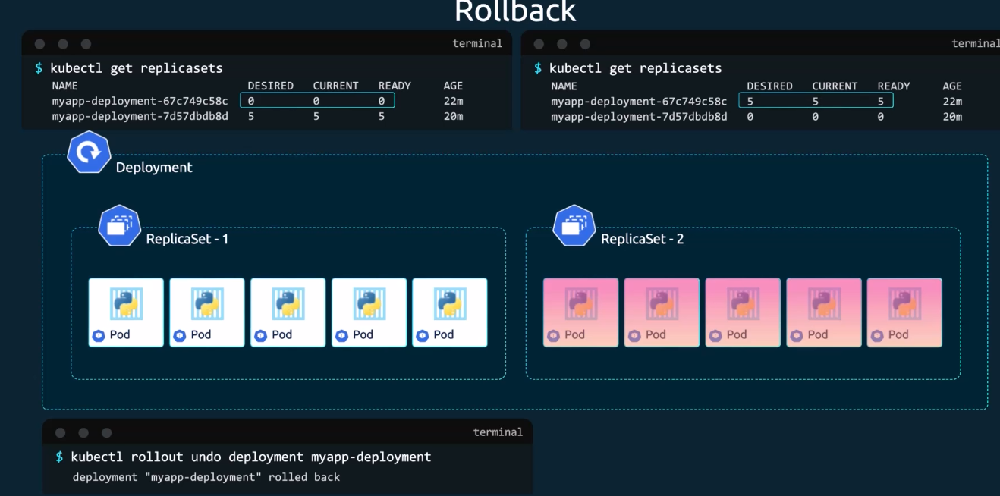
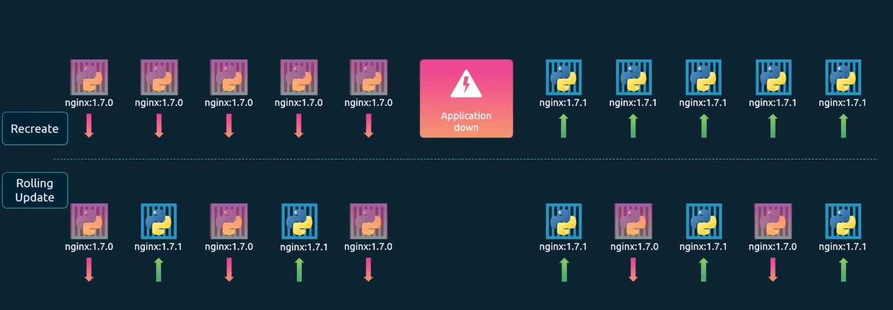
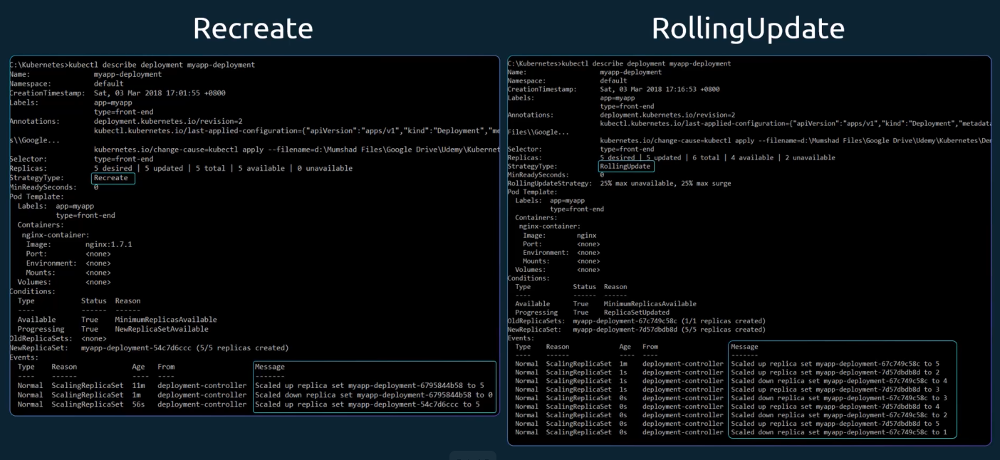

# Các chủ điểm quan trọng trong Kubernetes

## Pod

### Tạo pod với file YAML 

## Replication Controller và ReplicaSets

### Replication Controller

### ReplicaSets

## Deployments

### Deployments Updates và Rollback
- Định nghĩa rollout là gì trước khi chúng ta tìm hiểu về cách nâng cấp application 

#### Upgrade

#### Rollback

#### Deployments Strategy

## Services 

### NodePort

### ClusterIP

### Load Balancer

## Imperative và Declarative

## Kubernetes namespaces

