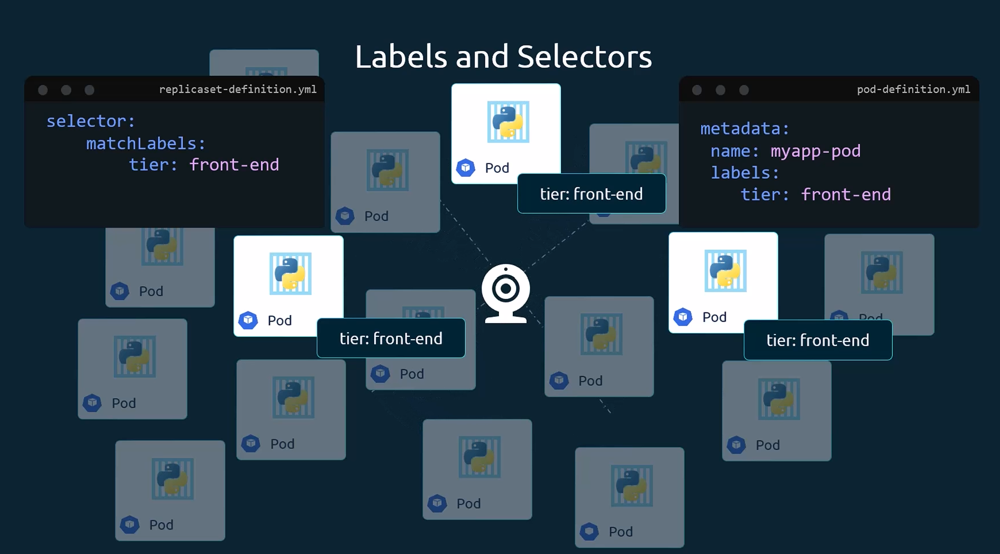
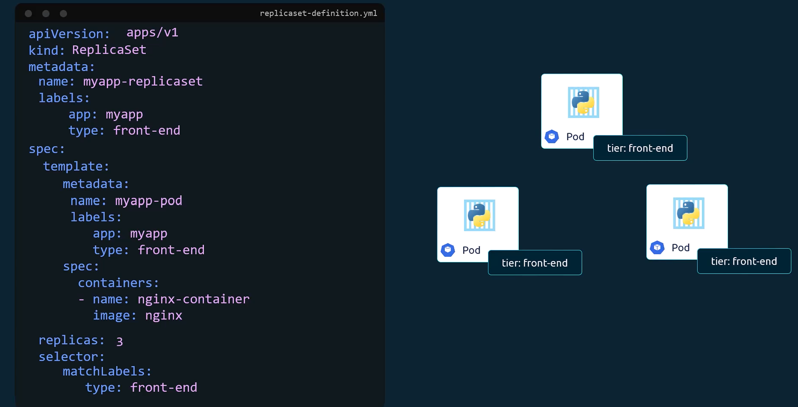

# Lập lịch - Scheduling trong K8s 


## Manual Scheduling

## Labels và Selector 





>> Đặt vấn đề : Bây giờ làm sao chúng ta có thể scale được số ReplicaSets lên 6 Rep ?

Có nhiều cách có thể áp dụng cho trường hợp này :
+ Chúng ta có thể update thẳng trong file yaml từ 3 thành 6 . Sau đó chạy lại lệnh `kubectl apply -f replicaset-definition.yml` để áp dụng thay đổi .

+ Một cách khác là sử dụng lệnh `kubectl scale` với tham số replicas để thay đổi số lượng replica
```bash
kubectl scale --replicas=6 -f replicaset-definition.yml
```

+ Lệnh `kubectl scale` cũng có thể sử dụng với việc định nghĩa tên file . Tuy nhiên giá trị replicas mới sẽ không cập nhật lại vào file

```bash
kubectl scale --replicas=6 replicaset myapp-replicaset
```

## Taints and Tolerations


## Node Selectors


## Node Affinity

### So sánh Taints and Tolerations với Node Affinity


## Resource Limits


## DaemonSets


## Static Pods


## Multiple Schedulers


## Configuring Kubernetes Scheduler profiles


