# Kubernetes Service Discovery, Ingress Và Network Policy Deep Dive

## Overview

Kubernetes networking không bắt đầu từ Ingress. Nó bắt đầu từ một vấn đề nền: Pod là ephemeral, IP Pod thay đổi, replica tăng giảm liên tục, nhưng client vẫn cần một tên/endpoint ổn định để gọi service. Vì vậy Kubernetes tách:

- Pod là backend thật.
- Service là frontend ổn định ở layer 4.
- EndpointSlice là danh sách backend hiện tại.
- Ingress/Gateway là layer 7 routing từ ngoài vào.
- NetworkPolicy là boundary cho east-west traffic.


## Service Discovery Mental Model

Service là một named selector:

```text
Service selector -> Pods matching labels -> EndpointSlice -> data plane rules
```

Nếu Service selector là `app=web`, Kubernetes sẽ tìm Pod có label `app=web`, sau đó tạo EndpointSlice chứa Pod IP/port. Client không cần biết Pod IP; client gọi Service DNS hoặc ClusterIP.

Debug Service luôn đi theo chain này:

```bash
kubectl get svc <service> -n <namespace>
kubectl describe svc <service> -n <namespace>
kubectl get endpointslice -n <namespace> -l kubernetes.io/service-name=<service>
kubectl get pod -n <namespace> --show-labels
```

Nếu Service không route được, đừng sửa Ingress ngay. Trước hết kiểm tra Service có endpoint không.

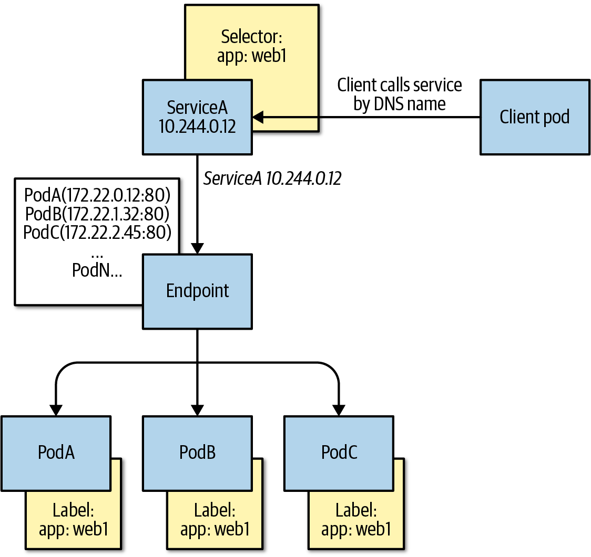

Hình trên nhấn mạnh điểm dễ quên: Service chọn Pod qua label selector, còn dataplane route tới danh sách endpoint hiện tại. Nếu label sai hoặc Pod chưa Ready, Service vẫn tồn tại nhưng không có backend hữu dụng.

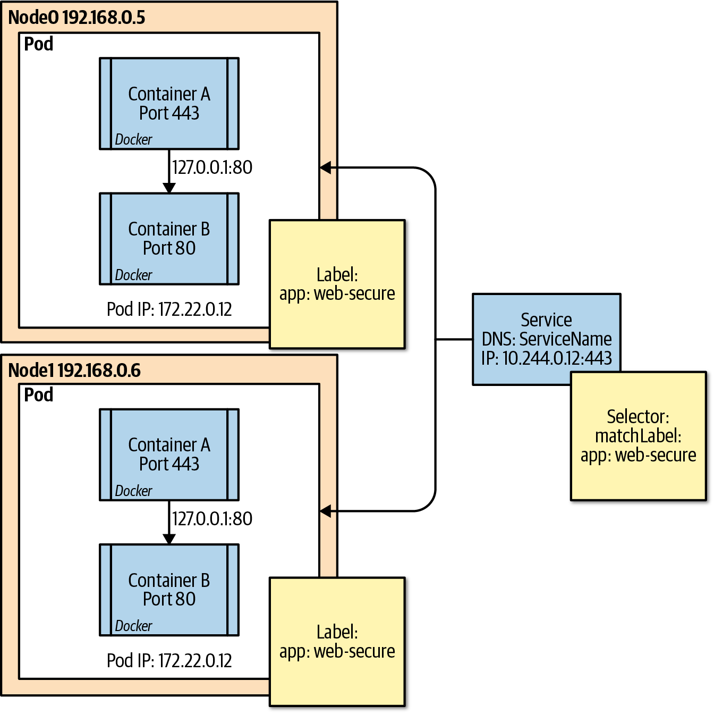

Khi debug production, hãy đọc Service như một contract giữa identity ổn định và backend động: selector phải match đúng label, EndpointSlice phải có endpoint Ready, port `targetPort` phải khớp container thật, và dataplane trên node phải có rule tương ứng.

## ClusterIP, kube-proxy Và EndpointSlice

ClusterIP là virtual IP ổn định. kube-proxy hoặc dataplane thay thế quan sát Service/EndpointSlice rồi lập rule trên node để traffic đến ClusterIP được chuyển về một backend Pod.


Tùy cluster, implementation có thể là:

- iptables,
- IPVS,
- eBPF/dataplane của CNI.

Điểm cần nhớ: ClusterIP không phải process đang listen socket như app. Nó là abstraction do node dataplane thực thi.

## CNI Contract Và Pod Network

CNI không phải một network duy nhất; nó là contract để kubelet/runtime gọi plugin khi Pod sandbox được tạo hoặc xóa. Với Linux cluster, kubelet tạo Pod sandbox trước, sau đó CNI thường nhận network namespace của sandbox và thực hiện các việc như:

- cấp IP cho Pod;
- tạo veth/interface;
- thêm route;
- cấu hình overlay, tunnel, BGP hoặc eBPF dataplane tùy plugin;
- enforce NetworkPolicy nếu plugin hỗ trợ.

Luồng rút gọn:

```text
Pod sandbox network namespace
-> CNI ADD
-> Pod IP + route + dataplane rule
-> app container join namespace
-> CNI DEL khi Pod bị xóa
```

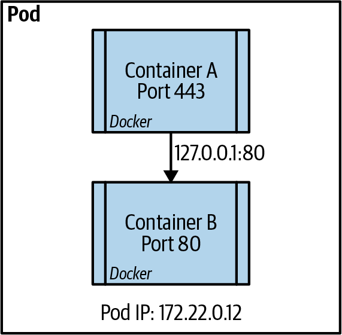

Các container trong cùng một Pod chia sẻ network namespace, nên có thể gọi nhau qua `localhost`. Điều này tiện cho sidecar, nhưng cũng có nghĩa là hai container trong cùng Pod không thể bind cùng một port trên cùng protocol.

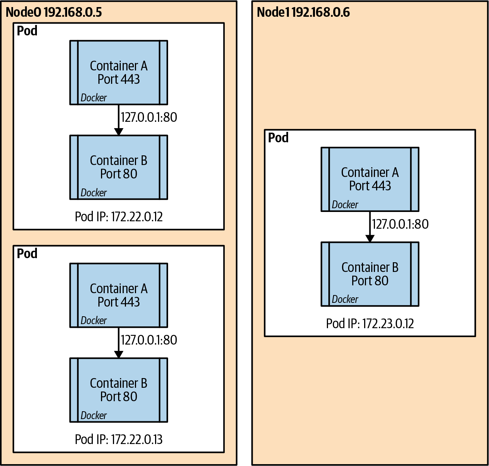

Kubernetes giả định Pod IP có thể nói chuyện trực tiếp với Pod IP khác trong cluster nếu policy cho phép, dù hai Pod nằm cùng node hay khác node. Vì vậy lỗi Pod-to-Pod thường nằm ở CNI/dataplane, route, MTU, NetworkPolicy hoặc firewall nền, không chỉ ở Service object.

Khi chọn CNI cho production, đừng chỉ so benchmark throughput. Checklist tối thiểu:

- Có enforce NetworkPolicy đúng nhu cầu ingress/egress không.
- Có support chính thức với managed Kubernetes hoặc distro đang dùng không.
- Pod CIDR, node count và service scale có phù hợp giới hạn thiết kế không.
- Dataplane dùng overlay, BGP, cloud-native IP hoặc eBPF; lựa chọn này ảnh hưởng MTU, route, observability và cách debug.
- Tooling logging/metrics/flow visibility đủ để điều tra sự cố east-west traffic không.

Khi một node có nhiều Pod bị lỗi network cùng lúc, hãy chuyển hướng điều tra từ Service object sang CNI/node dataplane: interface, route, iptables/IPVS/eBPF map, tunnel, MTU và log của CNI agent.

```bash
kubectl get pod -A -o wide --field-selector spec.nodeName=<node>
ip addr
ip route
iptables-save
```

Tên command cụ thể của plugin khác nhau, ví dụ Calico, Cilium, Antrea hoặc Flannel có tool/log riêng. Luôn đọc runbook CNI đang chạy thay vì áp một flow cho mọi cluster.

## DNS Và Stale Discovery

Kubernetes DNS giúp app gọi service bằng tên:

```text
web.prod.svc.cluster.local
```

DNS đơn giản nhưng có giới hạn:

- một số client cache DNS quá lâu;
- DNS không hiểu health sâu của app;
- DNS nhiều A record không thay thế load balancing tốt;
- khi scale nhanh, client có thể giữ endpoint cũ.

Vì vậy với phần lớn app, gọi Service DNS ổn định tốt hơn là tự query Pod IP. Chỉ app đặc biệt như database peer discovery hoặc StatefulSet mới cần biết identity từng Pod.

Service cũng có thể tạo environment variables cho container mới nếu Service đã tồn tại trước khi Pod start. Đây là cơ chế legacy; DNS nên là default cho service discovery. Nếu môi trường có quá nhiều Service hoặc muốn tránh env bị nhiễu, có thể cân nhắc:

```yaml
spec:
  enableServiceLinks: false
```

### resolv.conf, Search Domain Và ndots

Pod dùng DNS policy mặc định thường nhận `/etc/resolv.conf` có nameserver trỏ về cluster DNS, kèm search domain theo namespace:

```text
<namespace>.svc.cluster.local
svc.cluster.local
cluster.local
```

Vì vậy app có thể gọi `web`, `web.prod`, hoặc FQDN đầy đủ `web.prod.svc.cluster.local`. Tuy nhiên `ndots` và search domain có thể làm một tên ngắn phát sinh nhiều query trước khi ra ngoài upstream DNS. Với app gọi nhiều hostname ngoài cluster, DNS latency bất thường đôi khi đến từ resolver behavior chứ không phải CoreDNS hỏng.

Debug DNS từ trong Pod:

```bash
kubectl exec -n <namespace> <pod> -- cat /etc/resolv.conf
kubectl exec -n <namespace> <pod> -- nslookup kubernetes.default.svc.cluster.local
kubectl logs -n kube-system deploy/coredns
```

## ExternalName Và Selectorless Service

Không phải mọi backend đều là Pod trong cluster. Kubernetes vẫn có thể cung cấp tên ổn định cho dependency ngoài cluster:

- `ExternalName` tạo DNS alias đơn giản tới tên ngoài cluster, ví dụ database managed service.
- Service không có selector có thể đi kèm EndpointSlice do bạn hoặc controller quản lý để trỏ tới endpoint cụ thể.
- External dependency vẫn cần credential, egress policy, DNS, timeout và observability riêng; Service object không biến nó thành workload Kubernetes.

Pattern này hữu ích khi muốn app dùng cùng một service name ở nhiều môi trường nhưng backend khác nhau. Tuy nhiên đừng che giấu quá nhiều: runbook vẫn phải chỉ rõ backend thật nằm ở đâu, ai vận hành, backup/restore ra sao và failover làm thế nào.

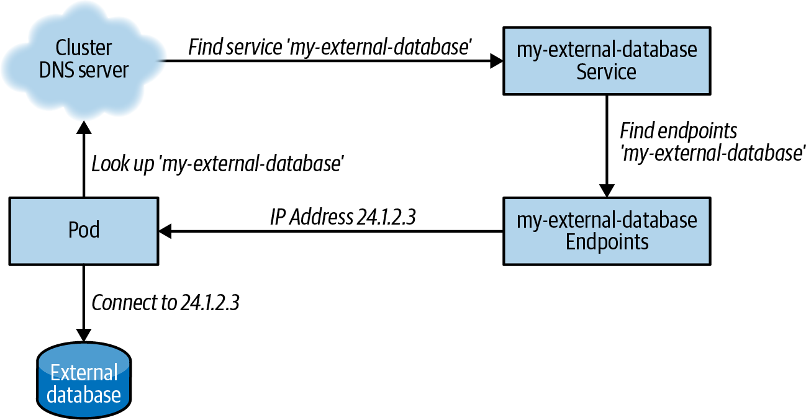

Mental model khi import service ngoài cluster:

```text
Pod -> cluster DNS -> selectorless Service -> EndpointSlice/Endpoints -> external IP/DNS
```

Dùng selectorless Service khi backend ngoài cluster có IP ổn định hoặc một controller riêng có thể cập nhật endpoint. Dùng `ExternalName` khi backend có DNS name ổn định và cluster DNS có thể resolve tên đó. Nếu DNS doanh nghiệp nằm ngoài resolver mặc định của cluster, CoreDNS/upstream resolver phải được cấu hình rõ; nếu không, object Kubernetes đúng nhưng Pod vẫn không resolve được dependency.

Với external database/API, Service chỉ giải quyết discovery. Production checklist vẫn cần:

- network path từ Pod CIDR/node tới mạng ngoài cluster;
- firewall/security group/route table/VPN/peering;
- credential và rotation;
- timeout/retry/circuit breaker phía app;
- observability cho cả phía cluster và backend ngoài cluster;
- owner/runbook của backend thật.

Nếu backend ngoài cluster không có IP hay DNS ổn định, cần controller đồng bộ external resource vào EndpointSlice/Endpoints thay vì cập nhật thủ công.

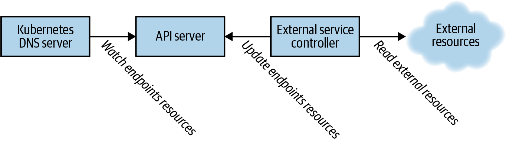

## NodePort Và LoadBalancer Data Path

`NodePort` mở một port trên mọi node để traffic ngoài cluster đi vào Service. Nó hữu ích cho lab, bare-metal hoặc khi tích hợp load balancer riêng, nhưng trong production cần xem đây là một thay đổi exposure trên cả node fleet, không phải chỉ trên một Pod.

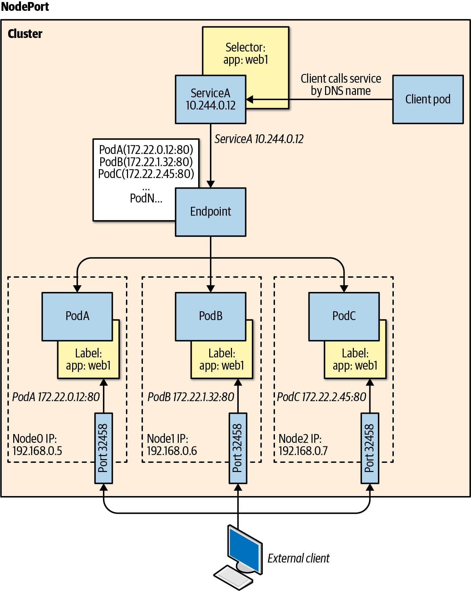

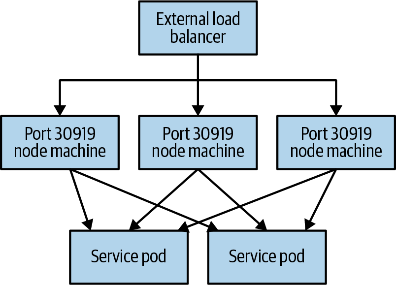

`LoadBalancer` thường yêu cầu cloud controller hoặc load balancer integration tạo endpoint bên ngoài, rồi route traffic về Service/node/dataplane trước khi tới Pod backend.

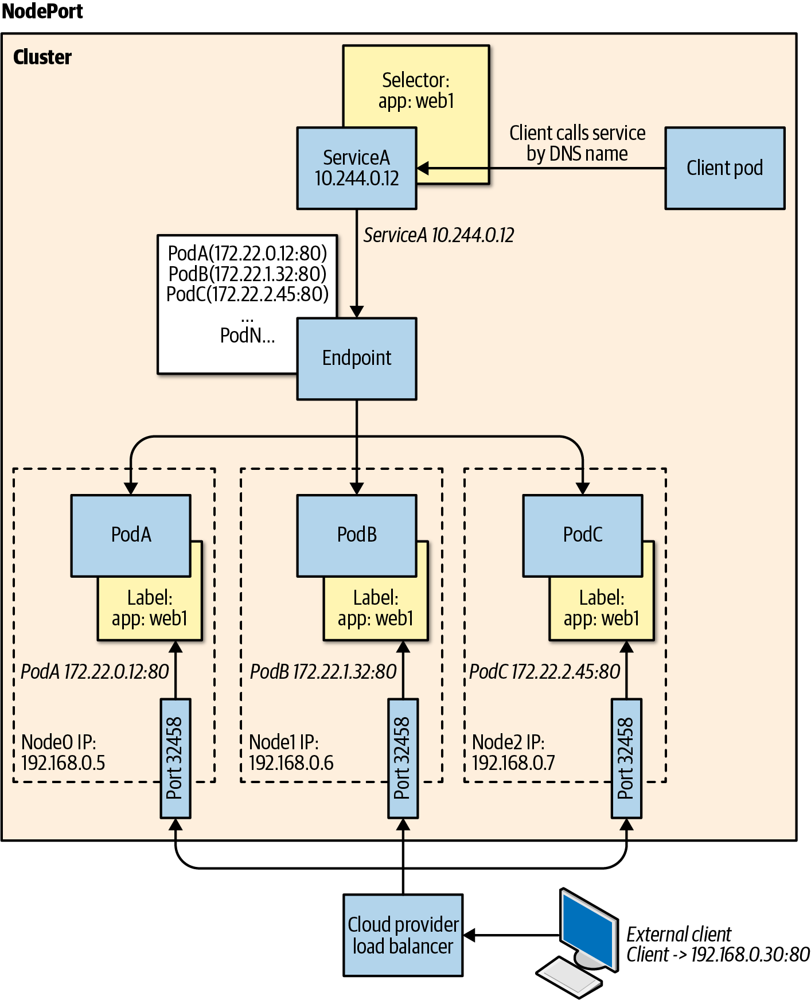

Review tối thiểu trước khi expose Service:

- Load balancer là public hay internal.
- Security group, firewall, source range và allowlist có đúng boundary không.
- Có cần giữ source IP không; nếu có, kiểm tra `externalTrafficPolicy: Local` và phân bố endpoint theo node.
- Health check của load balancer có khớp readiness thực tế không.
- NetworkPolicy/CNI có enforce trên đường traffic này đúng như kỳ vọng không.

Khi export Kubernetes Service cho hệ thống ngoài cluster, ưu tiên internal load balancer nếu môi trường cloud hỗ trợ vì nó cấp VIP routable trong mạng nội bộ. Với on-prem hoặc môi trường không có internal LB controller, NodePort thường cần một physical/virtual load balancer bên ngoài trỏ vào danh sách `<nodeIP>:<nodePort>`. Cách này hoạt động nhưng làm tăng trách nhiệm của network team: health check, firewall, source IP, node lifecycle và port range phải được quản lý.

Tích hợp máy ngoài cluster trực tiếp vào service discovery/dataplane Kubernetes, ví dụ chạy kubelet/kube-proxy hoặc chỉnh DNS về cluster DNS, là phương án invasive. Chỉ dùng khi thật sự cần vì nó kéo node legacy vào failure mode và security model của cluster.

## Service Traffic Policies

Với `NodePort` hoặc `LoadBalancer`, `externalTrafficPolicy` quyết định node nhận traffic có thể forward sang endpoint ở node khác hay chỉ dùng endpoint local:

| Policy | Ý nghĩa | Trade-off |
|---|---|---|
| `Cluster` | Có thể forward tới endpoint ở node khác | phân phối đều hơn nhưng có thể mất source IP hoặc thêm cross-node hop |
| `Local` | Chỉ gửi tới endpoint local trên node nhận traffic | giữ source IP và tránh hop liên node, nhưng node không có endpoint local có thể drop traffic |

`internalTrafficPolicy: Local` áp dụng cho traffic nội bộ cluster và ép client Pod dùng endpoint cùng node. Pattern này hữu ích cho node-local daemon/service, nhưng nếu node không có endpoint local thì request fail.

`sessionAffinity: ClientIP` chỉ là sticky ở layer 4 theo client IP. Service không hiểu HTTP cookie; cookie/session routing thuộc Ingress, Gateway hoặc proxy layer.

Topology-aware hints trong EndpointSlice có thể giúp ưu tiên endpoint cùng zone để giảm latency/cost, nhưng đây là hint cho dataplane, không phải cam kết routing tuyệt đối.

## Readiness Gate To Traffic

Một Pod `Running` chưa chắc nhận traffic. Service chỉ nên đưa Pod vào endpoint khi Pod Ready.

Readiness probe trả lời câu hỏi:

```text
Pod này đã nên nhận request từ Service chưa?
```

Lỗi phổ biến:

- readiness check chỉ kiểm tra process sống, không kiểm tra app route quan trọng;
- readiness check quá phụ thuộc database, làm tất cả Pod rút khỏi Service khi DB chập chờn;
- `initialDelaySeconds` quá ngắn làm rollout kẹt;
- app bind sai interface hoặc port.

## Ingress Controller

Ingress là object cấu hình. Ingress Controller mới là component đọc object đó và cấu hình reverse proxy/load balancer.

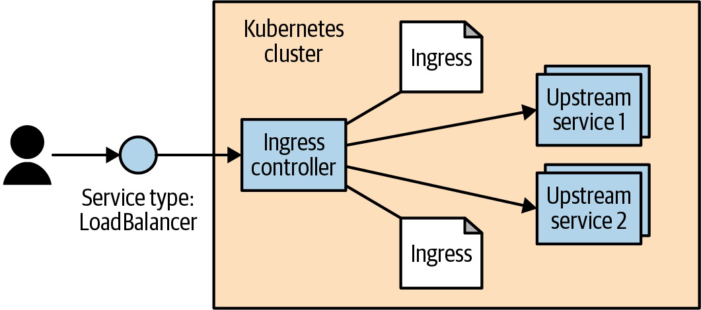


Ingress tách:

- spec chuẩn trong Kubernetes API;
- implementation cụ thể như NGINX, HAProxy, Traefik, Envoy/Contour hoặc cloud controller.

Điều này làm Ingress portable ở mức cơ bản nhưng annotation/behavior nâng cao thường phụ thuộc controller.

Khi một host phục vụ cả API và static content, rule order/path specificity phải được review kỹ. Ví dụ `/api` phải match API backend trước rule `/`; nếu rule `/` hoặc wildcard được đặt quá rộng, request API có thể bị route sang static file server. Với Gateway/Ingress controller khác nhau, hãy test bằng request thật kèm Host header và path trước khi coi routing là đúng.

## Gateway API Positioning

Ingress vẫn phổ biến cho HTTP routing cơ bản. Gateway API là hướng mới hơn và giàu role model hơn:

- platform team quản lý GatewayClass/Gateway;
- app team quản lý HTTPRoute/TCPRoute tùy mô hình;
- routing policy biểu đạt rõ hơn Ingress annotation.

Khi thiết kế platform mới, nên kiểm tra Gateway API support của controller. Khi vận hành cluster có Ingress ổn định, không cần migration chỉ vì "mới hơn".

Mô hình object thường gặp:

```text
GatewayClass -> Gateway -> HTTPRoute/TCPRoute/... -> Service backendRef -> EndpointSlice -> Pod
```

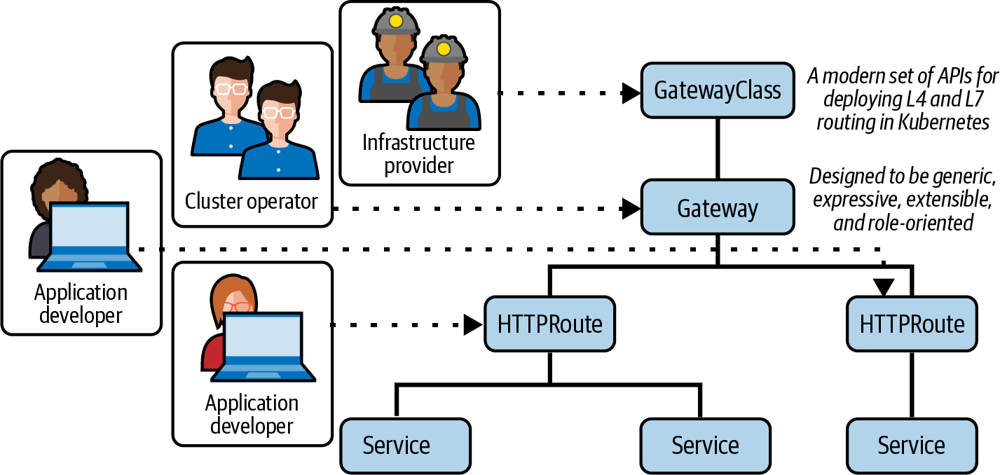

Gateway API làm rõ ranh giới trách nhiệm hơn Ingress: infrastructure/provider cung cấp `GatewayClass`, platform hoặc cluster operator quản lý Gateway, domain và TLS default, còn app team quản lý Route trỏ về Service của mình.

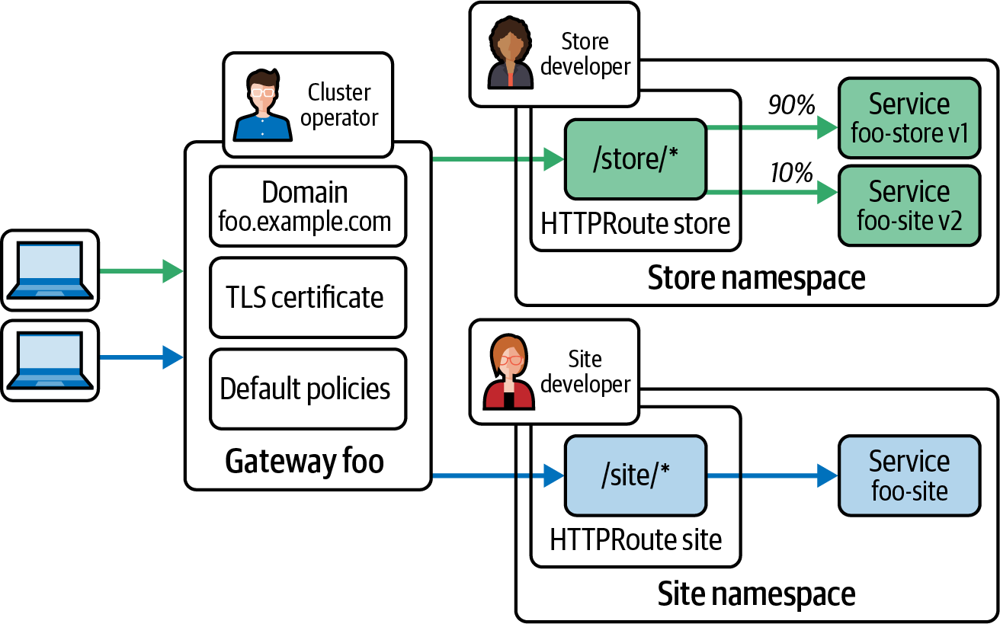

Mô hình này phù hợp môi trường nhiều team vì Route có thể được attach có kiểm soát vào Gateway chung, thay vì mỗi app tự đẩy annotation riêng vào một Ingress controller.

Điểm dễ lỗi:

- Gateway/Route tồn tại nhưng controller chưa reconcile hoặc chưa attach route.
- Route trỏ Service sai namespace/port hoặc thiếu quyền cross-namespace theo policy của controller.
- Gọi IP của load balancer mà không có Host header đúng nên rule không match.
- TLS termination/passthrough bị hiểu nhầm; passthrough không cho gateway inspect HTTP path/header.

Debug tối thiểu:

```bash
kubectl get gatewayclass,gateway -A
kubectl get httproute -A
kubectl describe gateway <gateway> -n <namespace>
kubectl describe httproute <route> -n <namespace>
kubectl get svc,endpointslice -n <namespace>
```

## NetworkPolicy

NetworkPolicy giải quyết câu hỏi khác Service:

```text
Pod nào được phép nói chuyện với Pod nào?
```

Default Kubernetes network thường cho phép Pod nói chuyện tự do nếu không có policy. Với namespace production, nên cân nhắc default deny rồi mở từng luồng.

Ví dụ mở ingress từ frontend sang api:

```yaml
apiVersion: networking.k8s.io/v1
kind: NetworkPolicy
metadata:
  name: allow-frontend-to-api
spec:
  podSelector:
    matchLabels:
      app: api
  policyTypes:
  - Ingress
  ingress:
  - from:
    - podSelector:
        matchLabels:
          app: frontend
    ports:
    - protocol: TCP
      port: 8080
```

NetworkPolicy cần CNI hỗ trợ. Nếu apply policy mà không có hiệu lực, kiểm tra CNI trước.

NetworkPolicy là allow-list cộng dồn theo hướng traffic:

- Pod không match policy nào thường vẫn default allow.
- Nếu Pod match policy `Ingress`, ingress không được allow sẽ bị chặn.
- Nếu Pod match policy `Egress`, egress không được allow sẽ bị chặn.
- Nhiều policy cùng chọn một Pod thì rule được cộng lại, không override lẫn nhau.

Rollout an toàn hơn cho namespace production:

```text
observe traffic thực tế
-> default deny ingress
-> mở ingress cần thiết theo app/namespace/port
-> thêm egress cho dependency nhạy cảm
-> test bằng debug Pod, synthetic check và app metrics
```

Với default deny egress, nhớ mở DNS tới CoreDNS, dependency bắt buộc, telemetry/logging endpoint và control-plane dependency nếu workload cần. Rất nhiều sự cố "app không gọi được database/API ngoài" thực chất là egress policy thiếu rule.

### Service Type Và Production Trade-Off

Không chọn Service type chỉ vì “truy cập được từ ngoài”:

| Type | Dùng khi | Rủi ro cần kiểm tra |
|---|---|---|
| `ClusterIP` | traffic nội bộ cluster | endpoint rỗng, readiness sai, DNS/cache |
| `NodePort` | lab, on-prem, hoặc tích hợp LB ngoài cluster | mở port trên mọi node, firewall/security group, source IP |
| `LoadBalancer` | cloud/provider có controller cấp LB | cost, annotation provider-specific, public/internal exposure |
| `ExternalName` | cần tên ổn định trỏ tới DNS ngoài cluster | không có health check endpoint, lỗi DNS ngoài cluster |
| selectorless Service | muốn đại diện cho backend ngoài cluster bằng Service name | EndpointSlice phải được quản lý đúng, runbook phải chỉ rõ backend thật |

`NodePort` và `LoadBalancer` cần review network exposure như một thay đổi production thật. Đừng assume NetworkPolicy chặn được toàn bộ traffic đi qua LB nếu CNI, kube-proxy và policy implementation không enforce theo đường bạn nghĩ.

## Service Mesh Positioning

Service mesh thêm data plane proxy và control plane để quản lý giao tiếp service-to-service ở tầng cao hơn NetworkPolicy. Mesh thường có giá trị khi platform cần:

- mTLS và workload identity thống nhất giữa service;
- traffic shifting, retry, timeout, circuit breaker và progressive delivery ở layer 7;
- metrics, tracing và access log nhất quán cho east-west traffic;
- policy theo service identity thay vì chỉ Pod label/IP;
- cross-cluster hoặc hybrid service discovery.

Trade-off là overhead CPU/memory/latency, vòng đời certificate, surface upgrade lớn hơn, policy debug phức tạp hơn và failure mode mới khi sidecar/proxy hoặc control plane gặp lỗi. Nếu nhu cầu chỉ là chặn east-west traffic cơ bản, NetworkPolicy ở CNI thường đủ nhẹ hơn. Nếu nhu cầu là mTLS, L7 traffic management và observability thống nhất, mesh có thể đáng chi phí vận hành.

Checklist trước khi bật mesh rộng:

- Use case ưu tiên đã rõ: security, traffic management, observability hay multicluster.
- Team vận hành hiểu certificate, proxy config, upgrade và rollback.
- Đã đo overhead latency, CPU và memory trên workload thật.
- Mesh tích hợp được với Ingress/Gateway, metrics, tracing và policy hiện có.
- Có đường rollback nếu sidecar/proxy làm request fail hoặc làm rollout chậm.

Với service giữa nhiều Kubernetes cluster, pattern cơ bản là export Service ở cluster A bằng internal LB/NodePort, rồi import VIP/DNS đó vào cluster B bằng selectorless Service hoặc `ExternalName`. Pattern này ổn cho số lượng nhỏ, tĩnh. Nếu số lượng service lớn hoặc cần failover động, nên dùng controller/service mesh/multicluster service API để đồng bộ export/import và garbage collect endpoint cũ.

## Troubleshooting Flow

```text
Client -> DNS -> Ingress/Gateway -> Service -> EndpointSlice -> Pod Ready -> Container port
```

Lệnh tối thiểu:

```bash
kubectl get ingress -n <namespace>
kubectl describe ingress <ingress> -n <namespace>
kubectl get svc <service> -n <namespace>
kubectl get endpointslice -n <namespace> -l kubernetes.io/service-name=<service>
kubectl get pod -n <namespace> -l app=<app> -o wide
kubectl describe pod <pod> -n <namespace>
```

Nếu có NetworkPolicy:

```bash
kubectl get networkpolicy -n <namespace>
kubectl describe networkpolicy <policy> -n <namespace>
```

## Related Pages

- [Networking Overview](./overview.md)
- [Pods, Labels, Namespaces Và Metadata](../01-core-objects/01-pods-labels-namespaces-and-metadata.md)
- [Kubernetes Troubleshooting Runbooks](../98-troubleshooting/overview.md)
