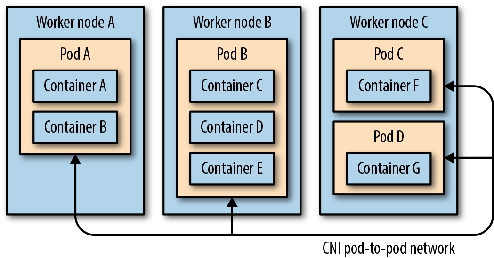

# Kubernetes Networking, Services Và Ingress

## Overview

Networking trong Kubernetes xoay quanh một ý tưởng: Pod thay đổi liên tục, nhưng client cần endpoint ổn định. Service, DNS, EndpointSlice, Ingress/Gateway và NetworkPolicy là các abstraction giúp traffic đi đúng nơi mà không buộc app phải biết Pod IP.

`Kubernetes in Action` giải thích Service, Endpoint, headless Service, readiness và cách kube-proxy/iptables triển khai data path. `Kubernetes Up and Running` bổ sung Ingress, HTTP load balancing, service discovery và service mesh như lớp nâng cao.

Đọc sâu: [Service Discovery, Ingress Và Network Policy Deep Dive](./01-service-discovery-ingress-and-network-policy.md).

## Kubernetes Network Assumptions

Cluster network thường được thiết kế sao cho:

- Pod có IP riêng.
- Pod có thể nói chuyện với Pod khác qua Pod IP nếu policy cho phép.
- Node có thể nói chuyện với Pod.
- Service cung cấp IP/DNS ổn định phía trước tập Pod.

Các giả định này phụ thuộc CNI plugin. Khi debug networking, luôn biết cluster đang dùng CNI nào.

## CNI Và Pod Network

CNI là contract giữa container runtime/kubelet path và network plugin. Mục tiêu của nó là cấp interface, IP, route và DNS/network metadata để Pod có thể tham gia cluster network theo cách nhất quán, dù implementation bên dưới là routing trực tiếp, overlay, cloud-native VPC networking hay mô hình khác.



Một Pod có thể có nhiều container nhưng chỉ có một network namespace chung. Container "pause"/sandbox giữ namespace đó sống trong suốt vòng đời Pod; các container app tham gia cùng namespace nên chia sẻ IP/port space. Khi Pod được tạo/xóa, CNI plugin được gọi để add/delete sandbox interface và IPAM theo dõi địa chỉ đã cấp.

Khi chọn CNI cho production, đừng chỉ hỏi "cài cái nào nhanh":

- topology network: single subnet, multi-AZ, routed, overlay hay cloud VPC-native;
- NetworkPolicy có được enforce thật không;
- IPAM có đủ dải địa chỉ và tránh overlap với underlay/on-prem không;
- observability/troubleshooting có nhìn được flow/drop reason không;
- upgrade và failure mode của CNI agent trên node.

## Service

Service chọn backend bằng selector:

```yaml
apiVersion: v1
kind: Service
metadata:
  name: web
spec:
  type: ClusterIP
  selector:
    app: web
  ports:
  - port: 80
    targetPort: 8080
```

Kiểm tra:

```bash
kubectl get svc web
kubectl describe svc web
kubectl get endpoints web
kubectl get endpointslice -l kubernetes.io/service-name=web
```

Nếu Service không có endpoint, thường là:

- selector không khớp label Pod,
- Pod chưa Ready,
- Pod ở namespace khác,
- targetPort sai,
- controller chưa cập nhật EndpointSlice.

kube-proxy hoặc dataplane thay thế đọc Service/EndpointSlice rồi reconcile rule trên node để traffic tới ClusterIP được chuyển về backend Pod. Tên `kube-proxy` mang tính lịch sử; trong nhiều cluster nó không proxy userspace từng request mà lập rule như iptables/IPVS/eBPF tùy implementation. Khi debug Service data path, cần biết cluster đang dùng mode nào.

## Service Types

| Type | Dùng khi |
|---|---|
| `ClusterIP` | giao tiếp nội bộ trong cluster |
| `NodePort` | lab/bare-metal đơn giản hoặc backend cho external LB |
| `LoadBalancer` | cloud/load balancer integration |
| `ExternalName` | tạo DNS alias tới hostname ngoài cluster |
| Headless Service | discovery trực tiếp Pod IP, thường cho StatefulSet |

Headless Service:

```yaml
spec:
  clusterIP: None
```

Với StatefulSet, headless Service giúp mỗi Pod có DNS ổn định.

## DNS

Service DNS thường có dạng:

```text
<service>.<namespace>.svc.cluster.local
```

Ví dụ:

```text
web.prod.svc.cluster.local
```

Debug DNS:

```bash
kubectl run dns-test --rm -it --image=busybox:1.36 -- nslookup web.prod.svc.cluster.local
kubectl get pods -n kube-system -l k8s-app=kube-dns
kubectl logs -n kube-system deploy/coredns
```

Kubernetes cũng có cơ chế inject environment variable cho Service đã tồn tại trước lúc Pod start, nhưng đây không nên là discovery chính cho production. Env var không tự cập nhật khi Service đổi và phụ thuộc thứ tự tạo Service trước Pod. DNS/Service name ổn định hơn cho phần lớn workload.

## Readiness Và Traffic

Readiness probe quyết định Pod có được đưa vào Service endpoint không. App đang chạy chưa chắc đã sẵn sàng nhận traffic.

Triệu chứng thường gặp:

- Pod `Running` nhưng Service không có endpoint.
- rollout treo vì new Pod chưa Ready.
- request lỗi ngẫu nhiên do readiness probe quá nông.

Readiness nên kiểm tra dependency tối thiểu cần cho request thật, nhưng không nên quá nặng đến mức tự tạo outage.

## Ingress Và Gateway

Ingress định tuyến HTTP(S) từ ngoài vào Service. Ingress chỉ là API object; cần Ingress Controller chạy trong cluster.

```yaml
apiVersion: networking.k8s.io/v1
kind: Ingress
metadata:
  name: web
spec:
  rules:
  - host: web.example.com
    http:
      paths:
      - path: /
        pathType: Prefix
        backend:
          service:
            name: web
            port:
              number: 80
```

Gateway API là hướng mới hơn cho traffic routing giàu tính biểu đạt hơn, đặc biệt khi nhiều team cùng dùng một ingress/gateway layer. Với cluster hiện có, chọn Ingress hay Gateway tùy platform support.

## NetworkPolicy

NetworkPolicy giới hạn traffic east-west giữa Pod/namespace. Nó chỉ có hiệu lực nếu CNI hỗ trợ policy.

API Server có thể nhận object NetworkPolicy dù CNI không enforce. Vì vậy validation thật phải là test traffic, không chỉ `kubectl get networkpolicy`.

Mẫu default deny ingress:

```yaml
apiVersion: networking.k8s.io/v1
kind: NetworkPolicy
metadata:
  name: default-deny-ingress
spec:
  podSelector: {}
  policyTypes:
  - Ingress
```

Sau đó mở từng luồng cần thiết bằng label/namespace selector.

Checklist:

- Dùng namespace label ổn định.
- Đặt label app/component rõ.
- Test từ Pod debug trước và sau khi apply policy.
- Cẩn thận với DNS egress nếu có default deny egress.

## Service Mesh

Service mesh thêm một data plane/proxy layer để cung cấp:

- mTLS service-to-service,
- traffic splitting/canary,
- retry/timeout/circuit breaking,
- L7 telemetry,
- policy theo service identity.

Nhưng service mesh cũng thêm complexity và failure mode mới. Chỉ nên dùng khi nhu cầu về bảo mật, traffic management hoặc observability thật sự vượt quá Service/Ingress/NetworkPolicy cơ bản.

## Troubleshooting Flow

Khi client không gọi được app:

1. Pod có Ready không.
2. Service selector có khớp label không.
3. EndpointSlice có backend không.
4. Port/targetPort đúng không.
5. DNS resolve đúng không.
6. NetworkPolicy có chặn không.
7. Ingress/Gateway controller có route đúng không.
8. External LB/firewall/security group có mở không.

```bash
kubectl get pod -o wide -l app=<app>
kubectl describe svc <service>
kubectl get endpointslice -l kubernetes.io/service-name=<service>
kubectl describe ingress <ingress>
kubectl get networkpolicy
```

## Related Pages

- [Kubernetes Operations Quick Reference](../01-core-objects/00-kubernetes-operations-quick-reference.md)
- [Service Discovery, Ingress Và Network Policy Deep Dive](./01-service-discovery-ingress-and-network-policy.md)
- [Pods, Labels, Namespaces Và Metadata](../01-core-objects/01-pods-labels-namespaces-and-metadata.md)
- [Kubernetes Storage, Volumes Và Stateful Workloads](../03-storage/overview.md)
- [Kubernetes Troubleshooting Runbooks](../98-troubleshooting/overview.md)
