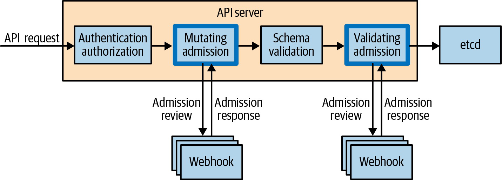
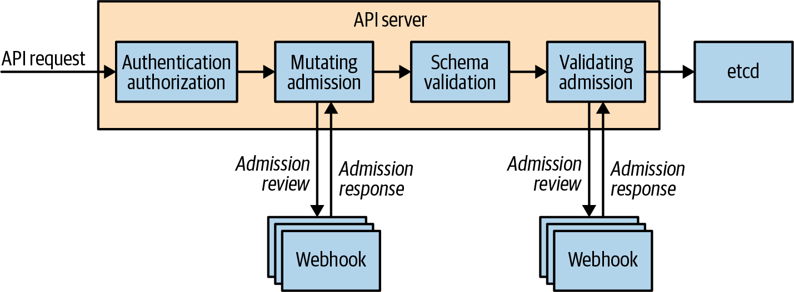
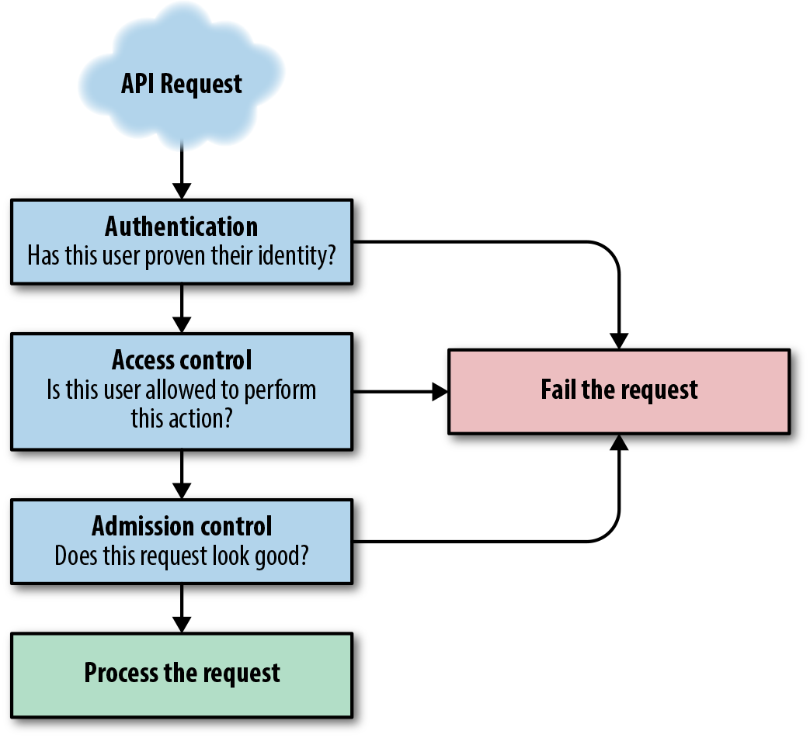
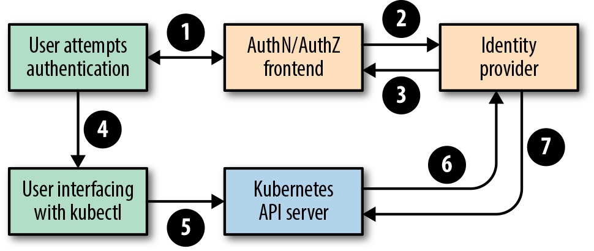
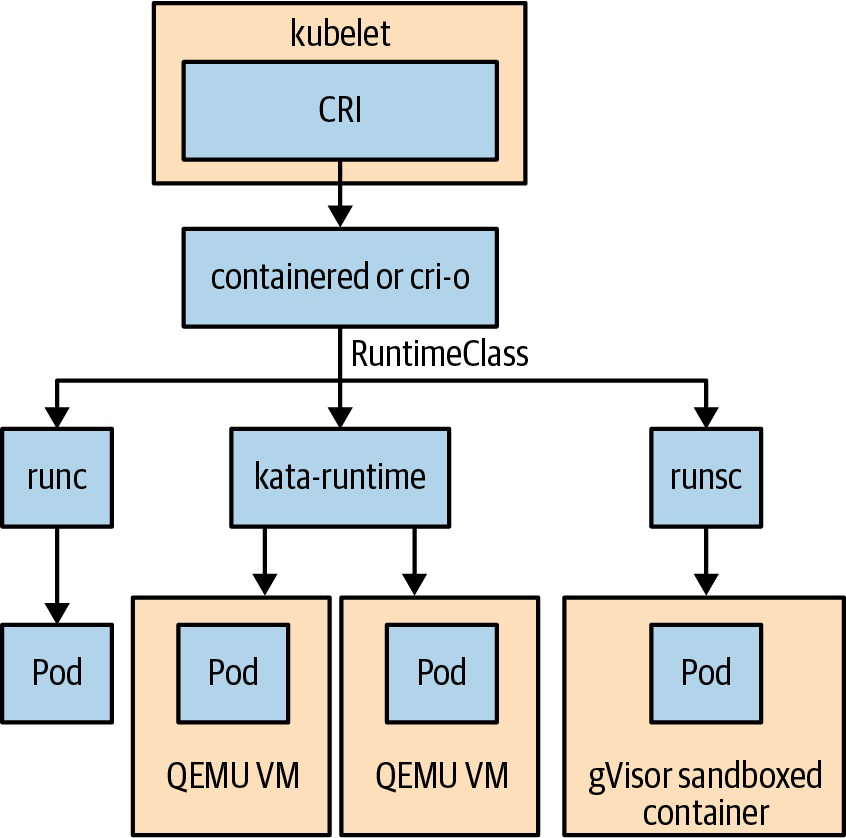
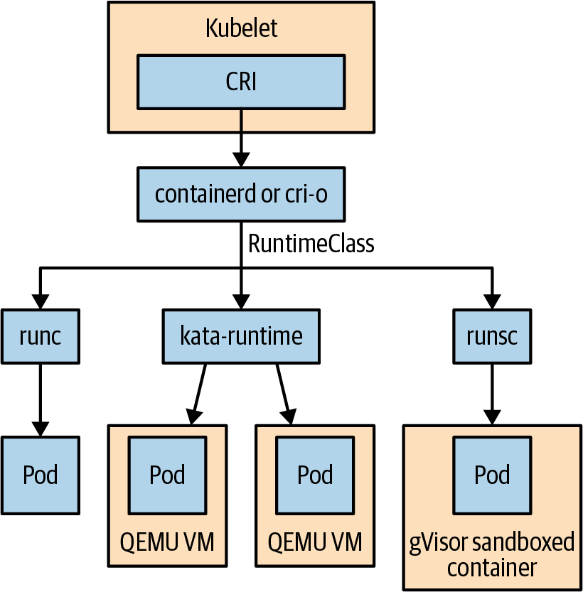
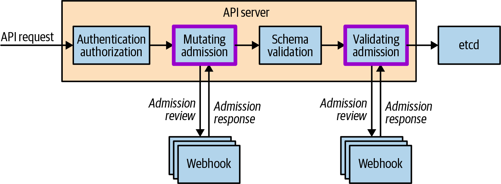
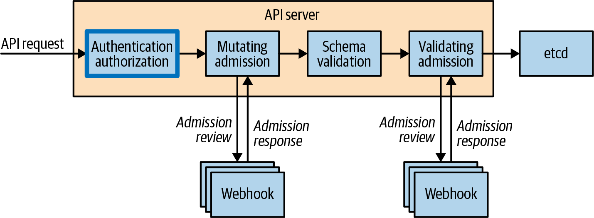

# Kubernetes RBAC, Pod Security Và Admission Deep Dive

## Overview

Kubernetes security cần nghĩ theo request path: ai gọi API, được phép làm gì, object có được admission cho vào cluster không, Pod khi chạy có quyền gì, và runtime có cô lập đủ không.

Một cluster an toàn cần defense in depth: RBAC tối thiểu, ServiceAccount riêng, Pod Security Admission, SecurityContext, NetworkPolicy, image supply chain, secret management, audit log và policy governance. Không lớp nào thay thế hoàn toàn lớp còn lại.

Security nên được chia theo layer để dễ vận hành:

- Cluster/control plane: API Server, etcd, kubelet, certificate, audit log, cloud metadata.
- Workload: Pod Security Admission, SecurityContext, NetworkPolicy, RuntimeClass, runtime audit.
- Code/supply chain: non-root image, base image tối giản, vulnerability scanning, provenance và repository security.

Nguyên tắc xuyên suốt là least privilege: user, workload, CI/CD runner, operator và controller chỉ có quyền cần thiết để làm nhiệm vụ.

## API Request Security Flow

Một request vào API Server thường đi qua:

```text
authentication -> authorization -> admission -> validation -> storage
```

Admission có thể mutate hoặc reject object trước khi lưu vào etcd.








Authorization trả lời “subject này có được thực hiện verb này trên resource này không”. Admission trả lời câu hỏi khác: “object/request này có được chấp nhận hoặc mutate trước khi lưu không”. Nhầm hai lớp này dễ dẫn tới debug sai hướng: `Forbidden` thường là authorization/RBAC, còn object bị reject với message policy thường là admission.

Thứ tự request flow cần nhớ:

- Authentication xác định caller là ai.
- Authorization quyết định caller có quyền gửi request đó không.
- Mutating admission có thể chỉnh object trước khi schema/validating admission chạy.
- Schema validation và validating admission kiểm tra object cuối cùng trước khi lưu vào etcd.

Request bị RBAC deny sẽ không tới admission webhook. Request được RBAC allow vẫn có thể bị admission reject vì vi phạm policy, security baseline, quota hoặc shape của object.

### Response Code Và Triage Request Bị Từ Chối

Khi debug request vào API Server, đừng chỉ nhìn message cuối cùng của `kubectl`. Hãy map response code về lớp xử lý:

| Code | Thường nằm ở lớp nào | Ý nghĩa vận hành |
|---|---|---|
| `401 Unauthorized` | authentication | Client chưa chứng minh được identity hợp lệ. Kiểm tra kubeconfig, token, certificate hoặc OIDC flow. |
| `403 Forbidden` | authorization/RBAC | Identity hợp lệ nhưng không có quyền với verb/resource/scope đó. Dùng `kubectl auth can-i`. |
| `400 Bad Request` | request shape | Request sai format hoặc tham số không hợp lệ. Kiểm tra manifest/rendered YAML và API path. |
| `409 Conflict` | optimistic concurrency | Object đã đổi `resourceVersion`; client/controller cần đọc lại rồi retry có kiểm soát. |
| `422 Unprocessable Entity` | validation/admission | Object syntactically đúng nhưng vi phạm schema, invariant hoặc policy. Kiểm tra field validation, admission webhook và event/message. |
| `202 Accepted` | async operation | Request đã được chấp nhận nhưng xử lý hoàn tất sau, ví dụ một số thao tác delete. Cần watch status/finalizer liên quan. |

Điểm thực dụng: `Forbidden` không phải lỗi Pod Security Admission; còn policy/admission reject không sửa bằng cách cấp thêm RBAC nếu request đã qua authorization.

### Audit Log Của API Server

Audit log trả lời câu hỏi "ai đã gọi API nào, vào lúc nào, với kết quả gì". Đây là lớp evidence quan trọng khi điều tra thay đổi nhạy cảm như Secret, RoleBinding, admission policy, kube-system workload hoặc thao tác exec/port-forward.

Nên ship audit log ra hệ thống tập trung thay vì chỉ giữ local trên control-plane node. Với cluster tự quản, cần quản lý retention, rotation và dung lượng vì API Server rất chatty; với managed Kubernetes, cần hiểu provider expose audit log ở đâu và có bật mặc định hay không.

Các nhóm event nên alert hoặc review định kỳ:

- tạo/sửa/xóa `RoleBinding`, `ClusterRoleBinding`, `Role`, `ClusterRole`;
- đọc hoặc liệt kê `Secret`, đặc biệt qua `list/watch`;
- thay `MutatingWebhookConfiguration`, `ValidatingWebhookConfiguration`, policy engine hoặc Pod Security namespace label;
- thao tác trong `kube-system` và namespace platform quan trọng;
- `pods/exec`, `pods/attach`, `pods/portforward` trên workload production.

Audit log không thay thế runtime detection. Nó thấy hành vi qua Kubernetes API, nhưng không thấy đầy đủ syscall, network connection hoặc file access bên trong container.

### Authentication Và User Management

Kubernetes không có resource `User` native để tạo/xóa user như Pod hay Secret. API Server nhận identity từ authentication plugin rồi chuyển thành `UserInfo` gồm username, uid, groups và extra fields. Vì vậy production user lifecycle nên nằm ở identity provider của tổ chức, còn Kubernetes dùng identity đó để authorization/audit.

Các nhóm cơ chế authentication phổ biến:

- X.509 client certificate: phù hợp cho bootstrap/admin hoặc automation ít người dùng, nhưng cần automation rotate/revoke certificate.
- OIDC: phù hợp cho user tương tác qua SSO/MFA và group claim từ identity provider.
- Bearer token/webhook: dùng khi tổ chức có hệ thống token riêng, nhưng phải kiểm soát latency/availability của auth backend.
- Basic/static file auth trong tài liệu cũ chỉ nên xem như lab hoặc legacy; production khó rotate, khó audit và thường cần restart/reconfigure API Server.



Với OIDC, `kubectl` thường gửi ID token như bearer token; API Server validate issuer/client/claim rồi map claim sang `UserInfo`. JWT thường được ký nhưng không encrypted, nên vẫn phải bảo vệ kubeconfig, terminal history, proxy/log và mọi đường truyền TLS.

Nếu bật nhiều authentication plugin, plugin đầu tiên xác thực thành công sẽ kết thúc authentication chain. Đây là pattern hữu ích để giữ một cơ chế break-glass được bảo vệ kỹ, nhưng cũng có thể gây khó debug nếu cùng một request có nhiều credential hợp lệ.

### kubeconfig Là Credential Nhạy Cảm

`kubeconfig` gồm ba phần chính:

```text
clusters: API endpoint và CA/connection data
users: credential hoặc exec plugin để lấy credential
contexts: ghép cluster + user + namespace mặc định
```

Không phát tán `admin.conf` từ kubeadm cho user hoặc CI/CD. Kubeconfig chứa client cert, token, password hoặc exec plugin có thể tương đương quyền API thật; ai đọc được file có thể gọi API theo identity đó. Với production, ưu tiên OIDC/SSO token ngắn hạn, context tách theo environment và quyền tối thiểu theo Role/Binding.

## RBAC Is Necessary But Not Sufficient

RBAC kiểm soát quyền gọi Kubernetes API. Nó không tự cô lập runtime của Pod.

Ví dụ user không có quyền đọc Secret vẫn có thể gây rủi ro nếu họ được tạo Pod tùy ý trong namespace có ServiceAccount mạnh, hostPath hoặc privileged container. Vì vậy cần kết hợp:

- RBAC tối thiểu;
- ServiceAccount riêng;
- Pod Security Admission/policy;
- NetworkPolicy;
- image policy;
- secret management;
- audit log.

## ServiceAccount Design

Nguyên tắc:

- mỗi workload quan trọng dùng ServiceAccount riêng;
- disable automount nếu app không gọi API;
- bind Role trong namespace trước khi nghĩ tới ClusterRole;
- tránh share ServiceAccount giữa CI/CD và runtime app.

```yaml
apiVersion: v1
kind: ServiceAccount
metadata:
  name: app-reader
automountServiceAccountToken: false
```

Nếu app cần gọi API:

```bash
kubectl auth can-i list pods \
  --as system:serviceaccount:<namespace>:app-reader \
  -n <namespace>
```

Token ServiceAccount là quyền API của workload. Nếu Pod bị compromise và token được mount, attacker có thể gọi API theo quyền của ServiceAccount đó. Vì vậy `automountServiceAccountToken: false` nên là default cho app không cần gọi Kubernetes API, còn workload cần API phải có Role tối thiểu và audit rõ ràng.


ServiceAccount đại diện cho process/workload, không phải người dùng. User/group thường đến từ identity provider bên ngoài, còn ServiceAccount là identity nội bộ Kubernetes, bị giới hạn theo namespace và nên được thiết kế theo từng workload.

Mỗi Pod luôn chạy với một ServiceAccount hiệu dụng: ServiceAccount được chỉ định trong `spec.serviceAccountName`, hoặc `default` ServiceAccount của namespace nếu không khai báo. Điểm này không có nghĩa là mọi Pod nên có API access rộng. Với app không cần gọi API Server, hãy tắt automount token; với controller/operator cần API access, cấp Role tối thiểu và audit hành vi bằng tên ServiceAccount rõ ràng.

Tài liệu cũ thường mô tả ServiceAccount token Secret được tạo tự động và mount vào Pod. Khi đọc tài liệu theo version hiện đại, cần kiểm tra cơ chế token projection/rotation của cluster đang dùng, nhưng mental model không đổi: token đó là credential API của process trong Pod.

## Workload Identity Và Cloud Credential

ServiceAccount Kubernetes kiểm soát danh tính khi workload gọi Kubernetes API. Nó không nên bị trộn lẫn với node identity hoặc credential cloud dài hạn.

Thiết kế tốt:

- workload dùng ServiceAccount riêng theo app;
- node identity chỉ đủ quyền cho node/pool, không cấp quyền rộng cho toàn bộ workload chạy trên node;
- app truy cập cloud API qua workload identity/federation hoặc secret manager thay vì key tĩnh trong manifest;
- secret rotation được test bằng rollout/reload thật;
- audit được cả phía Kubernetes API lẫn cloud/vault API.

Trên managed Kubernetes, tên implementation có thể khác nhau, ví dụ Workload Identity, managed identity, IAM role for service account, CSI Secret Store hoặc External Secrets. Mental model giống nhau: gắn quyền vào workload cụ thể, giới hạn phạm vi, tránh để Pod đọc credential của node hoặc dùng chung token admin.

Cloud metadata endpoint cũng là một phần của threat model. Nếu Pod có thể gọi metadata API của node và lấy credential provisioning/instance role quá rộng, attacker có thể thoát khỏi boundary namespace. Cần kiểm soát bằng metadata options của provider, NetworkPolicy/egress policy hoặc cơ chế workload identity chính thức.

## Role, ClusterRole Và Binding

Role giới hạn trong namespace. ClusterRole có thể áp dụng cluster-wide hoặc dùng lại trong namespace qua RoleBinding.

RBAC map identity đã được authentication tạo ra (`UserInfo`) sang cặp **verb + resource** của Kubernetes API. `kubectl get pod` thực chất là request `GET` tới resource Pod; RBAC verb tương ứng thường là `get`. Ngoài CRUD cơ bản còn có các verb/subresource quan trọng như `list`, `watch`, `patch`, `deletecollection`, `pods/log`, `pods/exec`, `pods/portforward` và `*/status`.

RBAC là additive allow-list: Role/ClusterRole chỉ grant quyền, không có deny rule trong cùng model. Nếu không rule nào allow request, kết quả là deny. Vì vậy khi debug, hãy tìm binding nào grant quyền, không tìm "rule deny".

Pattern an toàn:

- Role + RoleBinding cho app/team namespace.
- ClusterRole chỉ cho resource cluster-scoped hoặc reusable view role.
- ClusterRoleBinding chỉ cho platform/admin automation đã review.

Không dùng wildcard:

```yaml
verbs: ["*"]
resources: ["*"]
```

trừ khi đó thật sự là admin role có phạm vi kiểm soát riêng.

Subject trong Binding là string match từ authentication output:

- `User`: username do auth plugin trả về.
- `Group`: group claim/tên nhóm do auth plugin trả về.
- `ServiceAccount`: namespaced identity dạng `system:serviceaccount:<namespace>:<name>`.

RoleBinding có thể bind Role trong namespace hoặc bind ClusterRole để tái sử dụng policy trong một namespace. ClusterRoleBinding luôn mở scope cluster-wide, nên cần review kỹ hơn.

Một số quyền nhìn nhỏ nhưng blast radius lớn:

- `create pods`: có thể gián tiếp đọc Secret nếu user tạo Pod mount Secret trong namespace đó.
- `list/watch secrets`: đọc nhiều Secret và tiếp tục nhận update.
- `create rolebindings` hoặc bind role mạnh: có thể leo quyền.
- `impersonate`: có thể kiểm thử hoặc lạm dụng identity khác.
- `pods/exec` và `pods/portforward`: tương tác trực tiếp runtime workload.

## Impersonation Và Kiểm Tra Quyền

Khi debug RBAC, đừng chỉ đọc YAML bằng mắt. Dùng `kubectl auth can-i` để hỏi API Server:

```bash
kubectl auth can-i get pods -n <namespace> \
  --as system:serviceaccount:<namespace>:app-reader

kubectl auth can-i create deployments -n <namespace> \
  --as <user-or-group>
```

Các lỗi hay gặp:

- RoleBinding trỏ tới ServiceAccount sai namespace.
- Bind ClusterRole bằng ClusterRoleBinding khi chỉ cần RoleBinding.
- Cấp quyền `list/watch secrets` cho controller không cần đọc Secret.
- CI/CD token dùng chung cho nhiều environment.
- User có quyền create Pod nên gián tiếp đọc Secret bằng cách mount Secret vào Pod.

RBAC nên được review theo "hành động có thể gây hậu quả", không chỉ theo tên role. Quyền `create pods`, `create deployments`, `create rolebindings`, `impersonate`, `get secrets` đều rất nhạy cảm.

Các API authorization có thể dùng khi cần debug hoặc tự động hóa kiểm tra quyền:

- `SelfSubjectAccessReview`: user hiện tại có được làm action này không.
- `SubjectAccessReview`: kiểm tra cho subject khác, thường cần quyền admin.
- `LocalSubjectAccessReview`: scope theo namespace.
- `SelfSubjectRulesReview`: liệt kê các action user hiện tại có thể làm trong namespace.

`kubectl auth can-i` là wrapper tiện lợi cho các câu hỏi phổ biến. Khi cần audit/tooling tự động, các resource trong API group `authorization.k8s.io` cho phép kiểm tra quyền một cách Kubernetes-native.

### RBAC Cho CI/CD Và Quyền Tạm Thời

CI/CD nên dùng ServiceAccount riêng cho từng environment hoặc namespace, không dùng token admin chung. Điều này giúp audit rõ pipeline nào đã tạo, sửa hoặc xóa object nào.

Guardrail:

- CI deploy app namespace nào thì bind Role trong namespace đó trước, tránh ClusterRoleBinding rộng.
- Tách token deploy dev/staging/prod.
- Không cấp `get/list/watch secrets` nếu pipeline chỉ cần apply manifest đã render.
- Với quyền break-glass/SRE, ưu tiên Just-In-Time access, thời hạn ngắn, audit mạnh và reason rõ ràng.
- Người dùng tương tác nên đi qua OIDC/SSO/MFA thay vì kubeconfig tĩnh sống lâu.

Với Helm v3, quyền apply phụ thuộc vào identity gọi Helm/kubectl. Vì vậy quyền của runner hoặc operator vẫn phải được review như mọi Kubernetes API client khác.

## Pod Security Admission

PodSecurityPolicy trong sách cũ nên được đọc như bối cảnh lịch sử. Kubernetes hiện đại dùng Pod Security Admission hoặc policy engine.


Pod Security Admission là admission controller built-in để kiểm soát các field nhạy cảm trong Pod spec ở cấp namespace. Nó đơn giản hơn PodSecurityPolicy, nhưng đánh đổi bằng granularity thô hơn: trong cùng một namespace, bạn không thể dễ dàng áp security level khác nhau cho từng Pod/user nếu chỉ dùng PSA.

Namespace label ví dụ:

```bash
kubectl label namespace prod \
  pod-security.kubernetes.io/enforce=baseline \
  pod-security.kubernetes.io/warn=restricted \
  pod-security.kubernetes.io/audit=restricted
```

Ba mức mental model:

- `privileged`: cho workload hạ tầng đặc biệt.
- `baseline`: chặn cấu hình nguy hiểm phổ biến.
- `restricted`: hardening mạnh hơn cho app thông thường nếu tương thích.


PSA có ba mode kích hoạt:

- `enforce`: reject Pod không đạt policy.
- `warn`: cho phép tạo Pod nhưng trả warning cho client hỗ trợ warning, ví dụ `kubectl`.
- `audit`: ghi vi phạm vào audit log, hữu ích khi kiểm kê workload cũ.

Trong CI/CD, đừng giả định `warn` sẽ hiện ra cho developer; nhiều runner/tool chỉ fail/succeed mà không surfacing warning rõ ràng. Nếu dùng `warn`, nên kết hợp manifest linter hoặc policy check trong pipeline.

Pin version policy thay vì dùng `latest`:

```bash
kubectl label namespace prod \
  pod-security.kubernetes.io/enforce-version=v1.29 \
  pod-security.kubernetes.io/warn-version=v1.29 \
  pod-security.kubernetes.io/audit-version=v1.29
```

Version pinning giúp tránh cluster upgrade làm security standard thay đổi bất ngờ và phá workload ngoài kế hoạch. Sau khi upgrade cluster, nâng version policy theo batch riêng: audit trước, sửa manifest, rồi mới tăng enforce.

Triển khai PSA nên đi theo namespace:

```text
audit restricted -> warn restricted -> enforce baseline/restricted
```

Với workload cũ, bật `enforce=restricted` ngay có thể làm rollout fail vì app còn chạy root, cần writable root filesystem, hoặc cần capability đặc biệt. Cách an toàn là bật `warn/audit` trước, sửa manifest, rồi mới enforce.


Một posture thực dụng cho nhiều namespace production là `enforce=baseline`, `warn=restricted`, `audit=restricted` trong giai đoạn đầu. Khi app và chart đã được harden, nâng dần namespace phù hợp lên `enforce=restricted`.

## SecurityContext

SecurityContext là nơi đặt runtime hardening:

```yaml
securityContext:
  runAsNonRoot: true
  seccompProfile:
    type: RuntimeDefault
containers:
- name: app
  securityContext:
    allowPrivilegeEscalation: false
    readOnlyRootFilesystem: true
    capabilities:
      drop:
      - ALL
```

Các trường cần review kỹ:

- `privileged`;
- `hostNetwork`, `hostPID`, `hostIPC`;
- `hostPath`;
- Linux capabilities;
- `runAsUser`, `runAsGroup`, `fsGroup`;
- writable root filesystem.

Một baseline app thông thường nên hướng tới:

- không chạy privileged;
- không hostNetwork/hostPID/hostIPC;
- không mount hostPath trừ use case hạ tầng đã review;
- drop capabilities không cần;
- `runAsNonRoot`;
- `allowPrivilegeEscalation: false`;
- seccomp `RuntimeDefault`;
- root filesystem readonly nếu app hỗ trợ.

Không phải app nào cũng đạt restricted ngay. Nhưng mỗi exception cần có lý do, owner và thời hạn review.

### Seccomp, AppArmor Và SELinux

Pod Security Admission đặt baseline ở Kubernetes API, nhưng Linux kernel security vẫn là lớp runtime quan trọng:

- Seccomp lọc syscall mà container được gọi; tối thiểu nên dùng `RuntimeDefault` nếu workload tương thích.
- AppArmor và SELinux áp mandatory access control, hữu ích khi cần giới hạn hành vi process/file/network sâu hơn.
- Security profile operator hoặc tooling tương đương có thể giúp quản lý profile thay vì copy profile thủ công lên node.

Các profile này cần được rollout theo `audit/warn/enforce` tương tự admission policy. Profile quá chặt có thể làm app fail ở runtime, nên cần test bằng workload thật và quan sát syscall/denial log trước khi enforce rộng.

### Root-Like Pod Và Node Escape Risk

Một Pod nhìn như chỉ có quyền trong namespace vẫn có thể chạm tới node nếu spec mở quá rộng. Các cấu hình cần xem như exception bảo mật:

- `privileged: true` gần như trao nhiều quyền kernel capability cho container;
- `hostPath` có thể đọc/ghi filesystem của node nếu mount path nhạy cảm;
- `hostPID`/`hostIPC` mở vùng nhìn sang process/IPC của host;
- `hostNetwork` bỏ qua một phần isolation network và có thể đụng port/node firewall;
- capability như `SYS_ADMIN`, `NET_ADMIN` có blast radius lớn.

Chỉ workload hạ tầng đã review như CNI, CSI, node agent, log/monitoring agent mới thường cần các quyền này. Với app business, hãy bắt đầu từ restricted baseline và mở từng exception có lý do.

## RuntimeClass

RuntimeClass cho phép chọn runtime handler khác nhau cho Pod, ví dụ sandboxed runtime.





RuntimeClass hữu ích khi workload cần isolation mạnh hơn container runtime mặc định. Nhưng nó phụ thuộc node/runtime setup, không phải chỉ thêm field là chạy được.

Ví dụ Pod yêu cầu runtime riêng:

```yaml
apiVersion: v1
kind: Pod
metadata:
  name: sandboxed-app
spec:
  runtimeClassName: kata
  containers:
  - name: app
    image: example.com/app:1.0.0
```

RuntimeClass thường đi kèm node label, taint/toleration hoặc nodeSelector để Pod chỉ schedule lên node có runtime handler tương ứng. Các lựa chọn như Kata Containers, gVisor hoặc Firecracker có thể tăng isolation, nhưng khác nhau về syscall support, performance, observability và tooling debug.

Lưu ý quan trọng: workload isolation không đồng nghĩa secure multitenancy. Nếu Kubernetes API, RBAC, admission policy, Secret access và node boundary vẫn mở, một workload sandboxed vẫn có thể bị thay đổi hoặc lạm dụng qua control plane. Với môi trường nhiều tenant không tin cậy nhau, hãy review toàn bộ attack surface thay vì chỉ bật runtime sandbox.

Checklist trước khi dùng nhiều runtime trong cùng cluster:

- Workload nào thật sự cần isolation mạnh hơn runtime mặc định.
- Runtime handler đã được cài trên node và có capacity riêng.
- Feature matrix của runtime có tương thích app, sidecar, volume, networking và observability không.
- Debug runbook có thay thế cho thói quen runtime tooling cũ không.
- Có nên tách cluster theo runtime để giảm độ phức tạp vận hành không.

Với workload rất nhạy cảm, sandboxed runtime như Kata/gVisor có thể chưa đủ nếu threat model bao gồm cloud/provider boundary hoặc memory confidentiality. Khi đó cần đánh giá Confidential Containers hoặc trusted execution environment, nhưng đây là quyết định platform lớn: latency, observability, image compatibility và key management đều thay đổi.

Runtime security cũng cần telemetry riêng. Audit log ở API Server không thấy hết hành vi bên trong container; runtime sensor như Falco hoặc eBPF-based tooling giúp phát hiện syscall/hành vi bất thường gần nguồn hơn.

## Admission Policy And Governance

Policy engine như Gatekeeper/Kyverno có thể enforce quy tắc:


- chỉ cho image từ registry nội bộ;
- bắt buộc label owner/team/env;
- bắt buộc requests/limits;
- cấm privileged container;
- cấm hostPath trừ namespace hạ tầng;
- yêu cầu `runAsNonRoot`.

Triển khai policy nên theo lộ trình:

```text
audit -> warn -> enforce
```

Nếu enforce ngay trên cluster đang có workload cũ, khả năng cao sẽ chặn rollout.

### Gatekeeper/OPA Mental Model

Governance policy khác với runtime policy như NetworkPolicy hoặc Pod Security ở chỗ nó kiểm tra object trước khi object được lưu vào cluster state. Mục tiêu là chỉ cho phép manifest compliant đi qua admission.

Với Gatekeeper, model thường gặp:

```text
ConstraintTemplate -> Constraint -> admission review -> allow/warn/deny -> audit status
```

Các khái niệm chính:

- `ConstraintTemplate`: template policy có schema tham số và logic Rego, tái sử dụng được giữa cluster.
- `Constraint`: instance của template, chứa scope `match`, tham số và `enforcementAction`.
- `Rego`: ngôn ngữ policy của OPA, nên được review/test như code.
- Audit: đánh giá định kỳ resource đang tồn tại và ghi vi phạm vào `status` của constraint.

Constraint thường là deny-list: nếu không có rule deny nào match, resource được phép. Vì vậy policy phải được viết đủ rõ cho rủi ro muốn chặn, đồng thời scope chặt theo kind, namespace và label selector để tránh đánh giá dư thừa hoặc chặn nhầm.

Enforcement rollout thực dụng:

```text
dryrun + audit existing resources
-> warn để trả feedback cho user/tooling
-> deny cho namespace/workload đã sạch violation
```

Khi một Deployment tạo Pod không compliant, error message có thể xuất hiện ở ReplicaSet/Pod event thay vì ngay tại lệnh apply Deployment. Runbook policy nên hướng dẫn kiểm tra `kubectl describe deploy`, ReplicaSet, Pod event và constraint status.

Tránh mutation policy nếu chưa thật sự cần. Admission tự sửa manifest làm lệch GitOps desired state và khiến developer khó hiểu vì object trong cluster khác manifest trong repo. Ưu tiên sửa manifest tại nguồn, dùng template/Helm/Kustomize hoặc CI policy test.

Với dữ liệu nhạy cảm như Secret, hạn chế sync vào OPA/Gatekeeper cache nếu policy không bắt buộc cần so sánh. Mỗi tài nguyên được replicate vào policy engine đều mở thêm surface bảo mật và cần được review như dữ liệu nhạy cảm.

Policy nên được test trong CI/CD trước khi vào cluster, ví dụ chạy evaluator của policy engine trên rendered manifest. Như vậy team phát hiện violation trước production admission thay vì biến API server thành nơi đầu tiên báo lỗi.

### Webhook Blast Radius

Admission webhook là control-plane dependency. Một webhook cấu hình sai có thể làm toàn cluster không tạo/update được object thuộc scope của nó. Khi vận hành production:




- scope webhook bằng namespaceSelector/objectSelector, tránh match `kube-system` nếu không thật sự cần;
- đặt `timeoutSeconds` hợp lý để API Server không bị treo lâu;
- chọn `failurePolicy: Fail` cho policy bảo mật bắt buộc, nhưng chỉ sau khi webhook HA và được monitor;
- hạn chế resource rule, đặc biệt với Secret/ConfigMap chứa dữ liệu nhạy cảm;
- khóa quyền tạo/sửa `MutatingWebhookConfiguration` và `ValidatingWebhookConfiguration` bằng RBAC rất chặt.

Trước khi thay webhook, nên có pre-check endpoint/Pod của webhook, `kubectl diff`, rollback manifest và cách bypass khẩn cấp đã được platform team duyệt.

Dynamic admission webhook hoạt động theo mô hình:

```text
API Server
-> POST AdmissionReview tới webhook
-> webhook trả AdmissionResponse allowed/denied
-> nếu mutating: trả thêm JSONPatch đã encode
-> API Server tiếp tục hoặc reject request
```

Validating webhook chỉ quyết định allow/deny và trả lý do rõ ràng cho user. Mutating webhook có thể sửa object trước khi lưu, ví dụ thêm label mặc định hoặc inject sidecar. Quyền này rất mạnh: nếu mutation không minh bạch, object trong cluster sẽ khác manifest trong Git và debug sẽ khó hơn.

Các nguyên tắc vận hành thêm:

- Mutating webhook chạy trước validating webhook; validating webhook nên kiểm tra trạng thái cuối cùng sau mutation.
- Nếu có nhiều mutating webhook, đừng để chúng sửa cùng một field vì ordering giữa webhook có thể khó dự đoán.
- Mutating webhook phải idempotent: chạy lại trên object đã mutate không được tạo thay đổi lặp vô hạn.
- Mutation nên ưu tiên set field còn thiếu, tránh ghi đè field/annotation do user đã khai báo nếu không có contract rõ.
- `failurePolicy: Ignore` fail open, có thể làm policy quan trọng không được áp dụng; cần alert khi API server không gọi được webhook.
- `failurePolicy: Fail` fail closed, có thể chặn deploy toàn bộ scope; cần HA, timeout ngắn và scope hẹp.
- Không gửi Secret/ConfigMap hoặc resource nhạy cảm tới webhook nếu policy không cần đọc chúng.
- Webhook không nên phụ thuộc database/external service chậm để ra quyết định admission.

Kubernetes không gọi admission webhook cho request tạo/sửa chính `MutatingWebhookConfiguration` và `ValidatingWebhookConfiguration`. Đây là guardrail để tránh tự khóa cluster vào trạng thái không thể sửa webhook, nhưng quyền chỉnh các object này vẫn phải được xem như quyền cluster-admin.

## Authorization Modules



Authorization module quyết định request được phép hay không sau authentication và trước admission. Kubernetes có thể cấu hình nhiều module bằng `--authorization-mode`.

Mental model:

```text
authentication -> authorization modules -> admission -> storage
```

Khác admission webhook, authorization module thường được kiểm tra theo kiểu nếu một module allow thì request có thể đi tiếp; nếu tất cả đều deny/no-op thì request bị deny. Vì vậy tập module được bật là control-plane security decision, không phải cấu hình app thông thường.

Các module phổ biến:

- `Node`: quyền chuyên biệt cho kubelet.
- `RBAC`: policy lưu trong Kubernetes API, nên là default cho user/workload authorization.
- `Webhook`: delegate authorization tới REST endpoint ngoài.
- `ABAC`: policy file local trên control-plane node, khó vận hành nhất quán trên HA control plane.

Production guidance:

- Ưu tiên RBAC vì rule nằm trong Kubernetes API, audit/review được và không cần restart API server khi đổi policy.
- Tránh ABAC trên multi-control-plane vì policy file phải đồng bộ thủ công và thay đổi thường cần restart API server.
- Tránh external authorization webhook nếu chưa kiểm chứng failure mode; mọi request API đều đi qua authorization nên webhook unreachable có thể làm cluster mất khả năng vận hành.
- Với kubelet/node, dùng Node authorizer và NodeRestriction/admission liên quan theo baseline của distro/provider.

## Secrets Và Image Supply Chain

Kubernetes security không dừng ở Pod spec:

- image phải đến từ registry tin cậy;
- image nên có tag bất biến hoặc digest;
- CI/CD không nên push image đè cùng tag production;
- Secret không nên nằm plaintext trong manifest;
- pull secret phải giới hạn namespace và registry cần thiết;
- audit log nên ghi được ai thay Secret, RoleBinding, admission policy.

Một cluster có RBAC tốt nhưng image pipeline yếu vẫn có thể bị compromise qua image độc hại. Ngược lại, image sạch nhưng ServiceAccount quá quyền cũng tạo blast radius lớn khi app bị khai thác.

### Cluster Security Posture

Các control nền cần có:

- etcd chỉ được API Server truy cập; credential/certificate của etcd phải được bảo vệ và có kế hoạch rotation.
- API Server, kubelet và internal endpoints không được mở insecure/unauthenticated mode.
- Kubeconfig của user nên dùng OIDC/SSO/MFA hoặc token ngắn hạn thay vì certificate/static token sống lâu.
- Kubernetes Secret cần encryption at rest cho dữ liệu nhạy cảm, và backup etcd phải được bảo vệ như secret data.
- Audit log phải được ship về nơi tập trung và có alert cho hành vi nhạy cảm như thay RoleBinding, Secret, admission policy hoặc kube-system workload.
- Security posture scanner như Kubescape có thể chạy định kỳ để phát hiện misconfiguration, nhưng kết quả scan phải được triage theo severity và owner.

### Operator Security

Operator thường được cấp quyền rộng vì cần reconcile nhiều resource. Đây là attack surface lớn:

- review RBAC của operator như review application privilege;
- tránh `cluster-admin` nếu operator chỉ cần namespace scope;
- kiểm tra CRD/status có lộ Secret hoặc endpoint nhạy cảm không;
- operator webhook/API phụ phải có authentication, authorization và network boundary rõ;
- upgrade operator cần rollback plan vì nó có thể thay đổi data path hoặc policy path.

### Secret API Blast Radius

Quyền `list` hoặc `watch` trên Secret thường nguy hiểm hơn vẻ ngoài của nó: client có thể đọc nhiều Secret trong namespace và tiếp tục nhận update. Nếu workload chỉ cần một Secret cụ thể, ưu tiên mount Secret vào Pod hoặc cấp `get` theo resourceName cụ thể khi thật sự phải gọi API.

Secret security cần đủ ba lớp:

- API access: RBAC tối thiểu, audit ai đọc/sửa Secret.
- Storage: etcd encryption at rest, backup etcd được bảo vệ như dữ liệu nhạy cảm.
- Runtime: Pod nào mount Secret, app có log/env dump Secret không, rotation có được test không.

## Troubleshooting Security

| Symptom | Kiểm tra |
|---|---|
| `Forbidden` khi app gọi API | ServiceAccount, RoleBinding, `kubectl auth can-i` |
| Pod bị reject khi apply | Pod Security Admission, policy engine, admission webhook event/message |
| rollout kẹt sau khi bật policy | namespace label, policy mode, old workload spec |
| Secret bị app không đọc được | namespace, volume/env key, RBAC không liên quan đến mount Secret đã khai báo |
| webhook làm deploy chậm | webhook timeout, service endpoint, failurePolicy, controller log |

## Related Pages

- [Security Overview](./overview.md)
- [Kubernetes Operations, Resources Và Observability](../05-operations/overview.md)
- [Kubernetes Advanced Platform Patterns](../10-advanced/overview.md)
