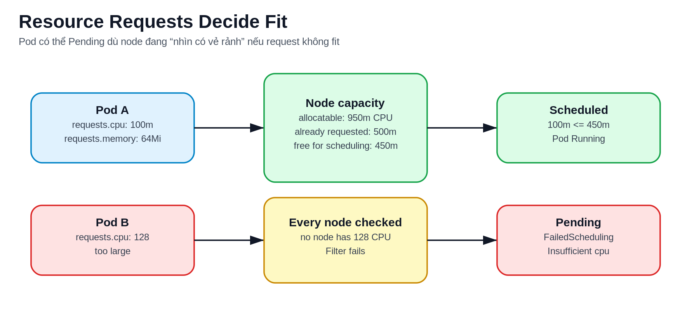
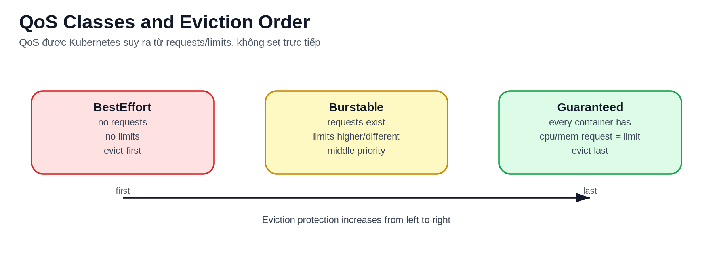
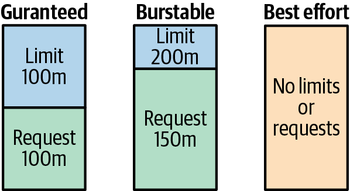
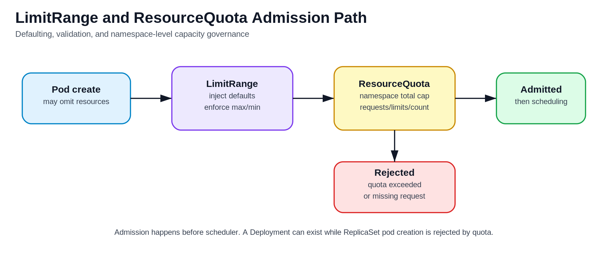
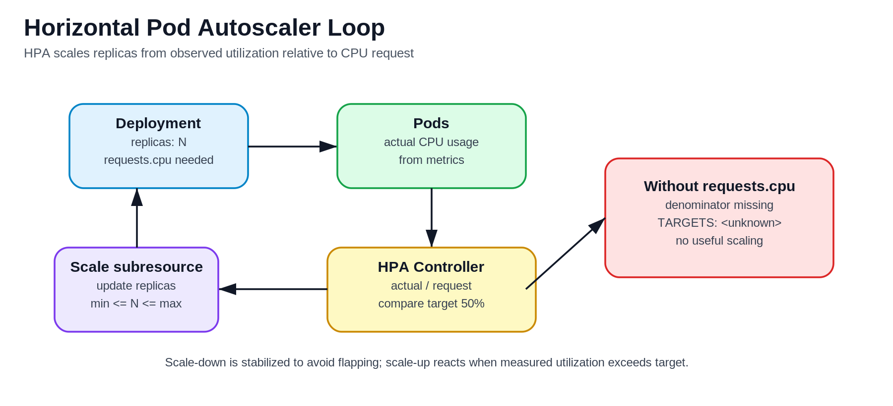

# Kubernetes Resources, Probes, Autoscaling Và Disruption

## Overview

Một workload Kubernetes production không chỉ cần `Deployment` chạy được. Nó cần khai báo tài nguyên để scheduler đặt Pod đúng chỗ, probe để Service chỉ nhận Pod khỏe, quota để namespace không chiếm toàn cluster, autoscaling để phản ứng với tải, và disruption control để bảo trì node không làm rơi ứng dụng.

Kubernetes tự động hóa nhiều việc, nhưng tự động hóa đó dựa trên tín hiệu bạn khai báo. Nếu `requests`, probe, selector hoặc metric sai, control plane vẫn reconcile rất chăm chỉ, chỉ là reconcile về một trạng thái không tốt.

## Flow Từ Manifest Đến Runtime

```text
manifest
  |
  v
admission: default/validate/quota/policy
  |
  v
scheduler: chọn node theo request, affinity, taint, volume
  |
  v
kubelet: pull image, mount volume, chạy container, probe
  |
  v
controller/service/hpa: cập nhật status, endpoint, replica
```

Điểm cần nhớ:

- Admission có thể reject object trước khi scheduler nhìn thấy Pod.
- Scheduler nhìn `requests` và constraints, không nhìn cảm giác "node đang rảnh" trên dashboard.
- kubelet mới là nơi container thật sự chạy và bị kill/restart.
- Service chỉ route tới Pod Ready.
- HPA scale theo metric và target, không tự hiểu bottleneck application.

## Requests Và Scheduling

`resources.requests` là lời hứa tối thiểu mà Pod cần để scheduler tính chỗ. Nếu tổng request đã đặt lên node vượt allocatable capacity, Pod sẽ `Pending` dù actual CPU hiện tại có thể thấp.



Ví dụ:

```yaml
resources:
  requests:
    cpu: 250m
    memory: 256Mi
```

Scheduler dùng request để trả lời câu hỏi:

- node còn đủ CPU/memory đã request không?
- Pod có cần node label cụ thể không?
- Pod có toleration cho taint trên node không?
- volume của Pod có bị ràng buộc zone/node không?
- topology spread hoặc anti-affinity có làm Pod không thể đặt ở node còn lại không?

Debug khi Pod `Pending`:

```bash
kubectl describe pod <pod> -n <namespace>
kubectl get events -n <namespace> --sort-by=.metadata.creationTimestamp
kubectl describe nodes
kubectl get quota,limitrange -n <namespace>
```

Nếu event là `Insufficient cpu` hoặc `Insufficient memory`, đừng chỉ tăng node ngay. Hãy kiểm tra request có thực tế không, namespace có quota không, workload có đang set request quá cao do copy manifest từ môi trường khác không.

## Limits Và Runtime Behavior

`resources.limits` là trần runtime. CPU và memory khác nhau:

| Resource | Khi vượt limit | Hậu quả thường gặp |
|---|---|---|
| CPU | bị throttle | latency tăng, request timeout |
| Memory | có thể bị OOMKilled | container restart, `CrashLoopBackOff` |

Ví dụ:

```yaml
resources:
  requests:
    cpu: 250m
    memory: 256Mi
  limits:
    cpu: "1"
    memory: 512Mi
```

Pattern thực tế:

- Stateless web/API thường cần request đủ để scheduler ổn định, limit memory rõ, CPU limit cân nhắc theo latency.
- Batch job có thể cần request sát nhu cầu để tránh tranh chấp node.
- Database trong Kubernetes cần cẩn trọng hơn: memory limit quá thấp dễ gây OOM, còn storage/IO mới thường là bottleneck chính.

## QoS Và Eviction

Kubernetes suy ra QoS class từ request/limit của Pod:





| QoS | Điều kiện đơn giản hóa | Khi node pressure |
|---|---|---|
| `Guaranteed` | mọi container có CPU/memory request = limit | được bảo vệ tốt nhất |
| `Burstable` | có request/limit nhưng không đủ điều kiện Guaranteed | nằm giữa |
| `BestEffort` | không có request/limit | dễ bị evict nhất |

QoS không thay thế monitoring. Một Pod `Guaranteed` vẫn có thể lỗi nếu app leak memory, dependency chậm, hoặc probe sai. Nhưng QoS giúp bạn hiểu vì sao cùng một node pressure, Pod này bị evict trước Pod kia.

Với Pod nhiều container, muốn đạt `Guaranteed` thì từng container phải có CPU và memory request/limit đầy đủ và bằng nhau. Chỉ một sidecar thiếu request/limit cũng làm cả Pod không còn là `Guaranteed`.

Lệnh kiểm tra:

```bash
kubectl get pod <pod> -n <namespace> -o jsonpath='{.status.qosClass}'
kubectl describe node <node>
kubectl get events -A --sort-by=.metadata.creationTimestamp
```

## LimitRange Và ResourceQuota

`LimitRange` đặt default/min/max cho container trong namespace. `ResourceQuota` giới hạn tổng tài nguyên và số object của namespace.




Tác dụng:

- tránh Pod không request tài nguyên;
- tránh một namespace tạo quá nhiều Pod/PVC/Service;
- bắt team khai báo tài nguyên có trách nhiệm;
- giúp platform team chia sẻ cluster giữa nhiều team an toàn hơn.

Kiểm tra:

```bash
kubectl get limitrange -n <namespace>
kubectl describe limitrange -n <namespace>
kubectl get resourcequota -n <namespace>
kubectl describe resourcequota -n <namespace>
```

Triệu chứng hay gặp:

- `kubectl apply` bị reject vì vượt quota;
- Deployment scale không lên replica mới;
- Pod không tạo được do thiếu default request/limit hoặc vượt max;
- PVC không bind vì quota storage.

Nếu namespace có `ResourceQuota` yêu cầu request/limit nhưng không có `LimitRange` default, Pod không khai báo resources có thể bị reject ngay ở admission. Vì vậy quota và LimitRange thường nên đi cùng nhau trong namespace dùng chung.

Quota nên bao phủ cả compute, storage và object count:

- `requests.cpu`, `requests.memory`, `limits.cpu`, `limits.memory`;
- `requests.storage`, số lượng PVC hoặc quota theo StorageClass;
- số lượng object như Pod, Service, Deployment, Secret hoặc ConfigMap nếu cần kiểm soát blast radius.

Khi Deployment/ReplicaSet tạo Pod vượt quota, lệnh `kubectl apply` Deployment có thể vẫn thành công vì object Deployment hợp lệ. Lỗi thật nằm ở bước controller tạo Pod và thường xuất hiện trong event của ReplicaSet/Pod:

```bash
kubectl describe deploy <deploy> -n <namespace>
kubectl describe rs <replicaset> -n <namespace>
kubectl get events -n <namespace> --sort-by=.lastTimestamp
```

Mental model cần nhớ:

```text
Deployment accepted
-> ReplicaSet tries to create Pod
-> ResourceQuota admission rejects Pod
-> desired replicas != available replicas
-> event explains quota limit
```

Vì vậy khi replica không lên đủ, đừng chỉ nhìn `kubectl get deploy`. Hãy kiểm tra ReplicaSet event, quota used/hard và LimitRange default của namespace.

## Probes Và Endpoint Readiness

Probe không phải health check trang trí. Probe quyết định Pod có nhận traffic hay bị restart.

| Probe | Nên dùng để | Sai lầm hay gặp |
|---|---|---|
| `readinessProbe` | rút/đưa Pod vào Service endpoint | check quá sâu làm mất toàn bộ capacity khi dependency lỗi |
| `livenessProbe` | restart app đã kẹt không tự hồi phục | đặt quá aggressive gây restart loop |
| `startupProbe` | bảo vệ app khởi động lâu khỏi liveness | bỏ qua khiến app chưa kịp warm up đã bị kill |

Ví dụ:

```yaml
readinessProbe:
  httpGet:
    path: /ready
    port: 8080
  initialDelaySeconds: 5
  periodSeconds: 10
livenessProbe:
  httpGet:
    path: /healthz
    port: 8080
  initialDelaySeconds: 30
  periodSeconds: 20
startupProbe:
  httpGet:
    path: /startup
    port: 8080
  failureThreshold: 30
  periodSeconds: 5
```

Thiết kế probe tốt:

- readiness trả lời "Pod này có nên nhận traffic mới không?";
- liveness trả lời "restart có giúp app thoát trạng thái kẹt không?";
- startup cho app đủ thời gian load config, migration nhẹ, warm cache;
- probe endpoint nên nhanh, ổn định, không tạo tải đáng kể lên dependency;
- timeout/failure threshold phản ánh latency thực tế, không lấy số quá thấp cho đẹp.

## HPA, VPA Và Cluster Autoscaler

HPA tăng/giảm replica của workload. Nó không thêm node trực tiếp.



Flow thường gặp:

1. HPA đọc metric từ metrics-server hoặc custom metric adapter.
2. HPA tính replica mong muốn.
3. Deployment/ReplicaSet tạo thêm Pod.
4. Scheduler cố đặt Pod lên node.
5. Nếu thiếu capacity, Pod `Pending`.
6. Cluster Autoscaler, nếu có, thấy Pod không schedule được và thêm node.


Điều kiện để HPA hữu ích:

- workload scale ngang được;
- có request CPU/memory nếu scale theo utilization;
- metric phản ánh bottleneck thật;
- dependency phía sau chịu được replica tăng;
- rollout và autoscaling không đánh nhau do probe/metric chậm.

Kiểm tra:

```bash
kubectl get hpa -n <namespace>
kubectl describe hpa <hpa> -n <namespace>
kubectl top pod -n <namespace>
kubectl top node
```

VPA thay đổi request/limit theo quan sát sử dụng. Với workload nhạy cảm, cần hiểu rõ mode hoạt động vì resize có thể cần recreate Pod tùy cấu hình và khả năng cluster.

Cluster Autoscaler scale node dựa trên Pod không schedule được, không phải vì CPU dashboard đang cao. Điều này có hai hệ quả:

- nếu request quá thấp, cluster có thể không scale dù workload đang bị CPU throttling hoặc latency cao;
- nếu request quá cao, Pod Pending có thể làm cluster scale tốn kém dù actual usage thấp.

Khi scale down node, autoscaler thường drain Pod khỏi node. PDB, local storage, DaemonSet và workload singleton có thể chặn hoặc làm scale down rủi ro hơn dự kiến.

## Disruption Và Bảo Trì Node

Kubernetes có nhiều loại gián đoạn:

- voluntary disruption: drain node, rollout, scale down;
- involuntary disruption: node chết, OOM, disk pressure, kernel panic;
- app-level disruption: dependency lỗi, config sai, migration sai.

`PodDisruptionBudget` giúp giới hạn số Pod của một workload có thể bị mất trong voluntary disruption.


```yaml
apiVersion: policy/v1
kind: PodDisruptionBudget
metadata:
  name: web-pdb
spec:
  minAvailable: 2
  selector:
    matchLabels:
      app: web
```

Bảo trì node an toàn:

```bash
kubectl cordon <node>
kubectl drain <node> --ignore-daemonsets --delete-emptydir-data
kubectl get pods -A -o wide --field-selector spec.nodeName=<node>
kubectl uncordon <node>
```

Trước khi drain production, kiểm tra PDB, replica count, StatefulSet behavior, local storage, DaemonSet, và workload singleton. Với stateful workload, cần backup/restore strategy riêng; PDB không thay thế HA của database.

Khi dùng phần trăm trong PDB, hãy nhớ Kubernetes phải làm tròn về số nguyên. Với replica count nhỏ, `maxUnavailable: 50%` có thể cho phép mất nhiều Pod hơn trực giác ban đầu. Với workload ít replica, cấu hình theo số tuyệt đối thường dễ review hơn.

## Graceful Shutdown

Khi Pod bị terminate do rollout, scale down hoặc drain node, shutdown tốt thường đi theo flow:

```text
Pod nhận deletionTimestamp
-> EndpointSlice dần rút Pod khỏi Service backend
-> kubelet chạy preStop hook nếu có
-> kubelet gửi SIGTERM
-> app ngừng nhận request mới, xử lý nốt request đang chạy
-> container exit trước terminationGracePeriodSeconds
```

Checklist cho app nhận traffic:

- readiness chuyển `false` nhanh khi app không nên nhận request mới;
- app xử lý `SIGTERM` thay vì chỉ chờ bị kill;
- `terminationGracePeriodSeconds` đủ dài cho request/transaction đang chạy;
- `preStop` chỉ dùng khi thật sự cần, không thay thế logic shutdown trong app;
- load balancer/Ingress có timeout drain phù hợp với app;
- rollout test bằng cách xem error rate, latency và số request bị reset trong lúc thay phiên bản.

Nếu app bị kill bởi `SIGKILL`, thường là nó không exit kịp trước grace period hoặc bị OOM. Cần phân biệt shutdown chậm với memory limit quá thấp.

Lifecycle hooks là per-container, không phải per-Pod. `postStart` chạy gần như song song với main process và không chứng minh app đã Ready; nếu hook fail, container có thể restart. `preStop` chạy trước SIGTERM trong grace period, nên hook quá lâu có thể ăn hết thời gian shutdown của app. Nếu process chính không nhận signal do shell-form `ENTRYPOINT`/`CMD`, nên sửa image/wrapper để `exec` hoặc forward signal thay vì lạm dụng `preStop`.

## Day-2 Checklist

- Mỗi workload production có request CPU/memory hợp lý.
- Memory limit được set có chủ ý, tránh copy một con số chung cho mọi app.
- Probe được phân biệt rõ readiness/liveness/startup.
- Namespace có LimitRange/ResourceQuota nếu dùng chung cluster.
- HPA chỉ dùng khi metric đáng tin và app scale ngang được.
- Rollout có quan sát lỗi, latency, saturation và rollback path.
- Node maintenance dùng cordon/drain và kiểm tra PDB trước.
- Troubleshooting luôn đọc `describe`, events và status trước khi sửa manifest.

## Related Pages

- [Kubernetes Operations Overview](./overview.md)
- [Kubernetes Scheduling, Affinity, Taints, Topology Và Priority](./03-scheduling-affinity-taints-topology-and-priority.md)
- [Kubernetes Workload Controllers Và Rollout](../01-core-objects/02-workload-controllers-and-rollout.md)
- [Kubernetes Troubleshooting Runbooks](../98-troubleshooting/overview.md)
- [RBAC, Pod Security Và Admission](../04-security/01-rbac-pod-security-and-admission.md)
