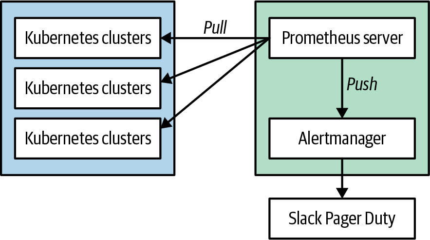
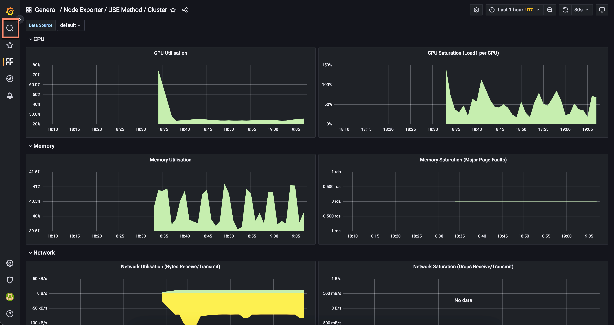
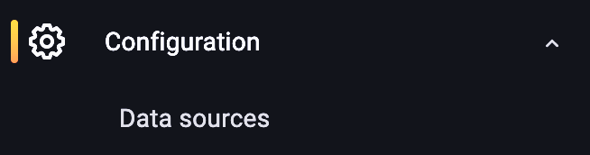
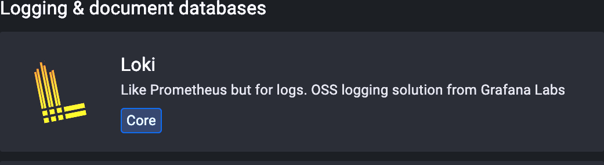
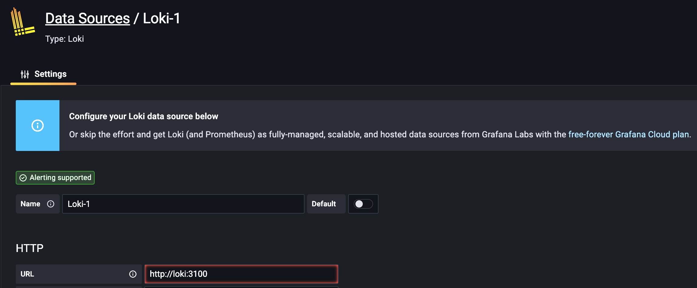
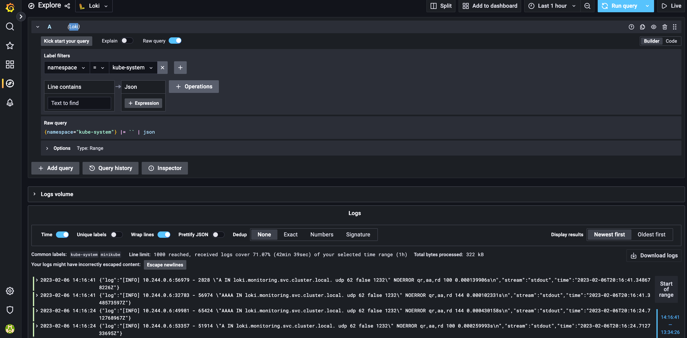

# Kubernetes Observability Logs, Metrics, Events Và Traces

## Why This Exists

Kubernetes troubleshooting không thể chỉ nhìn log application. Một sự cố thường đi qua nhiều lớp: scheduler, kubelet, container runtime, CNI, CSI, probe, controller và chính app. Observability trong Kubernetes cần kết hợp metrics, logs, events và traces để phân biệt lỗi control plane, node runtime, network/storage và lỗi application.

## Mental Model

```text
desired state
-> controller decision
-> scheduler placement
-> kubelet execution
-> container runtime
-> network/storage dependency
-> application behavior
-> status / events / metrics / logs / traces
```

Events thường giải thích vì sao Kubernetes không đạt desired state. Metrics cho biết xu hướng và sức khỏe. Logs giải thích hành vi cụ thể. Traces nối request qua nhiều service.

Đừng chỉ monitor component còn sống. Kubernetes có thể "trông có vẻ chạy" nhưng chức năng user cần lại hỏng, ví dụ controller-manager lỗi khiến Service/Endpoint/DNS mới không được cập nhật. Vì vậy observability production cần cả whitebox signal từ component lẫn blackbox/prober kiểm tra end-to-end behavior.

## Core Objects / Components Involved

- Pod status, conditions và restart count.
- Events từ scheduler, kubelet, controllers, ingress, CSI.
- Metrics từ metrics-server, Prometheus hoặc cloud monitoring.
- Logs từ container runtime, app và system components.
- Traces từ OpenTelemetry/Tempo/Jaeger hoặc backend tương đương.
- Alert rule, dashboard và SLO.

## Metrics Pipeline Với Prometheus

Prometheus phù hợp với Kubernetes vì cả hai đều dùng label để gắn ngữ cảnh. Mental model:

```text
Kubernetes components / app / exporter
-> metrics endpoint
-> Prometheus scrape
-> time-series database
-> PromQL / recording rules
-> Grafana dashboard
-> Alertmanager notification
```


Prometheus thường dùng pull model: server scrape endpoint thay vì app chủ động push metric vào server. Alert flow thường tách khỏi scrape flow: Prometheus đánh giá rule rồi gửi alert sang Alertmanager để group, route, silence hoặc notify.

Pull vs push là lựa chọn kiến trúc, không phải đúng/sai tuyệt đối:

- Metrics thường hợp với pull: Prometheus kiểm soát scrape interval, timestamp và service discovery.
- Logs thường hợp với push/agent: log agent trên node đọc file/stdout/stderr rồi ship về backend.
- Exporter/sidecar phù hợp khi app không expose Prometheus metrics native nhưng có giao thức riêng như StatsD/JMX hoặc endpoint nội bộ.




Trong production, cần tránh đặt toàn bộ năng lực quan sát trong đúng failure domain đang được quan sát. Với cluster quan trọng, cân nhắc mô hình utility/monitoring cluster, remote write, Thanos/Mimir hoặc backend tương đương để một sự cố trong workload cluster không làm mất hoàn toàn telemetry.

Dashboard nên bắt đầu từ USE/RED/SLO thay vì gom mọi panel có thể có:

- USE cho node/resource: utilization, saturation, errors.
- RED cho service: request rate, error rate, duration.
- Kubernetes health: Pending Pod, restart/OOM, rollout health, PVC state, node pressure.



## How It Works

Debug nên đi từ trạng thái Kubernetes ra tín hiệu chi tiết:

1. `kubectl get` để thấy object nào lệch desired state.
2. `kubectl describe` để đọc conditions và events gần object.
3. `kubectl logs` để xem app/container.
4. `kubectl top` hoặc metrics dashboard để xem resource pressure.
5. Trace/request-level telemetry nếu lỗi xảy ra trên đường đi giữa service.

## Minimal Example

```bash
kubectl get pod -n <namespace> -o wide
kubectl describe pod <pod> -n <namespace>
kubectl get events -n <namespace> --sort-by=.lastTimestamp
kubectl logs <pod> -n <namespace> -c <container>
kubectl top pod -n <namespace>
```

## How To Inspect

### Workload

```bash
kubectl get deploy,rs,pod -n <namespace>
kubectl rollout status deployment/<name> -n <namespace>
kubectl describe deployment <name> -n <namespace>
```

### Node Và Capacity

```bash
kubectl get nodes
kubectl describe node <node>
kubectl top nodes
kubectl top pods -A
```

### Network

```bash
kubectl get svc,endpointslice,ingress -n <namespace>
kubectl describe svc <service> -n <namespace>
kubectl describe ingress <ingress> -n <namespace>
```

### Storage

```bash
kubectl get pvc,pv -n <namespace>
kubectl describe pvc <pvc> -n <namespace>
kubectl get events -n <namespace> --sort-by=.lastTimestamp
```

## Logging Pipeline Và Retention

Logging trong Kubernetes nên được thiết kế như pipeline, không phải “log càng nhiều càng tốt”:

```text
container stdout/stderr
-> node/container runtime log file
-> DaemonSet log agent
-> log backend
-> query/dashboard/alert correlation
```


Nguồn log cần phân lớp:

| Nguồn log | Dùng để trả lời |
|---|---|
| Application logs | app xử lý request ra sao, lỗi business/runtime gì |
| Node/runtime logs | kubelet/container runtime/CNI/CSI có lỗi host-level không |
| Control plane logs | API server, scheduler, controller-manager quyết định gì |
| Audit logs | ai gọi API nào, lúc nào, trên object nào |

Ứng dụng nên log ra stdout/stderr để log agent dạng DaemonSet thu gom đồng nhất. Sidecar log forwarder chỉ nên dùng khi app legacy bắt buộc ghi file riêng hoặc cần format/ship đặc biệt. Audit log phải tune rất kỹ vì dễ tạo volume lớn và chi phí cao.

Logging và monitoring trả lời hai câu hỏi khác nhau:

- Metrics là time-series để thấy xu hướng, saturation, latency, error rate và alert.
- Logs là event record để tìm nguyên nhân cụ thể, request cụ thể hoặc hành động cụ thể.

Một alert tốt thường bắt đầu từ metrics/blackbox symptom, sau đó điều tra bằng logs, events và traces. Nếu chỉ có logs, bạn dễ phát hiện muộn; nếu chỉ có metrics, bạn biết có vấn đề nhưng thiếu bằng chứng vì sao.


Retention nên được quyết định theo nhu cầu điều tra và compliance. Log ngắn hạn phục vụ incident/debug nóng; log dài hạn nên archive rẻ hơn, có lifecycle rõ, và không giữ dữ liệu nhạy cảm ngoài thời hạn cần thiết.

## Loki/Grafana Pattern

Loki là một lựa chọn log backend phổ biến khi team đã dùng Grafana. Pattern vận hành:

```text
Promtail / log agent
-> Loki
-> Grafana datasource
-> Explore / dashboard
-> correlate với metrics và traces
```









Điểm cần kiểm tra khi Loki không thấy log:

```bash
kubectl get pods -n <logging-namespace>
kubectl logs -n <logging-namespace> <log-agent-pod>
kubectl get svc -n <logging-namespace>
kubectl describe pod -n <logging-namespace> <loki-or-agent-pod>
```

Nếu query chậm hoặc chi phí tăng, thường kiểm tra label cardinality, retention, tenant/namespace filter, volume log debug, và policy drop/sampling trước khi tăng tài nguyên backend.

## Common Confusions

| Confusion | Reality |
|---|---|
| Log app là đủ | Scheduling, image pull, volume mount và readiness thường nằm trong events/status |
| `kubectl top` cho biết request/limit | `top` cho actual usage; scheduling dùng request |
| Pod Running nghĩa là app healthy | Pod có thể Running nhưng readiness false hoặc app trả lỗi |
| Events là log dài hạn | Events có retention ngắn; incident nghiêm trọng cần thu thập evidence sớm |
| Trace thay thế metrics/logs | Trace bổ sung request path; vẫn cần metrics và logs |

## Production Notes

- Alert nên gắn với symptom người dùng hoặc SLO, không chỉ CPU cao.
- Dashboard nên có workload health, rollout, error rate, latency, saturation, restart, OOM, pending Pod và PVC state.
- Events có thể mất nhanh; khi incident xảy ra hãy capture sớm.
- Không bật log quá nhạy cảm chứa token/password/customer data.
- Với multi-cluster, thống nhất label như cluster, namespace, app, version, environment để query được.
- Instrument application bằng OpenTelemetry khi cần trace request xuyên service.

## Alert Design

Alert tốt phải gọi đúng người, đúng lúc, với đủ context để hành động. Không nên page on-call chỉ vì “một Pod restart” nếu controller tự phục hồi và SLO không bị ảnh hưởng. Nên ưu tiên:

- symptom ảnh hưởng người dùng: error rate, latency, availability, data loss risk;
- saturation kéo dài: node pressure, disk full, queue backlog, PVC gần đầy;
- control-plane hoặc platform dependency làm nhiều workload mất khả năng phục hồi;
- alert có runbook/playbook, owner, service, cluster, namespace, region và dashboard link.


Ngưỡng quá ngắn tạo false positive. Với nhiều alert production, hãy dùng duration đủ dài để lọc nhiễu, ví dụ nhiều phút thay vì vài giây, rồi cải tiến dần theo incident thực tế. Alert gửi vào mailing list lớn thường bị bỏ qua; route theo service owner/on-call rotation rõ ràng hơn.

### Blackbox Prober Cho Cluster

Blackbox monitoring kiểm tra Kubernetes như một user thật thay vì chỉ đọc metric nội bộ. Ví dụ prober có thể định kỳ:

```text
create temporary namespace
-> create Deployment/Pod
-> create Service
-> verify endpoint/DNS/connectivity
-> delete namespace
-> export success/latency/error as metrics
```

Nếu prober chạy trong chính cluster, cần watchdog alert khi prober không chạy xong trong N phút; nếu không, sự cố cluster có thể làm mất luôn tín hiệu kiểm tra. Với cluster production quan trọng, nên có ít nhất một số probe chạy từ ngoài failure domain của cluster.

Layer nên monitor theo thứ tự:

- machine/node: CPU, memory, disk, network, node pressure;
- Kubernetes core: API Server, scheduler, controller-manager, kubelet, CoreDNS, CNI, CSI;
- add-ons: ingress, metrics/logging, cert-manager, policy engine, service mesh;
- user workload: RED/USE/SLO, rollout health, dependency, business metric.

## Related Pages

- [Kubernetes Operations, Resources Và Observability](./overview.md)
- [Resources, Probes, Autoscaling Và Disruption](./01-resources-probes-autoscaling-and-disruption.md)
- [Debug Flow Từ Symptom Đến Control Plane Decision](../98-troubleshooting/01-symptom-to-control-plane-debug-flow.md)
- [Service Discovery, Ingress Và Network Policy](../02-networking/01-service-discovery-ingress-and-network-policy.md)
