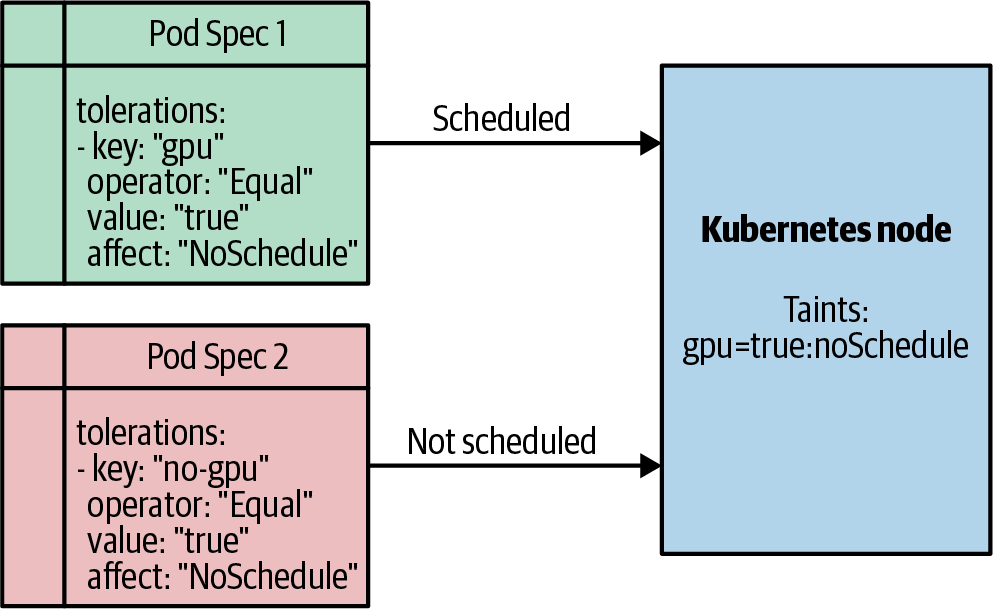

# Kubernetes Scheduling, Affinity, Taints, Topology Và Priority

## Why This Exists

Scheduling là quá trình Kubernetes chọn node cho Pod. Đây là operational topic vì nó liên quan trực tiếp đến capacity, placement policy, failure domain, noisy neighbor, dedicated nodes và availability. Pod object chỉ khai báo nhu cầu; scheduler mới quyết định Pod có thể chạy ở node nào.

## Mental Model

```text
Pod pending
-> scheduler reads request and constraints
-> filter nodes that cannot run the Pod
-> score remaining nodes
-> bind Pod to one node
-> kubelet starts containers
```

Nếu Pod Pending, đừng nhìn `kubectl top` trước. Scheduler không dùng actual usage để fit Pod; nó dùng resource requests và constraints.

Scheduler quan sát API Server để tìm Pod chưa có `spec.nodeName`, chọn node phù hợp, rồi bind Pod bằng cách ghi `nodeName`. Sau đó kubelet trên node đó mới thấy Pod qua watch và bắt đầu pull image, mount volume, gọi CNI/CSI và chạy container. Vì vậy scheduling chỉ là quyết định placement; nó không đảm bảo container đã chạy thành công.

Tránh tự set `spec.nodeName` trong manifest app thông thường. Direct scheduling bỏ qua nhiều logic của scheduler, làm workload giòn hơn khi node thay đổi và dễ tạo placement không tối ưu. Ngoại lệ thường thuộc controller/hạ tầng có lý do rõ, ví dụ DaemonSet hoặc static/control-plane mechanism do platform quản lý.

## Core Objects / Components Involved

- Pod `resources.requests`.
- `nodeSelector`, node affinity, pod affinity, pod anti-affinity.
- taints và tolerations.
- topology spread constraints.
- PriorityClass và preemption.
- Node labels, zones, node pools, capacity và allocatable.
- Namespace, ResourceQuota, LimitRange và NetworkPolicy khi scheduling là một phần của multi-tenancy.

## How It Works

Scheduler thường xử lý theo hai lớp:

- Filter: loại node không đủ CPU/memory request, không match affinity, không tolerate taint, không đạt topology rule.
- Score: chấm điểm node còn lại theo policy và plugin scheduling.

Một Pod có thể Pending dù cluster còn CPU actual, vì node allocatable theo request đã hết hoặc constraints quá chặt.

Trong mental model cũ, lớp filter tương đương "predicate": câu trả lời đúng/sai rằng node có thể chạy Pod không. Lớp score tương đương "priority": trong các node hợp lệ, node nào tốt hơn theo resource balance, spread, affinity, image locality hoặc policy khác. Nếu nhiều node có điểm ngang nhau, scheduler chọn một node theo logic tie-breaker nội bộ.

Scheduling decision là snapshot tại một thời điểm. Giữa lúc scheduler tính toán và lúc kubelet thực thi, cluster có thể đổi state: DaemonSet mới consume resource, node label đổi, Pod khác được bind, hoặc node degraded. Soft conflict thường tự cân bằng theo thời gian; hard conflict có thể làm Pod fail và controller phải tạo Pod mới để schedule lại.

Vì vậy không nên chạy standalone Pod cho workload production. Hãy dùng Deployment, StatefulSet, Job hoặc controller phù hợp để failed Pod không trở thành trạng thái chết cứng không ai reconcile.

Điều quan trọng khi debug là tách:

- **không node nào hợp lệ**: Pod Pending với event như `Insufficient memory`, `had taints that the pod did not tolerate`, volume zone conflict;
- **nhiều node hợp lệ nhưng placement không như kỳ vọng**: kiểm tra scoring, topology spread, affinity preference, node labels và node pool.

### Descheduler Và Placement Drift

Scheduler quyết định tại thời điểm Pod được tạo/bind; nó không tự di chuyển Pod chỉ vì sau đó placement trở nên kém tối ưu. Descheduler là một controller bổ sung có thể evict Pod bị xem là suboptimal để scheduler đặt lại Pod mới.

Dùng descheduler cần cẩn trọng:

- eviction vẫn là disruption thật với workload;
- cần PDB, replica, readiness và rollout budget hợp lý;
- policy phải được test theo từng namespace/node pool, tránh gây churn lớn;
- đây là công cụ chỉnh placement drift, không phải cách sửa requests/affinity sai.

## Minimal Example

Dedicated node pattern thường cần đủ hai chiều:

```yaml
spec:
  tolerations:
  - key: dedicated
    operator: Equal
    value: gpu
    effect: NoSchedule
  affinity:
    nodeAffinity:
      requiredDuringSchedulingIgnoredDuringExecution:
        nodeSelectorTerms:
        - matchExpressions:
          - key: dedicated
            operator: In
            values:
            - gpu
```

Taint chặn Pod không được phép. Node affinity kéo Pod đúng loại vào node phù hợp.



## Multi-Tenancy Và Dedicated Node Pool

Với cluster dùng chung, scheduling không đứng riêng lẻ. Một tenant/team an toàn tối thiểu cần:

- namespace riêng;
- RBAC theo team/app;
- ResourceQuota và LimitRange;
- NetworkPolicy hoặc egress policy;
- Pod Security Admission/policy baseline;
- label/annotation owner rõ để audit và chargeback.

Dedicated node pool nên dùng khi workload có nhu cầu đặc biệt như GPU, compliance, latency, noisy-neighbor isolation hoặc lifecycle node riêng. Pattern chuẩn là:

- label node pool để scheduler nhận diện;
- taint node pool để chặn workload thường;
- workload có toleration để được phép vào;
- workload có node affinity/nodeSelector để thực sự bị kéo vào đúng node pool;
- quota/governance để tránh team tự gắn toleration vào mọi workload.

Toleration một mình không buộc Pod chạy trên dedicated node. Nó chỉ nói "Pod này chịu được taint"; nếu muốn placement chắc chắn, cần thêm affinity hoặc nodeSelector.

Tách cluster riêng thay vì chỉ tách namespace/node pool khi yêu cầu nằm ở cấp failure domain, control plane ownership, compliance boundary, upgrade schedule, network perimeter hoặc blast radius mà cluster dùng chung không còn phù hợp.

## How To Inspect

```bash
kubectl get pod -n <namespace> -o wide
kubectl describe pod <pod> -n <namespace>
kubectl get events -n <namespace> --sort-by=.lastTimestamp
kubectl get nodes --show-labels
kubectl describe node <node>
kubectl top nodes
```

Xem taints:

```bash
kubectl describe node <node> | grep -i taints
```

Xem PriorityClass:

```bash
kubectl get priorityclass
```

## Common Confusions

| Confusion | Reality |
|---|---|
| Cluster còn CPU actual nên Pod phải schedule được | Scheduler fit theo requests và constraints, không theo actual usage |
| Toleration kéo Pod vào node | Toleration chỉ cho phép Pod chịu taint; node affinity/nodeSelector mới kéo Pod |
| Node affinity đảm bảo exclusive node | Node affinity kéo Pod vào node, nhưng không chặn Pod khác; cần taint nếu muốn dedicated |
| Priority luôn giải quyết Pending | Preemption chỉ hữu ích nếu có victim phù hợp và policy cho phép |
| Topology spread luôn tốt | Spread quá chặt có thể làm Pod Pending khi zone/node thiếu capacity |
| `nodeSelector` và taint là một | `nodeSelector` chọn node có label; taint đẩy Pod không có toleration ra khỏi node |

## Production Notes

- Đặt requests sát nhu cầu thực tế; requests quá cao gây Pending, quá thấp gây overcommit và eviction/throttling.
- Dedicated node nên dùng taint + toleration + affinity + label ownership rõ.
- Với workload HA, dùng topology spread hoặc anti-affinity để tránh nhiều replica nằm cùng node/zone.
- Dùng `nodeSelector` cho yêu cầu đơn giản như GPU/SSD node; dùng node affinity khi cần expression phức tạp hoặc preference mềm.
- `requiredDuringSchedulingIgnoredDuringExecution` phải đúng tại lúc schedule, nhưng nếu label node đổi sau khi Pod đang chạy thì Kubernetes không tự evict Pod chỉ vì điều kiện không còn match.
- `preferredDuringSchedulingIgnoredDuringExecution` chỉ là preference có trọng số, không phải guarantee. Nếu cần chắc chắn, dùng required affinity hoặc `nodeSelector`; nếu cần exclusive node pool, kết hợp thêm taint/toleration.
- Các operator affinity thường gặp: `In`, `NotIn`, `Exists`, `DoesNotExist`, `Gt`, `Lt`. Với `Gt`/`Lt`, label value cần biểu diễn được như integer.
- Dùng `NoSchedule` để chặn Pod mới, `PreferNoSchedule` cho preference mềm, `NoExecute` khi muốn evict Pod đang chạy không tolerate taint.
- NodeCondition taints giúp scheduler/eviction tránh node degraded như memory/disk/PID pressure, nhưng workload vẫn cần replica/PDB để chịu được di chuyển.
- Không dùng hard affinity quá rộng nếu team không kiểm soát node labels.
- Preemption có thể làm gián đoạn workload khác; dùng PriorityClass có governance.
- Khi scale replica, kiểm tra quota, PDB, HPA, requests và node pool capacity.

## Related Pages

- [Resources, Probes, Autoscaling Và Disruption](./01-resources-probes-autoscaling-and-disruption.md)
- [Observability Logs, Metrics, Events Và Traces](./02-observability-logs-metrics-events-and-traces.md)
- [Debug Flow Từ Symptom Đến Control Plane Decision](../98-troubleshooting/01-symptom-to-control-plane-debug-flow.md)
- [Pods, Labels, Namespaces Và Metadata](../01-core-objects/01-pods-labels-namespaces-and-metadata.md)
